# Physical Layer ‐Logical (Gen1 and Gen2)// 物理逻辑(gen1 和 gen2)

### 关于前一章节

上一章描述了 Ack/Nak 协议：一种基于硬件的自动机制，用于确保 TLP 在链路上的可靠传输。 Ack DLLP 确认 TLP 接收良好，而 Nak DLLP 指示传输错误。 本章描述了正常的操作规则以及错误恢复机制。

### 关于本章节
本章描述物理层的逻辑子块。 该层将为串行传输和恢复准备数据包。 完成此操作需要几个步骤，并对这些步骤进行了详细描述。 本章介绍与使用 8b/10b 编码的 Gen1 和 Gen2 协议相关的逻辑。 Gen3 的逻辑不使用 8b/10b 编码，并在下一章节 “物理层 - 逻辑（Gen3）”章节中单独描述。

### 关于下一章节

下一章介绍第三代 (Gen3) PCIe 的物理层特性。 主要变化包括通过消除 8b/10b 编码的需要，能够将带宽相对于 Gen2 加倍，而无需将频率加倍。 Gen3 速度需要更稳健的信号补偿。 进行这些更改比预期的更复杂。

### 11.1 物理层概述

本物理层概述介绍了 Gen1、Gen2 和 Gen3 实现之间的关系。 此后的重点是与 Gen1 和 Gen2 相关的逻辑物理层实现。 Gen3 的逻辑物理层实现将在下一章中描述。

物理层位于外部物理链路和数据链路层之间的接口的底部。 它将来自数据链路层的出站数据包转换为串行化的比特流，该比特流被计时到链路的所有通道上。 该层还从接收器处的链路的所有通道恢复比特流。 接收逻辑将位反序列化回符号流，重新组装数据包，并将 TLP 和 DLLP 转发到数据链路层。
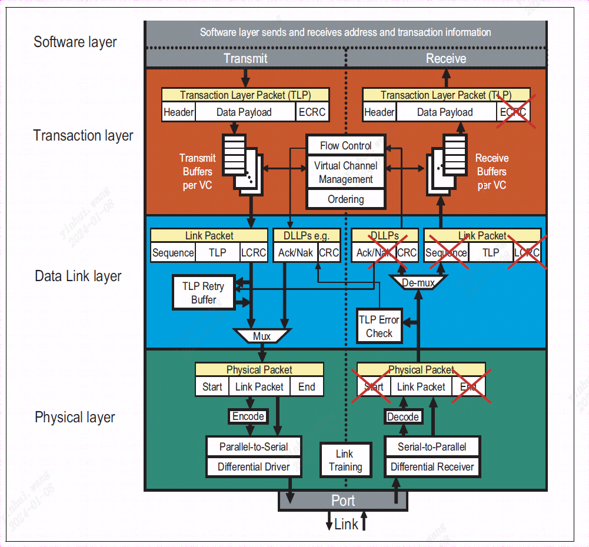
                        图 11.1 PCIe Port Layers
这些层的内容是概念性的，没有定义精确的逻辑块，但在设计人员对它们进行分区以匹配规范的情况下，他们的实现可以受益，因为不断增加的数据速率对物理层的影响比其他层更大。 按分层职责划分设计允许物理层适应更高的时钟速率，同时尽可能少地改变其他层。

PCIe规范的3.0修订版没有使用特定术语来区分规范版本定义的不同传输速率。 考虑到这一点，本书中定义和使用了以下术语。
- Gen1 - 第一代PCIe(版本1.x)，运行速度为 2.5 GT/s。
- Gen2 - 第二代PCIe(版本2.x)，运行速度为 5.0 GT/s。
- Gen3 - 第三代PCIe(版本3.x)，运行速度为 8.0 GT/s。

物理层由两个子块组成：逻辑部分和电气部分，如图 11-2 所示。 两者都包含独立的发送和接收逻辑，允许双单工通信。
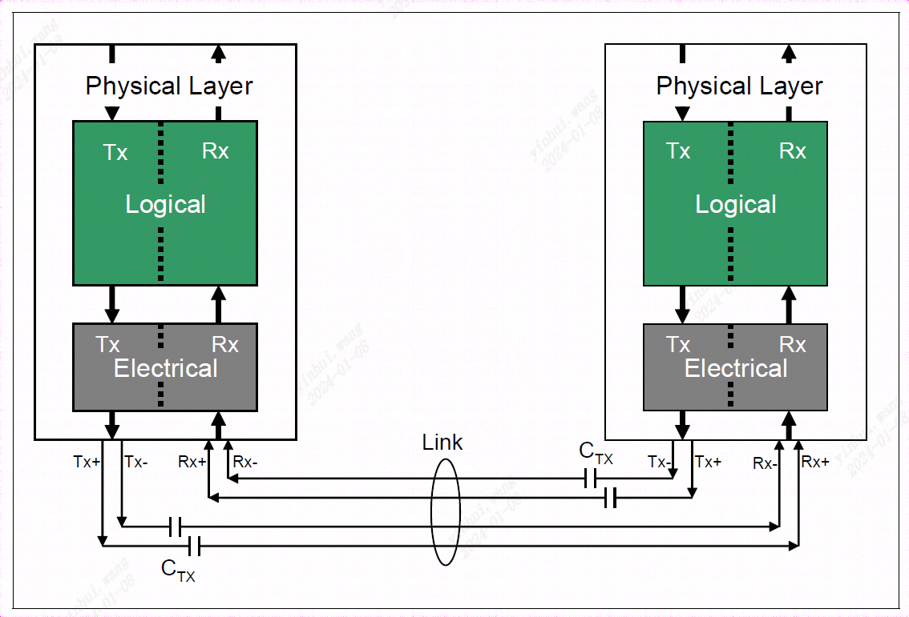
                 图11.2 物理层的逻辑和电气子模块
#### 11.1.1 简介

该规范描述了物理层的功能，但在实现细节方面故意含糊不清。 显然，规范编写者不愿意提供细节或示例实现，因为他们希望为个别供应商留出空间，让他们通过聪明或创造性的逻辑版本来增加价值。 不过，对于我们的讨论来说，一个例子是必不可少的，并且选择了一个例子来说明这些概念。 需要明确的是，该示例尚未经过测试或验证，设计人员也不应该感到有必要以这种方式实现物理层。

#### 11.1.2 逻辑发送端概述

为简单起见，我们首先对该层的发送端进行高级概述，如图 11-3 所示。从顶部开始，我们可以看到从数据链路层进入的数据包字节首先进入 缓冲。 这里有一个缓冲区是有意义的，因为有时必须延迟来自数据链路层的数据包流，以允许将有序集数据包和其他项目注入到字节流中。
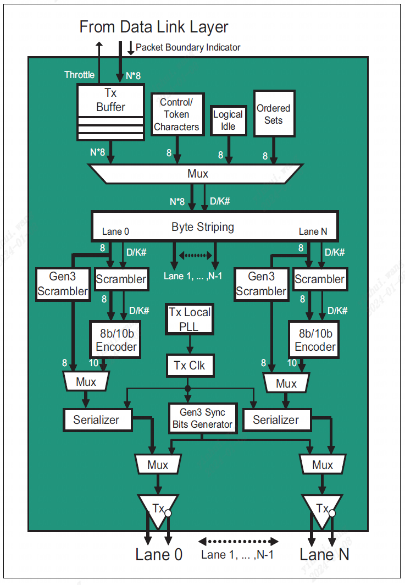
                        图 11.3 物理层发送端细节

对于 Gen1 和 Gen2 操作，这些注入的项是控制和数据字符，用于标记数据包边界并创建有序集。 为了区分这两种类型的字符，添加了 D/K# 位（数据或“控制”）。 逻辑可以根据字符的来源了解 D/K# 应该取什么值。

Gen3 操作模式不使用控制字符，因此数据模式用于组成有序集，用于识别传输的字节是否与 TLP / DLLP 或有序集关联。 2 位同步标头插入 128 位（16 字节）数据块的开头。 同步头通知接收器接收到的块是数据块（TLP 或 DLLP 相关字节）还是有序集块。 由于 Gen3 模式中没有控制字符，因此不需要 D/K# 位。

接下来，来自上层的并行数据字节被发送到字节条带逻辑，在那里它们被展开或条带化到该链路的所有通道上。 每个通道传输一个字节的数据包，并且所有活动通道都用于每个出去的数据包。 链路的通道全部同时传输，因此字节必须足够快地进入该逻辑以适应这一点。 例如，如果有八个通道，则来自上层的八个并行字节可能会到达字节分条逻辑，从而允许数据同时计时到所有通道上。

接下来是加扰器，它将伪随机模式异或到输出数据字节上以混合位。 虽然这看起来可能会带来问题，但事实并非如此，因为加扰模式是可预测的并且不是真正随机的，因此接收器可以使用相同的算法轻松恢复原始数据。 如果扰码器失步，则接收器将无法理解比特流，因此，为了防止该问题，扰码器会定期重置（Gen1 和 Gen2）。 这样，如果扰频器确实彼此不同步，那么不久它们就会重新初始化并再次恢复同步。 对于 Gen1 和 Gen2 模式，只要检测到 COM 字符就会重新初始化。 对于 Gen3 模式，只要看到 EIEOS 有序集，就会发生这种情况。 Gen3 模式中使用了更复杂的基于 24 位的扰码器，因此有通过 Gen3 扰码器的替代路径，如图 11-3 所示。

对于 Gen1 和 Gen2 模式，加扰的 8 位字符随后由 8b/10b 编码器进行编码以供传输。 回想一下，字符是 8 位未编码字节，而符号是 8b/10b 逻辑的 10 位编码输出。 8b/10b 编码有几个优点，但它确实增加了开销。

对于 Gen3，显示了一条绕过编码器的单独路径。 换句话说，数据包的加扰字节在没有 8b/10b 编码的情况下进行传输。 同步位生成器在数据包的每个 16 字节块之前添加 2 位同步标头。 添加的 2 位同步标头将随后的 16 字节块标识为数据块或有序集
堵塞。 每 16 字节（128 位）添加 2 位同步标头是 Gen3 128b/130b 编码方案的基础。

最后，符号被序列化为比特流并转发到物理层的电气子块并传输到链路的另一端。

#### 11.1.3 逻辑接收端概述

图 11-4 显示了构成接收器逻辑的关键元素。 针对每个通道执行下面描述的过程。 这次从底部开始，首先要提到的是接收器时钟和数据恢复（CDR）。 此过程的第一步是根据传入比特流中的转换恢复时钟。 这个恢复的时钟忠实地再现了用于发送数据的发送器时钟，并用于将输入位锁存到解串缓冲区中。
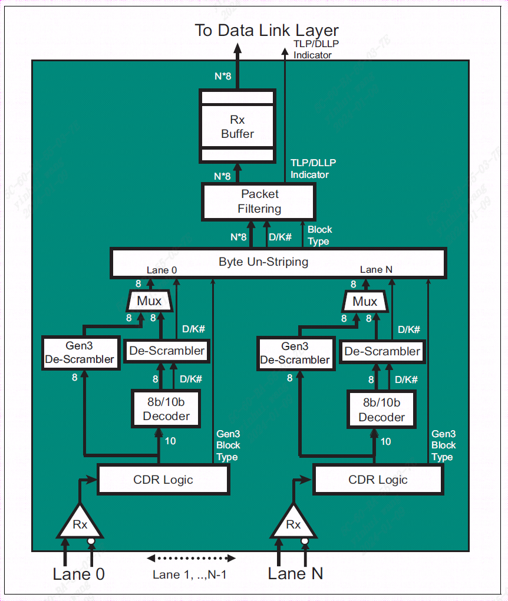
                     图11.4 物理层接收逻辑详细信息

CDR 过程的下一步是找到 Gen1/Gen2 符号边界，并将恢复的时钟除以 10，以将 10 位符号锁存到弹性缓冲区中。 对于 Gen3，下一步是获取块锁，然后将与块中每个 16 字节关联的 8 位符号锁存到弹性缓冲区中——下一章将详细介绍这一点。

当检测到 SOS（SKP 有序集）时，控制弹性缓冲器的逻辑通过根据需要添加或删除 SKP 符号来调整恢复时钟和接收器本地时钟之间的微小时钟变化。 最后，接收器的本地时钟将每个符号移出弹性缓冲区。

使用 8b/10b 解码器，对 Gen1/Gen2 符号进行解码，从而将 10 位符号转换为 8 位字符。 解扰器应用与发射机相同的加扰方法来恢复原始数据。 最后，来自每个通道的字节被取消条带化，形成字节流，该字节流将被转发到数据链路层。 只有 TLP 和 DLLP 被加载到接收缓冲区并发送到数据链路层。
### 11.2 发送端逻辑细节(Gen1和Gen2)

本节提供了与上一节中确定的步骤相关的更多详细信息。 讨论期间请参阅图 11-5 中的框图。
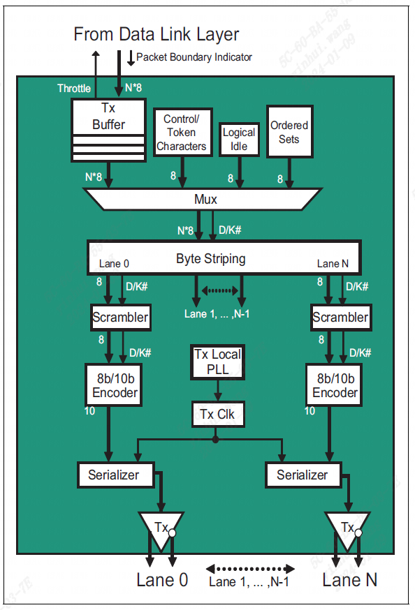
图 11.5 物理层发送端逻辑细节(仅包含Gen1和Gen2)

#### 11.2.1 Tx 缓冲区(Tx Buffer)

再次从图的顶部开始，缓冲区接受来自数据链路层的 TLP 和 DLLP，以及指定新数据包何时开始的“控制”信息。 如前所述，缓冲区允许我们不时地停止字符流，以便插入控制字符和有序集。 如果缓冲区已满，还会显示一个“节流”信号，该信号会返回到数据链路层以停止字符流。

#### 11.2.2 多路复用器和控制逻辑(Mux and Control Logic)

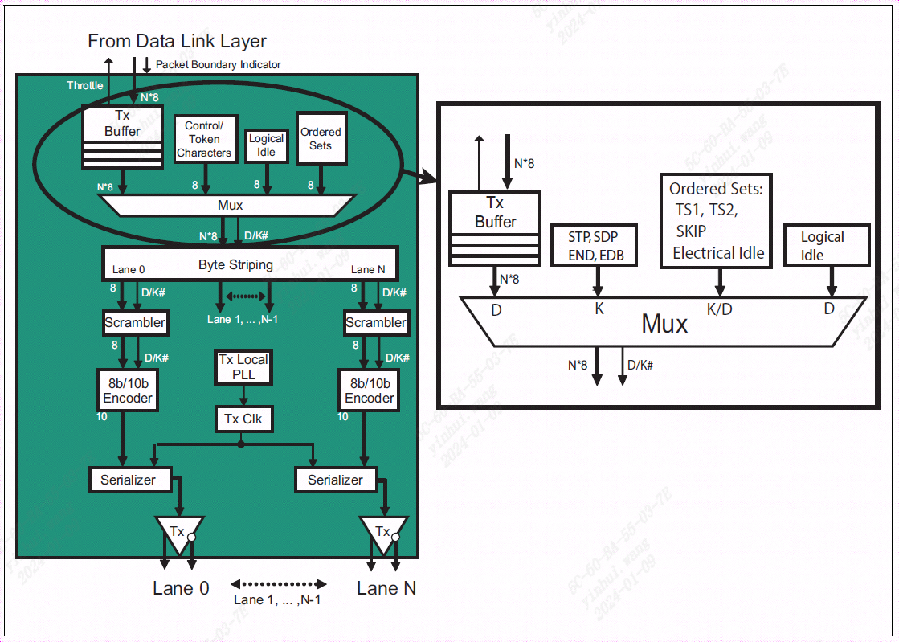
                图 11.6 发送端逻辑多路复用器

多路复用器（如图 11-6 所示）用于将特殊控制 (K) 字符插入来自缓冲区的数据流中。 仅物理层使用K个控制字符； 它们在传输期间插入并在接收器处移除。 多路复用器的四个不同输入是：
- 发送数据缓冲区。 当数据链路层提供数据包时，多路复用器门控字符流通过。 来自缓冲区的所有字符都是 D 字符，因此当 Tx 缓冲区内容被选通时，D/K# 信号被驱动为高电平。
- 开始和结束字符。 这些控制字符被添加到每个 TLP 和 DLLP 的开头和结尾（参见图 11-7），并允许接收器轻松检测数据包的边界。 有两个开始字符：STP 表示TLP 的开始，而SDP 表示DLLP 的开始。 来自数据链路层的指示符与数据包类型一起确定要插入的帧字符类型。 还有两个结束字符，用于正常传输的结束好字符（END）和用于处理某些错误情况的结束坏字符（EDB）。 起始字符和结束字符是 K 字符，因此当插入起始字符和结束字符时，D/K# 信号被驱动为低电平（有关控制字符的列表，请参阅表 11-1）。
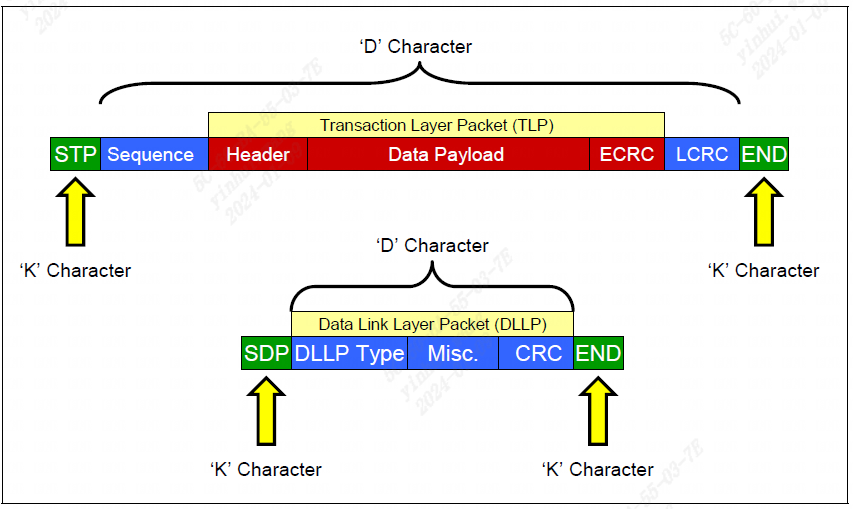
            图 11.7 具有开始和结束控制字符的 TLP 和 DLLP 数据包组帧

- 有序集。 如前所述，控制字符仅由物理层使用，较高层看不到。 一些跨链路的通信对于启动和维持链路操作是必要的，这是通过交换有序集来完成的。 每个有序集都以称为逗号 (COM) 的 K 字符开头，并包含其他 K 或 D 字符，具体取决于要交付的订单集的类型。 有序集始终在四个字节边界上对齐，并在各种情况下传输，包括：
    - 错误恢复、启动事件（例如热重置）或退出低功耗状态。 在这些情况下，训练序列 1 和 2（TS1 和 TS2）有序集通过链路进行交换。
    - 复用器以周期性间隔插入 SKIP 有序集模式，以促进接收器中的时钟容差补偿。 有关此过程的详细说明，请参阅“时钟补偿”章节。
    - 当设备想要将其发射器置于电气空闲状态时，它必须通知链路另一端的远程接收器。 多路复用器插入一个电气空闲有序集(EIOS)来完成此操作。
    - 当设备想要将链路电源状态从 L0s 低功耗状态更改为 L0 全开启功耗状态时，它会向接收器发送一组快速训练序列 (FTS) 有序集。 接收器使用此有序集将其 PLL 重新同步到发送器时钟。

- 逻辑空闲序列。 当没有准备好传输的数据包并且没有要发送的有序集时，链路在逻辑上处于空闲状态。 为了使接收器 PLL 锁定到发送器的频率，发送器不断发送内容非常重要，因此在这种情况下会插入逻辑空闲字符。 逻辑空闲非常简单，仅由一串 Data 00h 字符组成。

#### 11.2.3 字节条带化对于宽链路(Byte Striping for Wide Links)

我们的示例中显示的下一步是字节条带化，尽管仅当端口实现多个通道（称为宽链路）时才需要这样做。 条带化意味着字符流中的每个连续的出站字符都被路由到连续的通道上。 所使用的通道数是在链路训练过程中根据共享链路的两个设备所支持的配置进行配置的。
 
下图说明了字节条带化的三个示例。 在图 11-8 中，显示了单通道链路 (x1)。 这不是一个非常有趣的情况，因为数据包一次一个字节地进入物理层并以相同的方式出去，但说明了绘制字符序列的方式。
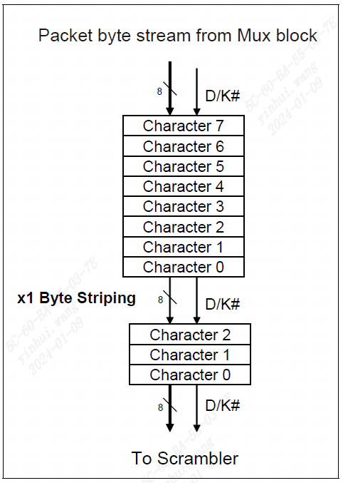
           图 11.8 x1 字节条带化

图 11-9 显示了来自多路复用器的传入 Dword 数据包。 每个字节都被定向到相应的通道。 最后，图 11-10 说明了八车道 (x8) 链路。 在此示例中，需要两个 Dword 来填充所有 8 个通道。 这要求 Dword 的到达速率是前一个示例的两倍。 以下各节描述了通过每个通道发送的数据的格式。
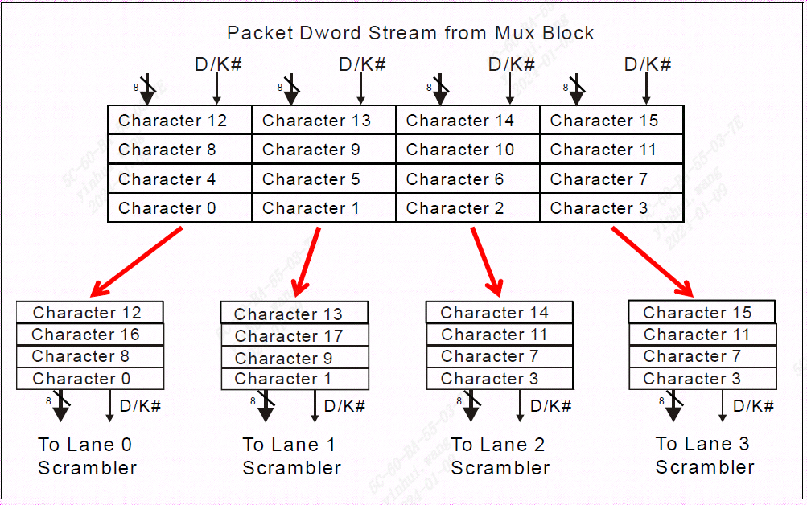
                       图 11.9 x4 字节条带化
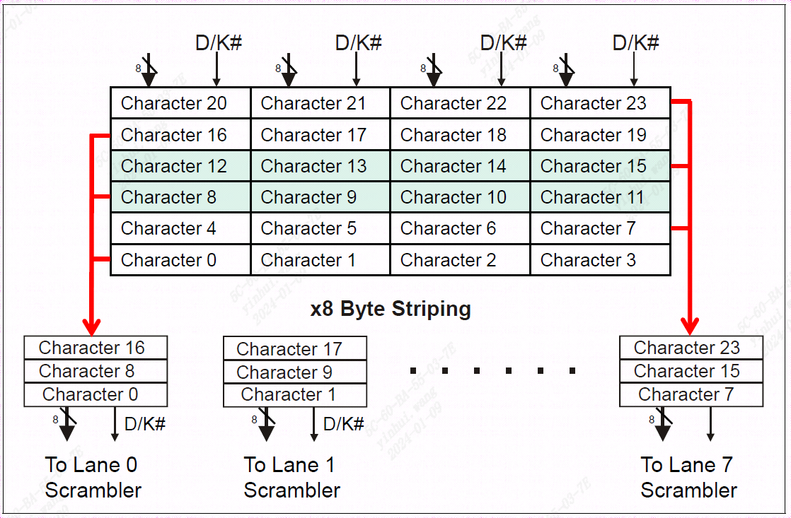
                图 11.10 带双字并行数据的 x8 字节条带化

#### 11.2.4 数据包格式规则

##### 通用规则

- 每个数据包的总数据包长度（包括开始和结束字符）始终是四个字符的倍数。 这是数据长度以双字为单位测量这一事实的自然延伸。
- TLP 以STP 字符开始，以END 或EDB 字符结束。
- DLLP 以SDP 开始，以END 字符结束。 并且正好是 8 个字符长（SDP + 6 个字符 + END）
- 在传输逻辑空闲后开始传输数据包时，STP 和SDP 字符被放置在通道0 上。 在其他情况下，它们可能从可被 4 整除的通道号开始。
- 接收器的物理层可以监视是否违反这些规则，并可以将其作为接收器错误报告给数据链路层。

##### 示例：x1 格式

图 11-11 中所示的示例说明了通过 x1 链路（仅一个通道可操作的链路）传输的数据包的格式。 显示了一系列数据包，其中散布着一个 SKIP 有序集。 逻辑空闲显示在末尾，表示发送器没有更多数据包要发送并使用空闲字符作为填充符的情况。
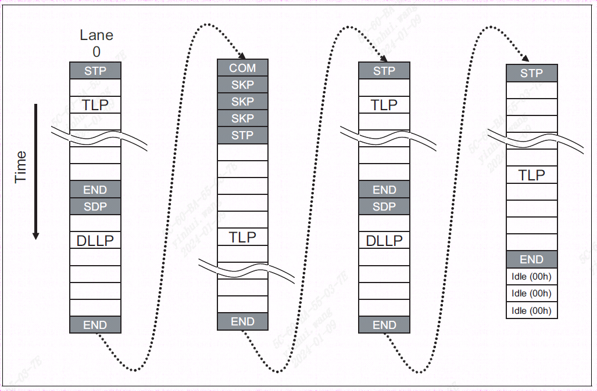
                     图 11.11 x1 数据包格式

##### x4 格式规则

- STP 和SDP 字符始终在通道0 上发送。
- END 和EDB 字符始终在通道3 上发送。
- 当发送诸如SKIP 之类的有序集时，它必须同时出现在所有通道上。
- 传输逻辑空闲时，必须同时在所有通道上发送它们。
- 任何违反这些规则的行为都可能会作为接收器错误报告给数据链路层。

##### 示例：x4 格式

图 11-12 中所示的示例说明了通过 x4 链路（具有四个数据通道的链路）发送的数据包的格式。 该图显示了一个 TLP，后跟在所有通道上传输的 SKIP 有序集，用于接收器时钟补偿。 接下来是 DLLP，然后是所有通道上的逻辑空闲。 此示例强调数据包始终是 4 个字符的倍数，因为起始字符始终出现在通道 0 中，结束字符始终出现在通道 3 中。它还说明有序集必须同时出现在所有通道上。
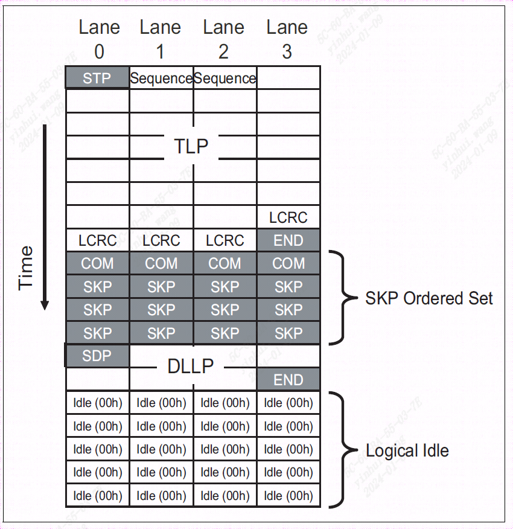
                      图 11.12 x4 数据包格式

##### 大链路宽度数据包格式规则

当数据包通过 x8、x12、x16 或 x32 链路传输时，适用以下规则：
- 在传输逻辑空闲一段时间后开始传输时，STP/SDP 字符始终在通道 0 上发送。 此后，在发送背靠背数据包时（Lane 4、8、12 等），它们只能在可被 4 整除的 Lane 号上发送。
- END/EDB 字符在可被4 整除的通道号上发送，然后减一（通道3、7、11 等）。
- 如果数据包未在链路的最后一个通道结束，并且没有更多数据包准备就绪，则 PAD 符号将用作剩余通道编号的填充符。 逻辑空闲不能用于此目的，因为它必须同时出现在所有通道上。
- 有序集(Ordered sets)必须同时在所有通道上发送。
- 同样，逻辑空闲在使用时必须在所有通道上发送。
- 任何违反这些规则的行为都可能会作为接收器错误报告给数据链路层。

##### 示例：x8数据包格式

图 11-13 中所示的示例说明了通过 x8 链路传输的数据包的格式。 该图显示了一个 TLP，后跟一个 SKIP 有序集、一个 DLLP，最后是一个在通道 3 上结束的 TLP。此时，发送器没有更多数据包准备发送，但当前数据包不会扩展到包括所有 可用车道。 人们可能期望额外的通道充满逻辑空闲，但这在这里不起作用，因为空闲必须同时出现在所有通道上。 因此需要另一个填充字符，规范编写者选择在这里使用 PAD 控制字符。 PAD 唯一使用的其他地方是在训练过程中。 最后，由于仍然没有更多数据包要发送，因此在所有通道上发送逻辑空闲。
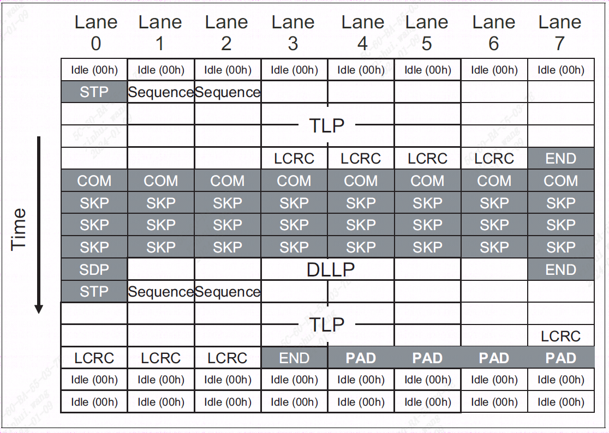
                      图 11.13 x8 数据包格式

#### 11.2.5 加扰器(Scrambler)

我们示例中的下一步是加扰，如图 11-5 所示，其目的是防止数据流中出现重复模式。 重复的模式会在链路上产生“纯音”，这意味着由该模式产生的一致频率会产生比通常的噪声或 EMI 更大的噪声。 通过将这种能量分散到更宽的频率范围来减少这个问题是加扰的主要目标。 此外，一个通道上的加扰传输还可以减少对宽链路上相邻通道的干扰。 这种“空间频率去相关”或串扰噪声的减少有助于每个通道上的接收器区分所需的信号。

为了帮助接收器保持与加扰序列的同步，控制字符不会被加扰，因此即使加扰器不同步也可以被识别。 此外，COM 控制字符 (K28.5) 的到来会在每次到达时重新初始化链路两端的扰码器，从而重新同步它们。

##### 加扰器算法

规范中描述的扰码器如图 11-14 所示。它由 16 位线性反馈移位寄存器 (LFSR) 组成，反馈点实现以下多项式：
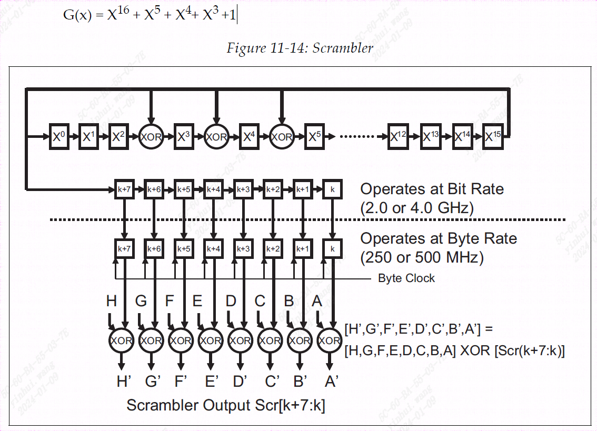
                         图 11.14 加扰器

LFSR 的时钟频率是馈送数据字节的时钟频率的 8 倍，其输出时钟输入 8 位寄存器，该寄存器与 8 位数据字符进行异或，以形成加扰数据输出。

##### 一些加扰器的实现规则：

- 在多通道链路实施中，与每个通道关联的扰码器必须协同操作，在每个LFSR 中保持相同的同时值。
- 加扰仅适用于“D”字符，即与 TLP 和 DLLP 以及逻辑空闲 (00h) 字符相关的字符。 但是，TS1 和 TS2 有序集中的那些“D”字符不会被扰乱。
- 加扰永远不会应用于“K”字符和有序集合中的字符，例如 TS1、TS2、SKIP、FTS 和 Electrical Idle。 这些字符绕过扰码器逻辑。 这样做的原因之一是确保即使扰码器以某种方式失序，接收器仍然可以识别它们。
- Compliance Pattern 字符（用于测试）也不会被扰乱。
- COM 字符是一种不会加扰的控制字符，用于在发送器和接收器上将 LFSR 重新初始化为 FFFFh。
- 除COM 字符外，对于发送的每个D 或K 字符，LFSR 通常会连续前进八次，但它不会在与SKIP 有序集关联的SKP 字符上前进。 原因是接收器可以添加或删除SKP符号来执行时钟容差补偿。 如果不忽略接收器中的字符数与发送的字符数相比，更改接收器中的字符数将导致接收器 LFSR 中的值与发送器 LFSR 值失去同步。

##### 禁用加扰

默认情况下启用加扰，但规范允许出于测试和调试目的禁用它。 这是因为测试可能需要控制发送的确切位模式，并且由于硬件处理加扰，因此软件没有合理的方法能够强制使用特定模式。 没有定义特定的软件机制来指示物理层禁用加扰，因此这必须是特定于设计的实现。

如果设备禁用加扰，则会通过发送至少两个在控制字段中设置了适当位的 TS1 和 TS2 来将其传达给相邻设备，如“配置状态”中章节所述。作为响应，相邻设备 还禁用其加扰。

#### 11.2.6 8b/10b 编码(8b/10b Encoding)

##### 概述

前两代 PCIe 使用 8b/10b 编码。 每个通道都实现一个 8b/10b 编码器，将 8 位字符转换为 10 位符号。 此编码方案于 1984 年获得 IBM 专利，并广泛应用于当今的许多串行传输，例如千兆位以太网和光纤通道。

##### 动机

编码实现了串行传输的几个理想目标。 这里列出了其中最重要的三个：
- **将时钟嵌入到数据中**(Embedding a Clock into the Data)。 编码可确保数据流中有足够的**边沿**来恢复接收器处的时钟，从而不需要分布式时钟。 这避免了并行总线设计的一些限制，例如飞行时间和时钟偏差。 它还消除了分配高频时钟的需要，否则会导致其他问题，例如增加 EMI 和布线困难。 作为此过程的示例，图 11-15 显示了数据字节 00h 的编码结果。 可以看出，这个没有转换的 8 位字符转换为具有 5 个转换的 10 位符号。 8b/10b 保证有足够的边沿，以确保在任何条件下比特流中的“游程长度”（连续的 1 或 0 的序列）不超过 5 个连续位。
- **保持直流平衡**(Maintaining DC Balance)。PCIe 使用交流耦合链路，在路径中串联放置一个电容器，以将信号的直流部分与链路的另一端隔离。 这允许发送器和接收器使用不同的共模电压，并且在它们之间的路径足够长而不太可能具有完全相同的参考电压的情况下，使电气设计变得更容易。 该直流值或共模电压可能会在运行时发生变化，因为信号被驱动时线路会充电。 通常，信号变化如此之快，以至于没有时间引起问题，但是，如果信号平均值主要是一个电平或另一个电平，则共模值将出现漂移。 这种漂移电压被称为“直流漂移”，会降低接收器处的信号完整性。为了补偿，8b/10b 编码器跟踪发送的最后一个符号的“差异”。 视差或不平等只是指示前一个符号的 1 是否多于 0（称为正视差）、零多于 1（负视差）还是 1 和 0 的平衡（中性视差）。 例如，如果前一个符号具有负差异，则下一个符号应该通过使用更多符号”1“来平衡。
- **增强错误检测**(Enchancing Error Detection)。 该编码方案还有助于检测传输错误。 对于 10 位值，可能有 1024 个代码，但要编码的字符只有 256 个唯一代码。 为了保持 DC 平衡，设计为每个字符使用两个代码，并根据发送的最后一个符号的差异选择哪个代码，因此需要 512 个代码。 然而，许多中性视差编码具有相同的值（D28.5 是一个示例），因此并非所有 512 都被使用。 因此，超过一半的可能编码未被使用，如果在接收器处看到，将被视为非法。 如果传输错误确实改变了符号的位模式，则结果很可能是可以立即识别的非法模式之一。 有关这方面的更多信息，请参阅标题为“差异”的部分。

8b/10b 编码的主要缺点是它所需的开销。 从接收方的角度来看，实际传输性能下降了 20%，因为每个字节发送 10 位，但在接收方只恢复了 8 个有用的位。 这是一个不小的代价，但仍然被认为是可以接受的以获得上述优势。
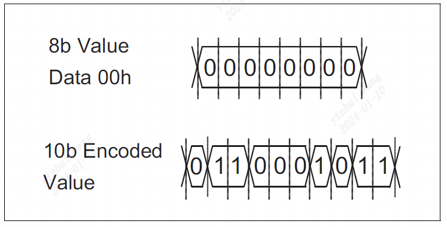
                     图 11.15 8位字符 00h 编码示例

##### 10位符号的属性

正如有关 8b/10b 编码的文献中所述，该设计并不是严格的 8 位到 10 位。 相反，它实际上是先进行 5 到 6 位编码，然后再进行 3 到 4 位编码。 子块是设计的内部部分，但它们的存在有助于解释合法符号的一些属性，如下所列。 不遵循这些属性的符号被视为无效。
- 比特流绝不会包含超过五个连续的1 或0，即使从一个符号的末尾到下一个符号的开头也是如此。
- 每个 10 位符号包含：
	- 四个 0 和六个 1（不一定连续），或者
	- 六个 0 和四个 1（不一定连续），或者
	- 五个 0 和五个 1（不一定是连续的）。
- 每个10 位符号被细分为两个子块：第一个为六位宽，第二个为四位宽。
	- 6 位子块包含不超过 4 个 1 或 4 个 0。
	- 4 位子块包含不超过 3 个 1 或 3 个 0

##### 字符表示法(Character Notation)

8b/10b 使用特殊符号速记，图 11-16 说明了获得给定字符的速记的步骤：
1. 将字符划分为 3 位和 5 位子块。
2. 调换子块的位置。
3. 为每个子块创建等值的十进制。
4. 字符采用 Dxx.y 形式（表示数据字符）或 Kxx.y 形式（表示控制字符）。 在这种表示法中，xx 是 5 位字段的十进制等效值，y 是 3 位字段的十进制等效值。
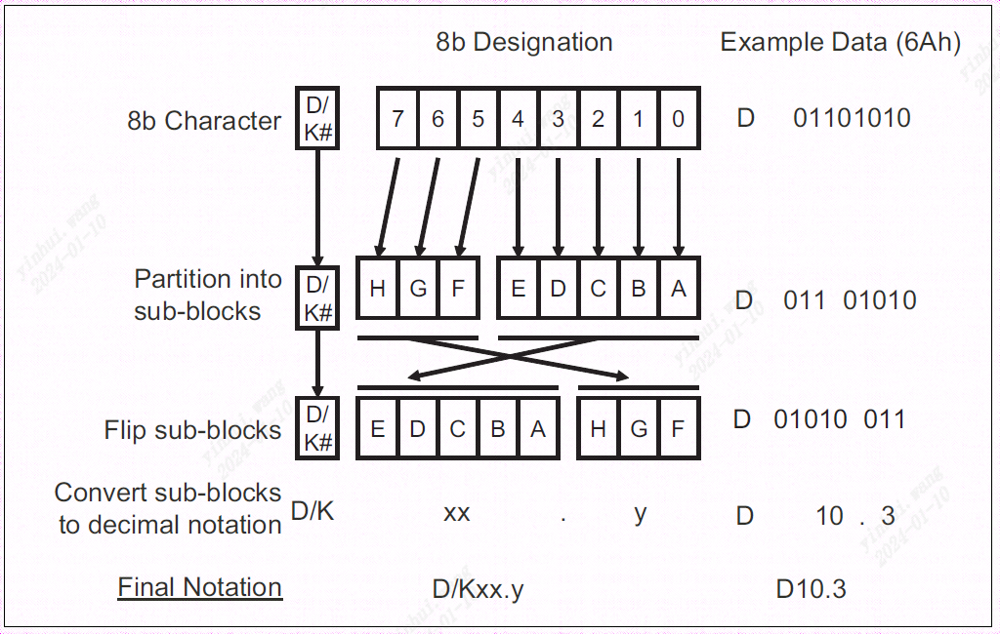
                       图 11.16  8b/10b 命名法

##### 视差/差异(Disparity)

**定义**(Define)。 差异是指 10 位符号内 1 和 0 的数量之间的不平等，用于帮助维持链路上的 DC 平衡。 具有更多0的符号被称为具有负 (-) 差异，而具有更多1的符号具有正 (+) 差异。 当一个符号具有相同数量的 1 和 0 时，我们称其具有中性差异。 有趣的是，大多数字符都编码为具有+或-差异的符号，但有些字符仅编码为具有中性差异的符号。

**CRD（当前运行差异）**（CRD (Current Running Disparity)）。 CRD 是有关链路上当前差异状态的信息。 由于它只是一个位，因此只能是正数或负数，并且在发送下一个符号时并不总是会改变。 要了解其工作原理，请记住解码的下一个符号可以具有负、中性或正差异，然后考虑以下示例。 如果 CRD 为正，则具有负差异的传出符号会将其更改为负，中性差异会将其保留为正，而正差异将是一个错误，因为 CRD 只有一位且无法生成更多 积极的。

CRD 的初始状态（在传输任何字符之前）\ 发送者和接收者之间可能不匹配，但事实证明这并不重要。 当接收器在训练完成后看到第一个符号时，它将检查差异错误，如果发现错误，则只需更改 CRD。 这不会被视为错误，而只是对 CRD 进行调整以匹配接收方和发送方。 之后，只有两种合法的CRD情况：如果新Symbol具有中性差异，则它可以保持不变；如果新Symbol具有相反差异，则它可以翻转到相反极性。 不合法的是新符号的差异与 CRD 相同。 此类事件将是视差错误，并且在初始调整后永远不会发生，除非发生错误。

##### 编码过程

8b/10b 编码有多种不同的实现方式。 最简单的方法可能是实现一个包含所有可能输出值的查找表。 然而，该表可能需要相对大量的门。 另一种方法是将解码器实现为逻辑块，这通常是首选，因为它通常会产生更小且更便宜的解决方案。 参考文献中详细描述了编码逻辑的细节，因此我们将在这里重点关注它的工作原理。

图 11-17 显示了示例 8b/10b 框图。新的传出符号是基于三件事创建的：传入字符、该字符的 D/K# 指示以及 CRD。 新的 CRD 值是根据传出的符号计算出来的，并被反馈以用于编码下一个字符。 编码后，生成的符号被馈送到串行器，该串行器输出各个位。图 11-18 显示了一些示例 8b/10b 编码，这些编码对于下面的示例很有用。
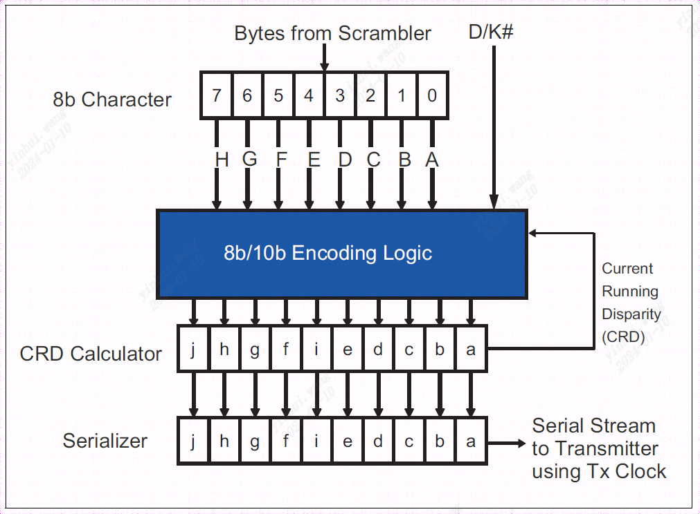
                  图 11.17 8bit 到 10bit（8b/10b）编码框图
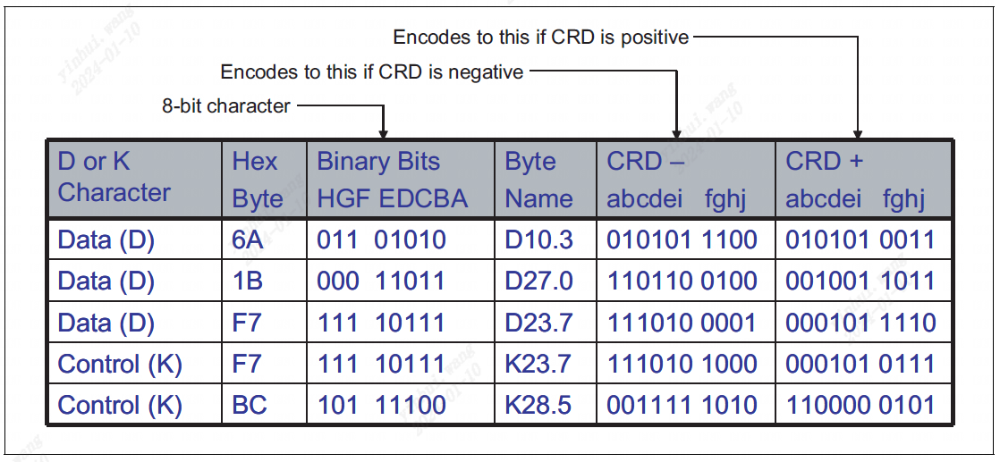
                     图 11.18 8b/10b 编码示例

##### 传输示例

图11-19说明了三个字符的编码和传输：第一个和第二个字符是控制字符K28.5，第三个字符是数据字符D10.3。

在此示例中，初始 CRD 为负，因此 K28.5 编码为 001111 1010b。 该符号具有正差异（1 多于 0），并导致 CRD 极性翻转为正。 接下来的K28.5被编码为110000 0101b并且具有负视差。 这导致这次 CRD 转为负数。 最后，D10.3被编码为010101 1100b。 由于其差异是中性的，因此 CRD 在这种情况下不会改变，但无论下一个字符是什么，它都保持负值。
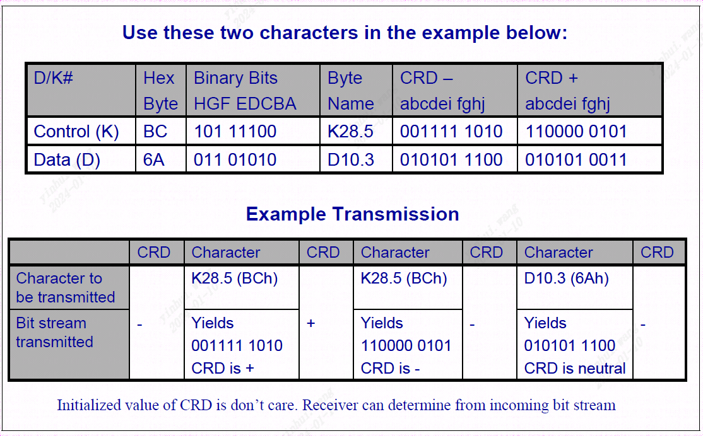
                        图 11.19 8b/10b 传输示例

##### 控制字符

8b/10b 编码为链路管理提供了几个特殊字符，表 11-1 显示了它们的编码。

                     表 11-1 控制字符编码和定义
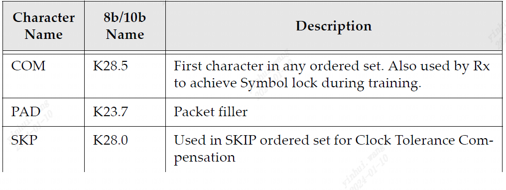
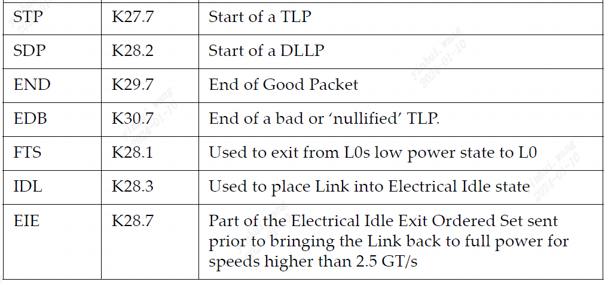

- **COM**（Comma）：其主要功能之一是成为物理层通信中的第一个符号，称为有序集（请参阅的“有序集”）。 它有一个有趣的属性，使得它的两种符号编码在接收器上都很容易识别：它们以两个同极性的位开始，后面跟着五个相反极性的位（001111 1010 或 110000 0101）。 当接收器试图理解传入的比特串时，此属性对于初始训练特别有用，因为它有助于接收器锁定传入的符号流。 有关其工作原理的更多信息，请参阅的“链路训练和初始化”。
- **PAD**：在多通道链路上，如果要发送的数据包未覆盖所有可用通道并且没有更多数据包准备发送，则使用 PAD 字符填充剩余通道。
- **SKP**(Skip）：用作周期性发送的SKIP 有序集的一部分，以促进时钟容差补偿。
- STP（开始 TLP）：插入以标识TLP 的开始。
- SDP（开始 DLLP）：插入以标识DLLP 的启动。
- END：附加以标识无错误TLP 或DLLP 的结束。
- EDB (End Bad)：插入以识别转发设备（例如交换机）希望“无效”的 TLP 末尾。 当使用“直通模式”的交换机将数据包从入口端口转发到出口端口而不首先缓冲整个数据包时，可能会出现这种情况。 在转发过程中检测到的任何错误都会产生问题，因为在检查数据包是否有错误之前，数据包的一部分已经被传送。 为了处理这种情况，交换机必须取消已经在前往目的地的路由中的路由。 这是通过使其无效来实现的：以 EDB 结束数据包并将 LCRC 反转。 当接收方看到无效数据包时，它会丢弃该数据包并且不返回 ACK 或 NAK。 （参见“直通操作示例”。）
- FTS（快速训练序列）：设备发送的FTS 有序集的一部分，用于将链路从L0s 待机状态恢复到全开L0 状态。
- IDL（空闲）：发送电气空闲命令集的一部分，通知接收器链路正在转换为低功耗状态。
- EIE（电气空闲退出）：添加到 PCIe 2.0 规范中，用于帮助电气空闲链路开始唤醒过程。

##### 有序集

**通用**。 有序集用于链路伙伴的物理层之间的通信，并且可以被视为通道管理数据包。 根据定义，它们是一系列字符，不是 TLP 或 DLLP。 对于 Gen1 和 Gen2，它们始终以 COM 字符开头。 有序集同时在所有通道上复制，因为每个通道在技术上都是独立的串行路径。 这也允许接收器验证对齐和去偏斜。 有序集用于链路训练、时钟容差补偿和更改链路电源状态等。

**TS1 和 TS2 有序集 (TS1OS/TS2OS)**。 训练序列一和二用于链路初始化和训练。 它们允许链接伙伴实现位锁定和符号锁定、协商链接速度并报告与链接操作相关的其他变量。标题为“TS1 和 TS2 有序集”的部分对它们进行了更详细的描述。

**电气空闲有序集 (EIOS)**。 希望进入较低功率链路状态的发送器在停止传输之前发送此消息。 收到后，接收器知道要为低功耗状态做好准备。 EIOS 由四个符号组成：COM 符号后跟三个 IDL 符号。 接收器检测此有序集，并通过忽略输入错误为链路进入电气空闲状态做好准备，直到退出电气空闲状态。 发送 EIOS 后不久，发送器将其差分电压降低至低于 20mV 峰值。

**FTS 有序集 (FTSOS)**。 发送器发送适当数量的这些（最小数量由链路邻居在训练期间给出）以使链路从低功耗 L0s 状态返回到完全运行的 L0 状态。 接收器检测 FTS，识别链路正在退出电气空闲状态，并使用它们来恢复位和符号锁定。FTS 有序集由四个符号组成：COM 符号后跟三个 FTS 符号。

**SKP 有序集 (SOS)**。 它由四个符号组成：COM 符号后跟三个 SKP 符号。 它定期发送，并用于时钟容差补偿，如“时钟补偿”和“接收器时钟补偿逻辑”中所述。基本上，接收器评估 SOS，并根据需要在内部添加或删除 SKP 符号 防止其弹性缓冲器下溢或上溢。

**电气空闲退出有序集 (EIEOS)**。 在 PCIe 2.0 规范中添加的此有序集被定义为提供退出电气空闲链路状态所需的较低频率序列。 用于 8b/10b 编码的 EIEOS 使用重复的 K28.7 控制字符来显示为由 5 个 1 后跟 5 个 0 组成的重复字符串。 该低频串产生低频信号，允许接收器更容易检测到更高的信号电压。 事实上，规范指出，这种模式保证接收器能够正确检测到电气空闲状态的退出，这是加扰数据无法做到的。 有关电气空闲退出的详细信息，请参阅的“电气空闲”部分。

#### 11.2.7 串行器(Serializer)

每个通道上的 8b/10b 编码器为串行器提供信号，该串行器按位顺序输出符号（参见图 11-17），首先移出最低有效位 (a)，然后移出最高有效位 (j) 最后出来。 对于每个通道，符号将以 250MHz 或 500MHz 的频率提供给串行器，以支持比 2.5 GHz 或 5.0 GHz 快 10 倍的串行比特率。

#### 11.2.8 差分驱动器(Differential Driver)

实际将比特流发送到线路上的差分驱动程序使用 NRZ 编码。 NRZ 简单地表示没有使用特殊或中间电压电平。 差分信号提高了信号完整性，并允许更高的频率和更低的电压。 有关驱动器电气特性的详细信息将在“发射器电压”部分中讨论。

#### 11.2.9 发送器时钟(Tx 时钟)

每个通道上的串行输出由 Tx 时钟信号进行时钟输出。 如前所述，时钟频率必须精确到中心频率周围 +/-300ppm（总变化为 600ppm）。 关于该时钟的来源有两种选择。 它可以在内部生成，也可以从可选的外部参考中导出。 外围卡的 PCIe 规范包括系统板为此目的提供的 100MHz 参考时钟的定义。 该参考时钟在内部进行倍频，以获得驱动内部逻辑的本地时钟和串行器使用的 Tx 时钟。

#### 11.2.10 其他传输主题

##### 逻辑空闲(Logical Idle)

为了防止接收器的 PLL 漂移，必须在没有 TLP、DLLP 或有序集要传输的时间段内传输某些内容，并且在这些时间段内注入到字符流中的是逻辑空闲字符。 逻辑空闲字符的一些属性：
- 它是一个8 位数据字符，值为00h。
- 发送时，它同时在所有通道上运行，并且链路处于逻辑空闲状态（不要与电气空闲状态混淆，即输出驱动器完全停止传输且接收器 PLL 失去同步时的状态）。
- 逻辑空闲字符被加扰，但接收器可以将其与其他数据区分开来，因为它出现在数据包成帧上下文之外（即：在 END 或 EDB 之后，但在 STP 或 SDP 之前）。
- 采用8b/10b 编码。
- 在逻辑空闲传输期间，SKIP 有序集仍定期发送。

##### Tx 信号偏移(Tx Signal Skew)

可以理解的是，发射机应在通道之间引入最小的偏斜，以便为路由和其他变化留下尽可能多的 Rx 偏斜预算。 该规范将 Tx 偏差值列出为 Gen1 的 500ps + 2 UI、Gen2 的 500ps + 4UI 和 Gen3 的 500ps + 6 UI。 回想一下，UI（单位间隔）代表链路上的一位时间，其计算结果如下面的表 11-2 所示。

                        11-2 允许的发射机信号偏差
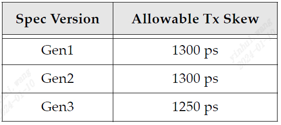

##### 时钟补偿(Clock Compensation)

**背景**。 PCIe 等高速串行传输有一个特殊的时钟问题需要解决。 接收器从传入的比特流中恢复时钟，并使用它来锁存数据位，但是该恢复的时钟与接收器的内部时钟不同步，并且在某些时候它必须开始使用自己的内部时钟为数据提供时钟。 即使它们有一个可选的公共外部参考时钟，它们最多也只能生成一个在所需频率的指定容差范围内的内部时钟。 因此，其中一个时钟的频率几乎总是比另一个时钟的频率稍高。 如果发送器时钟更快，则数据包到达的速度将快于接收的速度。为了补偿，发送器必须在比特流中注入一些“丢弃字符”，如果有必要避免接收器丢失这些字符，接收器可以丢弃这些字符。 缓冲区溢出情况。 对于 PCIe，这些可以删除的字符采用 SKIP 有序集的形式，它由一个 COM 字符后跟三个 SKP 字符组成（见图 11-20）。 有关该主题的更多详细信息，请参阅第 396 页的“接收器时钟补偿逻辑”。

**SKIP 有序集插入规则**。 发射机需要定期发送 SKIP 有序集，并且适用以下规则：
- SKIP 有序集必须安排在 1180 到 1538 个符号时间之间插入（一个符号时间是发送一个符号所需的时间，为 10 位时间，因此在 2.5 GT/s 时，一个符号时间为 4ns，在 5.0 GT/s 时，一个符号时间为 4ns） /s，是2ns）。
- 它们仅插入数据包边界（不允许任何内容中断数据包），并且必须在所有通道上同时进行。 如果数据包已在处理中，则 SKP 有序集将必须等待。 不过，最大可能的数据包大小将需要超过 4096 个符号时间，并且在此期间应发送多个 SKIP 有序集。 这种情况的处理方法是累积应该发出的 SKIP，并将它们全部注入下一个数据包边界。
- 由于该有序集必须同时在所有通道上传输，多通道链路可能需要在某些通道上添加 PAD 字符，以允许有序集同时在所有通道上传输（参见图 11-13）。
- 在低功耗链路状态期间，任何用于调度SKIP 有序集的计数器都必须重置。 当发射器没有发出信号时，就不需要它们，并且唤醒链路来发送它们是没有意义的。
- 当Compliance 模式正在进行时，不得传输SKIP 有序集。

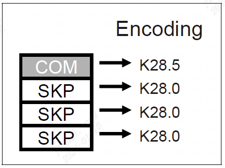
图 11.20 SKIP 有序集

### 11.3 接收机逻辑细节(仅Gen1和Gen2)

图 11-21 显示了逻辑物理层的接收器逻辑。 本节描述从每个通道上串行接收数据到数据包字节流被记录到数据链路层的数据包处理过程。
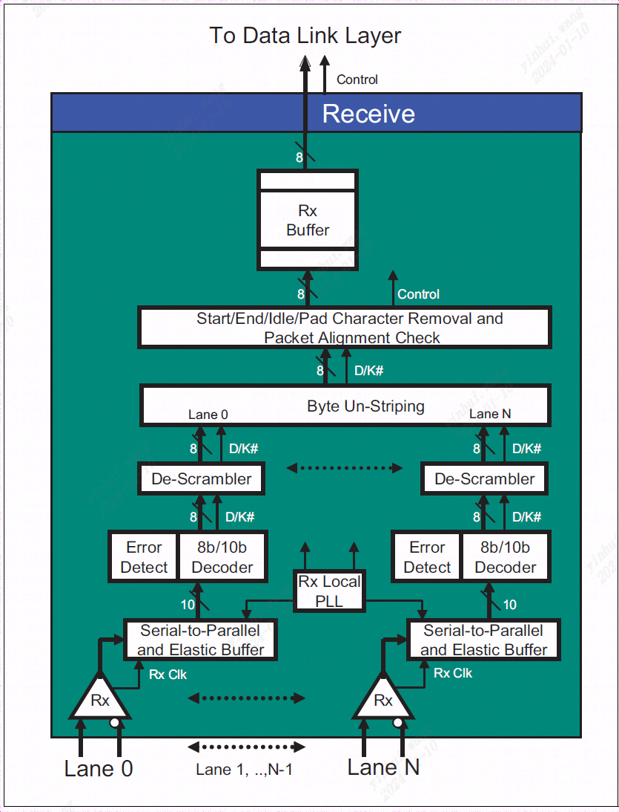
             图 11.21 物理层接收机逻辑细节(仅Gen1和Gen2)

#### 11.3.1 差分接受器

接收器逻辑的第一部分如图 11-22 所示，包括每个通道的差分输入缓冲器。 缓冲器感测峰峰值电压差并确定该差代表逻辑一还是零。 有关接收器特性的详细讨论，请参见“接收器特性”部分。
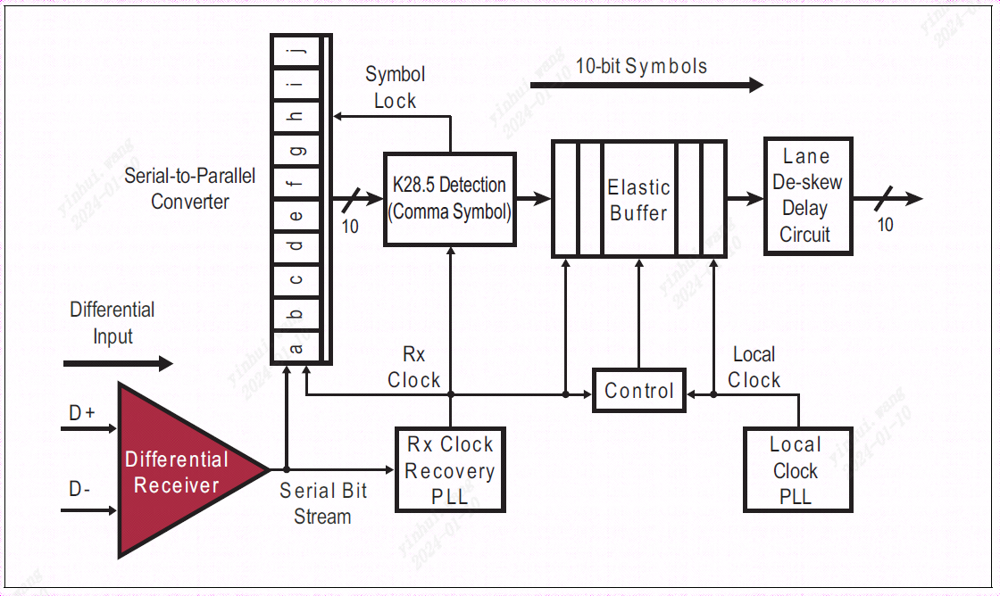
                  图 11.22 接收器逻辑每通道的前端

#### 11.3.2 Rx 时钟恢复

##### 概述

接下来，接收器可能使用 PLL 根据输入数据流中的数据位转换生成 Rx 时钟。 该恢复时钟的频率（2.5 或 5.0 GHz）与用于为线路上的比特流提供时钟的 Tx 时钟频率相同。 Rx 时钟用于为进入解串器的入站比特流提供时钟。 解串器必须与 10 位符号边界对齐（这个过程称为实现符号锁定），然后其符号流输出通过已除以 10 的 Rx 时钟版本记录到弹性缓冲区中。 必须精确到中心频率的 +/-300ppm 范围内，Rx 时钟可能与本地时钟略有不同，如果是这样，则需要补偿。
##### 实现位锁定(Achieving Bit Lock)

回想一下，8b/10b 编码方案保证入站串行符号流将包含频繁的转换。 接收器 PLL 使用这些转换来创建与 Tx 时钟同步的 Rx 时钟，Tx 时钟用于为发送器输出的比特流提供时钟。 当接收器锁定 Tx 时钟频率时，接收器被称为已实现“位锁定”。

在链路训练期间，发送器向接收器发送一长串 TS1 和 TS2 有序集，然后接收器使用其中的位转换来实现位锁定。 在正常操作期间，链路上有足够的转换，以便接收器在此之后保持位锁定。
##### 丢失位锁定(Losing Bit Lock)

如果链路处于低功耗状态（例如 L0s 或 L1），此时数据包传输停止，接收器将失去同步。 为了避免错误电路将此视为错误，发送器在进入较低功耗状态之前会发送一个电气空闲有序集 (EIOS)，以告知接收器解除其输入的选通。
##### 重新获得位锁定(Regaining Bit Lock)

当发送器准备好将链路从 L0s 状态唤醒时，它会发送特定数量的 FTS 有序集（实际数量是特定于设计的），接收器使用这些来重新获得位和符号锁定。 恢复所需的FTS数量较少，恢复时延较短。 由于链路在短时间内处于 L0 状态，因此接收器 PLL 在开始接收 FTS 之前通常不会偏离 Tx 时钟太远。 如果链路处于 L1 低功耗状态，并且发送器开始发送 TS1OS。 这会导致 Link 重新训练并且唤醒时间比 L0s 唤醒时间长。 如果链路有更严重的错误，并且在四次重试 TLP 后 Ack/Nak 机制未能成功恢复错误，数据链路层会向物理层发出信号，要求重新训练链路。 再次，在重新训练过程中重新建立位锁定。

#### 11.3.3 解串器(Deserializer)

##### 概述

输入数据通过 Rx 时钟计时进入每个通道的解串器（串并转换器）（参见图 11-22）。 生成的 10 位符号使用 Rx 时钟的 10 分频版本记录到弹性缓冲区中。
##### 实现符号锁定(Achieving Symbol Lock)

当接收逻辑开始接收比特流时，它是 JABOB（只是一堆比特），没有标记来区分符号或任何边界。 接收逻辑必须有办法找到 10 位符号的开始和结束，而Comma (COM) 符号可用于此目的。

COM 符号的 10 位编码包含两个同极性位，后跟五个相反极性位（0011111010b 或 1100000101b），使其易于检测。 回想一下，COM 控制字符与所有其他控制字符一样，也不会被发送器加扰，这可确保在接收器处看到所需的序列。 检测到 COM 后，逻辑知道接收到的下一位将是下一个 10 位符号的第一位。 此时，解串器据说已经实现了“符号锁定”。

COM Symbol用于实现Symbol Lock，如下：
• 在链路训练期间，当链路首次建立或需要重新训练时，传输TS1和TS2有序集。
• 当发送FTS 有序集以通知接收方将链路状态从L0s 更改为L0 时。

#### 11.3.4 接收器时钟补偿逻辑

##### 背景

我们之前观察到，链路两端的发射器和接收器使用的时钟不需要具有完全相同的频率。 每当链接不使用公共参考时钟并引入其中一个比另一个运行得稍快的问题时，就会出现这种情况。 唯一的要求是两个时钟的中心频率必须在 +/- 300 ppm（百万分之一）范围内。 由于在最坏的情况下，一个可能是+300 ppm，另一个可能是‐300 ppm，所以它们之间最差的分离可能是600 ppm。 这一差异转化为每 1666 个时钟增加或损失一个符号时钟。 一旦链路训练完毕，接收器中的接收时钟（Rx Clock）与链路另一端的发送时钟（Tx Clock）相同（因为接收时钟源自比特流）。

##### 弹性缓冲区的作用

为了补偿最坏情况下的频率差异，在接收路径中内置了一个弹性缓冲器（参见图 11-22）。 接收到的符号使用恢复的时钟输入，并使用接收器的本地时钟输出。 弹性缓冲器通过添加或删除 SKP 符号来补偿频率差异。 当 SKP 有序集到达时，逻辑监视弹性缓冲区的状态进行评估。 如果本地时钟运行得更快，则符号的输出速度比输入速度快，因此缓冲区将接近下溢条件。 当有序集到达时，逻辑将通过向有序集附加一个额外的 SKP 符号来快速重新填充缓冲区来对此进行补偿。 另一方面，如果恢复的时钟运行得更快，缓冲区将接近溢出条件，逻辑将通过删除其中一个 SKP 符号来快速耗尽缓冲区来对此进行补偿。 这些措施将弥补符号到达率和消耗率的差异，并防止任何数据混乱或丢失。

为此，发射机周期性地发送SKIP有序集。 顾名思义，SKP 角色是真正的一次性角色。 删除或添加 SKP 符号可以防止弹性缓冲区中的缓冲区溢出或下溢，然后当符号转发到下一层时，它们会与所有其他控制字符一起被丢弃。 因此，它们使用少量带宽，但根本不会影响数据包流。

尽管由于弹性缓冲区上溢或下溢而丢失符号是一种错误情况，但接收器可以选择检查此情况。 如果这样做，并且发生这种情况，将向数据链路层指示接收器错误。

发射机每 1180 到 1538 个符号时间调度一次 SKIP 有序集传输。 然而，如果发送器在计划发送 SKIP 有序集时在 1538 个符号时间边界处开始最大尺寸的 TLP 传输，则 SKIP 有序集传输将被推迟。接收器必须能够容忍具有最大大小的 SKIP 有序集。 分离取决于设备支持的最大数据包有效负载大小。 SKIP 有序集之间的最大符号数 (n) 的公式为：n = 1538 +（最大数据包有效负载大小 + 28）

等式中的数字 28 是 TLP 开销。 它是与标头（16 字节）、可选 ECRC（4 字节）、LCRC（4 字节）、序列号（2 字节）以及成帧符号 STP 和 END（2 字节）。

#### 11.3.5 通道间偏移(Lane-to-Lane Skew)

##### 飞行时间因通道而异(Flight Time Will Vary Between Lanes)

对于宽链路，通道之间的倾斜是一个无法避免的问题，必须在接收器处进行补偿。 符号使用相同的传输时钟在所有通道上同时发送，但不能期望它们在完全相同的时间到达接收器。 通道间偏差的来源包括：
• 电气发送器和接收器之间的差异
• 印刷线路板阻抗变化
• 走线长度不匹配

当携带数据包的串行比特流到达接收器时，必须消除通道间偏差，才能以正确的顺序接收字节。 此过程称为链路校正。
##### 有序集帮助消除偏斜

有序集的独特结构以及它们在所有通道上同时发送的事实使得它们对于检测通道之间的时序偏差非常有用。 规范没有定义执行此操作的方法，但在 Gen1 和 Gen2 中，接收器逻辑可以简单地查找每个通道上的 COM 字符。 如果它没有同时出现在所有通道上，那么最早到达的 COM 会被延迟，直到它们在所有通道上都匹配。
##### 接收器通道间去偏斜能力

这可以通过调整输入信号的模拟延迟线来完成。 或者，也可以在弹性缓冲区之后完成，其优点是到达时间差现在由接收器的本地时钟数字化为符号时间（参见图 11-23）。 如果一个通道的输入使其处于时钟边沿，而另一通道则不然，则可以简单地将先到达的 COM 延迟适当数量的符号时钟，以将其与晚到达的 COM 对齐。 事实上，接收器的最大允许偏差是时钟周期的倍数，这表明规范编写者可能考虑了这样的实现（参见表 11‐3）。
                      表11-3 允许的接收器信号偏差
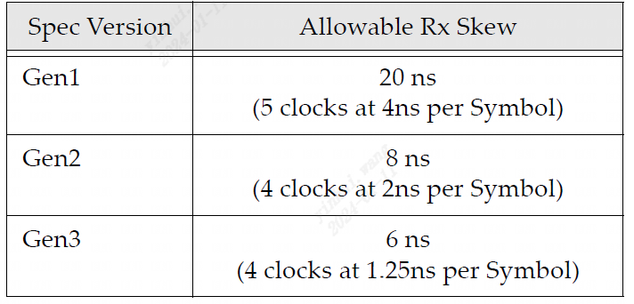

在 Gen3 模式下，没有任何 COM 字符可用于去偏，但检测有序集仍然可以提供必要的时序对齐。
##### 消除偏斜的机会

所有通道上同时需要一个明确的模式来执行偏移校正，任何有序集都可以。 链路训练发送这些，但 SKIP 有序集在正常链路操作期间定期发送。 检查其到达时间可以持续检查偏差，以防偏差可能因温度或电压而变化。 如果是这样，链路将需要转换到恢复 LTSSM 状态以纠正它。 然而，如果在数据包传输过程中发生这种情况，则可能会发生接收器错误并且数据包可能会被丢弃，从而可能导致重播 TLP。
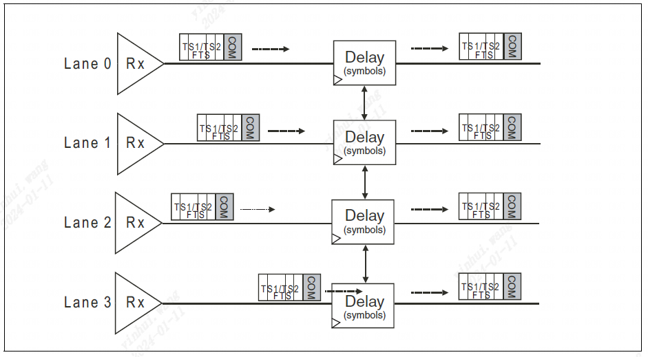
                  图 11.23 接收器链路消除偏斜逻辑
#### 11.3.6 8b/10b 解码

##### 概述

前两代 PCIe 使用 8b/10b，而 Gen3 则没有。 我们先探讨一下它的操作，然后再考虑 Gen3 的差异。 请参阅图 11-24。每个接收器通道都包含一个从弹性缓冲区馈送的 10b/8b 解码器。 解码器显示有两个查找表（D 表 和 K 表），用于将 10 位符号流解码为 8 位字符加上 D/K# 信号。 如果在 D 表中找到与接收到的符号匹配，则 D/K# 信号的状态指示接收到的符号是数据 (D) 字符；如果在 D 表中找到与接收到的符号匹配，则指示接收到的符号是控制 (K) 字符。
##### 差异计算器

解码器根据接收到的第一个符号的差异来设置差异值。 在第一个Symbol之后，一旦实现了Symbol锁定并且初始化了差异，则每个后续Symbol的差异的计算出的差异预计将遵循规则。 如果不存在，则会报告接收器错误。
##### 代码违规和差异错误检测

**通用**。8b/10b 解码器的错误检测逻辑检测接收到的符号流中的非法符号。 某些错误检查在接收器中是可选的，但规范要求检查这些错误并将其报告为接收器错误。 检测到的两种类型的错误是：

**代码违规**
- 任何包含超过四个1 或四个0 的6 位子块都是错误的。
- 任何包含超过三个1 或三个0 的4 位子块都是错误的。
- 任何包含超过六个1 或六个0 的10 位符号都是错误的。
- 任何包含超过五个连续1 或五个连续0 的10 位符号都是错误的。
- 任何不能解码为8 位字符的10 位符号都是错误的。

**差异错误**
在接收器处，Symbol 的差异不能与 CRD 的差异不匹配。 如果是，则检测到差异错误。 在处理后续符号之前，某些差异错误可能无法检测到（请参见图 11-25）。 例如，如果符号中的两个位翻转错误，则该错误可能不可见，并且该符号可以解码为有效的 8 位字符。 物理层不会检测到此类错误。
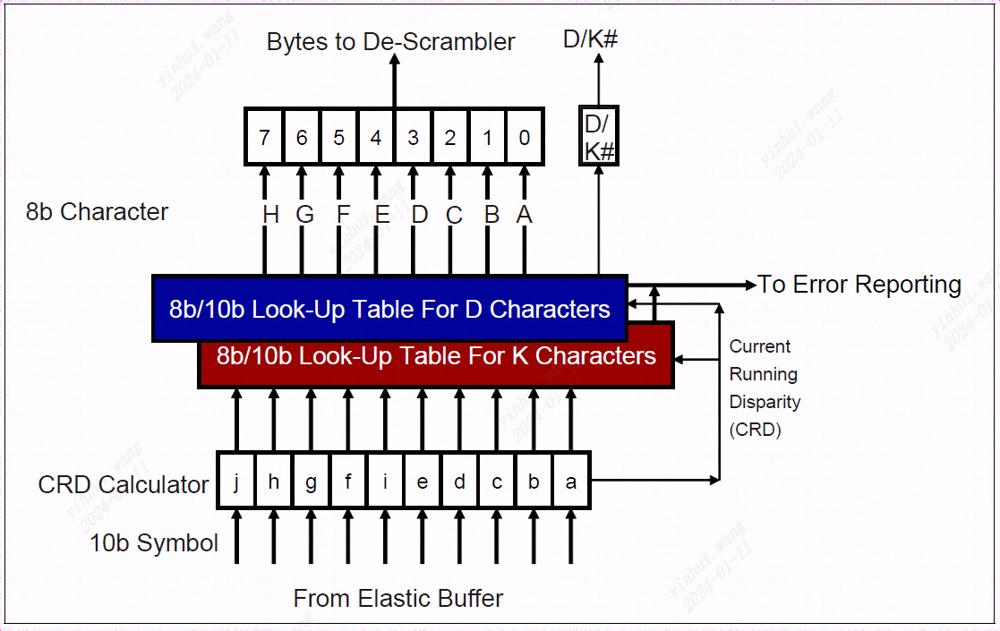
                  图 11.24 每条通道的8b/10b 解码器
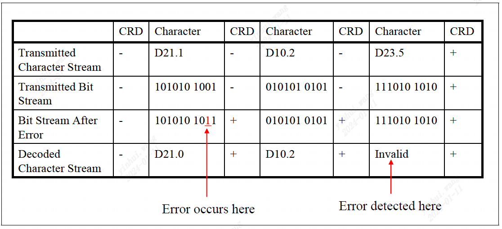
                    图 11.25 延迟差异错误检测的示例
#### 11.3.7 解串器

解扰器由 8b/10b 解码器馈送。 它仅解扰与 TLP 或 DLLP 关联的数据 (D) 字符（D/K# 为高）。 它不会对控制 (K) 字符或有序集进行解扰，因为它们在发射机上没有进行加扰。

##### 一些解串器实现规则：
- 在多通道链路上，与每个通道相关的解扰器必须协同工作，在每个 LFSR 中保持相同的同时值。
- 解扰应用于与TLP 和DLLP 相关的“D”字符，包括逻辑空闲(00h) 序列。 有序集中的“D”字符不会被解扰。
- “K”字符和有序集字符绕过解扰器逻辑。
- Compliance 模式字符不会被解扰。
- 当COM 字符进入解扰器时，它会将LFSR 值重新初始化为FFFFh。
- 除了一个例外，对于接收到的每个字符（D 或K 字符），LFSR 连续前进八次。 LFSR 不会在与接收到的 SKIP 有序集关联的 SKP 字符上前进。 LFSR 在检测 SKP 方面不先进的原因是，传输的 SKP 字符数与退出弹性缓冲区的 SKP 字符数之间可能存在差异（如“接收器时钟补偿逻辑”中所述）。

##### 禁用解串器

默认情况下，解扰始终处于启用状态，但规范允许出于测试和调试目的禁用它，尽管没有给出禁用它的标准软件方法。 如果解扰器接收到至少两个在其所有配置通道上设置了“禁用加扰”位的 TS1/TS2 有序集，则它会禁用解扰器。

#### 11.3.8 字节解条带化

图 11-26 显示了来自 x8 链路解扰器的八个字符流被分解为单个字节流，该字节流被馈送到字符过滤器逻辑。
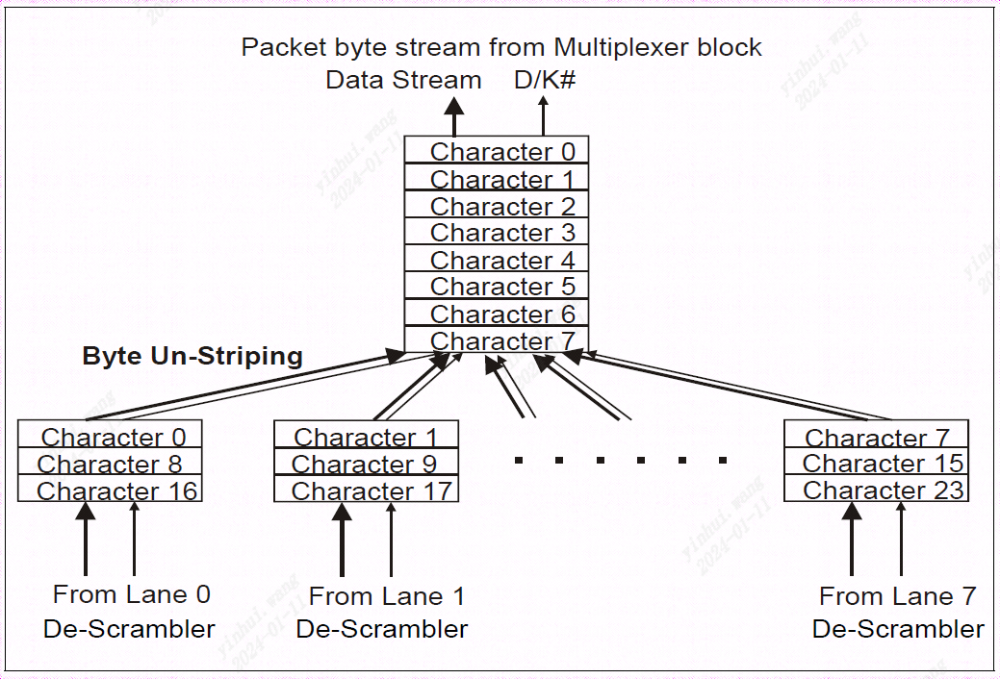
                 图 11.26 x8链路字节解串器示例

#### 11.3.9 过滤器和数据包对齐检查

字节解串逻辑提供的串行字节流包含 TLP、DLLP、逻辑空闲序列、控制字符（例如 STP、SDP、END、EDB 和 PAD）以及有序集。 其中，逻辑空闲序列、控制字符和有序集在进入下一层之前被检测并消除。 剩下的是 TLP 和 DLLP，它们连同每个数据包开始和结束的指示符一起发送到 Rx 缓冲区。

#### 11.3.10 接收缓冲区(Rx Buffer)

Rx 缓冲区在消除起始字符和结束字符后保存接收到的 TLP 和 DLLP。 接收到的数据包已准备好发送到数据链路层。 规范中未描述数据链路层的接口，因此设计人员可以自由决定数据总线宽度等细节。 例如，我们可以假设接口时钟为 250MHz，链路速度为 Gen1。 对于这种情况，这些层之间的数据总线中的字节数将与支持的通道数相同。

### 11.4 物理层错误处理

#### 11.4.1 概述

物理层错误作为接收器错误报告给数据链路层。 根据规范，必须检查某些错误并触发接收器错误，而其他错误则是可选的。

所需的错误检查：
- 8b/10b 解码错误：差异错误、非法符号 可选错误检查：
- 符号锁定丢失（请参阅“实现符号锁定”）
- 弹性缓冲区上溢或下溢
- 通道偏移校正错误（请参阅“通道到通道偏移”）
- 不符合格式规则的数据包

#### 11.4.2 数据链路层对接收器错误的响应

如果物理层向数据链路层指示接收器错误，则数据链路层丢弃当前正在接收的TLP并释放为TLP分配的任何存储。 然后它安排 NAK 返回到 TLP 的发送器。 这会导致发送器从重播缓冲区重播 TLP，这应该会自动纠正错误。 数据链路层还可以指示物理层发起链路重新训练。

如果实现了 PCI Express 扩展高级错误功能寄存器集，则接收器错误会设置可纠正错误状态寄存器中的接收器错误状态位。 如果启用，EP可以向RC发送 ERR_COR（可纠正错误）消息。

#### 11.5 激活状态电源管理

有多种链路电源状态可以在某些条件下实现省电。 这些是 L0s、L1、L2 和 L3，它们代表逐渐降低的功率以及更长的恢复时间，以使链路回到 L0 的完全运行状态。 L0s状态只能在硬件控制下进入，而L1状态可以由硬件或软件启动。 由于 L0s和 L1 可以由硬件控制，因此规范将它们称为 ASPM（活动状态电源管理）状态。 有关链路和设备电源管理的详细信息，请参阅“激活状态电源管理 (ASPM)”部分。

#### 11.6 链路训练和初始化

正如我们在本章中简要提到的，物理层还负责在重置后初始化链路。 然而，这个主题太大，无法在这里介绍，而是在第14 章的“链接初始化和训练”中介绍。

