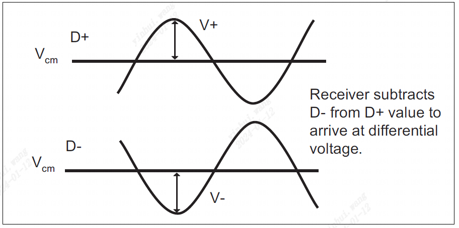
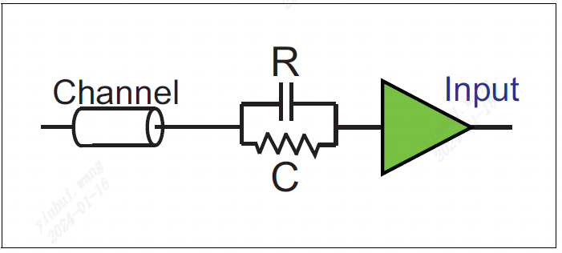

### 上一章节

上一章介绍了第三代 (Gen3) PCIe 的逻辑物理层特征。 主要变化包括能够将相对于 Gen2 速度的带宽加倍，而无需将频率加倍（链路速度从 5 GT/s 变为 8 GT/s）。 这是通过在 Gen3 模式下消除 8b/10b 编码来实现的。 Gen3 速度需要更稳健的信号补偿。 进行这些更改比预期的更复杂。
### 本章节

本章描述了链路的物理层电气接口，包括差分发送器和接收器的一些低级特性。 这里还讨论了信号均衡的必要性以及用于实现信号均衡的方法。 本章结合了 Gen1、Gen2 和 Gen3 速度的电气发射器和接收器特性。
### 下一章节

下一章介绍物理层的链路训练和状态机 (LTSSM) 的操作。 链路的初始化过程描述为从上电或复位到链路达到完全运行的 L0 状态，在此期间发生正常的数据包流量。 此外，还讨论了链路电源管理状态 L0、L1、L2、L3 以及状态之间转换的原因。 描述了可以重新建立位锁定、符号锁定或块锁定的恢复状态。
### 13.1 后向兼容能力

该规范从物理层电气部分开始，观察到较新的数据速率需要与较旧的速率向后兼容。 以下摘要定义了要求：
- 所有设备的初始训练均以2.5 GT/s 的速度完成。
- 更改为其他速率需要链路合作伙伴之间进行协商以确定峰值公共频率。
- 支持8.0 GT/s 的根端口还需要支持2.5 和5.0 GT/s。
- 下游设备显然必须支持2.5 GT/s，但所有更高的速率都是可选的。 这意味着 8 GT/s 设备不需要支持 5 GT/s。

此外，无论数据速率如何，可选的参考时钟 (Refclk) 都保持不变，并且不需要改进抖动特性来支持更高的速率。

尽管有这些相似之处，该规范确实描述了 8.0 GT/s 速率的一些变化：
- ESD 标准：早期的 PCIe 版本要求所有信号和电源引脚能够承受一定水平的 ESD（静电放电），3.0 规范也是如此。 不同之处在于列出了更多 JEDEC 标准，并且规范指出它们适用于设备，无论它们支持哪种速率。
- Rx 断电电阻：为 8.0 GT/s 指定的新阻抗值（ZRX-HIGH-IMP-DC-POS 和 ZRX-HIGH-IMP-DC-NEG）将应用于支持 2.5 和 5.0 GT/s 的设备 以及。
- Tx 均衡容差：将 Tx 去加重值的先前规格容差从 +/- 0.5 dB 放宽至 +/- 1.0 dB，使得 3.5 和 ‐6.0 dB 去加重容差在所有三种数据速率上保持一致。
- Tx 裕度期间的Tx 均衡：在早期规范中，对于这种情况，去加重容差已放宽至+/- 1.0 dB。 8.0 GT/s 的精度由正常操作期间发射机的 Tx 系数粒度和 TxEQ 容差决定。
- VTX-ACCM 和VRX-ACCM：对于2.5 和5.0 GT/s，发送器放宽至150 mVPP，接收器放宽至300 mVPP。
### 13.2 组件接口

来自不同供应商的组件必须可靠地协同工作，因此指定了接口必须满足的一组参数。 对于 2.5 GT/s，它是隐含的，对于 5.0 GT/s，它是明确声明的，该接口的特性是在器件引脚上定义的。 这允许独立地表征组件，而不需要使用任何其他 PCIe 组件。 其他接口可能在连接器或其他位置指定，但这些接口未包含在基本规范中，而是会在其他外形规格（例如 PCI Express 卡机电规范）中进行描述。
### 13.3 物理层电气结构概述

与每个通道相关的电气子块（如第 450 页的图 13-1 所示）提供了链路的物理接口，并包含差分发送器和接收器。 发送器通过将比特流转换为两个极性相反的单端电信号来在每个通道上传送出站符号。 接收器比较两个信号，当差异足够正或负时，在内部生成 1 或 0，以向物理层的其余部分表示预期的串行比特流。

                     图13.1 物理层电气子模块
当链路处于 L0 全开启状态时，驱动器应用与逻辑 1 和逻辑 0 相关的差分电压，同时保持正确的直流共模电压。 接收器将此电压视为输入流，但如果它降至阈值以下，则可以理解为表示电气空闲链路状况。 当链路被禁用时，或者当 ASPM 逻辑将链路置于低功耗链路状态（例如 L0 或 L1）时，就会进入电气空闲状态（有关此主题的更多信息，请参阅“电气空闲”）。

设备必须支持每个支持的数据速率所需的发射机均衡方法，以便实现足够的信号完整性。 2.5 和 5.0 GT/s 应用去加重，8.0 GT/s 应用更复杂的均衡过程。 这些在“信号补偿”和“恢复均衡”中有更详细的描述。

驱动器和接收器具有短路耐受能力，使 PCIe 附加卡适合热插拔环境中的热（通电）插入和移除事件。 连接两个组件的链路通过添加串联电容器进行交流耦合，通常位于链路的发送器侧附近。 这用于解耦链路伙伴之间信号的直流部分，并且意味着它们不必共享公共电源或接地返回路径，就像当设备通过电缆连接时一样。 图 13-1 说明了该电容器 (CTX) 在链路上的放置情况。
### 13.4 高速信号传输

PCIe 的高速信号环境的特点如图 13-2 所示。这种低压差分信号环境是许多串行传输中使用的常用方法，原因之一是它提供了噪声抑制。 影响一个信号的电噪声也会影响另一个信号，因为它们位于相邻的引脚上，并且它们的走线彼此非常接近。 由于两个信号都会受到影响，如图 13-3 所示，它们之间的差异不会发生太大变化，因此在接收器中看不到。

3.0 规范修订版的设计目标是 8.0 GT/s 速率仍应适用于现有标准 FR4 电路板和连接器，这是通过将编码方案从旧的 8b/10b 更改为新的 128b/130b 模型来实现的 以保持较低的频率。 这个目标可能会随着下一个速度步骤（Gen4）而改变。

                    图 13.2 差分 发送器/接收器

                       图 13.3 差分共模噪声抑制
### 13.5 时钟要求

#### 13.5.1概述

对于所有数据速率，发送器和接收器时钟都必须精确到中心频率的 +/- 300 ppm（百万分之一）以内。 在最坏的情况下，发射器和接收器可能会在相反方向上偏差 300 ppm，从而导致最大差异为 600 ppm。 最坏情况模型意味着每 1666 个时钟增益或损失 1 个时钟，这是接收器时钟补偿逻辑必须考虑的差异。

设备可以从外部源获取时钟，并且在 3.0 规范中仍然可以选择使用 100 MHz Refclk 来实现此目的。 即使在应用扩频时钟时，使用 Refclk 也能让链路合作伙伴轻松保持 600 ppm 的精度。
#### 13.5.2 SSC 扩频时钟(Spread Spectrum Clocking)

SSC 是一种可选技术，用于在规定范围内缓慢调制时钟频率，以将信号的 EMI（电磁干扰）分散到整个频率范围，而不是让其全部集中在中心频率。 传播辐射能量有助于设备或系统保持在阈值以下，从而通过政府排放标准，如图 13-4 所示。请注意，信号的感兴趣频率仅为时钟速率的一半，因为两个上升沿 需要时钟沿来在数据上创建一个周期，如图 13-5 所示。例如，2.5 GT/s 速率使用 2.5 GHz 的位时钟，从而在迹线上产生感兴趣的频率 1.25GHz。

规范不要求使用 SCC，但如果支持，则适用以下规则：
- 时钟可以从标称值(5000 ppm) +0% 到‐0.5% 进行调制，称为“向下扩展”。 未指定频率调制包络，但图 13-6 所示的锯齿波模式可产生良好的结果。 请注意，向下扩展需要权衡，因为平均时钟频率现在将比没有 SSC 时低 0.25%，从而导致性能略有下降。
- 调制速率必须在30KHz 和33KHz 之间。
- 时钟频率精度的+/-300 ppm 要求仍然有效，因此链路伙伴之间的最大600 ppm 变化也同样有效。 该规范规定，大多数实现都要求两个链路合作伙伴使用相同的时钟源，尽管这不是必需的。 一种方法是他们都使用 Refclk 的调制版本来派生自己的时钟（请参阅“通用 Refclk”）。

                        图 13.4 SSC 动机

                  图 13.5 信号速率低于时钟速率的一半

                       图 13.6 SSC 调制示例
#### 13.5.4参考时钟概述(Refclk Overview)

接收器必须生成自己的时钟来操作其内部逻辑，但有一些选项可以为输入比特流生成恢复时钟。 它们的详细信息随着规范的每个后续版本而制定，并且基于数据速率。
##### 2.5GT/s
在使用 2.5 GT/s 速率的早期规范版本中，有关可选 Refclk 的信息未包含在基本规范中，而是包含在 PCIe 的单独 CEM（卡机电）规范中。 其中指定了许多参数，并且一些通用术语已被保留到该规范的新版本中。 Refclk 被描述为一个 100 MHz 差分时钟，驱动 100 Ω 差分负载 (+/- 10%)，走线长度限制为 4 英寸。 允许 SSC，如“SSC（扩频时钟）”中所述。
##### 5.0GT/s
当开发 5.0 GT/s 速率时，规范编写者选择将 Refclk 信息包含在基本规范的电气部分中，并列出了时钟架构的三个选项：

**通用参考时钟**。 所描述的第一个架构中，两个 Link 伙伴都使用相同的 Refclk，如图 13-7 所示。此实现具有三个直接优点：
- 首先，与参考时钟相关的抖动对于 Tx 和 Rx 来说是相同的，因此可以在本质上进行跟踪和说明。
- 其次，对于该模型，SSC 的使用将是最简单的，因为如果 Tx 和 Rx 时钟都遵循相同的调制参考，则很容易保持 Tx 和 Rx 时钟之间的 600 ppm 间隔。
- 第三，Refclk 在低功耗链路状态 L0s 和 L1 期间保持可用，这允许接收器的 CDR 保持恢复时钟的外观，即使在没有比特流提供数据边沿的情况下也是如此。 反过来，这又可以防止本地 PLL 发生如此大的漂移，从而与其他时钟选项相比，缩短恢复到 L0 的时间。

                  图 13.7 共享参考时钟架构
**数据时钟 Rx 架构（Data Clocked Rx Architecture）**。 在此时钟架构中，接收器根本不使用参考时钟，而只是从数据流中恢复发送器时钟，如图 13-8 所示。这种实现显然是三种实现中最简单的，并且将 因此通常是首选。 该规范并不禁止在此模型中使用 SSC，但这样做会带来两个问题。 首先，接收器 CDR 必须保持锁定输入频率，因为它在更宽的范围内进行调制（5600 ppm，而不是通常的 600 ppm），这可能需要更复杂的逻辑。 其次，仍必须保持 600ppm 的最大时钟频率间隔，并且尚不清楚在没有共同参考的情况下如何做到这一点。

                        图 13.8 数据时钟Rx架构
**分离的 Refclk**。 最后，链路伙伴也可以使用不同的参考时钟，如图 13-9 所示。然而，这种实现对 Refclks 提出了更严格的要求，因为在接收器处看到的抖动将是 RSS（根平方和）两者的组合，使得时间预算变得困难。 在此模型中管理 SSC 也变得更加困难，这就是规范规定在这种情况下必须关闭 SSC 的原因。 总体而言，该规范给人的印象是这是最不理想的替代方案，并声明它没有明确定义该架构的要求。

                           图 13.9 分离 Refclk 架构
##### 8.0 GT/s

该数据速率的规范中也描述了相同的三种时钟架构。 一个区别是，现在定义了两种类型的 CDR：用于共享 Refclk 架构的一阶 CDR，以及用于数据时钟架构的二阶 CDR。 这只是反映了这样一个事实：由于数据速率较低，数据时钟架构的 CDR 需要更加复杂，以便能够在 SSC 的参考值在很大范围内变化时保持锁定。

### 13.6 发送器(Tx)规格

#### 13.6.1 测量Tx信号

该规范指出，测量 Tx 输出的方法在较高频率下受到限制。 在 2.5 GT/s 下，可以将测试探针放置在非常靠近 DUT（被测设备）引脚的位置，但对于更高的速率，有必要使用带有 SMA（超小型版本 A）微波型同轴电缆的“分支通道” 连接器，如图 13-10 中的 TP1（测试点 1）、TP2 和 TP3 所示。请注意，被测设备必须有一个低抖动时钟源，以便在输出处看到抖动 仅由设备本身引入。 该规范还提到，在设备测试过程中，尽可能多地同时使用其通道和其他输出非常重要，以便最好地模拟真实系统。

由于分支通道会对信号产生一些影响，因此对于 8.0 GT/s，有必要能够测量这些影响并将其从正在测试的信号中移除（去嵌入）。 实现此目的的一种方法是让测试板提供另一条与设备引脚所用信号路径非常相似的信号路径。 用已知信号表征此“副本通道”可以提供有关通道的所需信息，从而可以从 DUT 信号中解嵌其影响，从而可以恢复组件引脚处的信号。

                    图 13.10 测试电路测量通道
#### 13.6.2 Tx 阻抗要求

为了获得最佳精度，分接通道的特性差分阻抗应为 10% 以内的 100 Ω 差分，单端阻抗为 50 Ω。 为了匹配这种环境，发射机在发送信号期间具有差分低阻抗值，在 2.5 GT/s 时为 80 至 120 Ω，在 5.0 和 8.0 GT/s 时不超过 120 Ω。 对于接收器，单端阻抗在 2.5 或 5.0 GT/s 时为 40 ‐ 60 Ω，但对于 8.0 GT/s 没有给出具体值。 相反，只需注意，进入检测 LTSSM 状态时，单端接收器阻抗必须在 20% 以内为 50 Ω，以便检测电路能够正确感测接收器。

发送差分信号时，发送器还必须满足回波损耗参数 RLTX-DIFF 和 RLTX-CM。 作为对该术语的简单介绍，“回波损耗”是对通过传输路径传输或反射回来的能量的度量。 回波损耗是用于分析高频信号环境的几个“散射”参数（S 参数）之一。 当频率较低时，集总元件描述就足够了，但当频率足够高以致波长接近电路尺寸时，就需要分布式模型，这就是使用 S 参数来表示的。 该规范描述了其中的一些来描述传输路径的特征，但是这种高频分析的细节确实超出了本书的范围。

当信号未被驱动时（如低功率链路状态下的情况），发送器可能会进入高阻抗状态以减少功耗。 对于这种情况，只需满足 ITX-SHORT 值，并且未定义差分阻抗。
#### 13.6.3 ESD和短路要求

所有信号和电源引脚必须能够承受使用人体模型的 2000V ESD（静电放电）和使用充电设备模型的 500V。 有关这些模型或 ESD 的更多详细信息，请参阅 JEDEC JESE22-A114-A 规范。

ESD 要求不仅可以防止静电损坏，而且有助于支持意外的热插入和移除事件（在通电时添加或移除附加卡）。 该目标还要求发射器和接收器能够承受 ITX-SHORT 的持续短路电流（参见表 13-5）。

#### 13.6.4 接收器检测

##### 概述

图 13-11 中所示的发送器中的检测块用于检查复位后链路的另一端是否存在接收器。 此步骤在串行传输领域有点不寻常，因为将数据包发送到链接伙伴并通过其是否响应来测试其存在非常容易。 然而，PCIe 中这种方法的动机是在测试环境中提供自动硬件辅助。 如果检测到正确的负载，但链路伙伴拒绝发送 TS1 并参与链路训练，则该组件将假定它必须处于测试环境中，并将开始发送Compliance模式以促进测试。 由于链路在复位或上电事件后始终以 2.5 GT/s 的速率开始运行，因此检测仅用于 2.5 GT/s 的速率。 这就是为什么接收器的单端直流阻抗被指定为该速率（ZRX-DC = 40 至 60 Ω），以及为什么每个设计中都必须包含检测逻辑，无论其预期运行速度如何。

通过将发射器的直流共模电压设置为一个值然后将其更改为另一个值来完成检测。 知道存在接收器时的预期充电时间，逻辑将测量的时间与该时间进行比较。 如果连接了接收器，则由于接收器的终止，充电时间（RC 时间常数）相对较长。 不然充电时间会短很多。

                       图 13.11 接收器检测机制

#### 13.6.5 发送器电压

差分信号（与 PCI 和 PCI-X 中使用的单端信号相反）是高频信号的理想选择。 差分信号的一些优点是：
• 接收器查看信号之间的差异，因此每个信号的电压摆幅可以更小，从而在不超出功率预算的情况下允许更高的频率。
• 由于使用相反极性电压并排放置两个信号，可以消除噪声，从而降低了 EMI。
• 抗噪性非常好，因为影响一个信号的噪声也会以同样的方式影响另一个信号，结果是接收器不会注意到这种变化（参见图 13-3）。
##### 直流共模电压(DC Common Mode Voltage)

在链路训练的检测状态之后，发送器直流共模电压 VTX-DC-CM（参见表 13-3）必须保持在相同的电压。 共模电压仅在 L2 或 L3 低功耗链路状态下关闭，在该状态下设备的主电源被移除。 设计人员可以选择 0 至 3.6V 范围内的任何共模电压。
##### 全摆幅差分电压(Full-Swing Differential Voltage)

发送器输出由两个信号 D+ 和 D- 组成，它们相同但极性相反。 当 D+ 信号为高电平且 D- 信号为低电平时表示逻辑 1，而通过将 D+ 信号驱动为低电平且 D- 信号驱动为高电平来表示逻辑 0，如图 13-13 所示。

由发送器 VTX DIFFp-p 驱动的差分峰峰值电压（参见表 13-3）在 800 mV 和 1200 mV 之间（8.0 GT/s 为 1300 mV）。
• 逻辑1 通过正差分电压发出信号。
• 逻辑0 用负差分电压表示。

在电气空闲期间，发送器保持差分峰值电压 VTXIDLE-DIFFp（参见表 13-3）非常接近于零 (0-20 mV)。 在此期间，发送器可能处于低阻抗或高阻抗状态。

接收器通过评估链路上的电压来感测逻辑 1 或 0，以及电气空闲。 高频下预期的信号损失意味着接收器必须能够感测信号的衰减版本，定义为 VRX-DIFFp-p（参见表 13-5）。

                         图13.12 差分信号
##### 差分表示法

差分信号电压通过两个导体 D+ 和 D- 上的电压差来定义。 每个导体上相对于地的电压为 VD+ 和 VD-。 差分电压由 VDIFF = VD+ - VD- 给出。 共模电压 VCM 定义为信号切换周围的电压，它是由 VCM = (VD++ VD-) / 2 给出的平均值。

该规范在讨论差分电压时使用了两个术语，因此有时会出现混乱。 如第 464 页图 13-13 所示，峰值是信号之间的最大电压差，而峰峰值电压是该值加上相反方向的最大值。 对于对称信号，峰峰值只是峰值的两倍。

1. 差分峰值电压 => VDIFFp = (max |VD+ - VD- |)
2. 差分峰峰值电压 => VDIFFp-p = 2 *(max |VD+ ‐ VD- |)

例如，假设 VCM = 0 V，则如果 D+ 值为 300mV，D- 值为 ‐300mV，则对于逻辑 1，VDIFFp 将为 300 ‐ (‐300) = 600 mV。 同样，对于逻辑零来说，它是 (‐300) ‐ (+300) = ‐600 mV。 这种对称情况下的 VDIFFp-p 将为 1200 mV。 2.5 GT/s 和 5.0 GT/s 允许的 VDIFFp-p 范围为 800 至 1200 mV，而对于 8.0 GT/s，在应用均衡之前为 800 至 1300 mV。

            图 13.13 差分峰峰值 (VDIFFp-p) 和峰值 (VDIFFp) 电压
##### 摆幅减小的差分电压

长通道或有损耗的通道需要全摆幅电压，并且需要发射机来支持它。 但当信号环境较短且损耗较低时，不需要高电压，可以通过降低电压来实现省电。 考虑到这一点，2.5 GT/s 和 5.0 GT/s 的规范为使用短通道的功率敏感系统定义了另一种降低摆幅的电压。 在这种模式下，电压降低至其全摆幅范围的一半左右。 对该操作的支持是可选的，并且选择它的方法没有定义，并且将是特定于实现的。

8.0 GT/s 信令也是如此，只不过在这种情况下它是通过使用有限范围的系数来实现的。 例如，减少摆幅情况下的最大提升被限制为 3.5 dB。 与较低的数据速率一样，对此电压模型的支持是可选的，但现在实现它的方法很简单：只需设置 Tx 系数值即可实现。

应该注意的是，接收器电压电平独立于发送器，这直观地符合我们的预期：接收到的信号始终需要满足正常要求，因此发送器和通道的设计必须保证满足正常要求。
##### 均衡电压

为了在本节中保持良好的流程，这个大主题将在“信号补偿”部分中单独介绍。
##### 电压裕度

裕度的概念是，在测试期间可以在较宽的值范围内调整发射器特性（例如输出电压），以确定其处理信号环境的能力。 2.5 GT/s 速率不包括此功能，但电压裕度是随 5.0 GT/s 速率添加的，并且必须由使用该速率或更高速率的发射机来实现。 其他参数（例如去加重或抖动）也可以选择进行裕度调整。 裕度调整的粒度必须是基于链路可控的并且可以基于通道可控。 该控制通过 PCIe 功能寄存器块中的链路控制 2 寄存器来完成。 发送余量字段，如图 13-14 所示，包含 3 位，因此可以表示 8 个级别。 它们的价值观没有被定义，也不是所有的价值观都需要实现。 默认值全为零，代表正常工作范围。

值得注意的是，该字段仅用于调试和Compliance性测试目的，在此期间仅允许软件对其进行修改。 在所有其他时间，该值需要设置为默认值全零。

               图 13.14 链路控制 2 寄存器中的发送裕度字段
对于 8.0 GT/s，发送器需要实现电压裕度并使用链路控制 2 寄存器中的相同字段，但均衡对选项增加了一些限制，因为它不需要比 1/24 分辨率更精细的系数或预设分辨率 定义为正常操作。

在 Tx 裕度期间，2.5 GT/s 和 5.0 GT/s 的均衡容差从 +/- 0.5 dB 放宽到 +/- 1.0 dB。 对于 8.0 GT/s 速率，容差由为发射机指定的系数粒度和正常均衡器容差定义。

### 13.7 接收器规格

#### 13.7.1 接收器阻抗

接收器需要满足 RLRX-DIFF 和 RLRX-CM（参见表 13-5）参数，除非设备断电，例如在 L2 和 L3 电源状态下或在基本状态期间。 重置。 在这些情况下，接收器进入高阻抗状态并且必须满足 ZRX-HIGH-IMP-DC-NEG 和 ZRX-HIGH-IMP-DC-NEG 参数参见表 13‐5。
#### 13.7.2 接收器直流共模电压

对于所有数据速率，接收器的直流共模电压指定为 0V，这在图 13-15 中通过显示连接到地的信号终端来表示。 CTX 串联电容器允许发送器处的电压有所不同，指定范围为 0 – 3.6V。 当发射器和接收器位于同一外壳并具有相同电源时，这并不那么有趣，但如果它们通过电缆连接并驻留在具有不同电源的不同机器中，这就变得更加重要。 在这种情况下，很难避免机器之间的参考电压差异，并且由于信号电压已经很小，这种差异可能会使接收器难以识别信号。 当使用某种连接器时，该电容器的位置必须靠近发送器引脚，但如果没有连接器，则可以将其放置在传输线上的任何方便的位置。 虽然它可以集成到设备中，但预计 CTX 将是外部的，因为它太大而无法集成。

图 13-15 中的绘图还显示了接收器处的一组可选电阻器，标记为“无规格”，因为规格中未提及它们。 这里的故事是，接收器设计人员不喜欢使用零共模电压，原因很简单，因为它通常要求他们实现两个参考电压，一个高于零，一个低于零。 一种优选的实现将信号完全偏移到零之上或之下，因此只需要一个参考电压。虚线内所示的电路通过添加一个小值串联电容器来解耦信号的直流分量来实现这一点 从接收器本身的电线上。 然后，梯形电阻用于在一个方向或另一个方向上抵消接收器的共模电压以实现目标。

                 图 13.15 接收器直流共模电压调整
#### 13.7.3 传输损耗(Transmission Loss)

发送器驱动最小差分峰峰值电压 VTX-DIFFp-p 为 800 mV。 接收器灵敏度设计用于最小差分峰峰值电压 (VRX-DIFFp-p) 175 mV。 这意味着链路设计时的损耗预算为 13.2dB。 尽管电路板设计人员可以根据不同频率确定链路的衰减损耗预算，但发射机和接收器眼图测量是链路损耗预算的最终决定因素。 眼图在“眼图”中进行了描述。驱动高达 1200 mV 允许的最大差分峰峰值电压的发射机可以补偿具有最坏情况衰减特性的有损链路。
#### 13.7.4 交流耦合(AC Coupling)

PCI Express 要求在每个通道上放置串联交流耦合电容器，通常靠近发送器。 电容器可以集成到系统板上，或者集成到设备本身中，尽管它们所需的大尺寸使得这不太可能。 带有 PCI Express 设备的附加卡必须将卡上的电容器靠近发送器放置，或者将电容器集成到 PCIe 芯片中。 这些电容器在链路两端的两个设备之间提供直流隔离，从而允许设备使用独立的电源和接地层，从而简化设备设计。
### 17.8 信号补偿

#### 17.8.1 与Gen1和Gen2 PCIe相关的去加重(De-emphasis)

对于 2.5 GT/s 和 5.0 GT/s 传输，PCIe 要求使用一种相当简单的发送器均衡形式（称为去加重），以减少链路传输线上信号失真的影响。 这种失真问题始终存在，但随着频率的增加和有损传输线而变得更糟。
##### 问题

随着数据速率变高，单位间隔（UI-bit 时间）变得更小，结果是越来越难以避免一位时间中的值影响另一位时间中的值。 通道总是抵制电压电平的变化。我们尝试切换电压的速度越快，这种效应就越明显。 然而，当信号在多个位时间内保持在相同电压时，例如在连续发送相同极性的多个位时，通道有更多时间接近目标电压。 由此产生的较高电压使得当极性确实发生变化时，很难在所需的时间内变为相反的值。 这种先前比特影响后续比特的问题被称为 ISI（符号间干扰）。
##### 去加重有何帮助？

去加重降低了比特流中重复比特的电压。 尽管一开始听起来违反直觉，因为这会减少信号摆幅，从而减少到达接收器的能量，但在这些情况下降低发射器电压可以显着提高信号质量。 图 13-16 通过显示“1000010000”的发送器输出说明了其工作原理，其中相同极性的重复位已被弱化。 去加重可以被认为是双抽头 Tx 均衡器，与之相关的一些规则是：
- 当信号变为与前一位相反的极性时，不会减弱，而是使用 VTX-DIFFp-p 指定的峰峰值差分电压（请参见表 13-3）。
- 一系列相同极性位的第一位不会被弱化。
- 仅对第一位之后具有相同极性的后续位进行去加重。
- 2.5 GT/s 的去加重电压比正常电压降低了 3.5 dB，这意味着电压降低了约三分之一。
- 信标信号也被弱化，但使用的规则略有不同。 （参见“信标信令”）。

                        图 13.16 去加重传输
##### 2.5GT/s 的解决方案

对于 2.5 GT/s，在相同极性的第一个比特之后传输的每个后续比特必须降低 3.5dB，以适应这种最坏情况的损耗预算。 当然，对于低损耗环境，这不太重要，对于非常短的路径，它甚至会使接收到的信号看起来更糟。 毕竟，去加重本质上是以与传输过程中预期失真相反的方式使传输信号失真，从而将其抵消。 如果结果证明失真很小或没有失真，那么去加重将使信号看起来更糟。 该规范没有描述任何测试信号环境或调整去加重级别的方法，但并不禁止设计人员开发特定于实现的方法来执行此操作。

图 13-17 显示了去加重的好处的示例，为了清晰起见，该示例将范围捕获转换为绘图。 这些捕获是从驱动长路径的设备获取的，并使用具有多个重复位的比特流来显示信号失真。 顶部的迹线显示差分对一侧的位模式（也称为单端信号）有 2 位为 1 极性后跟 5 位相反极性。 对于 8b/10b 来说，五个连续位是最坏的情况，并且这种特定模式仅出现在少数字符中，例如 COM 字符。 该通道可以抵抗高速变化，但如果驱动器不断尝试达到更高的电压，通道将继续充电，这一点可以在本例中看到。 当这些位不重复时，电压就没有时间达到那么远，但重复的位可以为变化提供更多时间。 由此产生的问题可以在连续第 5 个位之后的位中看到（在椭圆形中突出显示），该位在 UI 期间无法达到良好的信号值，因为电压差太大而无法在短时间内克服。 它达到的值和它应该达到的值之间的差异通过标记未经历那么多 ISI 的其他位所达到的电平的线来显示。

                   图 13.17 接收器去加重的好处
在插图的下半部分，捕获了信号的去加重版本并与原始信号进行比较。 在这里我们可以看到，降低重复位的电压可以防止电压充电过多，并产生更清晰的信号，因为后面的位不会受到前面位的影响那么多。 对于 2 个连续位和随后的 5 个连续位，过度充电问题都减少了，这改善了时序抖动以及电压电平。 因此，当去加重打开时，糟糕的位看起来好多了，并且接收到的信号在该位时间内接近正常电压摆幅。

图 13-18 中显示了差分信号的正版本和负版本，以说明所得到的眼图张开情况。 去加重后信号质量的改善是显而易见的，因为下部迹线中麻烦时刻的眼图张开程度比上部迹线中未去加重时的眼图张开程度要大得多。
##### 5GT/s 的解决方案

正如人们所预料的那样，增加数据速率会加剧 ISI 问题，因为bit时间逐渐变小，并且需要更积极的均衡技术。 5.0 GT/s 的变化是增量的，包括提供有关要应用的去加重量的三种选择。
1. 当以 2.5 GT/s 速度运行时，需要 ‐3.5 dB 去加重。
2. 当以 5.0 GT/s 速度运行时，建议使用 ‐6.0 dB 去加重，而使用 ‐3.5 dB 是可选的。 ‐6.0 dB 去加重级别旨在补偿较高频率下较大的信号衰减。 正如图 13-19 所示，降低 3.5 dB 代表电压降低 33%，而降低 6 dB 代表电压降低 50%。 为了避免可能的混淆，请注意功率和电压的 dB 测量值相差两倍。 3 dB 降低代表功率变化 50%，但电压仅变化 25%。

                    图 13.19 对于5GT/s的去加重选项
3. 通常，发射机在全摆幅模式下运行，可以使用整个可用电压范围来帮助克服信号衰减。 电压需要从较高的值开始以补偿损耗，如图 13-20 的上半部分所示。但是，对于 5.0 GT/s，提供了另一种选项，称为减小摆幅模式。 其目的是支持短距离、低损耗的信号环境，如图 13-20 的下半部分所示，并将电压摆幅减少约一半以节省功耗。 该模式还通过完全关闭去加重来提供第三种去加重选项，这是有道理的，因为如前所述，它产生的信号失真不会因路径中的损耗而减少，并且接收器处的结果信号将看起来像更差。

               图 13.20 5.0 GT/s 的减少摆幅选项且无去加重
#### 13.8.2 8.0GT/s的解决方案——发送器均衡

当数据速率达到 8.0 GT/s 时，信号调理模型发生显着变化。 发射机均衡变得更加复杂，并且握手训练过程用于适应实际的信令环境，而不是对需要什么做出假设。 要了解有关评估链路过程的更多信息，请参阅“恢复均衡”部分。基本上，该过程允许接收器请求链路伙伴的发射器使用特定的系数组合，然后接收器进行测试 接收到的信号看起来有多好，如果结果不够好，可能会建议其他信号。

有时学生会问这个模型是否真的足以实现良好的错误率，因为在所有可能的情况下评估信号需要在实验室进行数天的测试才能达到$10^{-15}$或更好的 BER。 这个问题的答案有两个部分。 首先，即使有握手过程，系数也将是一个近似值，在训练完成时效果很好，但在其他条件下可能效果很好，也可能效果不佳。 从小样本量进行推断是快速得出工作值的必要部分，而且效果相当好。 其次，与 8 GT/s 的传输速率相关，只需达到$10^{-12}$的最低 BER，并且验证所需的时间不像$10^{-15}$的 BER 那样长。
##### 三抽头Tx均衡器要求

为了在发射机上实现更好的波形整形，规范要求使用 3 抽头 FIR（有限脉冲响应）滤波器，即具有 3 个位时间隔输入的滤波器。 其概念图如图 13-21 所示，其中可以看出输出电压是输入的三个版本的总和：原始输入、延迟一位时间的版本和又延时一位时间的第三个延迟的输入。这种类型的 FIR 滤波器通常用于 6.0 Gb/s 以上的其他 SERDES 应用，并且它对 PCIe 很有帮助，因为它补偿了通道将信号传播较长时间的事实。 另一种思考方式是，给定的位同时受到其之前的位值和其之后的位值的影响。

                      图 13.21 三抽头 Tx 均衡器
考虑到这一点，三个输入可以通过其时序位置来描述为$C_{-1}$的“前光标”、$C_{0}$的“光标”和 $C_{+1}$的“后光标”，它们组合起来创建一个基于即将到来的输入、当前值和先前值的输出。 调整抽头的系数可以优化输出波的形状。图 13-22 中所示的脉冲响应波形说明了这种效应。查看单个脉冲可以更轻松地识别对信号的调整。

                 图 13.22 Tx 3抽头均衡器输出脉冲整形

滤波器根据分配给每个抽头的系数值（或抽头权重）对输出进行整形。三个系数幅值的绝对值之和被定义为1，因此只需给出其中的两个即可计算第三个系数。 因此，规范中仅给出了 $C_{-1}$和 $C_{+1}$，而 $C_{0}$ 始终是隐含的且始终为正值。
##### 预冲、去加重和增强(Pre-shoot, De-emphasis and Boost)

系数值的作用是调整输出电压，以创建多达四种不同的电压电平，以适应不同的信号环境，如图 13-23 所示。该波形取自测试设备，并显示了一个代表性示例 ，但电压电平取决于发送器是否实现预冲或去加重或两者兼而有之。

                    图 13.23 8.0 GT/s Tx 电压电平

波形显示了要传输的四种通用电压，它们是：最大高度（Vd）、正常（Va）、去加重（Vb）和预冲（Vc）。该方案向后兼容仅使用去加重的 2.5 和 5.0 GT/s 模型，因为预冲和去加重可以独立定义。 带去加重和不带去加重的电压与较低数据速率下的电压相同，只是现在去加重值有更多选项，范围从 0 到 ‐6 dB。 预冲是一项新功能，旨在通过提升当前位时间内的电压来改善后续位时间内的信号。 最后，最大值就是 $C_{-1}$和 $C_{+1}$ 都为零（且 C0 为 1.0）时信号的值。 如图顶部所示的比特流所示，我们可以将这些电压的策略总结如下：
- 当光标两侧的位极性相反时，电压为Vd，即最大电压。
- 当要发送重复的位串时：
	- 第一位将使用 Va，即最大电压 Vd 的下一个较低电压。
	- 第一个和最后一个位之间的位使用最低电压 Vb。
	- 极性改变之前的最后一个重复位使用 Vc，即最低电压 Vb 的下一个较高电压。
##### 预设和比率

如“Recovery.Equalization”中所述，当链路准备从较低数据速率更改为 8.0 GT/s 时，下行端口发送 EQ TS2，为上行端口提供一组预设值以供其使用。系数作为开始测试链路信号质量的起点。表 13-1 给出了 11 个可能的预设列表及其相应的系数值和电压比。请注意，电压以相对于最大值的比率给出。 选择这些值是为了匹配早期的规范版本。 作为如何使用的示例，第一个条目 P4 不使用去加重或预冲，因此所有电压值都等于最大值，并且比率均为 1.000。
                表 13-1 具有系数和电压比的 Tx 预设编码

##### 均衡器的系数

预设允许设备在首次训练到 8.0 GT/s 数据速率时使用 11 个可能的起始值之一作为合作伙伴的发射器系数。 这是通过在训练期间发送 EQ TS1 和 EQ TS2 来实现的，训练期间将 Tx 均衡的粗调作为起点。 如果使用预设的信号提供了所需的$10^{-12}$错误率，则无需进一步训练。 但如果测得的错误率太高，则使用均衡序列来微调系数设置，方法是尝试不同的 $C_{-1}$和 $C_{+1}$ 值并评估结果，重复该序列，直到达到所需的信号质量或错误率。

8.0 GT/s 发射机需要向其相邻接收机报告其支持的系数值范围。 对此有一些限制：
- 设备必须支持表 13-1 中列出的所有 11 个预设；
- 发射机必须满足全摆幅 $V_{TX-EIEOS-FS}$ 信令限制；
- 发射机可以选择支持减少摆幅，如果支持，则必须满足 $V_{TX-EIEOS-RS}$ 限制；
- 系数必须满足升压限制（$V_{TX-BOOST-FS}$ = 8.0 dB（最小值）、$V_{TXBOOST-RS}$ = 2.5 dB（最小值））和分辨率限制（$EQ_{TX-DOEFF -RESS}$ = 最大 1/24 至最小 1/63）。

应用这些约束并使用最大粒度 1/24 为每个设置创建预冲、去加重和增强值的列表。这在规范的表格中给出，该表格部分复制自表 13‐2 中的规范。该表包含空白条目，因为增强值不能超过 8.0 +/- 1.5 dB = 9.5 dB。 这会导致对角线边界，在全摆幅情况下，升压达到 9.5。 对于减少摆幅，界限为 3.5 dB。 沿表格左边缘和上边缘一直延伸到 4/24 的 6 个阴影条目是全摆幅或缩小摆幅信号支持的预设。 其他 4 个阴影条目是仅支持全摆幅信号的预设。
                        表 13-2 Tx 系数表

**系数示例**。 让我们以表 13-1 中的预设编号 P7 为例，对系数进行更深入的研究。 在本条目中，$C_{-1}$ = ‐0.100，$C_{+1}$ = ‐0.200，并且由于 $C_{0}$必须为正且它们的绝对值之和必须为 1，因此意味着 $C_{0}$ = 0.700。

将这些值与规范中给出的系数空间表进行匹配并不简单，因为系数是以分数而不是十进制值的形式给出的，但是将分数转换为其十进制值与它们非常匹配。 0.100 的$C_{-1}$值最接近 2/24 (0.083)，而 0.200 的 $C_{+1}$略小于 5/24 (0.208)。 这些分数的系数表条目突出显示为预设值之一，这让我们确信这是在正确的轨道上。 在预设表中，P7 列出的预冲值为 3.5 +/- 1 dB，系数表中的值显示为 2.9 dB。 如果我们校正系数值的差异，((0.083/.1) * 3.5 = 2.9)，我们会得到相同的预冲值。 去加重系数值的差异要小得多（0.200 与 0.208），因此，正如我们所料，两个表均显示为 ‐6.0 dB。

P7 系数产生什么电压？ 假设以全摆幅电压Vd为起点，则根据预设表中的比例，其他电压为Va=0.8Vd，Vb=0.4Vd，Vc=0.6Vd。 这些与使用预冲和去加重数字产生的值的对应程度如何？ 去加重为 ‐6.0 dB，我们已经知道这代表了 50% 的电压降低，因此我们预计 Vb 应为 Va 的一半，事实也确实如此。 预冲值为 3.5 dB，这意味着 Vc/Vb 的比率为 0.668，对于 Vc，0.4/0.668 = 0.598Vd； 非常接近我们预期的 0.6Vd。 最后，Boost值，即Vd/Vb的比率，在预设表中没有给出，但使用公式20*log(Vd/Vb)，预设值的提升结果为7.9 dB 。 这相当接近系数表中给出的 7.6 dB 值，让我们相信这些表之间是一致的。

那么这四个电压是如何得到的呢？ 本质上存在三个可编程驱动器，它们的输出被相加以得出要发射的最终信号值。 如果光标设置保持不变，并且光标前和后抽头均为负，则只需将抽头相加即可找到答案（$C_0$ + $C_{-1}$ + $C_{+1}$）。
- Vd = ($C_0$ + $C_{‐1}$ + $C_{+1}$) = (0.700 + 0.100 + 0.200) = 1.0 * 最大电压。 这是当一个位前面和后面都有相反极性的位时产生的“提升”值。 在此处列出的所有四个电压中，如果位的极性反转，则值将全部为负。
- Va = (0.700 + (‐0.100) + 0.200) = 0.8 * 最大电压。 这是当一位前面有相反极性但后面有相同极性时产生的值，这意味着它是重复位串中的第一个。
- Vb = (0.700 + (‐0.100) + (‐0.200)) = 0.4 * 最大电压。 这是当一个位前面和后面都有相同极性的位时产生的去加重值，这意味着它位于重复位串的中间。
- Vc = (0.700 + 0.100 + (‐0.200)) = 0.6 * 最大电压。 这是当一位前面有相同极性但后面有相反极性时产生的预拍摄值，这意味着它是重复位串中的最后一位。

什么决定了何时添加或减去系数以获得这些数字？ 事实证明这相当简单，因为这只是时移前光标和后光标输入的极性问题。图 13-24 对此进行了说明。标记为“加权光标 ($C_0$)”的单端波形显示当前正在传输的差分比特流的正半部分。 如果将波形理解为随时间向右移动，则下一条较低迹线 ($C_{+1}$) 就是后光标信号。 该版本在一个时钟后到达，并按其系数进行负加权，导致其反转。 顶部迹线 ($C_{-1}$) 比光标早到达一个时钟，并且是前光标值，该值也根据其自身的系数进行负加权。

最后，底部轨迹显示了所有三个输入相加的结果，以得出实际发射到线路上的最终信号。 在插图中，它与图 13-23 中的单端输出波形重叠，以表明它相当接近真实捕获。 我们之前的示例中显示了一些电压计算，以演示如何获得最终电压。

                     图 13.24 Tx 3抽头均衡器输出
系数预设在链路更改为 8.0 GT/s 之前交换，然后它们可能会在链路均衡过程中更新（有关更多详细信息，请参阅“恢复.均衡”）。

**EIEOS 模式**。 在 8.0 GT/s 下，当信号具有低频时，会测量一些电压，因为高频变化不会达到我们想要测量的水平。 EIEOS 序列包含 8 个连续的 1，后跟 8 个连续的 0，其模式重复 128 位时间。 其目的主要是作为一个明确的指示，表明发射机正在退出电气空闲状态，而加扰数据无法保证这一点。 对于全摆幅信号，其发射电压定义为 VTX-EIEOS-FS，对于减小摆幅信号，其发射电压定义为 VTXEIEOS-RS。

**减少摆幅**。 发射机可以像 5.0 GT/s 那样支持减小摆幅信号：在短、低损耗的传输路径上实现节能和更好的信号。 输出电压的最大值与全摆幅情况相同，均为 1300 mV，但允许较低的最小电压，为 $V_{TX-EIEOS-RS}$ 定义的 232 mV。 由于支持的最大提升为 3.5dB，因此以减小的摆幅运行会限制预设数量。

#### 13.8.3 信标信号发送(Beacon Signaling)

##### 概述

去加重也适用于信标信号，因此本节包含有关信标的讨论。 链路处于 L2 状态的设备可以生成唤醒事件来请求恢复电源，以便可以与系统通信。 信标是可用于此目的的两种方法之一。 另一种方法是断言可选边带 WAKE# 信号。图 13-25 显示了信标的示例。该版本显示了差分信号脉冲，然后沿相反方向衰减，让人想起闪烁的信标灯。 信标还有其他选项，但这个选项很好地说明了这一概念。

                    图 13.25 信标信号示例
当链路处于 L2 电源状态时，其主电源和时钟关闭，但辅助电压源 ($V_{aux}$) 保持设备的一小部分工作，包括唤醒逻辑。 为了发出唤醒事件信号，下游设备可以驱动上游 Beacon 以启动 L2 退出序列。 在其下游端口上接收信标的交换机或网桥必须通过在其上游端口上发送信标或通过置位 WAKE# 引脚来向上游转发通知。 请参阅“WAKE#”章节。

创建两种唤醒机制的动机是提供有关功耗的选择。 要使用信标，EP和RC之间的所有网桥和交换机都需要使用 $V_{aux}$，以便它们可以检测和生成信号。如果系统始终处于插入状态并且不关心待机电量，则 Beacon 带内信号可能优于必须路由额外的边带信号。但在电池寿命有限且优先考虑节能的移动系统中，WAKE# 引脚是首选，因为该方法使用尽可能少的 $V_{aux}$。 该引脚可以直接从EP连接到RC，然后不需要其他设备参与或使用 $V_{aux}$。
##### 信标信号的属性 

- 低频、直流平衡差分信号，由2ns 到16μs 之间的周期脉冲组成。
- 脉冲之间的最大时间不能超过16μs。
- 传输的信标信号必须符合表 13-3 中记录的电压规格。
- 信号必须在最长32μs 时间内实现直流平衡。
- 信标信号传输与普通差分信号传输一样，必须使用处于低阻抗模式（50 Ω 单端、100 Ω 差分阻抗）的发送器来完成。
- 当发出信号时，Beacon 信号必须在Lane 0 上传输，但不必在其他Lane 上传输。
- 除了一个例外，传输的信标信号必须根据上一节中定义的规则进行弱化。 对于大于 500ns 的信标脉冲，信标信号电压必须根据 $V_{TX-DIFFp-p}$ 规范降低 6db。 对于小于 500ns 的信标脉冲，信标信号电压最多可降低 3.5dB。

### 13.9 眼图

#### 13.9.1 抖动、噪声和信号衰减

当比特流从链路一端的发送器传输到另一端的接收器时，它会受到以下破坏性影响：
- 由链路传输线引起的确定性（即可预测）抖动。
- 由链路上的动态数据模式引起的数据相关抖动。
- 信号对中引入的噪声。
- 由于传输线的阻抗效应而导致的信号衰减。
#### 13.9.2 眼图测试

为了验证接收器看到的信号是否在允许的变化范围内，可以执行眼图测试。 以下对此测量的描述由 James Edwards 在他为 OE 杂志撰写的一篇文章中提供。

	"传输系统最常见的时域测量是眼图。 眼图是从伪随机位序列中重复采样并由示波器显示的数据点图。 观察的时间窗口是两个数据周期宽。 对于[以 2.5 GT/s 运行的 PCI Express 链路]，周期为 400ps，时间窗口设置为 800ps。 示波器扫描由每个数据时钟脉冲触发。 眼图允许用户在单个绘图上观察系统性能。

	为了观察每种可能的数据组合，示波器必须像多重曝光相机一样工作。 数字示波器的显示余辉设置为无限。 每次时钟触发时，都会测量一个新的波形，并将其叠加在所有先前测量的波形上。 为了增强对合成图像的解释，数字示波器可以指定不同的颜色来传达有关占据显示屏上同一像素的波形出现次数的信息，这一过程称为颜色分级。 现代数字采样示波器能够进行大量自动测量，以充分表征各种眼图参数。"
#### 13.9.3 正常眼图

理想的跟踪捕获会绘制与图 13-26 中心标记为“正常”的轮廓相匹配的眼图。 只要模式完全位于该区域内，发射器和链路就在容差范围内。 请注意，显示的差分电压参数和值是峰值电压，而不是规范中使用的峰峰值电压，因为眼图中只能表示峰值电压。图 13-27 显示了良好眼图的屏幕截图。

                          图 13.26 发送器眼图

                        图 13.26 Rx 正常眼图
#### 19.3.4 抖动的影响

抖动（时序不确定性）是当边沿在其理想时间之前或之后到达时发生的情况，并会降低信号完整性并关闭眼图开度。 它是由多种因素引起的，从环境影响到飞行中的数据模式，再到导致信号电压电平超出或低于正常区域的噪声或信号衰减。 在 2.5 GT/s 时，这可以被视为简单的集总效应，但在更高的数据速率下，它会成为一个更重要的问题，必须在几个不同的部分进行考虑。 针对这一目标，8.0GT/s数据速率定义了5种不同的抖动值。 抖动分析和最小化的细节超出了本书的范围，但我们至少定义一下规范使用的术语。 抖动被描述为以下几类之一：
1. 不相关 - 不依赖于或“相关”正在传输的数据模式的抖动。
2. Rj - 来自不可预测源的随机抖动，无界且通常假设符合高斯分布。 通常由系统中的电噪声或热噪声引起。
3. Dj - 确定性抖动，可预测且受峰峰值限制。 通常由 EMI、串扰、电源噪声或接地问题引起。
4. PWJ - 脉宽抖动 - 不相关、边沿到边沿、高频抖动。
5. DjDD - 确定性抖动，使用双狄拉克近似。 该模型是一种快速估计低 BER 总抖动的方法，无需通常需要的大样本量。 它使用在相对较短的时间内（一个小时左右）采集的代表性样本，并推断曲线以获得可接受的近似值。
6. DDj - 数据相关抖动是发送数据模式的函数，规范指出这主要是由于包丢失和反射造成的。 ISI 是 DDj 的一个例子。

图 13-28 显示了 2.5 GT/s 时不良眼图的屏幕截图。 由于这是在没有去加重的情况下捕获的，因此迹线应全部留在最小眼区域之外，如屏幕上中间的梯形形状所示。 此示例说明抖动会影响边沿到达时间和电压电平，导致某些迹线实例侵入图表的禁止区域。

                    图 13.28 Rx 不良眼图(没有去加重)
### 13.10 发射器驱动特性

本页表 13-3 列出了一些发送器驱动器特性。 这并不是为了复制规范中的表格，而是为了提供一些基本参数来说明数据速率之间的一些差异（例如 UI），并表明某些内容保持不变，例如 Tx 共模电压。
                        表 13-3 发射器规格

                      表 13-4 8 GT/s 特有的参数

### 13.11 接收器特性

#### 13.11.1 眼图压力测试

接收器使用压力眼图技术进行测试，其中将具有特定问题的信号提供给输入引脚并监控 BER。 由于使用的方法不同，该规范将 2.5 和 5.0 GT/s 与 8.0 GT/s 分开呈现，然后给出了定义所有速度通用参数的第三部分。
##### 2.5 和 5 GT/s

在 2.5 GT/s 下，参数是在接收器引脚上测量的，观察到的裕度与 BER 之间存在隐含的相关性。 在 5.0 GT/s 时，应用接收器容差。 这是一种两步方法，其中校准测试板以显示规范中定义的最坏情况信号裕度。 然后，校准完成后，将测试负载替换为待测设备，并观察其 BER。 实际上有两组基于时钟方案的最坏情况数字：一组是为公共时钟架构定义的，另一组是为数据时钟架构定义的。 在更高的速度下，必须仔细考虑信号路径的每个元素，对于器件封装也是如此。 在测试过程中必须理解封装对信号添加的影响。

校准通道本身的设计必须考虑到特定的特性，但规范指出 FR4 PCB 上 28 英寸的走线长度应足以创建必要的 ISI。 信号发生器用于注入包含适当抖动元素的合规模式。
##### 8 GT/s

以 8.0 GT/s 测试受压眼图的方法类似，但也存在一些差异。 一个区别是信号无法在器件引脚处进行评估，因此使用复制通道来测量信号，就像器件是理想终端时出现在引脚处的信号一样。

为了评估接收器正确执行均衡的能力，建议使用具有不同插入损耗特性的多个校准通道，以便可以在多个环境中测试接收器。 与 8.0 GT/s 的发射器一样，接收器的校准通道由两端带有同轴连接器的差分走线组成。

为了在通道和接收器之间建立正确的相关性，有必要对应用均衡后接收器内部看到的内容进行建模。 这意味着必须应用后处理来模拟接收器中发生的情况，包括以下项目，其详细信息在规范中进行了描述：
- 封装插入损耗
- CDR – 时钟和数据恢复逻辑
- 考虑最长校准通道的均衡，包括
	- 一阶 CTLE（连续时间线性均衡器）
	- 一抽头 DFE（判决反馈均衡器）
#### 13.11.2 接收器(Rx)均衡

发射器均衡是强制性的，但信号在经过最长的允许信道时仍可能遭受足够的衰减，以至于眼睛关闭并且信号在接收器处无法识别。 为了适应这一点，规范描述了接收器均衡逻辑，但表示无意作为实施指南。 它的意思是，当使用允许的最长校准通道时，需要一个版本来校准受压眼。 如前所述，该要求被描述为一阶 CTLE 和单步 DFE。
##### 连续时间线性均衡(CTLE)

线性均衡器从接收信号中去除不需要的频率分量。 对于 PCIe，这可以像无源高通滤波器一样简单，它可以降低接收信号中低频分量的电压，从而在传输线上衰减较小。 也可以通过放大来打开接收眼图，但这会放大高频噪声以及信号并产生其他问题。

接收器均衡的一种形式是类似于图 13-29 所示的电路，它是离散时间线性均衡器 (DLE)。 这只是一个 FIR 滤波器，与发射机使用的滤波器类似，提供波形整形作为补偿通道失真的一种手段。 一个区别是，它在前端使用采样和保持 (S & H) 电路，将模拟输入电压保持在采样值一段时间，而不是让它不断变化。 该规范没有提及 DLE，原因可能是与 CTLE 相比，其成本和功耗更高。 与发射机 FIR 一样，更多的抽头可以提供更好的波形整形，但会增加成本，因此只有少量抽头是实用的。

                 图 13.29 Rx 离散时间线性均衡器(DLE)
相比之下，CTLE 不限于离散时间间隔，并且可以在较长的时间间隔内改善信号。 一个简单的 RC 网络可以作为 CTLE 高通滤波器的示例，如图 13-30 所示。这可以减少通道引起的低频失真，而不会增加高频噪声。 兴趣范围并清理信号以供下一阶段使用。图 13-31 说明了 CTLE 高通滤波器对接收到的信号(连续1或连续0。)低频分量（例如，低频分量）的衰减影响。 

                 图 13.30 Rx 连续时间线性均衡器 (CTLE)

           图 13.31 Rx 连续时间线性均衡器 (CTLE) 对接收信号的影响
##### 决策反馈均衡 (DFE)

图 13-32 显示了一个类似于规范中描述的单抽头 DFE 电路示例，其中可以看到接收到的信号与反馈值相加，然后馈入数据“切片器”。 限幅器是一种 A/D 电路，它获取模拟输入并将其转换为干净的全摆幅数字信号以供内部使用。 它做出最佳猜测并决定输入是正值还是负值，并输出 +1 或 ‐1。 这一决策仅用一个抽头发送到 FIR 滤波器，这只是根据系数设置加权的延迟版本。 然后，该滤波器的输出被反馈并与接收到的信号相加，用作数据限幅器的新输入。

                        图 13.32 Rx 1抽头 DFE
该规范仅描述了单抽头滤波器，但第 497 页的图 13-33 中显示了双抽头版本，以说明另一个选项。 包含更多抽头的动机是为了创建更清晰的输出，因为每个抽头都会减少一个 UI 的噪音。 因此，两个抽头进一步减少了信号中不需要的分量，如图底部的脉冲响应波形所示。 该版本还显示为自适应，这意味着它能够根据设计特定的标准动态修改系数值。

                     图 13.33 Rx 2抽头DFE

滤波器的系数可以是固定的，但如果它们是可调的，则允许接收器随时更改它们，只要这样做不会干扰当前操作。 在“恢复均衡”部分中，接收器预设提示被描述为使用 EQ TS1 由下行端口传送到链路上的上行端口。 预设在选择这些系数的起点上以 dB 降低的形式给出了提示。

由于规范没有要求，因此接收器选择执行的有关信号补偿的操作将取决于具体的实现。 行业文献指出，DFE 在睁眼工作时更有效，这就是为什么它通常在线性均衡器之后使用，线性均衡器用于清理输入，使 DFE 能够正常工作。
##### 接收器特性

表 13-5 列出了一些选定的接收器特性。图 13-34 中的接收器眼图还说明了表中列出的一些参数。
                         表 13-5 常见接收器特性

                     图 13.34 2.5 GT/s 接收器眼图

### 13.12 链路电源管理状态

图 13-35 到图 13-39 说明了链路处于各种电源管理状态时物理层的电气状态，并描述了几个特性。 其中之一是 Tx 和 Rx 终端，有时作为有源逻辑实现

                     图 13.35 L0 全开链路状态

                        图 13.36 L0s 低功耗链路状态

                    图 13.37 L1 低功耗链路状态

                     图 13.38 L2 低功耗链路状态

                      图 13.39 L3 链路关闭状态

