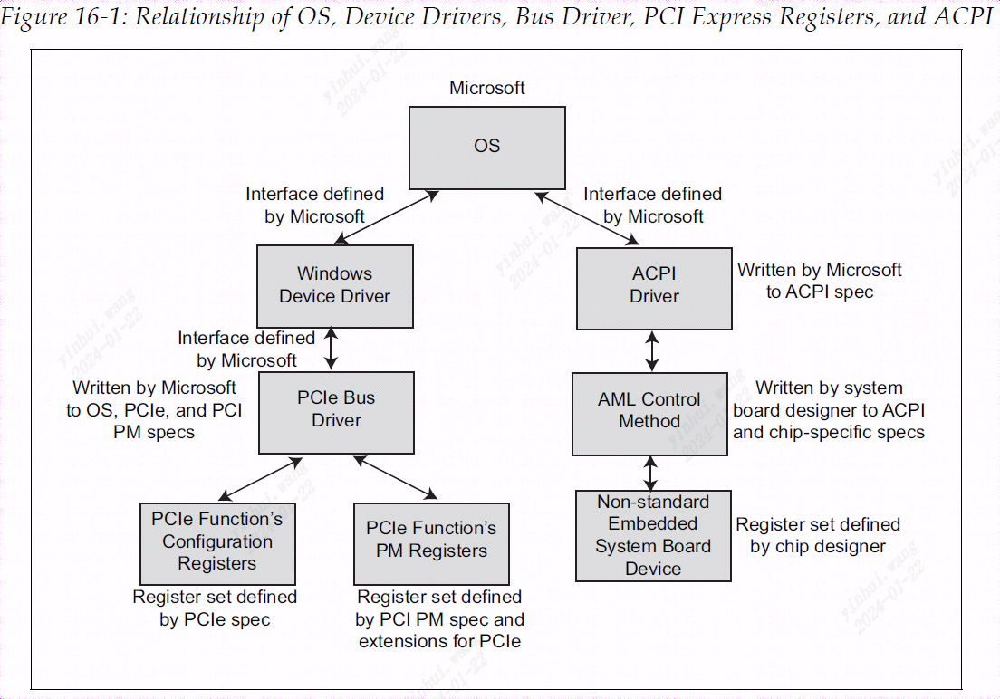
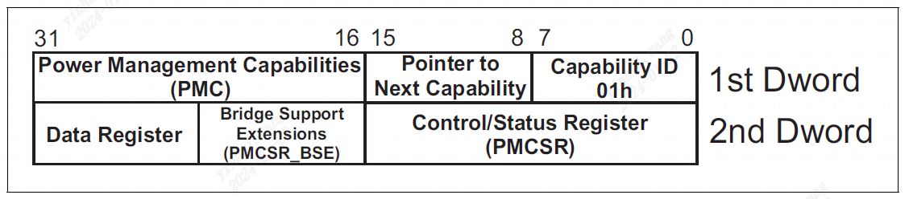
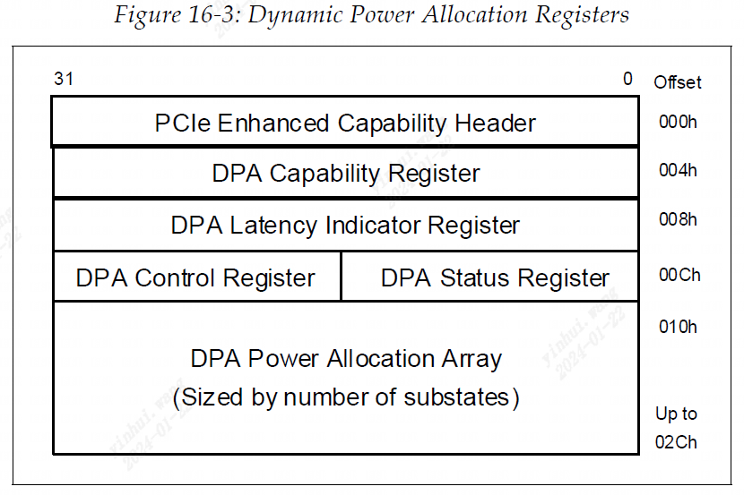
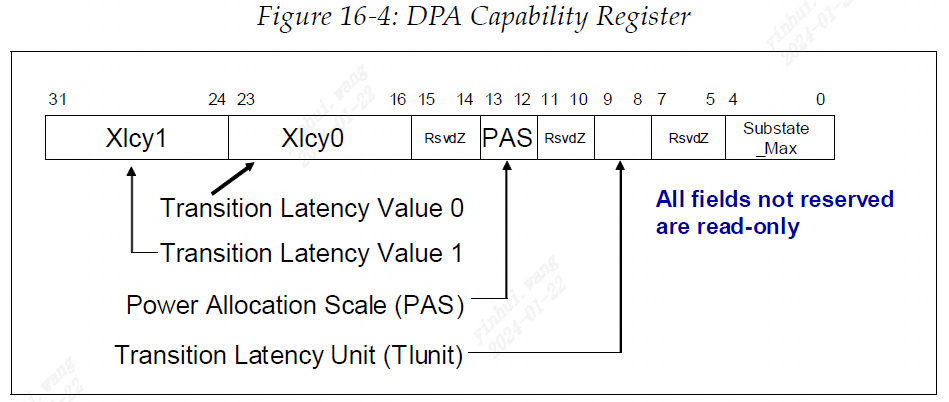
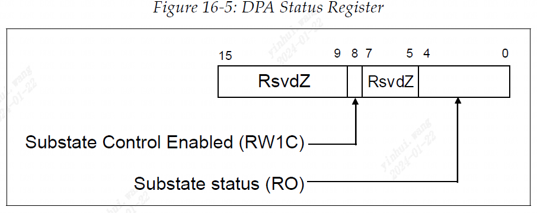

### 前一章节

上一章讨论了 PCIe 端口或链路中发生的错误类型、如何检测、报告这些错误以及处理这些错误的选项。 由于 PCIe 被设计为向后兼容 PCI 错误报告，因此对 PCI 错误处理方法的回顾作为背景信息包含在内。 然后我们重点关注可纠正、非致命和致命错误的 PCIe 错误处理。

### 本章节

本章提供系统电源管理讨论的总体背景以及 PCIe 电源管理的详细描述，它与 PCI 总线 PM 接口规范和高级配置和电源接口 (ACPI) 兼容。 PCIe 定义了 PCI-PM 规范的扩展，主要关注链路电源和事件管理。 还概述了 OnNow Initiative、ACPI 以及 Windows 操作系统的参与。

### 下一章节

本章提供系统电源管理讨论的总体背景以及 PCIe 电源管理的详细描述，它与 PCI 总线 PM 接口规范和高级配置和电源接口 (ACPI) 兼容。 PCIe 定义了 PCI-PM 规范的扩展，主要关注链路电源和事件管理。 还概述了 OnNow Initiative、ACPI 以及 Windows 操作系统的参与。

### 16.1 引言

PCI Express 电源管理 (PM) 定义了四个主要支持领域：
- **PCI 兼容PM**。 PCIe 电源管理的硬件和软件与 PCI-PM 和 ACPI 规范兼容。 此支持要求所有功能都包含 PCI 电源管理功能寄存器，允许软件通过使用配置请求在软件控制下在 PM 状态之间转换功能。 这在 2.1 规范修订版中进行了修改，添加了动态功率分配 (DPA)，这是另一组寄存器，向 D0 功率状态添加了多个子状态，为软件提供了更细粒度的 PM 机制。
- **本机PCIe 扩展**。 这些为链路定义了自主的、基于硬件的活动状态电源管理（ASPM），以及唤醒系统的机制、报告电源管理事件（PME）的消息事务以及计算和报告低功耗到活动状态延迟的方法。
- **带宽管理**。 2.1 规范修订版增加了硬件自动更改链路宽度或链路数据速率或两者的能力，以提高功耗。 这样可以在需要时提供高性能，并在可接受较低性能时保持较低的功耗。 尽管带宽管理被视为电源管理主题，但我们在“链路初始化和培训”一章的第 618 页上的“动态带宽更改”部分中描述了此功能，因为它涉及 LTSSM。
- **事件时序优化**。 不考虑系统电源状态而启动总线主控事件或中断的外围设备会导致其他系统组件保持在高功耗状态来为其提供服务，从而导致比所需的功耗更高的功耗。 这个缺点在 2.1 规范中通过添加两个新机制得到了纠正：优化缓冲区刷新和填充 (OBFF)，它允许系统向外设通知当前系统电源状态；以及延迟容忍报告 (LTR)，它允许设备报告 目前他们可以容忍服务延迟。

本章分为几个主要部分：
1. 第一部分是电源管理的一般入门知识，涵盖系统软件在控制电源管理功能中的作用。 本讨论仅考虑 Windows 操作系统的角度，因为它是 PC 上最常见的操作系统，其他操作系统没有描述。
2. 第二部分“函数电源管理”（第 713 页）讨论使用 PCI-PM 功能寄存器将函数置于低功耗设备状态的方法。 请注意，某些寄存器定义已被 PCIe 功能修改或未使用。
3. 第 735 页的“活动状态电源管理 (ASPM)”介绍了基于硬件的自主链路电源管理。 软件可能通过读取该功能将产生的恢复延迟值来确定为环境启用哪个级别的 ASPM，但之后电源转换的时间由硬件控制。 软件不控制转换，并且无法查看链路处于哪种电源状态。
4. 第 760 页的“软件启动的链路电源管理”讨论了当软件更改设备的电源状态时强制执行的链路电源管理。
5. 第 768 页的“链路唤醒协议和 PME 生成”描述了设备如何请求软件将它们返回到活动状态，以便它们可以为事件提供服务。 当设备断电时，如果要监视事件并向系统发出唤醒信号以恢复供电并重新激活链路，则必须存在辅助电源。
6. 最后，描述了事件计时功能，包括 OBFF 和 LTR。

### 16.2 电源管理入门

PCI 总线 PM 接口规范描述了 PCIe 所需的电源管理寄存器。 这些允许操作系统直接管理功能的电源环境。 让我们首先描述此功能在系统整体环境中的位置，而不是深入进行详细描述。

#### 16.2.1 PCI PM 基础知识

本节概述了 Windows 操作系统如何与其他主要软件和硬件元素交互以管理单个设备和整个系统的电源使用情况。 第 706 页的表 16-1 介绍了此过程中涉及的主要元素，并提供了它们如何相互关联的非常基本的描述。 应该注意的是，PCI 电源管理规范和 ACPI 规范都没有规定操作系统使用的 PM 策略。 然而，它们确实定义了用于控制功能的功耗的寄存器（和一些数据结构）。

表 16-1 PC PM涉及的主要软硬件要素

| **元素** | **职责** |
| ---- | ---- |
| OS | 通过向 ACPI 驱动程序、设备驱动程序和 PCI Express 总线驱动程序发送请求来指导整个系统电源管理。 具有节能意识的应用程序与操作系统交互以完成设备电源管理。 |
| ACPI 驱动 | 管理不符合行业标准规范的嵌入式系统设备的配置、电源管理和热控制。 此类示例包括芯片组特定寄存器、用于控制电源层的系统板特定寄存器等。PCIe 功能（嵌入式或其他方式）内的 PM 寄存器由 PCI PM 规范定义，因此不由 ACPI 驱动程序管理，但 而不是通过 PCI Express 总线驱动程序（请参阅此表中的条目）。 | 
| 设备驱动 | 类驱动程序可以与属于其编写控制的设备类的任何设备一起使用。 事实上，它不是为特定供应商编写的，这意味着它不具备设备接口的位级知识。 当它需要向设备发出命令或检查设备的状态时，它会向特定设备供应商提供的微型端口驱动程序发出请求。  设备驱动程序也不了解该设备类型的特定总线实现所特有的设备特征。 例如，它无法理解 PCIe 功能的配置寄存器集。 PCI Express 总线驱动程序是与这些寄存器进行通信的驱动程序。  当它从操作系统接收到控制 PCIe 设备电源状态的请求时，它会将请求传递给 PCI Express 总线驱动程序。  • 当从操作系统收到关闭其设备电源的请求时，设备驱动程序将保存其关联功能的设备特定寄存器的内容（换句话说，上下文保存），然后将请求传递给 PCI Express 总线驱动程序以更改 设备的电源状态。  • 相反，当接收到重新给设备供电的请求时，设备驱动程序将请求传递给 PCI Express 总线驱动程序以更改设备的电源状态。 PCI Express 总线驱动程序重新为设备供电后，设备驱动程序会将上下文恢复到功能的设备特定寄存器。 |
| 微型端口驱动程序 | 它由设备供应商提供，接收来自类驱动程序的请求，并将它们转换为对设备寄存器集的正确访问系列。 |
| PCIe 总线驱动 | 该驱动程序适用于所有 PCI Express 兼容设备。 它管理它们的电源状态和配置寄存器，但不了解功能的设备特定寄存器集（该知识由设备驱动程序用于与设备寄存器集通信的微型端口驱动程序拥有）。 它接收来自设备驱动程序的请求以更改设备电源管理逻辑的状态。 例如：  • 当收到设备断电请求时，该驱动程序负责保存功能的 PCI Express 配置寄存器的上下文。 然后，它会禁用设备充当请求者或作为目标进行响应的能力，并写入功能的 PM 寄存器以更改其状态。  • 相反，当设备必须重新供电时，PCI Express 总线驱动程序写入 PCI Express 功能的 PM 寄存器以更改其状态，然后将功能的配置寄存器恢复为其原始状态。 |
| PCI Express PM 在每个功能的配置空间内进行寄存器。| 这些寄存器的位置、格式和用法由 PCIe 规范定义。 PCI Express 总线驱动程序理解此规范，因此是负责在功能的设备驱动程序请求时访问功能的 PM 寄存器的实体。 |
| 系统板电源层和总线时钟控制逻辑 | 该逻辑的实现和控制通常是特定于系统板设计的，因此由 ACPI 驱动程序（在操作系统指导下）控制。|
#### 16.2.2 ACPI 规范定义总体 PM

ACPI（高级配置和电源接口）规范最初是几年前由多家公司共同编写的，旨在为计算平台中的 OSPM（操作系统级电源管理）提供行业标准。 当时的电源管理是在不同平台上以专有方式处理的，这使得供应商很难协调他们的工作。 此外，特定于平台的代码并不总是与操作系统操作完全兼容或了解所有系统条件或策略考虑因素。 ACPI 通过定义系统电源状态、硬件寄存器和软件交互来实现基于操作系统的电源管理，从而在这些领域提供帮助。 ACPI 的详细描述超出了本书的范围，但概念和术语的介绍将会有所帮助。

##### 系统 PM 状态

第 708 页的表 16-2 参考功耗定义了整个系统的可能状态。 OnNow Design Initiative 文档中定义了“工作”、“睡眠”和“软关闭”状态。

表 16-2 OnNow 设计计划定义的系统 PM 状态

| **电源状态** | **描述**|
|--| -- |
| 工作(Working(G0/S0)) | 该系统已全面投入运行|
| 休眠(Sleeping(G1)) | 系统似乎已关闭并且功耗已降低。 返回“工作”状态所需的时间与所选的节能级别成反比。  • S1 ‐ 缓存刷新，CPU 暂停;  • S2 ‐ 与S1 相同，只是现在CPU 已断电。 不常用，因为它比 S3 好不了多少。  • S3 ‐（也称为“挂起至RAM”或“待机”）这与S2 相同，只是系统上下文保存在内存中并且系统的更多部分被关闭。 当系统唤醒时，CPU 开始完整的引导过程，但会发现 CMOS 内存中设置的标志指示它从 RAM 重新加载上下文，因此可以非常快速地恢复程序执行。  • S4 ‐（也称为“挂起到磁盘”或“休眠”）与S3 类似，不同之处在于现在系统将系统上下文复制到磁盘，然后断开系统电源，包括主内存。 这可以更好地节省电量，但重新启动时间会更长，因为在恢复程序执行之前必须从磁盘恢复上下文。|
| 软关闭(Soft off)(G2/S5)) | 系统似乎已关闭且功耗极小。 它需要完全重新启动才能返回“工作”状态，因为内存内容已丢失，但仍有一些电源可用于唤醒，例如通过按系统上的“电源”按钮。|
| 机械关闭(G3) | 系统已断开所有电源，无电源可用。|
##### 设备 PM 状态

ACPI 还定义了设备级别的 PM 状态，这些状态在第 709 页的表 16-3 中列出。第 709 页的表 16-3 以略有不同的形式提供了相同的信息。 PCIe 设备必须实现支持这些设备状态的寄存器。

表 16-3 设备级 PM 状态的 OnNow 定义

| **状态** | **描述** |
|---|---|
| D0 | **强制的**。 设备已完全运行并使用系统的全部电源。 2.1 规范修订版添加了另一组寄存器来支持 D0 下的 32 个子状态，称为动态功率分配寄存器。|
| D1 | **可选的**。 设备上下文可能丢失也可能不丢失的低功耗状态。 没有给出此状态的定义，但它表示比 D0 更低且比 D2 更高的功耗状态 |
| D2 | **可选的**。 据推测，比 D1 更低的功耗状态可以实现更大的节能，但会导致更长的恢复延迟，并可能导致设备丢失一些上下文。|
| D3 | **强制的**。 设备已做好断电准备，无论断电与否，上下文都可能丢失。 恢复时间将比 D2 长，但在此状态下可以正常地从设备上断电。|

##### 设备上下文的定义

**总述**。 在正常操作期间，设备的操作状态不断变化。 设备驱动程序可以写入或读取其寄存器，或者设备上的本地处理器可以执行影响其与系统交互的代码。 给定时刻设备的状态包括：
- 其配置寄存器的内容。
- 其本地内存和 IO 寄存器的状态。
- 如果它包含处理器，则将包含当前程序指针及其其他寄存器的内容。

该状态信息称为设备上下文。 如果设备 PM 状态更改为更激进的级别，则可能会丢失其中的部分或全部。 如果不维护上下文信息，设备返回到 D0（完全运行）状态时将无法正常运行。

**PME 背景**。 如果操作系统启用调制解调器来唤醒系统以接收来电，然后关闭系统电源，则在此期间需要在本地保留设备唤醒上下文。 芯片组保留足够的电量以允许其监视这些事件。 为了支持此功能，PCIe 调制解调器必须实现配置寄存器，包括：
- PME 消息功能。
- PME 启用/禁用控制位。
- PME 状态位，指示设备是否已发送 PME 消息。
- 一个或多个特定于设备的控制位，可选择性地启用或禁用可导致设备发送 PME 消息的各种特定于设备的事件。
- 相应的设备特定状态位，指示设备发出 PME 消息的原因。

##### 设备类特定 PM 规格

**默认设备类别规范**。 如前所述，ACPI 提供了四种可能的设备电源状态（D0 - 到 - D3）。 它还定义了所有设备类型必须实现的最低 PM 状态，如第 710 页的表 16-4 中所列。

表 16-4 默认设备类别规范

| **状态** | **描述** |
| ---- | ---- |
| D0 | 设备已开启，正在全功率运行，并且完全可操作。 |
| D1 | 该可选状态仅定义为功率低于 D0。 它并不常用。|
| D2 | 该可选状态仅被定义为比D1低的功率。 它并不常用。|
| D3 | 设备消耗尽可能小的电量，并且主电源可能会关闭。 唯一的要求是，当电源仍然打开时，设备必须能够服务配置命令以重新进入 D0。 在此状态下可以断开设备的电源，并且当电源恢复时设备将经历硬件重置。|
**设备类特定 PM 规格**。 除了默认设备类别规范规定的电源状态之外，某些设备类别可能需要中间电源状态（D1 和/或 D2）或在特定电源状态下表现出某些共同特征。

与特定设备类别相关的规则可在 Microsoft 硬件开发人员网站上提供的设备类别电源管理规范中找到。 例如，以下类别存在设备类别电源管理规范：
- 音频
- 通讯
- 显示
- 输入
- 网络
- PC 卡
- 存储

##### 电源管理策略所有者

设备的 PM 策略所有者定义为做出有关设备 PM 状态决策的软件模块。 在 Windows 环境中，策略所有者是与该类设备关联的类特定驱动程序。

#### 16.2.3 PCI Express 电源管理与 ACPI

##### PCI Express 总线驱动程序访问 PM 寄存器

如第 706 页上的表 16-1 和第 712 页上的图 16-1 所示，PCI Express 总线驱动程序了解 PM 配置寄存器的位置、格式和用法。 当操作系统需要更改 PCIe 设备的电源状态或确定其状态和功能时，会调用它。 其他示例包括：
- IEEE 1394 总线驱动程序，它了解如何使用1394 电源管理规范中定义的PM 寄存器。
- USB 总线驱动程序，它了解如何使用USB 电源管理规范中定义的PM 寄存器。

##### ACPI驱动程序控制非标准嵌入式设备

系统板上嵌入了一些设备，其寄存器集不遵守任何特定的行业标准规范。 启动时，BIOS 通过 ACPI 表（也称为命名空间）向操作系统报告这些设备。 当操作系统需要与任何这些设备通信时，它会调用 ACPI 驱动程序，后者执行与设备关联的称为控制方法的处理程序。 该处理程序也可在 ACPI 表中找到，由平台设计者使用称为 ACPI 源语言（ASL）的特殊解释语言编写。 然后，ASL 代码被编译为 ACPI 机器语言 (AML)。 请注意，AML 不是特定于处理器的机器语言。 它是 ASL 源代码的标记化（即压缩）版本。 ACPI 驱动程序包含一个 AML 令牌解释器，允许其“执行”控制方法。

### 16.3 功能的电源管理

PCI Express 功能需要支持电源管理，并且必须实现多个寄存器和相关位字段，如下所述。

#### 16.3.1 PM能力寄存器组(The PM Capability Register Set)

PCI-PM 规范定义了电源管理功能配置寄存器。 这些寄存器对于 PCI 是可选的，但对于 PCIe 是必需的，并且位于Capability ID 为 01h 的 PCI 兼容配置空间中。 软件可以执行以下序列来定位这些寄存器：
1. 应设置该功能的配置状态寄存器(Configuration Status Register)的位 4，指示该功能的配置头的双字 13d 的第一个字节中的能力指针有效。 读取功能指针寄存器(Capabilities Pointer Register)会给出该功能的能力寄存器链表中第一个的偏移量。
2. 如果该偏移处的双字的最低有效字节包含Capability ID 01h（请参见第 713 页上的图 16-2），则这是 PM 寄存器集。 紧跟在功能 ID 字节之后的字节是指向下一个能力字段的指针，它给出了下一个能力(capability)（如果有的话）在配置空间中的偏移量。 非零值是有效指针，而 00h 值表示链表末尾。 所有 PM 寄存器的描述可以在第 724 页的“PCI-PM 寄存器的详细描述”中找到。

#### 16.3.2 设备PM 状态

每个 PCI Express 功能必须支持全开 D0 状态和全关 D3 状态，而 D1 和 D2 是可选的。 以下部分描述了可能的 PM 状态。

##### D0 状态——全开

**强制的**。 在此状态下，节能不起作用并且设备完全运行。 所有 PCIe 功能必须支持 D0 状态，技术上有两个子状态：D0 Uninitialized(未初始化)和 D0 Active(活动)。 当设备处于此状态时，ASPM 硬件控制可以更改链路功率。 第 714 页的表 16-5 总结了 D0 状态下的 PM 策略。

**D0 Uninitialized**。 基本复位后，或者在某些情况下，当软件将其从 D3hot 转换到 D0 时，功能会进入 D0 未初始化状态。 通常，寄存器会返回到默认状态。 在此状态下，Function 表现出以下特征：
- 它仅响应配置事务。
- 其命令寄存器使能位全部返回到默认状态，这意味着它无法启动事务或充当内存或 IO 事务的目标。

**D0 Active**。 一旦该功能被软件配置并启用，它就处于 D0 活动状态并且完全可操作。

表 16-5 D0电源管理策略

| **链路PM状态** | **功能PM状态** | **必须有效的寄存器或状态** | **功率** | **允许执行的操作** | **功能允许的操作** |
| ---- | ---- | ---- | ---- | ---- | ---- |
| L0 | D0 未初始化 | PME 上下文(如果PME支持该状态) | < 10W | PCIe 配置事务 | 无 |
| L0，L0s，L1(可选) | D0 Active | all | full | 任何PCIe事务 | 任何事务，中断，PME |
| L2/L3 | D0 Active | N/A |  |  |  |
##### 动态功率分配 (DPA)

**可选的**。 基本规范的 2.1 修订版添加了另一个可选功能，为 D0 定义了另外 32 个子状态并描述了它们的特性。 这样做的目的是促进设备驱动程序、操作系统和正在执行的应用程序之间有关电源管理的协商，部分原因是某些功能没有可以很好地处理 PM 的设备驱动程序。 此模型的一个优点是，设备在技术上仍保持在 D0 状态，因此可以继续以降低的容量运行，而不是由于更改为 D1 或更低状态而导致脱机。

DPA 寄存器仅在设备电源状态处于 D0 时适用，在状态 D1-D3 时不适用。 最多可以定义 32 个子状态，并且它们必须从零到最大值连续编号。 子状态 0 是初始默认值，表示函数能够消耗的最大功率。 软件不需要按顺序在子状态之间转换，甚至不需要等到前一个转换完成后再请求子状态中的另一次更改。 因此，当功能完成子状态更改时，它必须检查配置的子状态，如果它们不匹配，则必须开始更改为配置的值。 支持 DPA 的寄存器（如第 715 页的图 16-3 所示）位于增强型配置空间中。

DPA 功能寄存器（如第 716 页的图 16-4 所示）包含与子状态相关的几个有趣的值。 Substate_Max 数字指示描述了多少个子状态，并且数字必须从零连续递增到该值。 给出了两个转换延迟值，每个子状态将通过延迟指示器寄存器与其中一个或另一个相关联。 其中每个可能的子状态包含一位； 如果该位被设置，则使用转换延迟值 1，否则使用值 0。 延迟值给出了从任何其他子状态转换到该子状态所需的最长时间。 延迟乘以转换延迟单位即可得到以毫秒为单位的时间。 同样，功率分配比例值给出每个子状态中使用的功率的乘数，以瓦特表示。 对于每个定义的子状态，DPA 功率分配阵列中的 32 位字段描述了该状态使用的功率。 其中第一个位于偏移量 010h 处，其余部分在后续双字中实现。

DPA 控制寄存器的低 5 位由软件写入以设置新的子状态，并且可以从状态寄存器中读取当前子状态，如第 716 页上的图 16-5 所示。请注意，DPA 控制寄存器的第 8 位 状态寄存器指示是否已启用 DPA 子状态的使用，但它被标记为 RW1C（读、写 1 清除），这意味着软件可以清除该位但不能设置它。 复位后默认启用 DPA，如果软件不打算使用 DPA，则需要通过向该位写入 1 来禁用它。

##### D1 状态——轻度睡眠

**可选的**。 在进入此状态之前，软件必须确保所有未完成的no-posted 请求已收到其关联的完成。 这可以通过轮询 PCI Express capability块的设备状态寄存器中的事务挂起位来实现； 当该位清零时，就可以安全地继续。 在这种轻节能状态下，功能不会发起除 PME 消息之外的请求（如果启用）。 D1 状态的其他特征包括：
- 当设备进入D1 状态时，链路被强制进入L1 电源状态。
- 在此状态下接受配置和消息请求，但所有其他请求必须作为不支持的请求进行处理，并且所有完成都可以选择作为意外完成进行处理。
- 如果错误是由传入请求引起的并且已启用报告，则在此状态下可能会发送错误消息。 如果发生不同类型的错误（例如完成超时），则在设备返回到 D0 状态之前不会发送消息。
- 该功能可以重新激活链路并发送PME 消息（如果在此状态下受支持并启用），以通知软件该功能已经历需要恢复电源的事件。
- 功能在此状态下可能会也可能不会失去其上下文。 如果确实如此并且设备支持 PME，则在此状态下它必须至少维护其 PME 上下文（请参阅第 710 页上的“PME 上下文”）。
- 该功能必须返回到D0 Active PM 状态才能完全运行。
表 16-6 D1 电源管理策略

| **链路PM状态** | **功能PM状态** | **必须有效的寄存器或状态** | **功率** | **允许执行的操作** | **功能允许的操作** |
| ---- | ---- | ---- | ---- | ---- | ---- |
| L1 | D1 | 设备类特定寄存器和 PME 上下文。 | <= D0 uninitialized | 配置请求和消息。 链路转换回 L0 以服务请求。 | PME 消息。 尽管通常不允许，但他们会要求链路转换回 L0。 |
| L2-L3 | D1 | NA | NA| NA| NA|

##### D2 状态——深度睡眠

**可选的**。 在进入此状态之前，软件必须确保所有未完成的non-posted请求已收到其关联的完成。 这可以通过轮询 PCI Express 功能块的设备状态寄存器中的事务挂起位来实现； 当该位清零时，就可以安全地继续。 此电源状态比 D1 提供更深层次的节能，但低于 D3hot 状态。 与 D1 中一样，该功能不会发起请求（PME 消息除外）或充当除配置之外的请求的目标。 在此状态下，软件必须仍然能够访问功能的配置寄存器。

D2 状态的其他特征包括：
- 在进入此状态之前，软件必须确保所有未完成的non-posted请求已收到其关联的完成。 这可以通过轮询 PCIe capability块的设备状态寄存器中的事务挂起位来实现。 完成可能永远不会被返回，在这种情况下，软件应该等待足够长的时间以确保它们永远不会被返回。
- 当设备转换到D2 状态时，链路状态必须转换到L1。
- 在此状态下接受配置和消息请求，但所有其他请求必须作为不支持的请求进行处理，并且所有完成都可以选择作为意外完成进行处理。
- 如果错误是由传入请求引起的并且已启用报告，则在此状态下可能会发送错误消息。 如果发生不同类型的错误（例如完成超时），则在设备返回到 D0 状态之前不会发送消息。
- 如果支持并启用，功能可以发送PME 消息，以通知软件需要恢复电源来处理事件。
- 功能在此状态下可能会也可能不会失去其上下文。 如果确实如此并且设备支持 PME 消息，则它必须至少为此目的维护其 PME 上下文。
- 该功能必须返回到D0 Active 状态才能完全运行。

第 719 页的表 16-7 说明了处于 D2 状态时的 PM 策略。

| **链路PM状态** | **功能PM状态** | **必须有效的寄存器或状态** | **功率** | **允许执行的操作** | **功能允许的操作** |
| ---- | ---- | ---- | ---- | ---- | ---- |
| L1 | D2 | 设备类特定寄存器和 PME 上下文。 | <= D0 uninitialized or <= PM支持了下一个更高的状态| 设备类允许的配置请求和事务（通常没有）。 这需要链路转换回 L0 | PME 消息。 尽管通常不允许，但他们会要求链路转换回 L0。 |
| L2-L3 | D2 | NA | NA| NA| NA|

##### D3 —— 全关

**强制的**。 所有功能必须支持 D3 状态。 这是最深的状态，并且功率节省最大化。 当软件将此电源状态写入设备时，它会进入 $D3_{hot}$ 状态，这意味着电源仍然处于通电状态。 如果辅助电源 (Vaux) 可用，则断开设备电源 (Vcc) 会将其置于 $D3_{cold}$ 状态，并将链路置于 L2 状态，如果不可用，则将链路置于 L3 状态。

**D3 hot状态**。 （强制。）软件通过将适当的值写入其电源管理控制和状态寄存器 (PMCSR) 的 PowerState 字段，使功能进入 $D3_{hot}$。 在此状态下，Function 只能发起 PME 或 PME_TO_ACK 消息，并且只能响应配置请求或 PME_Turn_Off 消息。 当器件处于 $D3_{hot}$ 状态时，软件必须能够访问功能的配置寄存器，以便能够将状态更改回 D0。 D3hot 的其他特性包括：
- 在进入此状态之前，软件必须确保所有未完成的非发布请求已收到其关联的完成。 这可以通过轮询 PCIe 功能块的设备状态寄存器中的事务挂起位来实现。 完成可能永远不会被返回，在这种情况下，软件应该等待足够长的时间以确保它们永远不会被返回。
- 当功能更改为$D3_{hot}$ 时，链路被强制进入L1 状态。
- 允许该功能发送PME 消息以通知PM 软件其需要返回到完全活动状态（假设它支持在$D3_{hot}$ 状态下生成PM 事件并且已启用这样做）。
- 进入此状态时，功能上下文可能会丢失，并且如果电源关闭，规范假定所有上下文都将丢失。 另一方面，如果在软件启动返回 D0 之前电源从未关闭，则可以维持上下文。 在早期的规范版本中这是不可能的； 从 $D3_{hot}$ 更改为 D0 涉及软复位并且所有寄存器都被重新初始化。 然而，该规范的 1.2 版本添加了一个名为“无软重置”的新功能位，以指示该功能在这种情况下不会进行软重置。 为了能够在 $D3_{hot}$ 状态下生成 PME 消息，设备必须维护其 PME 上下文（请参阅第 710 页上的“PME 上下文”）。

Function 在两种情况下退出 D3hot 状态：
- 如果从器件中移除Vcc，它将从$D3_{hot}$ 转换为$D3_{cold}$。
- 软件可以写入功能的PMCSR 寄存器的PowerState 字段，以将其PM 状态更改为D0。 当编程退出 $D3_{hot}$ 并返回到 D0 时，该功能返回到 D0 未初始化 PM 状态。 可能需要也可能不需要重置。 第 721 页的表 16-8 列出了处于 D3hot 状态时的 PM 策略。

表16-8 $D3_{hot}$ 电源管理策略

| **链路PM状态** | **功能PM状态** | **必须有效的寄存器或状态** | **功率** | **允许执行的操作** | **功能允许的操作** |
| ---- | ---- | ---- | ---- | ---- | ---- |
| L1 | $D3_{hot}$ | PME 上下文。 | <= D0 uninitialized or <= PM支持下一个更高的状态| PCI Express 配置事务和 PME_Turn_Off 广播消息（这些只能在链路转换回 L0 状态后发生。） | PME 消息** PME_TO_ACK消息*** PM_Enter_L23 DLLP*** （这些可能会发生仅在链接之后返回L0）|
| L2/L3 Ready | $D3_{hot}$ | PME_Turn_Off 握手序列后进入 L2/L3 就绪状态，为设备断电做好准备 | NA| NA| NA|
| L2/L3 Ready | $D3_{hot}$ | NA | NA| NA| NA|