#### 前一章节

前一章提供了系统电源管理讨论的总体背景以及 PCIe 电源管理的详细描述，它与 PCI 总线 PM 接口规范和高级配置和电源接口 (ACPI) 规范兼容。 PCIe 定义了 PCI-PM 规范的扩展，主要关注链路电源和事件管理。 还概述了 OnNow Initiative、ACPI 以及 Windows 操作系统的参与。
### 本章节

本章介绍 PCIe 功能生成中断的不同方式。 旧的 PCI 模型为此使用引脚，但在串行模型中不需要边带信号，因此必须支持带内 MSI（消息信号中断）机制。 出于软件向后兼容性的原因，仍然可以使用 PCIe INTx 消息来模拟 PCI INTx# 引脚操作。 描述了 PCI 传统 INTx# 方法和较新版本的 MSI/MSIX。
### 下一章节

下一章介绍为 PCIe 定义的三种类型的复位：基本复位（包括冷复位和温复位）、热复位和功能级复位（FLR）。 讨论了使用边带复位 PERST# 信号来生成系统复位，并且还描述了基于带内 TS1 的热复位。

### 17.1 中断支持背景

#### 17.1.1 概要

PCI 架构支持来自外围设备的中断，作为提高其性能并使 CPU 无需轮询设备以确定何时需要服务的一种手段。 PCIe 继承了 PCI 的这种支持，基本没有改变，允许软件向后兼容 PCI。 我们在本章中提供了系统中断处理的背景知识，但鼓励想要了解有关中断的更多详细信息的读者查看以下参考文献：
- 有关 PCI 中断背景，请参阅 PCI 规范修订版 3.0 或 MindShare 教科书的第 14 章：PCI 系统架构 (www.mindshare.com)。
- 要了解有关本地和IO APIC 的更多信息，请参阅MindShare 的教科书：x86 指令集架构。

#### 17.1.2 两种中断传递方法

PCI 使用被路由到中央中断控制器的边带中断线。 这种方法在简单的单 CPU 系统中运行良好，但存在一些缺点，促使人们转向一种名为 MSI（消息信号中断）的新方法，并具有名为 MSI-X (eXtented) 的扩展。

**传统 PCI 中断传送** — 这种为 PCI 总线定义的原始机制由每个设备或 INTx#（INTA#、INTB#、INTC# 和 INTD#）最多四个信号组成，如第 795 页的图 17-1 所示。 在这个模型中，引脚通过线“或”连接在一起来共享，它们最终会连接到 8259 PIC（可编程中断控制器）上的输入。 当一个引脚被置位时，PIC 反过来将其中断请求引脚置位到 CPU，作为原文第 796 页“传统模型”中描述的过程的一部分。

PCIe 支持此 PCI 中断功能以实现向后兼容性，但串行传输的设计目标是最大限度地减少引脚数。 因此，INTx# 信号未实现为边带引脚。 相反，功能可以生成带内中断消息包来指示引脚的断言或取消断言。 这些消息充当“虚拟线路”，并针对系统中的中断控制器（通常在根联合体中），如第 796 页上的图 17-2 所示。该图还说明了使用引脚的旧 PCI 设备如何工作 在 PCIe 系统中； 桥将引脚的断言转换为上游到根联合体的中断仿真消息 (INTx)。 预期 PCIe 设备通常不需要使用 INTx 消息，但在撰写本文时，实际上它们经常需要使用 INTx 消息，因为系统软件尚未更新为支持 MSI。
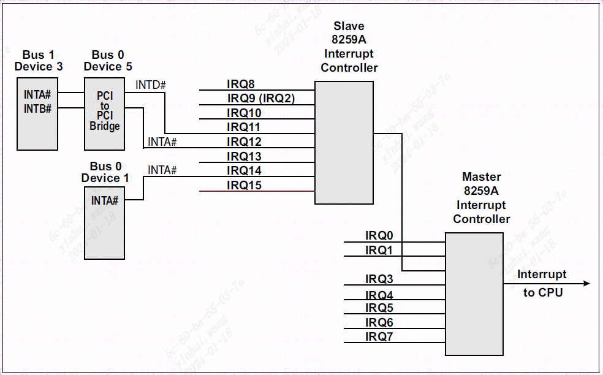
                        图 17.1 PCI 中断传送

**MSI 中断传送** —— MSI 通过使用内存写入来传递中断通知，从而消除了对边带信号的需求。 术语“消息信号中断”可能会令人困惑，因为它的名称包含术语“消息”，这是 PCIe 中的一种 TLP，但 MSI 中断是发布内存写入而不是消息事务。 MSI 内存写入与其他内存写入的区别仅在于其目标地址，这些地址通常由系统保留用于中断传递（例如，基于 x86 的系统传统上为中断传递保留地址范围 FEEx_xxxxh）。

图 17-2 说明了各种类型 PCIe 设备的中断传递。 所有 PCIe 设备都需要支持 MSI，但软件可能支持也可能不支持 MSI，在这种情况下，将使用 INTx 消息。 图 17-2 还显示了如何需要 PCIe 至 PCI 桥将来自连接的 PCI 设备的边带中断转换为 PCIe 支持的 INTx 消息。
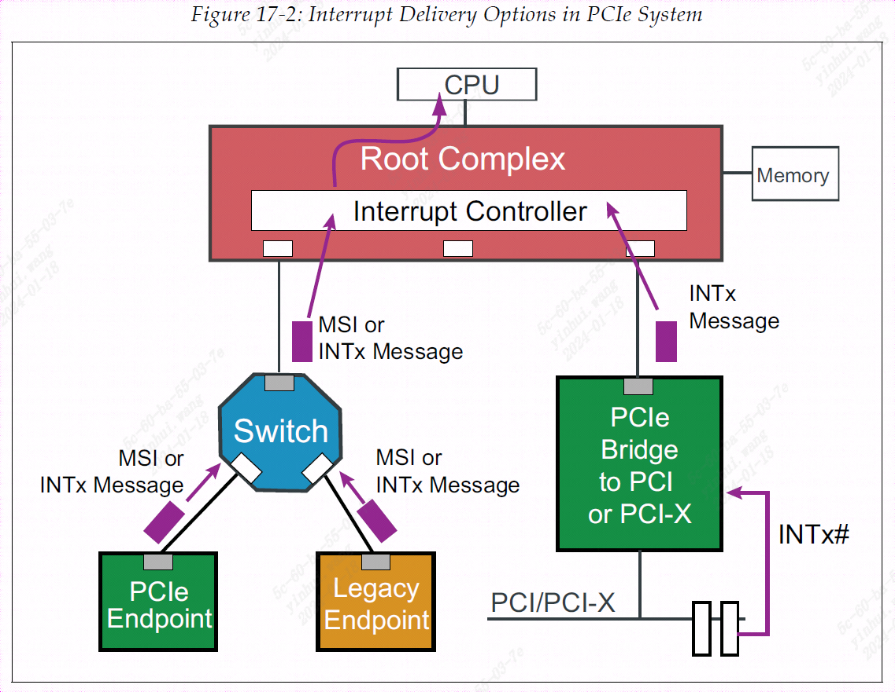

### 17.2 传统模型

#### 17.2.1 概要

为了说明传统中断传送模型，请参阅第 797 页的图 17-3，并考虑使用传统中断引脚方法进行中断传送所涉及的常见步骤：
1. 设备通过向控制器断言其引脚来生成中断。 在较旧的系统中，该控制器通常是 Intel 8259 PIC，具有 15 个 IRQ 输入和 1 个 INTR 输出。 然后，PIC 将置位 INTR 以通知 CPU 一个或多个中断正在等待处理。
2. 一旦 CPU 检测到 INTR 的断言并准备对其采取行动，它必须识别哪个中断实际需要服务，这是通过 CPU 在处理器总线上发出称为中断应答的特殊命令来完成的。
3. 该命令由系统路由到 PIC，PIC 返回一个称为中断向量的 8 位值，以报告当前待处理的最高优先级中断。 系统软件会提前为每个 IRQ 输入编程一个唯一的向量。
4. 然后，中断处理程序使用该向量作为中断表（由软件设置的区域，用于包含所有中断服务例程 ISR 的起始地址）的偏移量，并获取在该位置找到的 ISR 起始地址。
5. 该地址将指向为处理该中断而设置的 ISR 的第一条指令。 该处理程序将被执行，为中断提供服务并告诉其设备取消断言其 INTx# 行，然后将控制权返回到先前中断的任务。
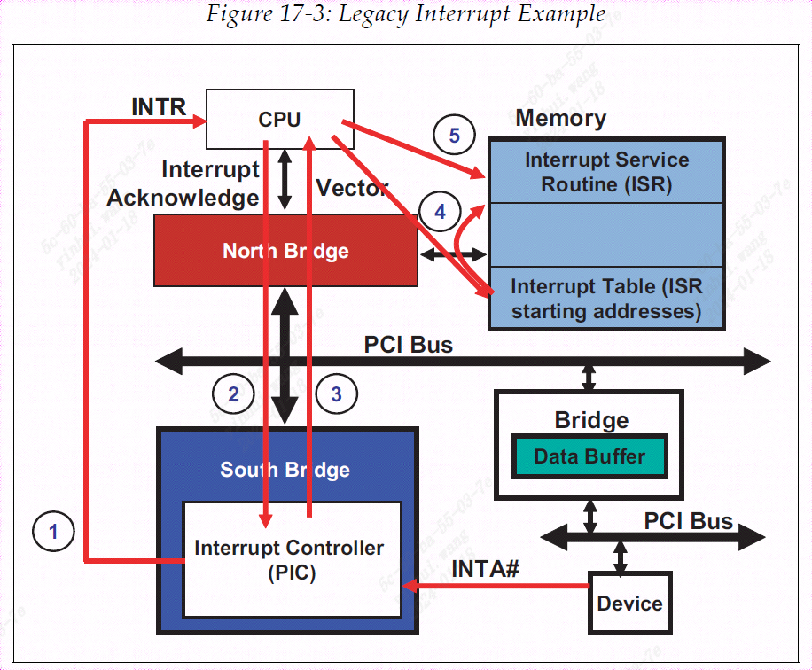
                         图 17.3 传统中断示例

#### 17.2.2 支持多处理器的更改

该模型适用于单 CPU 系统，但有一个限制，使其在多 CPU 系统中不是最优的。 问题是INTR引脚只能连接到一个CPU。 如果存在多个处理器，则只有其中一个处理器会看到中断，并且必须为所有中断提供服务，而其他 CPU 将看不到任何中断。 为了获得最佳性能，此类系统确实需要在所有处理器之间均匀分配系统任务，称为 SMP（对称多处理），但引脚模型不支持
它。

为了实现更好的 SMP，需要一种新模型，为此，PIC 被修改为 IO APIC（高级可编程中断控制器）。 IO APIC 设计有一个单独的小总线，称为 APIC 总线，它可以通过它传递中断消息，如第 799 页的图 17-4 所示。在该模型中，消息包含中断向量号，因此有 CPU 无需向 IO 世界发送中断确认来获取它。 APIC 总线连接到处理器内称为本地 APIC 的新内部逻辑块。 总线在所有代理之间共享，任何代理都可以在其上发起消息，但就我们的目的而言，有趣的部分是它用于来自外设的中断传递。 这些中断现在可以由软件静态分配，由不同的 CPU、多个 CPU 提供服务，甚至可以由 IO APIC 动态分配。
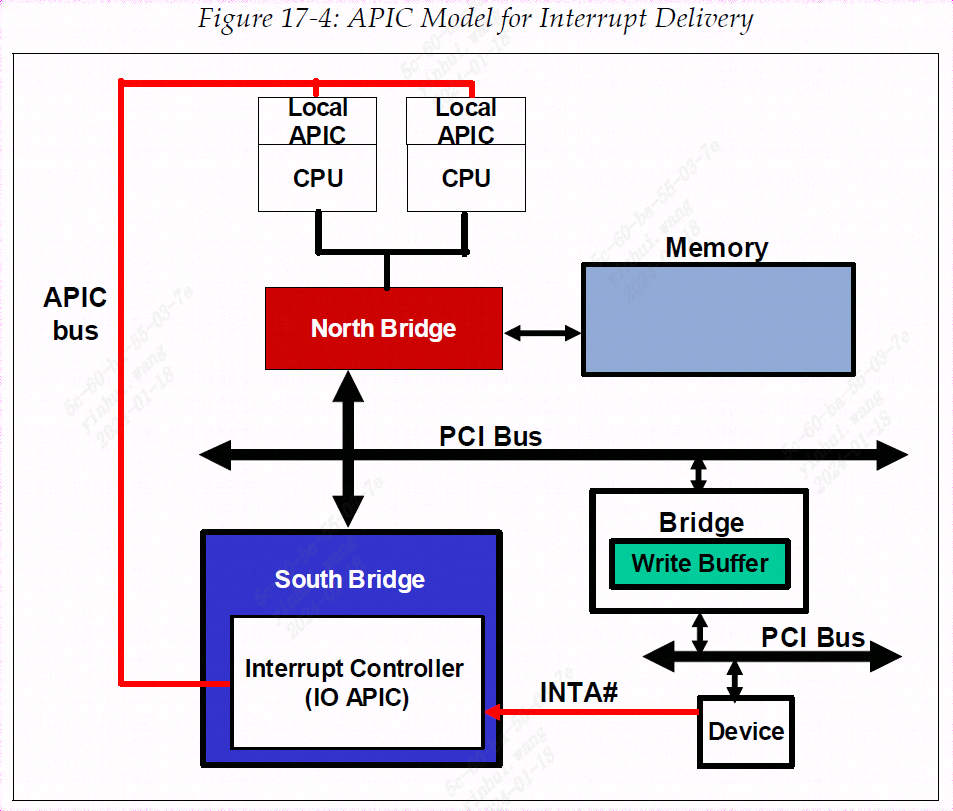

该模型（称为 APIC 模型）已足够使用数年，但仍依赖于外围设备的边带引脚才能工作。 该模型的另一个限制是 IO APIC 中的 IRQ（中断请求线）数量。 如果没有大量的 IRQ，外围设备必须共享 IRQ，这意味着在断言 IRQ 的任何时候都会增加延迟，因为可能有多个设备可以断言它，并且软件必须评估所有这些设备。 这种将多个 ISR 连接在一起的技术通常称为中断链。 最终，由于这个问题和其他一些小问题，出现了另一个改进。

为什么不让外围设备本身直接向本地 APIC 发送中断消息？ 所需要的只是一条已经以 PCI 总线和处理器总线形式存在的通信路径。 因此，APIC 总线被取消，所有中断都以内存写入的形式传递到本地 APIC，称为 MSI 或消息信号中断。 这些 MSI 的目标是一个特殊地址，系统将其理解为针对本地 APIC 的中断消息。 （对于基于 x86 的系统，这个特殊地址传统上是 FEEx_xxxxh。）甚至 IO APIC 也被编程为使用内存写入 (MSI) 通过普通数据总线发送中断通知。 现在，它只是通过数据总线发送一个 MSI 内存写入，目标是所需处理器的本地 APIC 的内存地址，这具有通知处理器中断的效果。

该模型称为 xAPIC 模型，由于它不基于进入具有有限输入数量的中断控制器的边带信号，因此几乎消除了共享中断的需要。 有关此模型的更多信息，请参阅第 827 页的“MSI 解决方案”。

PCI 多年前就添加了 MSI 支持作为一个选项，而 PCIe 则将该功能作为一项要求。 能够自行生成 MSI 事务的外设为处理中断开辟了新的选择，例如使每个功能能够生成多个唯一中断，而不仅仅是一个。

#### 17.2.3 传统 PCI 中断传送

本节提供有关传统 PCI 中断传送的更多详细信息。 熟悉 PCI 的读者可能希望继续阅读第 805 页的“虚拟 INTx 信令”，了解有关 PCIe 如何模拟此传统模型的更多信息，或者阅读第 812 页的“MSI 模型”，了解有关该方法的更多信息。 使用中断的 PCI 设备有两种选择。 他们可以使用：
• INTx# 有效低电平信号可以共享并在原始规范中定义。
• 消息信号中断作为2.2 版规范的选项添加。 MSI 无需修改即可在 PCIe 系统中使用。

##### 设备 INTx # 引脚

PCI 设备最多可以实现 4 个 INTx# 信号（INTA#、INTB#、INTC# 和 INTD#）。 不止一个引脚可用，因为 PCI 设备最多可以支持 8 个功能，每个功能都允许驱动一个（但只能是一个）中断引脚。 当 PCI 开发时，典型的系统使用包含 15 输入 8259 PIC 的芯片组，因此系统可用的 IRQ（映射到中断向量）数量就是如此。 然而，其中许多已经用于系统目的，例如系统计时器、键盘中断、鼠标中断等。 此外，还为 ISA 卡保留了一些引脚，这些引脚仍然可以插入这些旧系统中。 因此，PCI 规范编写者认为只有四个 IRQ 可以可靠地用于他们的新总线，因此该规范仅支持四个中断引脚。 然而，您可能知道，PCI 总线上通常有四个以上的 PCI 设备，甚至单个设备内部也可能有四个以上的功能，每个功能都需要自己的中断。 这些原因就是 PCI 中断被设计为电平敏感且可共享的原因。 这些信号可以简单地通过线或连接在一起，得到少量结果输出，每个输出代表中断请求。 由于它们是共享的，因此当检测到中断时，中断处理程序软件将需要遍历共享同一引脚的函数列表并进行测试以查看哪些函数需要服务。

##### 确定 INTx # 引脚支持

PCI 功能在其配置标头中指示对 INTx# 信号的支持。 图 17-5 中所示的只读中断引脚寄存器指示该函数是否支持 INTx#，如果支持，则在请求中断时将断言哪个中断引脚。
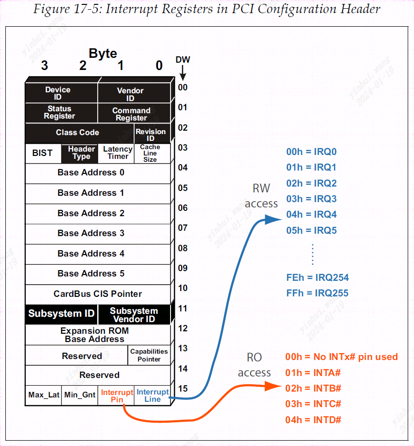

##### 中断路由

第 801 页上的图 17-5 所示的中断线寄存器提供了驱动程序需要了解的下一个信息：该引脚所连接的 PIC 的输入引脚。 PIC 由系统软件编程，每个输入引脚 (IRQ) 都有一个唯一的向量编号。 最高优先级中断的向量被报告给处理器，然后处理器使用该向量索引中断向量表中的相应条目。 该条目指向处理器执行的中断设备的中断服务例程。

平台设计者从设备分配 INTx# 引脚的路由。 它们可以通过多种方式进行路由，但最终每个 INTx# 引脚都连接到中断控制器的输入。 第 803 页上的图 17-6 说明了一个示例，其中多个 PCI 设备中断通过可编程路由器连接到中断控制器。 连接到可编程路由器的给定输入的所有信号将被引导到中断控制器的特定输入。 其中断被路由到公共中断控制器输入的函数都将具有由平台软件（通常是固件）分配给它们的相同中断线编号。 在此示例中，IRQ15 具有来自与其连接的不同设备的三个 PCI INTx# 输入。 因此，使用这些 INTx# 线的函数将共享 IRQ15，因此所有函数都会导致控制器在查询时发送相同的向量。 该向量将不同功能的三个 ISR 链接在一起。
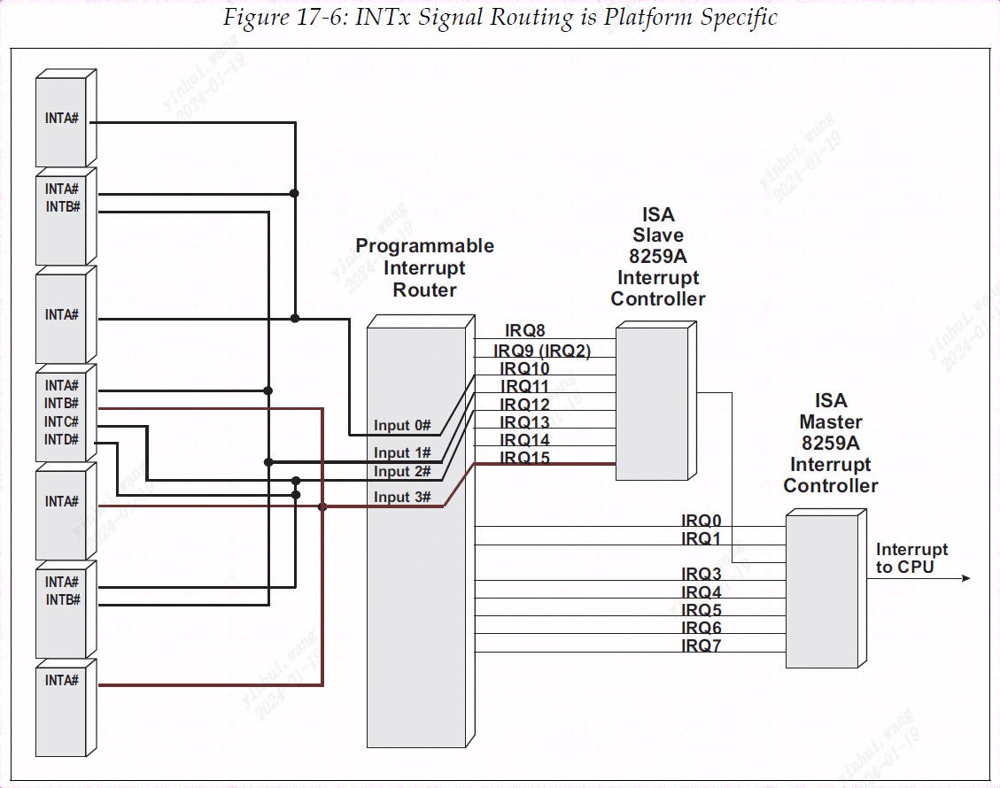

##### 将 INTx # 线与 IRQ 号关联

根据系统要求，路由器被编程为将其四个输入连接到四个可用的 PIC 输入。 完成此操作后，与每个功能关联的 INTx# 引脚的路由就已知，并且中断线编号由软件写入每个功能。 该值最终由函数的设备驱动程序读取，因此它将知道它已被分配到哪个中断表条目。 这是其 ISR 的起始地址将被写入的地方，这个过程称为“挂钩中断”。 当此函数稍后生成中断时，CPU 将接收与中断线寄存器中指定的 IRQ 相对应的向量号。 CPU 使用该向量索引中断向量表，以获取与函数的设备驱动程序关联的中断服务例程的入口点。

##### INTx # 信令

INTx# 线是低电平有效信号，以开漏方式实现，系统在每条线上提供上拉电阻。 连接到同一 PCI 中断请求信号线的多个设备可以同时置位它而不会造成损坏。

当功能发出中断信号时，它还会设置位于配置头的状态寄存器中的中断状态位。 系统软件可以读取该位以查看当前是否有中断待处理。 （参见第 805 页的图 17-8。）

**中断禁用**。 2.3 PCI 规范在配置头的命令寄存器中添加了一个中断禁用位（位 10）。 请参见第 804 页上的图 17-7。该位在复位时被清除，允许生成 INTx# 信号，但软件可以设置它以防止这种情况发生。 请注意，中断禁用位对消息信号中断 (MSI) 没有影响。 MSI 通过 MSI 功能结构中的命令寄存器启用。 自动启用 MSI 具有禁用中断引脚或仿真的效果。
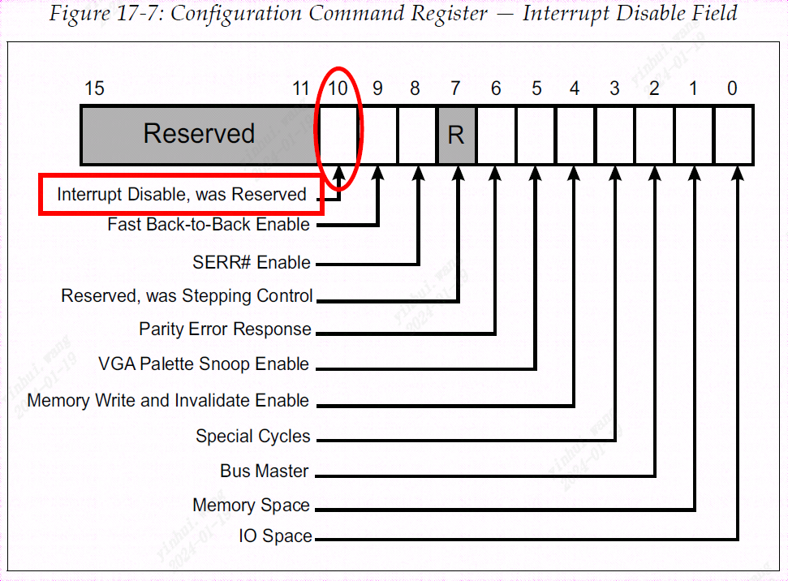

**中断状态**。 PCI 2.3 规范在配置状态寄存器中添加了一个只读中断状态位（如第 805 页的图 17-8 所示）。 当中断待处理时，函数必须设置该状态位。 此外，如果标头命令寄存器中的中断禁用位被清除（即启用中断），则当该状态位被置位时，该功能的 INTx# 信号将被置位。 该位不受中断禁用位状态的影响。
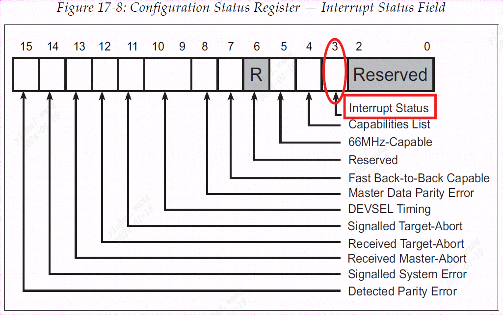

#### 17.2.4  虚拟 INTx 信令

##### 概要

如果情况不允许在 PCIe 拓扑中使用 MSI，则将使用 INTx 信令模型。 以下是需要能够使用 INTx 消息的设备的两个示例：

**PCIe 至（PCI 或 PCI-X）桥接器** — 大多数 PCI 设备将使用 INTx# 引脚，因为 MSI 支持对于它们来说是可选的。 由于 PCIe 不支持边带中断信号，因此使用带内消息。 中断控制器理解该消息并向 CPU 发送中断请求，其中包括预编程的向量号。

**引导设备** — PC 系统通常在引导序列期间使用传统中断模型，因为 MSI 通常需要操作系统级初始化。 一般来说，启动至少需要三个子系统：操作员的输出（例如视频）、操作员的输入（通常是键盘）以及可用于获取操作系统的设备（通常是硬盘驱动器）。 参与初始化系统的 PCIe 设备称为“启动设备”。 引导设备将使用传统中断支持，直到加载操作系统和设备驱动程序，之后最好使用 MSI。

##### 虚拟 INTx 线传送

第 806 页上的图 17-9 说明了具有 PCIe EP和 PCIe—PCI 桥接器的系统。如果我们假设软件未在EP上启用 MSI，它将通过 INTx 消息发送中断请求。 在此示例中，桥接器通过 INTx 消息从连接的 PCI 设备传播基于引脚的中断。 可以看出，桥接器发送 INTB 消息来表示来自 PCI 总线的 INTB# 输入的断言和取消断言。 PCIe EP使用仿真消息向 INTA 发送信号。 请注意，INTx# 信令涉及两个消息：
- **Assert_INTx** 消息指示虚拟INTx# 信号从高到低的转换（从无效到有效）。
- **Deassert_INTx** 消息指示从低到高的转换。 当函数传送 Assert_INTx 消息时，它还会在配置状态寄存器中设置其中断状态位，就像它断言物理 INTx# 引脚时一样（请参见第 805 页上的图 17-8）。
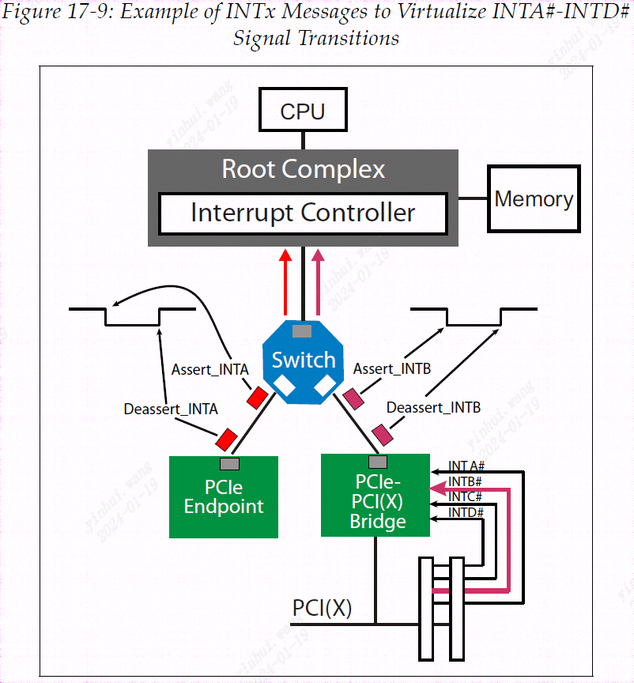

##### INTx 消息格式

第 807 页的图 17-10 描述了 INTx 消息头的格式。 中断控制器是这些消息的最终目的地，但所采用的路由方法不是“路由到根联合体”，而实际上是“本地 - 终止于接收器”，如图 17-10 所示。 有两个原因。 第一个是因为上游路径上的每个网桥（包括交换机端口和根端口）可能会将虚拟中断线映射到桥上的不同虚拟中断线（例如，交换机端口接收 Assert_INTA，但在向上游传播时将其映射到 Assert_INTB） ）。 有关此 INTx 映射的更多信息，请参阅第 808 页的“INTx 映射”。

这些消息的本地路由类型的第二个原因是我们正在模拟基于引脚的信号。 如果端口接收到映射到其初级侧的 INTA 的断言中断消息，并且由于先前的中断而已向上游发送了 Assert_INTA 消息，则没有理由发送另一个消息。 INTA 已被视为断言。 有关 INTx 消息折叠的更多信息可以在第 810 页的“INTx 合并”中找到。
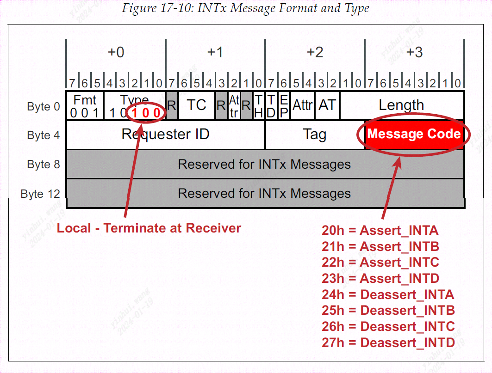

#### 17.2.5  映射和合并 INTx 消息

##### INTx 映射

交换机必须遵守 PCI 规范定义的 INTx 映射，如第 809 页的表 17-1 所示。该映射定义了通过 PCI 到 PCI 桥路由中断时存在的虚拟连接。 该映射基于 INTx 消息类型和消息中请求者 ID 字段中的设备编号。
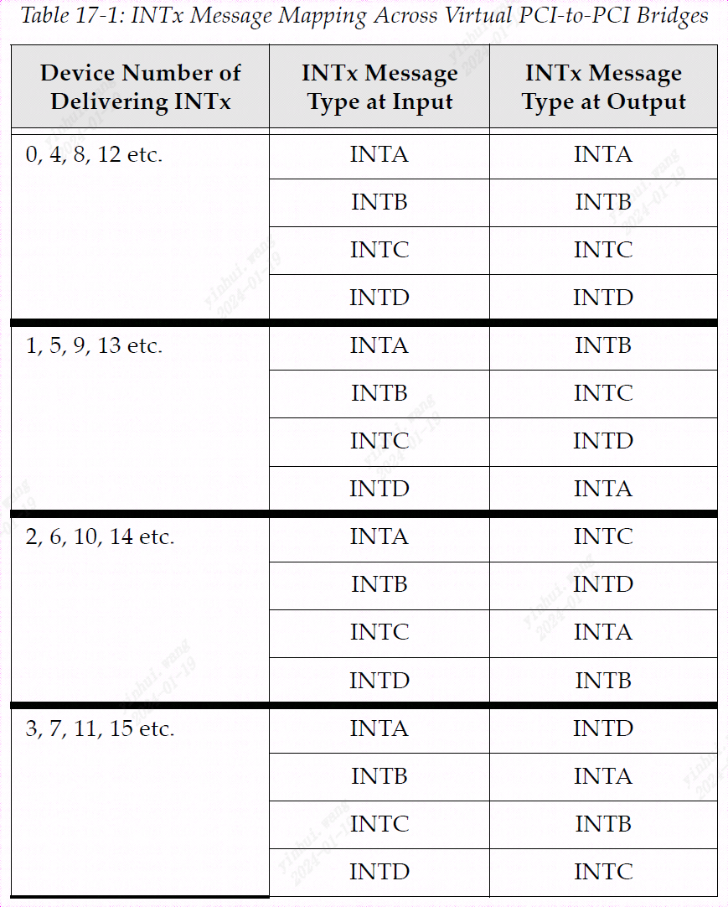

有关此示例，请参阅第 810 页上的图 17-11。 下游两个交换机端口收到的断言中断消息均为INTA消息。 每个入口端口处的虚拟 PCI 到 PCI 桥会将两条 INTA 消息映射到 INTA，这意味着没有任何变化。 这是因为两个始发端点设备的设备编号为零（它作为请求者 ID ReqID 的一部分包含在中断消息本身中）。 表 17-1 显示来自设备 0 的中断消息映射到桥另一侧的相同 INTx 消息（即，在交换机内部，两个 INTA 消息都映射到 INTA）。 因此，每个下游端口都会向上游传播中断消息，而无需更改其虚拟线路。 但是，传播的中断消息不再具有原始请求者的 ReqID，它们现在具有传播中断消息的端口的 ReqID。
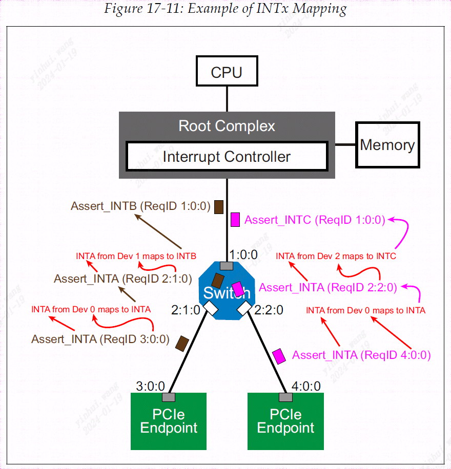

接下来，上游交换机端口接收传播的中断消息。 来自端口 2:1:0 的 INTA 中断在向上游传播时将映射到 INTB 消息，因为中断消息表明它来自设备 1 (ReqID 2:1:0)。 当从上游交换机端口发送到根端口时，端口 2:2:0 传播的另一个中断将被映射到 INTC 消息。 请参阅表 17-1 来确认这些映射。

这种中断映射的原因与 PCI 相同：尽可能避免多个功能共享同一 INTx# 引脚。 如前所述，如果使用传统中断，**单功能设备需要使用 INTA**。 因此，如果根端口下游的所有功能都使用 INTA 并且没有跨桥映射，则它们都将被路由到相同的 IRQ。 这意味着任何时候一个函数断言 INTA，所有函数都必须被检查。 这将导致列表末尾的函数出现显着的中断服务延迟。 这种中断映射方法是在所有四个 INTx 虚拟线上分配中断（尤其是 INTA）的粗略尝试，因为每个 INTx 虚拟线都可以映射到中断控制器处的单独 IRQ。

##### INTx 合并

PCIe 交换机必须确保 INTx 消息以正确的方式向上游传递。 具体来说，必须处理传统 PCI 实现的中断路由，以便软件可以确定哪些中断被路由到哪些中断控制器输入。 INTx# 线可以进行线或并路由到中断控制器上的相同 IRQ 输入，并且当多个设备在同一线上发出中断信号时，中断控制器只能看到第一个断言。 同样，当这些设备之一取消断言其 INTx# 线时，该线将保持断言状态，直到最后一个设备关闭。 这些相同的原则也适用于 PCIe INTx 消息。

然而，在某些情况下，两个重叠的 INTx 消息可能会被出口端口处的虚拟 PCI 桥映射到同一个 INTx 消息，从而需要合并这些消息。 请考虑第 811 页图 17-12 中所示的以下示例。
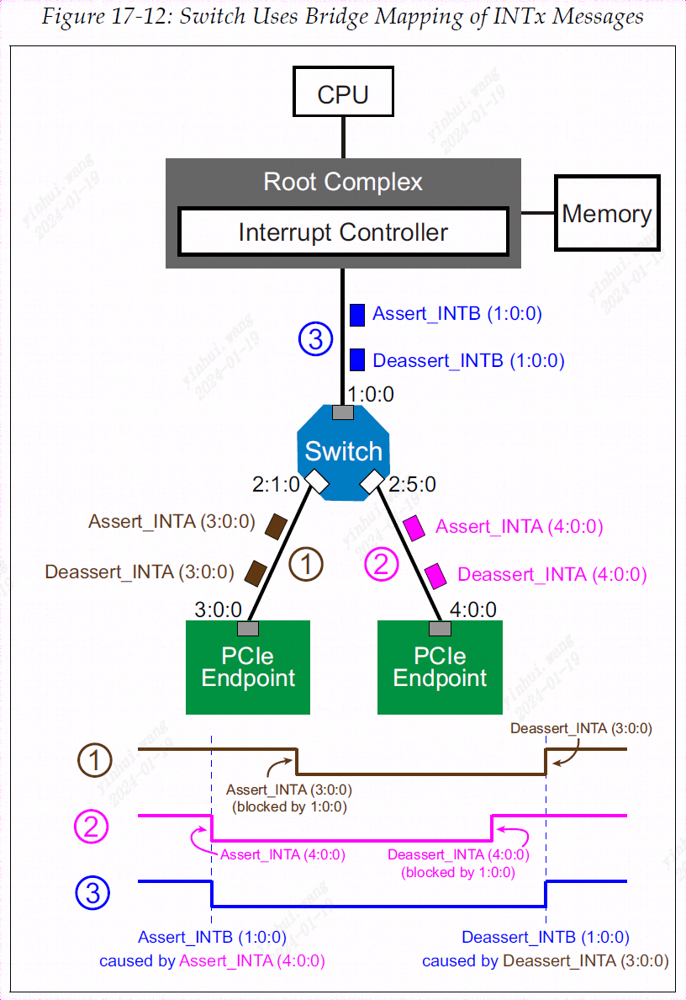

当上游交换机端口映射中断消息以在上游链路上传递时，两个中断都将被映射为 INTB（基于下游交换机端口的设备编号）。 请注意，由于这两条重叠的消息相同，因此必须合并它们。

合并可确保中断控制器永远不会收到共享中断的两个连续的 Assert_INTx 或 Deassert_INTx 消息。 这相当于对 INTx 信号进行线或运算。

##### INTx 传送规则

与 INTx 消息传递相关的规则具有一些独特的特征：
- Assert_INTx 和Deassert_INTx 仅在上行方向发出。
- 当中断状态发生变化时，正在合并中断的交换机将仅向上游发出 INTx 消息。
- 链路两侧的设备必须跟踪INTA~INTD 断言的当前状态。
- 交换机跟踪其每个下游端口的四条虚拟线路的状态，并可能在其上游端口上呈现一组合并的虚拟线路。
- RC必须跟踪每个下游端口的四条虚拟线路(A-D) 的状态。
- INTx 信号可以通过命令寄存器中的中断禁用位来禁用。
- 如果任何INTx 虚拟线处于活动状态并且设备中断随后被禁用，则必须发送相应的Deassert_INTx 消息。
- 如果下游交换机端口进入DL_Down 状态，则必须取消断言任何活动的INTx 虚拟线路，并相应地更新上游端口（如果该INTx 处于活动状态，则需要Deassert_INTx 消息）。

### 17.3 MSI 模型

PCIe 功能通过 MSI 功能寄存器指示 MSI 支持。 每个功能必须实现 MSI 能力结构或 MSI-X（扩展 MSI，请参阅第 821 页的“MSI-X 模型”）能力结构，或两者兼而有之。 MSI 能力寄存器由配置软件设置，包括：
- 目标内存地址
- 要写入该地址的数据值
- 可编码到数据中的唯一消息的数量 
请参阅第 188 页上的“内存请求标头字段”以了解内存写入事务标头。 请注意，MSI 的数据负载始终为 1DW。

#### 17.3.1 MSI 能力结构

MSI 能力结构驻留在 PCI 兼容的配置空间区域（前 256 个字节）。 MSI 能力结构有四种变体，具体取决于它是支持 64 位寻址还是仅支持 32 位以及是否支持每个向量掩码。 本机 PCIe 设备需要支持 64 位寻址。 MSI 能力结构的所有四种变体均可在第 813 页的图 17-13 中找到。
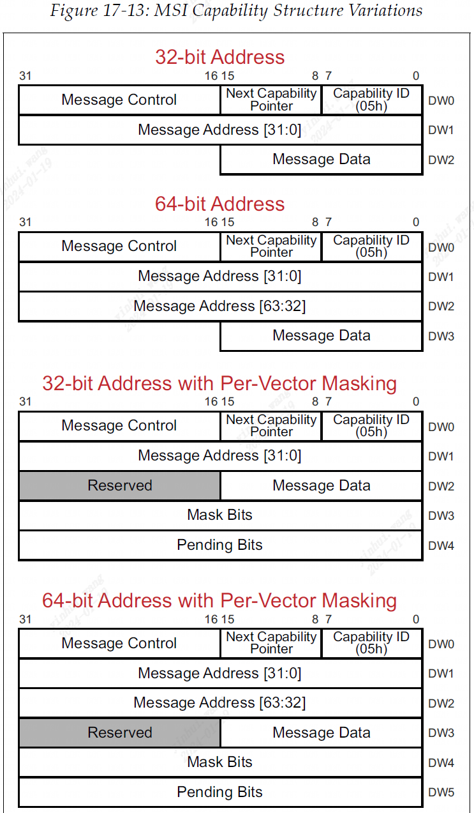

##### 功能 ID(Capability ID)

功能 ID 值 05h 标识 MSI 功能，并且是只读值。

##### 下一个功能指针(Next Capability Pointer)

寄存器的第二个字节是一个只读值，它给出从配置空间顶部到结构链接列表中下一个功能结构的双字对齐偏移量，或者包含 00h 以指示链接列表的末尾。

##### 消息控制寄存器(Message Control Register)

第 814 页的图 17-14 和第 814 页的表 17-2 说明了消息控制寄存器的布局和用法。
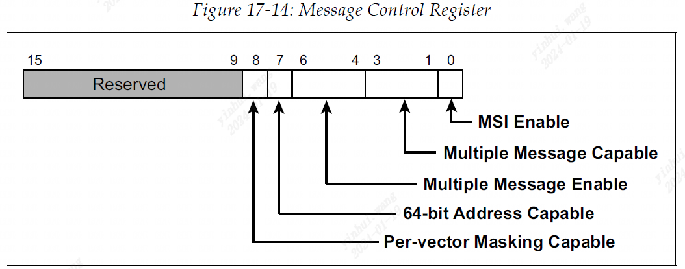

表17-2 消息控制寄存器的格式和用法

| **Bit(s)** | **Field Name** | **Description** |
| - | - |- |
| 0 | MSI Enable | 访问权限：读/写。复位后状态为0，表示设备的MSI功能禁用。   •  0 = 禁用使用MSI 的功能。 它必须使用 MSI-X 或 INTx 消息。   •  1 = 启用使用MSI 请求的功能服务并且不会使用 MSI‐X 或 INTx 消息。 |
| 3:1 | Multiple Message Capble | 访问权限：只读。系统软件读取该字段以确定该功能想要使用多少消息（中断向量）。 请求的消息数量是 2 的幂，因此需要 3 条消息的函数必须请求为其分配 4 条消息。  值             消息请求的数量    000b                   1   001b                   2   010b                   4   011b                   8   100b                  16   101b                  32   110b                 保留   111b                 保留 |
| 6:4 | Multiple Message Enable | 读写权限：读/写。系统软件读取多消息功能字段（此表中的前一行）以查看功能请求了多少消息（中断向量）后，它会在此字段中编程一个 3 位值，指示分配给该功能的实际消息数。 功能。 分配的数量可以等于或小于实际请求的数量。 复位后该字段的状态为000b。   值             消息请求的数量    000b                   1   001b                   2   010b                   4   011b                   8   100b                  16   101b                  32   110b                 保留   111b                 保留 |
| 7 | 64-bit Address Capable | 读写权限：只读。   •  0 = 功能不实现消息地址寄存器的高32 位； 只能使用 32 位地址。   •  1 = 功能实现消息地址寄存器的高32 位，并且能够生成64 位存储器地址。 |
| 8 | Per-Vector Masking Capable | 读写权限：只读。   •  0 = 功能不实现屏蔽位寄存器或挂起位寄存器； 软件无法使用此功能结构屏蔽各个中断。   •  1 = 功能确实实现了屏蔽位寄存器或挂起位寄存器； 软件确实能够利用这种功能结构屏蔽各个中断。 |
| 15:9 | 保留字段 | 只读，常0 |
 
##### 消息地址寄存器(Message Address Register)

32 位消息地址寄存器的低两位为零且无法更改，强制软件分配的地址为双字对齐。 通常，这将是系统 CPU 中本地 APIC 的地址。 在基于 x86 的系统（Intel 兼容）中，该地址传统上为 FEEx_xxxxh，其中低 20 位指示哪个本地 APIC 是目标以及有关中断本身的一些其他信息。 需要注意的是，地址的解释方式是特定于平台的，PCI 或 PCIe 规范中没有规定。

包含消息地址位 [63:32] 的寄存器对于本机 PCI Express 设备是必需的，但对于传统端点来说是可选的。 如果消息控制寄存器的位 7 被设置，则该寄存器存在。 如果是，则它是一个读/写寄存器，与消息地址 [31:0] 寄存器一起使用，以启用 64 位内存地址，用于从此函数传送中断。

##### 消息数据寄存器(Message Data Register)

系统软件将基本消息数据模式写入该 16 位读/写寄存器。 当功能生成中断请求时，它将 32 位数据值写入消息地址寄存器中指定的内存地址。 该数据的高 16 位始终设置为零，而低 16 位由消息数据寄存器提供。

如果已将多条消息分配给该功能，则它会修改消息数据寄存器值的低位（可修改位数取决于配置软件已将多少条消息分配给该功能），以形成适当的值 它希望报告的事件。 例如，请参阅第 820 页的“生成 MSI 中断请求的基础知识”。

##### 屏蔽位寄存器和待处理位寄存器(Mask Bits Register and Pending Bits Register)

如果功能支持每向量屏蔽（消息控制寄存器的位 [8] 中指示），则这些寄存器存在。 使用 MSI 可以请求并分配给功能的中断消息（itnerrupt 向量）的最大数量为 32。因此，这两个寄存器的长度为 32 位，每个潜在的中断消息都有自己的掩码和挂起位。 如果屏蔽位寄存器的位 [0] 被置位，则中断消息 0 被屏蔽（这是该函数的基向量）。 如果位 [1] 被置位，则中断消息 1 被屏蔽（这是基向量 + 1）。

当中断消息被屏蔽时，无法发送该向量的 MSI。 相反，设置相应的待处理位。 这允许软件屏蔽来自函数的各个中断，然后定期轮询该功能以查看是否有任何待处理的屏蔽中断。

如果软件清除屏蔽位并设置相应的待处理位，则功能必须在此时发送 MSI 请求。 发送中断消息后，该功能将清除挂起(pending)位。

#### 17.3.2 MSI 配置基础知识

以下列表指定了软件为 PCI Express 设备配置 MSI 中断所采取的步骤。 请参阅第 819 页上的图 17-15。
1. 启动时，枚举软件扫描系统中的所有 PCI 兼容功能（有关枚举过程的讨论，请参阅第 109 页上的“单根枚举示例”）。
2. 一旦发现功能，软件就会读取功能列表指针，以查找链接列表中第一个功能结构的位置。
3. 如果在列表中找到 MSI 功能结构（功能 ID 为 05h），软件将读取设备消息控制寄存器中的多消息功能字段，以确定设备支持多少个特定于事件的消息以及是否支持 64- 位消息地址或仅 32 位。 然后软件分配等于或小于该数量的消息，并将该值写入“多消息启用”字段。 至少会向该设备分配一条消息。
4. 软件将基本消息数据模式写入设备的消息数据寄存器，并将双字对齐的内存地址写入设备的消息地址寄存器，作为 MSI 写入的目标地址。
5. 最后，软件设置设备消息控制寄存器中的 MSI 启用位，使其能够生成 MSI 写入并禁用其他中断传送选项。
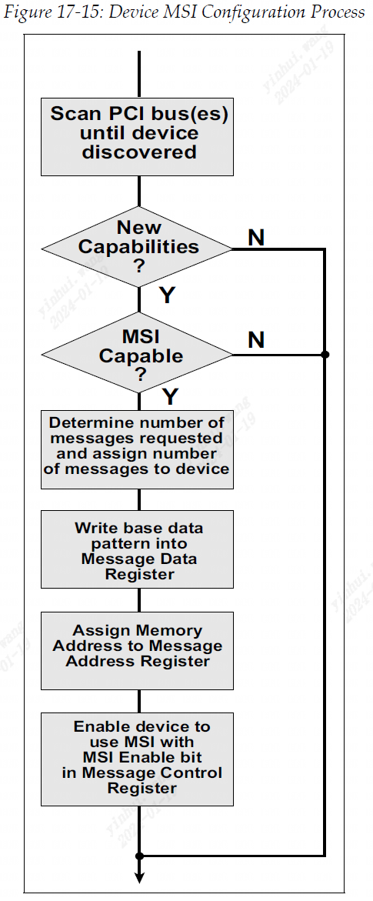

#### 17.3.3 生成 MSI 中断请求的基础知识

第 821 页上的图 17-16 说明了 MSI MWrite 标头和数据字段的内容。 要点包括：
- 对于本机功能，格式字段必须为 011b，表示带有数据的 4DW 标头（64 位地址），但对于传统端点，格式字段可能为 010b，表示 32 位地址。
- 无侦听和宽松排序的属性位必须为零。
- 长度字段必须为01h，以指示1DW 的最大数据负载。
- 第一个BE 字段必须是1111b，指示DW 的所有四个字节中的有效数据，即使MSI 的高两个字节始终为零。
- 最后一个BE 字段必须为0000b，表示单个DW 事务。
- 标题内的地址字段直接来自MSI功能寄存器中的地址字段。
- 较低的16位数据有效载荷是从MSI功能寄存器中的数据字段得出的。

#### 17.3.4 多条消息（Multiple Message）

如果系统软件向该功能分配了多个消息，则通过修改分配的消息数据值的低位来创建多个值，以便为每个设备特定的事件类型发送不同的消息。
例如，假设以下情况：
- 已将四条消息分配给一个设备。
- 数据值49A0h 已分配给设备的消息数据寄存器。
- 存储器地址FEEF_F00Ch 已写入器件的消息地址寄存器。
- 当四个事件之一发生时，器件通过对存储器地址FEEF_F00Ch 执行双字写入（数据值为0000_49A0h、0000_49A1h、0000_49A2h 或0000_49A3h）来生成请求。 换句话说，修改数据值的低两位以指定发生了哪个事件。 如果该函数已分配 8 个消息，则可以修改低三位。 此外，设备始终使用 0000h 作为其消息数据值的高 2 个字节。
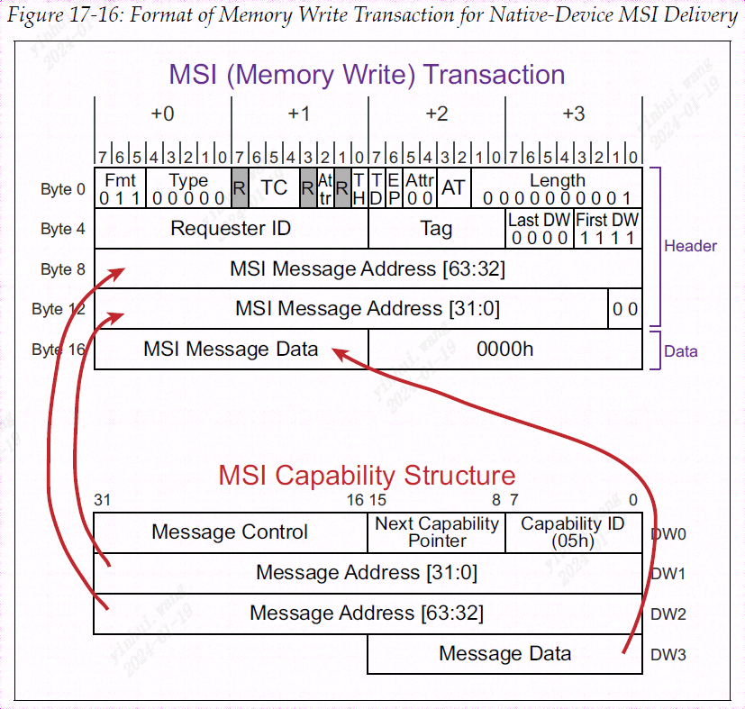

### 17.4 MSI-X 模型

#### 17.4.1 概要

PCI 规范的 3.0 修订版增加了对 MSI-X 的支持，MSI-X 有自己的功能结构。 MSI-X 的动机是希望缓解 MSI 的三个缺点：
• 每个功能 32 个向量对于某些应用来说是不够的。
• 只有一个目标地址使得在多个CPU 之间静态分配中断变得困难。 如果可以为每个向量分配唯一的地址，则可以实现最大的灵活性。
• 在某些平台（例如基于x86 的系统）中，中断的向量编号指示其相对于其他中断的优先级。 使用 MSI，可以为单个功能分配多个中断，但所有中断向量都是连续的，这意味着类似的优先级。 如果来自该函数的某些中断应具有高优先级而其他中断应具有低优先级，则这不是一个好的解决方案。 更好的方法是软件为分配给函数的每个中断指定一个唯一的向量（消息数据值），该向量不必是连续的。

牢记这些目标，很容易理解寄存器的更改，这些更改是为了提供更多向量而实现的，每个向量都分配有目标地址和消息数据值。

#### 17.4.2 MSI-X 功能结构

如第 822 页上的图 17-17 所示，消息控制寄存器与 MSI 有很大不同。 有趣的是，尽管 MSI-X 每个功能最多可支持 2048 个向量，而 MSI 为 32 个，但 MSI-X 的配置寄存器数量实际上比 MSI 稍少。 这是因为这里不包含矢量信息。 相反，它位于表 BIR（基地址指示寄存器）指向的内存位置 (MMIO)，如第 824 页上的图 17-18 所示。
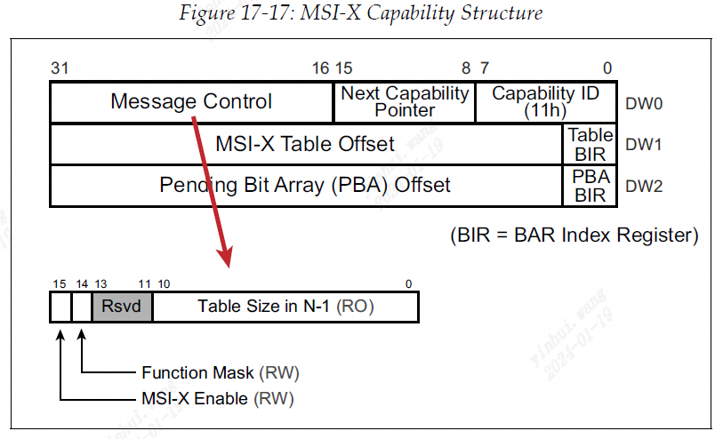

表 17-3 MSI-X 消息控制寄存器的格式和用法

| **Bit(s)** | **域名** | **具体描述** |
| ---- | ---- | ---- |
| 10:0 |  Table Size | 读写权限：只读。  该字段指示该功能支持的中断消息（向量）的数量。 这里的值以 N-1 方式解释，因此 0 值表示 1 个向量。 值 7 表示 8 个向量。 每个向量在 MSI-X 表中都有自己的条目，并且在待定位数组中都有自己的位。  |
| 13:11 | 保留字段 | 读写权限：只读。常0 |
| 14 | Function Mask | 读写权限：读/写。  该字段为系统软件提供了一种简单的方法来屏蔽功能的所有中断。 如果该位被清除，仍然可以通过在每个向量的 MSI-X 表条目中设置屏蔽位来单独屏蔽中断。|
| 15 | MSI-X Enable | 读写权限：读/写。  复位后的状态为0，表示设备的MSI-X功能被禁用。  •  0 = 禁用使用MSI-X 的功能。 它必须使用 MSI 或 INTx 消息。  •  1 = 启用功能以使用MSI-S 请求服务，并且不会使用MSI-X 或INTx 消息。|
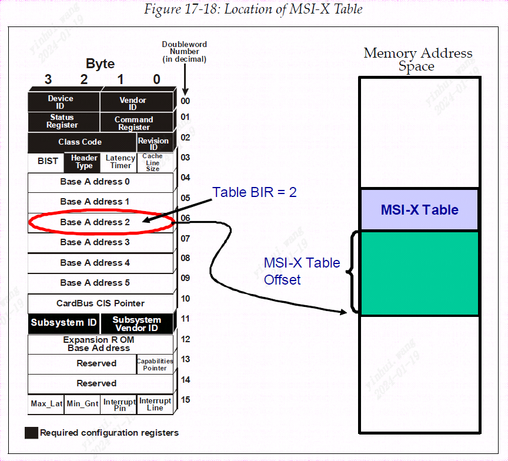

#### 17.4.3 MSI-X Table

MSI-X 表本身是一个向量和地址的数组，如第 825 页的图 17-19 所示。每个条目代表一个向量并包含四个双字。 DW0 和 DW1 为该向量提供唯一的 64 位地址，而 DW2 为其提供唯一的 32 位数据模式。 DW3 目前仅包含一位：该向量的屏蔽位，允许每个向量根据需要独立屏蔽。
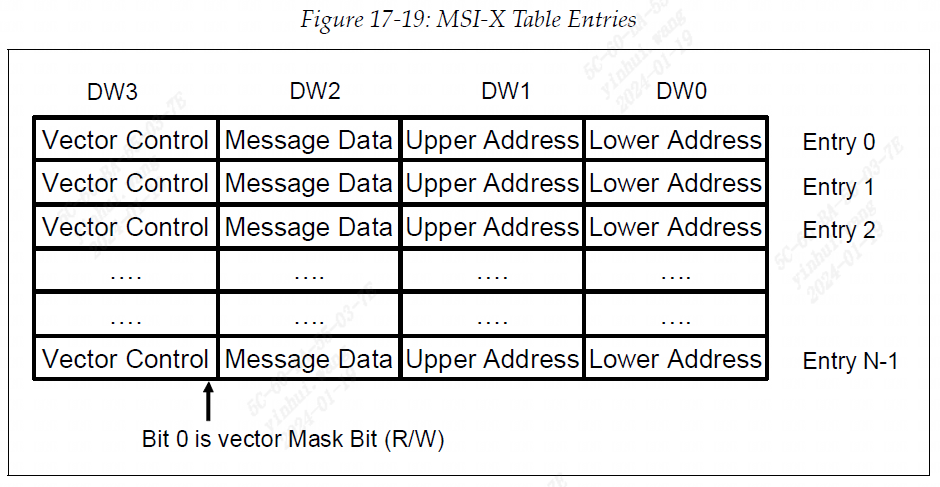

#### 17.4.4 带处理位位数组(Pending Bit Array)

以大致相同的方式，待处理位数组也位于存储器地址内。 它可以使用与具有不同偏移量的 MSI-X 表相同的 BIR 值（相同的 BAR），或者可以完全使用不同的 BAR。 如图 17-20 所示，该数组仅包含将要使用的每个向量的一个位。 如果触发该中断的事件发生但其掩码位已设置，则不会发送 MSI-X 事务。 相反，相应的待处理位被设置。 稍后，如果该向量被取消屏蔽并且挂起位仍被设置，则此时将生成中断。
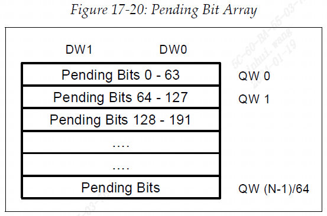

### 17.5 进入中断处理程序时的内存同步

#### 17.5.1 问题

当数据传送时，任何中断方案都存在潜在的问题。 例如，如果设备之前已发送过数据并希望通过中断来报告该数据，则数据传输的意外延迟可能会导致中断过早到达。 这可能发生在第 827 页图 17-21 所示的桥数据缓冲区中，结果是竞争条件。 这些步骤与我们之前的讨论类似（请参阅第 796 页的“遗留模型”）：
1. 该功能将数据块写入内存。 写入作为Posted事务在本地总线上完成，这意味着发送方已完成所需的所有操作，并且事务被视为已完成。
2. 发送中断以通知软件某些请求的数据现在存在于内存中。 然而，由于某种原因，数据在网桥中出现了延迟。
3. 与之前一样获取中断向量。
4. 获取 ISR 起始地址并将控制权传递给它。
5. ISR 从目标内存缓冲区读取，但数据有效负载仍未传送，因此它获取陈旧数据，可能会导致错误。
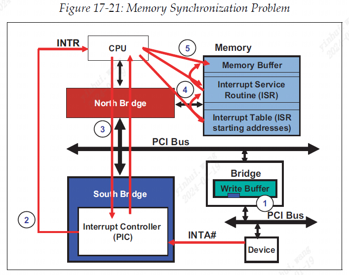

#### 17.5.2 一个解决方案

缓解此问题的一种方法是利用 PCI 事务排序规则。 如果 ISR 在尝试获取数据之前首先向发起中断的设备发送读取请求，则读取完成结果将遵循与任何写入数据从该设备获取到内存的相同路径返回到 CPU 。 事务排序规则保证桥中的读取结果不能通过同一方向的发布写入，因此最终结果是数据将在读取结果到达 CPU 之前写入内存。 因此，如果 ISR 等待读取完成到达后再继续，则可以确保任何数据都已传递到内存，从而避免竞争条件。 由于读取基本上被用作数据刷新机制，因此它不需要返回任何数据。 在这种情况下，读取的长度可能为零，并且返回的数据将被丢弃。 因此，这种类型的读取有时称为“虚拟读取”。

#### 17.5.3 一个MSI的解决方案

MSI 可以简化此过程，尽管它的工作有一些要求（请参阅第 829 页上的图 17-22）。 如果系统允许设备生成自己的 MSI 写入，而不是通过 IO APIC 等中介，则可以发生以下示例：
1. 设备将有效负载数据写入内存，并被桥接器中的写入缓冲区吸收。
2. 设备认为数据已传送并发出中断信号以通知CPU。 在这种情况下，发送 MSI 并使用与数据相同的路径。 由于数据和 MSI 都表现为对桥的内存写入，因此正常的事务排序规则将使它们保持正确的顺序。
3. 有效负载数据被传送到内存，从而释放通过桥的路径以进行 MSI 写入。
4. MSI 写入被传送到 CPU 本地 APIC，软件现在知道有效负载数据可用。
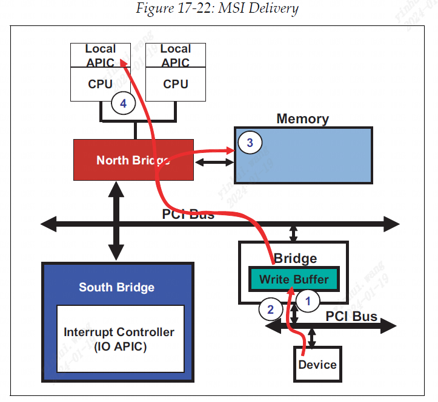

##### 流量类别必须匹配（Traffic Classes Must Match）

然而，这里必须强调重要的一点。 数据和 MSI 必须使用相同的流量类别才能正常工作。 回想一下，已分配不同 TC 值的数据包最终可能会被映射到不同的虚拟通道，并且不同 VC 中的数据包没有排序关系。 如果数据映射到 VC0，MSI 映射到 VC1，则系统将不知道它们之间的任何顺序关系，并且无法自动强制执行内存一致性。

如果不可能为两个数据包提供相同的 TC，系统将需要使用“虚拟读取”方法，并且读取请求的 TC 需要与数据写入数据包的 TC 相匹配。 应该清楚的是，即使两者使用相同的 TC，也必须避免使用宽松排序位。 我们依靠事务排序规则来实现内存同步，所以不能放松。

### 17.6 中断延迟

从发出中断信号到软件为设备提供服务的时间称为中断延迟。 尽管有其优点，MSI 与其他中断传送机制一样，不提供中断延迟保证。

### 17.7 MSI 可能会导致错误

由于 MSI 作为内存写入事务进行传递，因此与 MSI 传递相关的错误将被视为与任何其他内存写入错误条件相同。 作为示例，请参阅第 657 页上的“ECRC 生成和检查”，了解 ECRC 错误的处理。 当然，需要担心的是，如果错误导致 MSI 数据包无法识别，则处理器将看不到中断。 如何处理这种情况超出了 PCIe 规范的范围。

### 17.8 一些 MSI 规则和建议

1. 规范的目的是系统软件将互斥消息分配给功能，并且每个消息在传递到处理器时将转换为互斥中断。
2. 禁止每个功能设置多个 MSI 功能寄存器。
3. 读取消息地址寄存器会产生未定义的结果。
4. 保留的寄存器和位是只读的，并且在读取时始终返回零。
5. 系统软件可以修改消息控制寄存器位，但设备本身禁止这样做。 换句话说，不允许通过“后门”机制修改位。
6. 至少会为每个设备分配一条消息（假设软件支持并计划在系统中使用 MSI）。
7. 系统软件不得写入包含消息数据寄存器的双字的上半部分。
8. 如果设备多次写入同一消息，则仅保证其中一条消息得到服务。 如果必须对所有这些设备进行维修，则在前一个设备完成维修之前，设备不得再次生成相同的消息。
9. 如果设备分配了多个消息，并且它写入了一系列不同的消息，则保证所有消息都将得到服务。

### 17.9 对基本系统外设的特别考虑

中断也可能源自嵌入式传统硬件，例如 IO 控制器集线器或超级 IO 设备。 此类系统所需的一些典型遗留设备包括：
- 串行端口
- 并行端口
- 键盘和鼠标控制器
- 系统定时器
- IDE 控制器

这些设备通常需要将特定的 IRQ 线路连接到 PIC 或 IO APIC，以允许旧版软件与它们正确交互。

使用 INTx 消息并不能保证设备将收到它们所需的 IRQ 分配。 以下示例说明了支持正确的传统中断分配的系统。

#### 17.9.1 传统系统示例

第 831 页上的图 17-23 显示了较旧的 PCI Express 系统，其中包括通过专有集线器链接连接到根联合体的 IO 控制器集线器 (ICH)。 当 ICH 中嵌入的 IO APIC 在其输入端接收到中断请求时，它可以生成 MSI。 在这样的实现中，软件可以将遗留向量编号分配给每个输入，以确保将调用正确的遗留软件。

这种方法的优点是现有硬件可用于支持 PCIe 平台的遗留要求。 该系统还要求配置 MSI 子系统以在引导序列期间使用。 所示示例消除了对 INTx 消息的需要，除非 PCIe 扩展设备包含 PCI Express 至 PCI 桥。
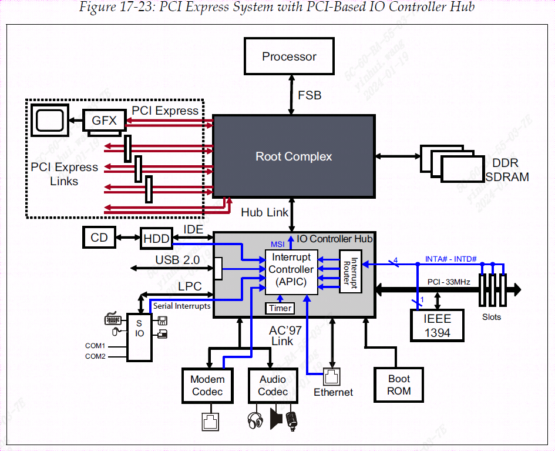

