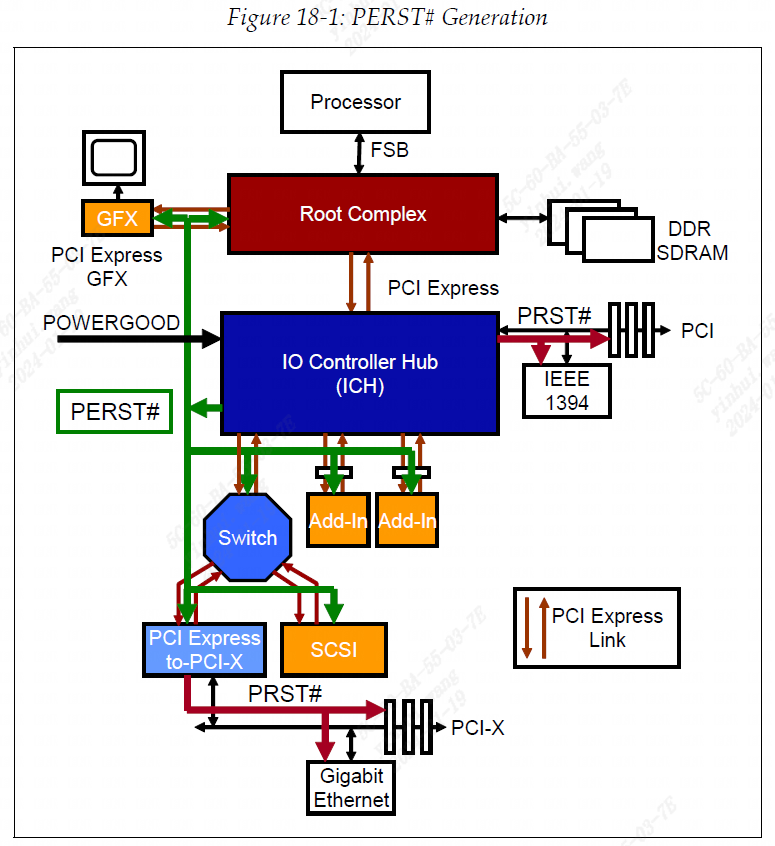
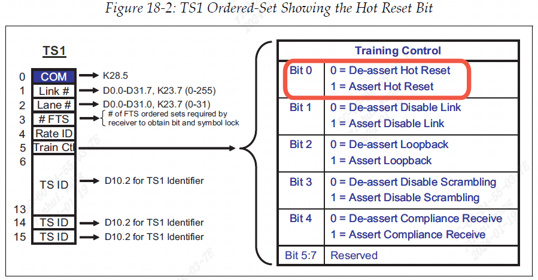
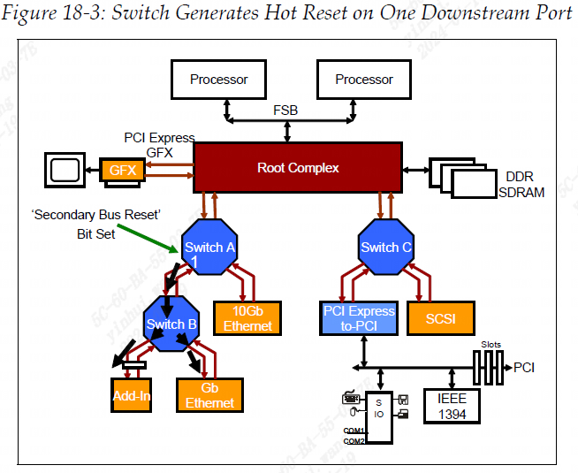
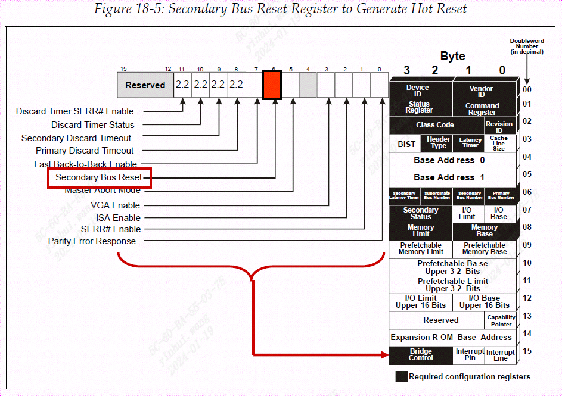
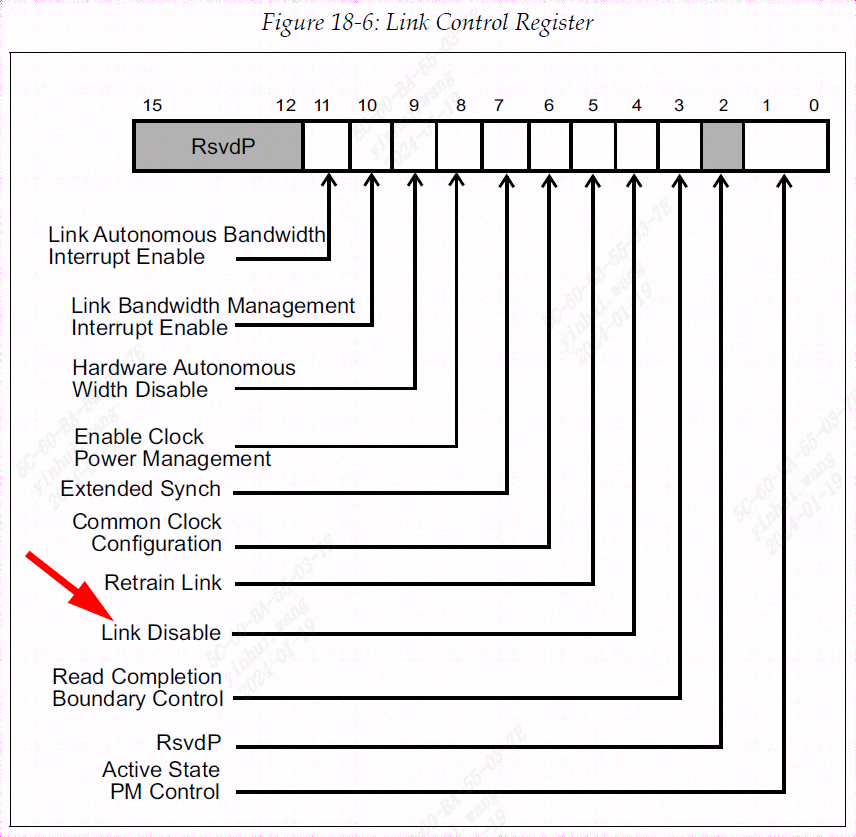
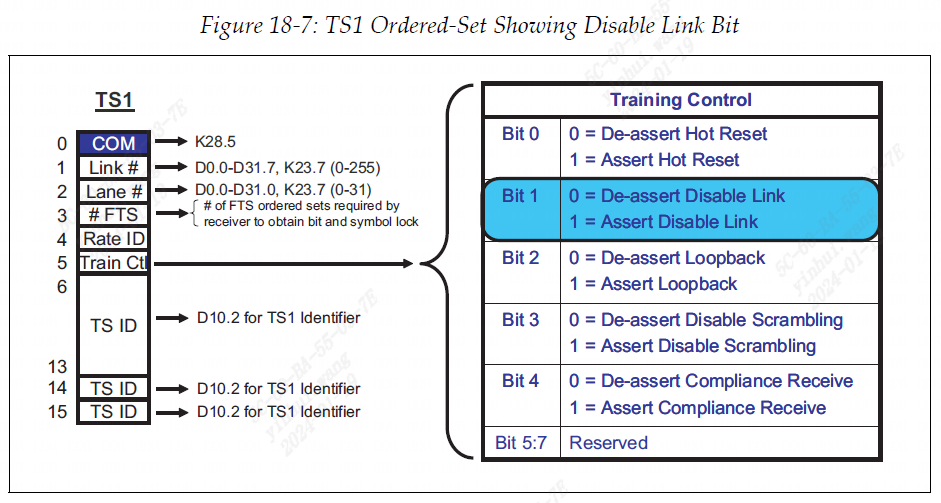
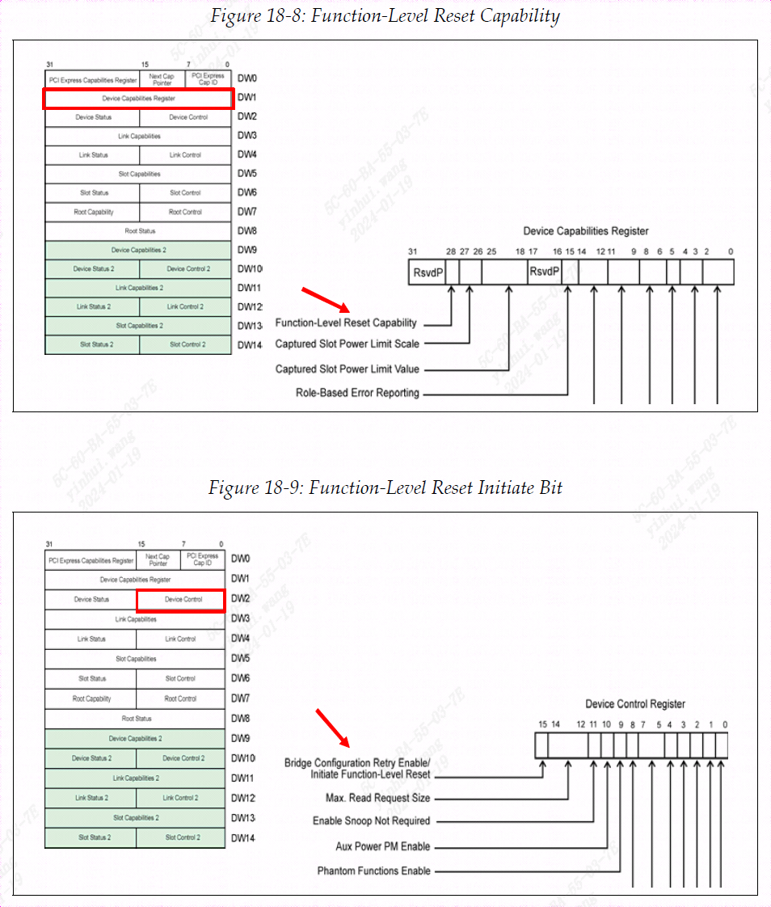

### 前一章节

上一章描述了 PCIe 功能生成中断的不同方式。 旧的 PCI 模型为此使用引脚，但在串行模型中不需要边带信号，因此必须支持带内 MSI（消息信号中断）机制。 出于软件向后兼容性的原因，仍然可以使用 PCIe INTx 消息来模拟 PCI INTx# 引脚操作。 描述了 PCI 传统 INTx# 方法和较新版本的 MSI/MSI-X。

### 本章节

本章介绍为 PCIe 定义的四种复位类型：冷复位(Cold Reset)、暖复位(Warm Reset)、热复位(Hot Reset)和功能级复位(FLR Reset)。 讨论了使用边带复位 PERST# 信号来生成系统复位，以及用于生成热复位的带内 TS1。

### 下一章节

下一章介绍 PCI Express 热插拔模型。 还为支持热插拔功能的所有设备和外形尺寸定义了标准使用模型。 电源对于热插拔卡来说也是一个问题，当在运行时将新卡添加到系统中时，确保其电源需求不超过系统可以提供的电源需求非常重要。 需要一种机制来查询和控制设备的功率需求，功率预算提供了这一点。

### 18.1 两种类型的系统复位

PCI Express 规范描述了四种类型的复位机制。 其中三个是 PCIe 规范早期修订版的一部分，现在统称为常规复位，其中两个称为基本复位。 第四个类别和方法是在 2.0 规范修订版中添加的，称为功能级别复位。

### 18.2 常规复位

#### 18.2.1 基本复位

基本复位在硬件中处理并复位整个器件，重新初始化每个状态机和所有硬件逻辑、端口状态和配置寄存器。 此规则的例外是一组被标识为“粘性”的配置寄存器字段，这意味着除非所有电源被移除，否则它们将保留其内容。 这使得它们对于诊断需要复位以使链路再次工作的问题非常有用，因为错误状态在复位后仍然存在，并且随后可供软件使用。 如果主电源被移除但 Vaux 可用，这也将保留粘性位，但如果主电源和 Vaux 都丢失，则粘性位将与其他所有内容一起复位。

基本复位将在系统范围复位时发生，但也可以针对单个设备进行。

定义了两种类型的基本复位：
- **冷复位(Cold Reset)**：设备主电源打开时的结果。重新上电将导致冷复位。
- **暖复位(Warm Reset)**（option）：由系统特定方式触发，无需关闭主电源。 例如，系统电源状态的变化可以用来启动此操作。 规范中没有定义生成暖复位的机制，因此系统设计者将选择如何完成此操作。

   当发生基本复位时：
- 对于正电压，接收器终端需要满足$Z_{RX-HIGH-IMP-DC-POS }$参数。 在 2.5 GT/s 下，这不低于 10 KΩ。 在较高速度下，对于低于 200mv 的电压，必须不低于 10 KΩ；对于高于 200mv 的电压，必须不低于 20 KΩ。 这些是终端未通电时的值。
- 类似地，对于负电压，$Z_{RX-HIGH-IMP-DC-NEG}$ 参数，在每种情况下该值最小为 1 KΩ。
- 发送器终端需要满足 Gen1 80 至 120Ω 的输出阻抗 $Z_{TX-DIFF-DC}$，Gen2 和 Gen3 最大 120Ω，但可能会将驱动器置于高阻抗状态。
- 发送器保持0 至3.6 V 之间的直流共模电压。

   退出基本重置时：
- 启用接收器终端时，必须存在接收器单端终端，以便接收器检测正常工作（Gen1 和 Gen2 为 40‐60Ω，Gen3 为 50Ω +/- 20%）。进入检测后，共模阻抗必须在 50Ω +/- 20% 的正确范围内
- 必须在退出基本复位后的 5 ms 内重新启用其接收器终端 $Z_{RX-DIFF-DC}$ 为 100Ω，使其在训练期间可被邻居的发射器检测到。
- 变送器保持0 至3.6 V 之间的直流共模电压。

定义了两种提供基本复位的方法。 首先，可以使用称为 PERST#（PCI Express 复位）的辅助边带信号来发送信号。 其次，当 PERST# 未提供给附加卡或组件时，当电源循环时，组件或附加卡会自主生成基本复位。

##### PERST# 基本复位生成

中央资源设备（例如 PCI Express 系统中的芯片组）提供此复位。 例如，第 836 页图 18-1 中的 IO 控制器集线器 (ICH) 芯片可能会根据系统电源“POWERGOOD”信号的状态生成 PERST#，因为这表明主电源已打开且稳定。 如果电源关闭，POWERGOOD 会切换并导致 PERST# 断言和取消断言，从而导致冷复位。 系统还可以提供通过一些其他方式切换 PERST# 的方法以完成暖复位。

PERST# 信号馈送到主板上的所有 PCI Express 设备，包括连接器和图形控制器。设备可以选择使用 PERST#，但不要求这样做。 PERST# 馈送到图中所示的 PCIe-to-PCI-X 桥接器。 桥接器始终将其主（上游）总线上的复位转发到辅助（下游）总线，因此 PCI-X 总线会看到 RST# 已置位。

##### 自主复位生成

设备必须设计为在施加主电源时在硬件中生成自己的复位。 该规范没有描述如何做到这一点，因此可以将自重置机制内置到设备中或添加为外部逻辑。 例如，检测到开机的附加卡可以使用该事件来生成对其设备的本地复位。 如果设备检测到其功率超出指定限制，则还必须生成自主复位。

##### 从 L2 低功耗状态进行链路唤醒

作为需要自主重置的一个示例，作为电源管理策略的一部分，其主电源已关闭的设备如果被设计为发出唤醒信号，则可能能够请求返回到全功率。 当电源恢复时，必须重置设备。 系统的电源控制器可以将 PERST# 引脚置位到设备，如第 836 页上的图 18-1 所示，但如果不这样做，或者设备不支持 PERST#，则设备必须自主生成 当它感觉到主电源重新接通时，它会进行自己的基本复位。

#### 18.2.2 热复位(带内复位)

通过发送多个 TS1（其内容如图 18-2 所示）并断言符号 5 的位 0，热复位从一个链路一端带内传播到另一个链路另一端。 这些 TS1 使用先前协商的链路和通道编号在所有通道上发送，持续 2 毫秒。 一旦发送，热复位的发送器和接收器都将进入检测 LTSSM 状态（请参阅第 612 页的“热复位状态”）。

通过在桥的桥控制配置寄存器中设置辅助总线复位位，可以在软件中启动热复位，如第 840 页上的图 18-5 所示。因此，只有包含桥的设备（如根联合体或交换机）才能执行此操作。 这。 在其上游端口上接收到热重置的交换机必须将其广播到其所有下游端口并重置自身。 接收热复位的交换机下游的所有设备都将自行重置。

##### 对接收热复位的响应

• 设备的LTSSM 经历Recovery和Hot Reset状态，然后返回Detect状态，在该状态下启动链路训练过程。
• 所有器件的状态机、硬件逻辑、端口状态和配置寄存器（粘性寄存器除外）均初始化为其默认条件。

##### 交换机在下游端口上生成热复位

在以下情况下，交换机会在其所有下游端口上生成热复位：
- 它在其上游端口上接收到热复位；
- 对于交换机或网桥上游端口，如果数据链路层报告DL_Down 状态，其效果与热复位非常相似。 当上游端口由于物理层或数据链路层无法恢复的错误而失去与上游设备的连接时，可能会发生这种情况。
- 软件设置与上行端口关联的桥控制配置寄存器的“辅助总线复位”位，如第 838 页的图 18-3 所示。

##### 桥将热复位转发到辅助总线

如果 PCI Express 至 PCI(-X) 桥等桥接器在其上游端口上检测到热复位，则它必须在其辅助 PCI(-X) 总线上断言 PRST# 信号，如图 18-4 所示 第 839 页。

##### 热复位的软件生成

软件通过将 1 后跟 0 写入相关端口配置头的桥控制寄存器中的“辅助总线复位”位，在特定端口上生成热复位（参见第 840 页上的图 18-5）。 考虑第 838 页图 18-3 中所示的示例。软件设置交换机 A 左下游端口的“辅助总线复位”寄存器，使其发送带有热复位位设置的 TS1 有序集。 交换机 B 在其上游端口上接收此热重置并将其转发到其所有下游端口。

如果软件设置交换机上行端口的辅助总线复位位，则交换机会在其所有下行端口上生成热复位，如第 839 页上的图 18-4 所示。此处，软件设置交换机 C 的辅助总线复位位。 上游端口，导致其发送在其所有下游端口上设置了热复位位的 TS1。 PCIe 至 PCI 桥接收此热复位并通过置位 PRST# 将其转发到 PCI 总线。

设置辅助总线复位位会导致端口的 LTSSM 转换到恢复状态（有关 LTSSM 的更多信息，请参阅第 519 页的“LTSSM 状态概述”），在该状态下，它会生成设置了热复位位的 TS1。 TS1 连续生成 2 ms，然后端口退出到检测状态，准备开始链路训练过程。

热复位 TS1 的接收器（始终是下游）也将进入恢复状态。 当它看到两个连续的 TS1 设置了热复位位时，它会进入热复位状态并持续 2ms 超时，然后退出到检测。 上行和下行端口均已初始化并最终处于检测状态，准备开始链路训练。 如果下游设备也是交换机或网桥，它也会将热重置转发到其下游端口，如第 838 页的图 18-3 所示。

##### 软件可以禁用链路

软件还可以禁用链路，强制其进入电气空闲状态并保持该状态，直至另行通知。 此时提及的原因是禁用链接还会导致下游组件热复位。 禁用是通过设置下游端口的链路控制寄存器中的链路禁用位来完成的，如第 841 页上的图 18-6 所示。这会导致端口进入恢复 LTSSM 状态并开始发送设置了禁用位的 TS1。 由于只有在链路已禁用的情况下才能对下游端口进行控制，因此该位为上游端口（例如端点或交换机上游端口）保留。

当上行端口识别出设置了禁用位的传入 TS1 时，其物理层向链路层发出 LinkUp=0（假）信号，并且所有通道进入电气空闲状态。 2ms 超时后，上行端口将进入检测状态，但下行端口将保持禁用 LTSSM 状态，直到指示退出该状态（例如通过清除链路禁用位），因此链路将保持禁用状态，并且不会在此之前尝试训练。

### 18.3 功能级别复位(FLR)

FLR 功能允许软件仅复位多功能设备中的一项功能，而不会影响所有设备共享的链路。 强烈建议但不是必需的，因此软件需要在尝试使用它之前通过检查设备功能寄存器来确认其可用性，如第 843 页上的图 18 -8 所示。如果功能级复位功能位设置后，只需设置设备控制寄存器中的启动功能级复位位即可启动 FLR，如第 843 页上的图 18-9 所示。

该规范提到了一些促使添加 FLR 的示例：
1. 控制功能的软件可能会遇到问题并且不再正常运行。 防止数据损坏需要重置该功能，但如果该设备中的其他功能仍然正常工作，那么最好能够仅重置有问题的功能。
2. 在虚拟化环境中，应用程序可以从一个硬件迁移到另一个硬件，因此当应用程序从某个功能移出时，该功能不会保留有关其正在执行的操作的任何信息，这一点很重要。 这可以防止一个应用程序使用的可能被视为机密的信息对在该功能上运行的新应用程序可见。 迁移以前的应用程序后最简单的清理方法就是重置功能。
3. 当软件为Function重建软件栈时，有时需要先将Function置于未初始化状态。 和以前一样，避免重置共享链接的所有功能是可取的。

另一个功能没有出现在规范的案例列表中，但其本身仍然是一个激励因素。 虽然传统的重置将重新初始化设备内的所有内容，但它并不要求所有外部活动（例如网络接口上的流量）必须立即停止。 FLR 添加了此要求，并且是唯一执行此要求的重置。

FLR 会复位功能的内部状态和寄存器，使其处于静态状态，但不会影响任何粘滞位、硬件初始化位或特定于链路的寄存器，例如捕获功率、ASPM 控制、Max_Payload_Size 或虚拟通道寄存器。 如果发送了未完成的 Assert INTx 中断消息，则必须发送相应的 Deassert INTx 消息，除非该中断由仍已断言的另一个功能内部共享。 当收到 FLR 时，该功能的所有外部活动都必须停止。

#### 18.3.1 容许时间

功能必须在 100 毫秒内完成 FLR。 但是，如果存在尚未返回的任何未完成的拆分完成（由设备状态寄存器中的事务挂起位保持设置状态这一事实表明），软件可能需要延迟启动 FLR。 在这种情况下，软件必须在启动 FLR 之前等待它们完成，或者在 FLR 之后等待 100 毫秒，然后再尝试重新初始化该功能。 如果不对此进行管理，则会出现潜在的数据损坏问题：功能可能有未完成的拆分事务，但重置会导致它失去对它们的跟踪。 如果稍后返回，它们可能会被误认为是对自 FLR 以来发出的新请求的响应。 为了避免此问题，规范建议软件应该：
1. 与可能访问该功能的其他软件协调，以确保其不会在 FLR 期间尝试访问。
2. 清除整个命令寄存器，从而使功能停止。
3. 通过轮询设备状态寄存器中的事务挂起位，确保先前请求的完成已返回，直到该位被清除或等待足够长的时间以确保永远不会返回完成。 多久才算足够长？ 如果使用完成超时，请在发送 FLR 之前等待超时时间。 如果禁用完成超时，则至少等待 100 毫秒。
4. 启动 FLR 并等待 100ms。
5. 设置功能的配置寄存器并使其能够正常运行。
当 FLR 完成时，无论时间如何，事务挂起位都必须清除。

#### 18.3.2 FLR 期间的行为

规范编写者选择用相当广泛的术语来描述功能重置的行为，以免排除设计人员可能希望采取的任何内部步骤。 规范中列出了以下行为：
- 该功能不得在外部接口上显示为带有活动主机的已初始化适配器。 确保终止外部接口上的所有活动的步骤将是特定于设计的。 例如，网络适配器在此期间不得响应需要活动主机的请求。
- 该功能不得保留任何软件可读状态，其中可能包含以前使用该功能时留下的秘密信息。 例如，任何内部存储器都必须被清除或随机化。
- 该功能必须可由下一个驱动程序正常配置。
- 该函数必须返回导致FLR 的配置写入完成，然后启动FLR。 当 FLR 正在进行时：
- 任何到达的请求都可以被静默丢弃，而不记录它们或发出错误信号。 不过，必须更新流量控制信用才能维持链路操作。
- 传入的完成可以被视为意外完成或默默地丢弃，而不记录它们或发出错误信号。
- FLR 本身必须在上述时间内完成，但此后的进一步初始化可能需要更长的时间。 如果在初始化完成之前出现配置请求，则该函数必须返回具有 CRS（配置重试状态）状态的完成。 一旦返回任何其他状态的完成，CRS 状态将不再合法，直到函数再次重置。

### 18.4 复位退出

退出复位状态后，链路训练和初始化必须在 20 ms 内开始。 由于复位信号是异步的，设备可能会在不同时间退出复位状态，但必须在该时间内开始训练。

为了允许复位组件执行内部初始化，系统软件必须在复位结束后等待至少 100 毫秒，然后再尝试向它们发送配置请求。 如果软件在 100 ms 等待时间后向设备发起配置请求，但设备仍未完成自初始化，则会返回状态为 CRS 的完成。 由于配置请求只能由CPU发起，因此Completion将返回给Root Complex。 作为响应，根可能会自动重新发出配置请求或使故障对软件可见。 该规范还规定，如果启用了 CRS 软件可见性，软件只能使用 100 毫秒的等待周期，否则可能会导致长时间超时或处理器停顿。

设备在重置后有整整 1.0 秒 (‐0%/+50%) 的时间，然后才必须对配置请求做出正确的响应。 因此，系统必须小心地等待这么长时间，然后才能确定无响应的设备已损坏。 该值是从 PCI 继承的，造成这种长时间延迟的原因可能是某些设备将配置空间实现为本地内存，必须先对其进行初始化，然后配置软件才能正确看到它。 它的初始化可能涉及从慢速串行 EEPROM 复制必要的信息，因此可能需要一些时间。