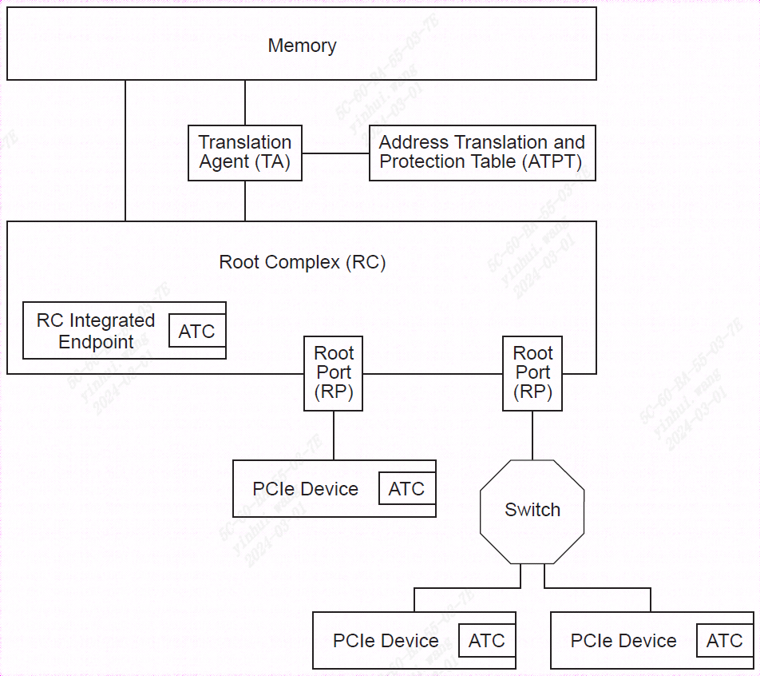
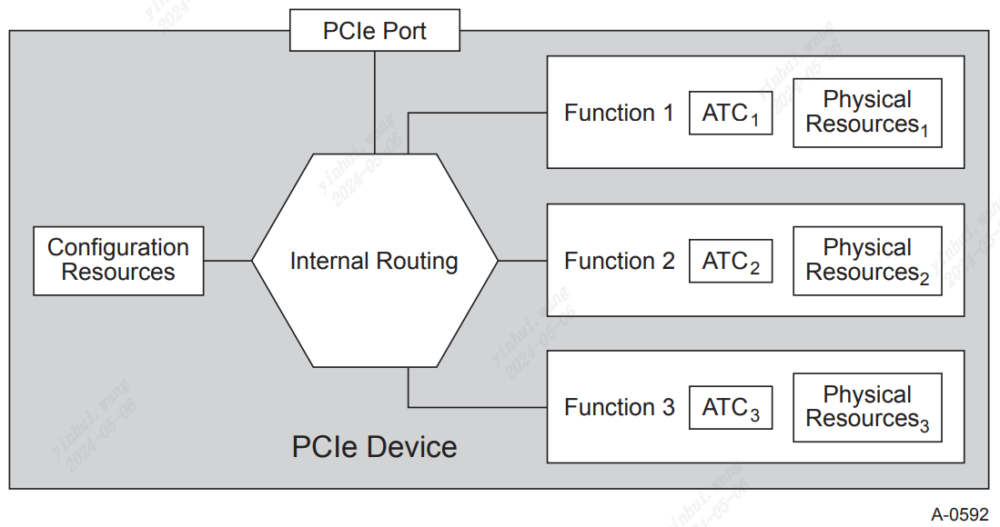
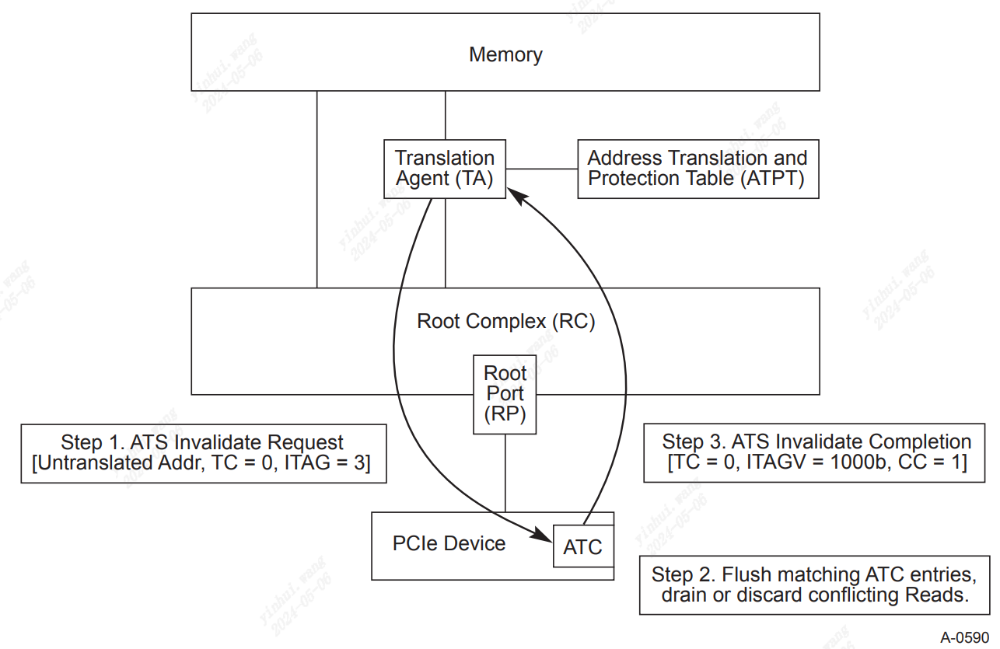
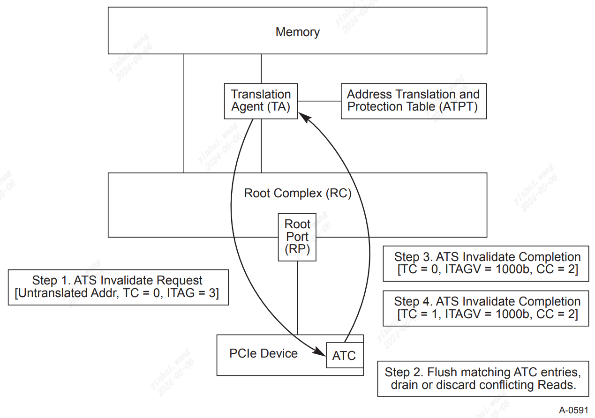
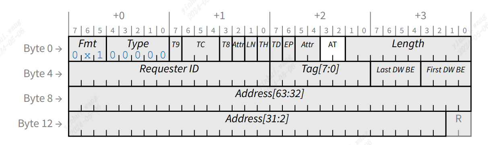
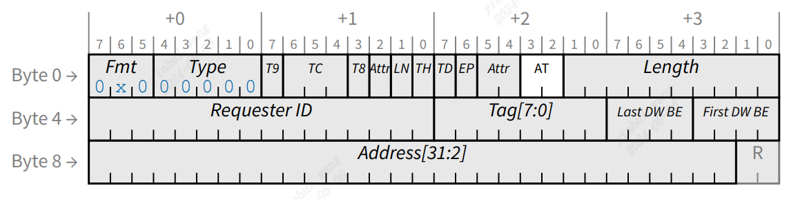
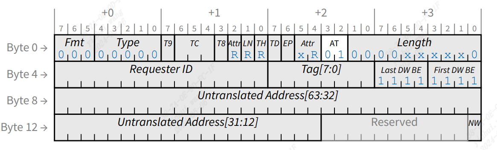
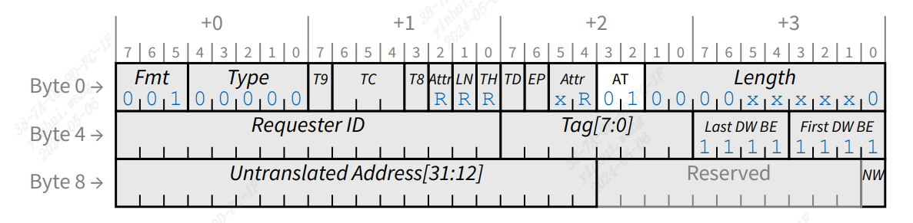

### 10.1 ATS 架构概述

大多数现代系统架构都规定从 DMA（总线主控）I/O 功能转换地址。 在许多实现中，通常的做法是假设 CPU 和 I/O 功能所看到的物理地址空间是等效的。 而在其他实现，情况并非如此。 编程到 I/O 功能中的地址是由根联合体 (RC) 处理的“句柄”。 该处理的结果通常是到中央复合体内的物理存储器地址的转换。 通常，该处理包括访问权限检查以确保允许 DMA 功能访问所引用的存储器位置。

进行 DMA 地址转换的目的各不相同，包括：
-  限制“损坏”或错误编程的 DMA I/O 功能的破坏性
-  提供分散/聚集
-  能够将消息信号中断（例如 MSI 或 MSI-X）重定向到不同的地址范围，而无需与底层 I/O 功能协调
-  地址空间转换（32 位 I/O 功能到更大的系统地址空间）
-  虚拟化支持

无论动机如何，主机系统中 DMA 地址转换的存在都会对 DMA 访问产生一定的性能影响。

根据具体实现，由于解析实际物理地址所需的时间，DMA 访问时间可能会显着延长。 如果实现需要访问驻留在主存储器的转换表，则访问时间可能明显长于未转换访问的时间。 此外，如果每个事务需要多次内存访问（例如，表遍历），则与 DMA 相关的内存事务速率（即开销）可能会很高。

为了减轻这些影响，设计通常在执行地址转换的实体中包含地址转换缓存。 在 CPU 中，地址转换缓存通常称为转换后备缓冲区 (TLB)。 对于 I/O TA，术语“地址转换缓存”或“ATC”用于将其与 CPU 使用的转换缓存区分开来。

虽然 TLB 和 ATC 之间有一些相似之处，但也存在重要的区别。 TLB 满足名义上一次运行一个线程的 CPU 的需求。 然而，ATC 通常处理来自多个 I/O 功能的请求，每个 I/O 功能都可以被视为一个单独的线程。 这种差异使得根据成本模型和跨各种系统配置的预期技术重用来确定 ATC 的规模变得很困难。

本规范中描述的机制允许 I/O 设备参与转换过程并为其自己的内存访问提供 ATC。 设备内配备 ATC 的好处包括：
-  能够通过分配地址转换缓存责任来减轻 TA 资源压力（降低 TA 内“颠簸”的可能性）
-  使ATC 设备能够减少对系统ATC 大小的性能依赖
-  通过向中央复合体发送预转换请求来确保最佳访问延迟的潜力

该规范将提供互操作性，允许 PCIe 设备与 TA 结合使用，但 TA 及其地址转换和保护表 (ATPT) 被视为特定于实现的，超出了本规范的范围。 虽然可以在其他 PCIe 组件中实现 ATS，但该规范仅限于 PCIe 设备和 PCIe 根联合体集成端点 (RCiEP)。

图 10-1 展示了一个带有 TA 和 ATPT 的示例平台，以及一组 PCIe 设备和带有集成 ATC 的 RC 集成端点。 TA 和 ATPT 是特定于实现的，并且可以是给定系统设计中的不同组件或集成组件。

                  图 10.1 带有 TA 和 ATPT 的示例平台

#### 10.1.1 地址转换服务 (ATS) 概述

ATS 章节提供了一组新的 TLP 和相关语义。 ATS 在 Device(EP) 和 Root Complex (RC) 提供翻译服务。 此外，在内存读取和内存写入 TLP 中定义了新的 AT 字段。 新的 AT 字段使 RC 能够确定给定请求是否已通过 ATS 协议进行转换。

图 10-2 说明了 ATS 转换请求操作的基本流程。

                 图 10.2 ATS 转换请求操作的基本流程

在此示例中，单功能 PCIe 设备接收特定于功能的工作请求。 该功能通过特定于实现的方法确定在其 ATC 内缓存翻译将是有益的。 功能或软件在做出此类决定时可以考虑多种因素； 例如：
-  在较长时间内频繁访问的内存地址范围或其关联的缓冲区内容受到显着更新率的影响
-  内存地址范围，例如工作和完成队列结构、低延迟通信的数据缓冲区、图形帧缓冲区、用于缓存功能特定内容的主机内存等

鉴于设计和访问模式的可变性，没有可以应用的单一标准。

该功能生成 ATS 转换请求，该请求通过 PCIe 层次结构向上游发送到 RC，然后 RC 将其转发到 TA。 ATS 转换请求使用与本规范中定义的相同的路由和排序规则。 此外，在任何给定时间，多个 ATS 转换请求都可能未完成； 即，可以在一个或多个 TC 上管道传输多个请求。 每个 TC 代表一个唯一的排序域，并定义关联的 ATS 翻译完成必须使用的域。

收到 ATS 转换请求后，TA 执行以下基本步骤：
- 1. 验证该功能已配置为发出 ATS 转换请求。
- 2.确定该功能是否可以访问ATS转换请求指示的存储器并具有相关的访问权限。
- 3.确定是否可以向该功能提供转换。 如果是，TA 会向该功能发出转换。
     a. ATS 需要支持各种页面大小，以适应一系列 ATPT 和处理器实现。
         i. 页面大小需要是 2 的幂并且自然对齐。
         ii. 支持的最小页面大小为 4096 字节。 需要支持 ATS 的组件才能支持此最小页面大小。
     b. 必须向功能告知其需要支持的最小转换或无效大小，以便为功能提供优化其资源利用率的机会。 最小转换大小必须为 4096 字节。
- 4. TA 将请求的成功或失败传达给 RC，RC 生成 ATS 转换完成并通过 RP 通过响应 TLP 发送给功能。
     a. RC 需要为每个 ATS 翻译请求生成至少一个 ATS 翻译完成； 即，无论请求的成功或失败，至少存在 1:1 的对应关系。
         i. 成功的翻译可能会导致每个请求产生一个或两个 ATS 翻译完成 TLP。 翻译完成度表示所涵盖的翻译范围。
         ii. RC 可以流水线化多个 ATS 翻译完成； 即，RC 可以返回多个 ATS 翻译完成，并且这些 ATS 翻译完成可以是相对于 ATS 翻译请求的任何顺序。
         iii. RC 需要使用与相应 ATS 转换请求相同的 TC（流量类别）来传输 ATS 转换完成。
     b. 请求的地址可能无效。 RC 需要发出翻译完成，表明所请求的地址不可访问。
当函数收到 ATS 翻译完成并更新其 ATC 以反映翻译或注释翻译不存在时。 该功能继续处理其工作请求，并根据完成结果使用已翻译地址或未翻译地址生成后续请求。
     a.  与读取完成类似，需要一个函数为每个完成分配资源空间，而不会对 PCIe 链路造成背压。
     b.  需要一个函数来丢弃可能“过时”的翻译完成。 过时的翻译完成可能因多种原因而发生。

可以推测，ATS 转换请求和转换完成处理在概念上与 PCIe 读取请求和读取完成处理类似，并且在许多方面相同。 这样做的目的是降低设计复杂性并简化 ATS 与现有和新的基于 PCIe 的解决方案的集成。 牢记这一点，ATS 需要满足以下条件：
- 支持ATS 的组件必须与符合[PCIe-1.1] 的组件互操作。
- ATS 通过新的功能和相关配置结构启用。 要启用 ATS，软件必须检测此功能并启用该功能以发出 ATS TLP。 如果功能未启用，则要求该功能不发出 ATS 转换请求，并要求发出所有 DMA 读取和写入请求，并将 TLP AT 字段设置为“未翻译”。
- ATS TLP 使用基于地址或请求者ID (RID) 路由进行路由。
- ATS TLP 需要使用本规范中指定的相同订购规则。
- ATS TLP 需要未经修改地流经[PCIe-1.1] 兼容交换机。
- 允许函数混合已翻译和未翻译的请求。
- 要求ATS 事务不依赖于内存请求的地址字段来传递超出PCI-SIG 定义的当前用途的附加信息。
```
实施说明
地址范围重叠
未翻译和翻译的地址范围很可能会重叠，甚至可能完全重叠。 这不是 ATS 的要求，但可能是 TA 的实现约束，以便正确路由内存请求。
```
与前面的示例相反，图 10-3 显示了一个示例多Function设备。 在此示例设备中，存在三个Function。 图10-3中需要注意的要点是：
- 每个ATC 都与一个Function相关联。 每个支持 ATS 的功能必须能够发送和接收每种 ATS 翻译请求或翻译完成类型中的至少一种。
- 每个ATC 均按Function进行配置和访问。 多Function设备不需要在每个Function上实施 ATS。
- 如果ATC 实现在一组Function之间共享资源，则逻辑行为需要与完全独立的ATC 实现保持一致。


              图 10.3 每个功能均带有 ATC 的多功能设备示例
无论设备内Function数量如何，都需要以下内容：
- 要求功能不发出任何设置了AT 字段的TLP，除非TLP 内的地址是通过ATS 转换请求和转换完成协议获得的。
- 每个ATC 只能使用ATS 协议进行填充； 即，ATC 内的每个条目必须通过 ATS 转换完成来填充，以响应针对给定地址发出 ATS 转换请求的功能。
- 除非通过ATS 协议，否则无法修改每个ATC。 即：
    - 主机系统软件无法通过本规范中定义的协议以外的方式修改 ATC，除非使 ATC 中的一个或多个转换无效。 设备或功能重置是由软件执行的用于更改 ATC 内容的操作的示例，但重置仅允许使条目无效而不能修改其内容。
    - 主机系统软件不得使用设备上执行的软件来修改 ATC。

当 TA 确定Function不应再在其 ATC 内维护转换时，TA 会启动 ATS 失效协议。 失效协议由单个失效请求和一个或多个失效完成组成。


             图 10.4 具有单个失效请求和完成的失效协议

如图 10-4 所示，ATS 失效协议本质上分为三个步骤：
1. 系统软件更新TA使用的表中的条目。 表更改后，TA 确定应在 ATC 中使转换无效，并发起无效请求 TLP，该无效请求 TLP 从 RP 发送到示例单Function设备。 无效请求传送未翻译的地址范围、TC 和 RP 唯一标记，该标记用于将无效完成与无效请求相关联。
2. Function接收无效请求并使所有匹配的 ATC 条目无效。 Function不需要在收到无效请求后立即刷新所有待处理的请求。 如果事务在等待发送的队列中，则Function无需从队列中删除请求，即使这些事务使用正在失效的地址。
     a. 要求Function不指示失效已完成，直到引用关联的已转换地址的所有未完成的读取请求或转换请求均已停用或无效。
     b. 需要一个Function来确保在任何先前发布的使用“过时”地址的写入之后，对 RC 的无效完成指示将到达 RC。
3. 当Function确定已转换地址的所有使用均已完成时，它会发出一个或多个 ATS 无效完成。
     a. 为可能引用了无效范围的每个 TC 发出无效完成。 这些完成充当刷新机制，以确保清除层次结构中任何可能包含对已转换地址的引用的正在进行的事务。
         i.  所需的完成数量在每个无效完成中传达。 TA 或 RC 实现可以维护一个计数器，以确保在考虑不再使用翻译之前接收到所有无效完成。
         ii. 如果发送了多个无效完成，则每个 TC 中发送的无效完成在第 10.3.2 节中详述的字段中必须相同。
     b. 无效完成包含来自无效请求的 ITAG，以使 RC 能够将无效请求和完成关联起来。
 
                 图 10.5 具有多个无效完成的单个无效请求

#### 10.1.2 页面请求接口扩展(Page Request Interface Extension)

ATS 改进了基于 DMA 的数据移动行为。 相关的页面请求接口 (PRI) 提供了额外的优势，允许启动 DMA 操作，而不需要固定所有要移入或移出系统内存的数据。 与固定内存相关的开销可能不大，但从可分页池中删除大部分内存对系统性能的负面影响可能很大。

PRI 在功能上独立于 ATS 的其他方面。 也就是说，支持ATS的设备不需要支持PRI，但PRI取决于ATS的能力。

可以构建智能 I/O 设备以充分利用更加动态的内存接口。 从设备的角度来看，固定始终具有最佳的性能特征——它想要访问的所有内存都保证存在。 然而，保证设备可能接触的所有内存的驻留可能会出现问题，并迫使主机上的设备感知水平达到次优水平。 允许设备更独立地操作（当它需要不存在的内存资源时出现页面错误）提供了设备和主机之间的高级耦合。

用于利用页面请求接口的机制是非常特定于设备的。 作为此类接口可以提高整体系统性能的模型示例，让我们检查一下高速 LAN 设备。 这样的设备知道其突发速率，并且只需要具有与它在某个时间片内可以接收的数据一样多的可用于入站数据的物理缓冲区空间。 可以将未固定的虚拟内存页面向量提供给设备，然后设备根据需要请求该向量以维持其突发窗口。 这最大限度地减少了设备所需的内存占用，并简化了与主机的接口，同时不会对性能产生负面影响。

分页能力引出了页表状态标志管理的问题。 典型的 TA 将标志（例如脏和访问指示）与每个未翻译的地址相关联。 如果没有任何关于如何管理映射到Function的页面的额外提示，此类 TA 需要保守地假设，当他们授予Function读取或写入页面的权限时，该Function将使用该权限。 在将这些可写页的转换地址提供给Function之前，需要将其标记为脏页。

对于不支持分页的Function来说，这种保守的写脏权限授予行为通常不是一个重大问题，其中页面被固定，并且很少会支付将干净页面保存到内存的成本。 然而，如果所有可写页面都被视为脏页面，支持页面请求接口的Function可能会付出重大代价，因为此类Function在不固定其可访问内存占用的情况下运行，并且可能会发出推测性页面请求以提高性能。 在此类系统中保存干净页面（而不是仅仅丢弃它们）的成本可能会降低其他有吸引力的分页技术的价值。 在无法写入后备存储（例如 CD-ROM）的情况下，这可能会导致严重的性能问题和风险功能问题。

翻译请求中的禁止写入 (NW) 标志表示函数愿意将其使用限制为仅读取页面，而与本来授予的访问权限无关。

如果设备选择通过发出设置了 NW 标志的转换请求来仅请求读取访问，并且随后确定它需要写入该页面，则该设备必须发出新的转换请求。

在收到带有 NW 标志清除的转换请求后，允许 TA 将相关页标记为脏页。 强烈建议函数不要发出此类请求，除非它们已被授予明确的写入权限。 写入权限的一个示例是主机向功能发出命令以从存储设备加载数据并将该数据写入内存。

#### 10.1.3 进程地址空间 ID (PASID)

某些 TLP 可以选择与进程地址空间 ID (PASID) 关联。 该值使用 PASID TLP 前缀来传送。 PASID TLP 前缀在第 6.20 节中定义。

PASID TLP 前缀允许用于：
- 具有未翻译地址的内存请求（包括未翻译AtomicOp 请求）
- 地址翻译请求
- 页面请求消息
- ATS 无效请求
- PRG 响应消息

未翻译内存请求的 PASID TLP 前缀的使用在第 6.20 节中定义。 本节介绍其余 TLP 的 PASID TLP 前缀。

当请求没有 PASID TLP 前缀时，未翻译地址表示与请求者 ID 关联的地址空间。

当请求具有 PASID TLP 前缀时，未翻译地址表示与请求者 ID 和 PASID 值关联的地址空间。

当响应具有 PASID TLP 前缀时，PASID 值反映与相应请求关联的地址空间。

每个Function都有一组独立的 PASID 值。 PASID 字段为 20 位宽，但有效宽度受根复合体 (TA) 支持的宽度和Function (ATC) 支持的宽度中较小者的限制。 PASID 值中未使用的高位必须为 0b。

对于存在虚拟中介 (VI) 的系统中的EP，具有关联 PASID 的未转换地址通常用于表示访客虚拟地址 (GVA)，与 PASID 不关联的未转换地址表示访客物理地址 (GPA)。 TA可以被设计成VI管理用于执行从GPA到翻译地址的转换的表，而各个客户操作系统管理用于执行从GVA到GPA的转换的表。 当转换具有关联 PASID 的地址时，TA 执行两种转换并返回结果转换地址（即，GVA 到 GPA，然后 GPA 到转换地址）。 ATC 不可见中间 GPA 值。

当 ATC 使缓存的 GPA 映射无效时，它会使 GPA 映射无效，并且还会使 ATC 中的所有 GVA 映射无效。 当GPA失效完成后，VI可以安全地从客户操作系统中删除支持GPA内存范围的页面。 VI不需要知道哪些GVA映射涉及GPA映射。

### 10.2 ATS 翻译服务

TA 负责翻译。 ATC 可以缓存这些翻译。 如果 ATC 通过 PCIe 与 TA 分开，则来自 ATC 的内存请求将需要能够指示事务中的地址是否已转换。 本节描述了对内存事务的修改，以及用于在远程 ATC 和中央 TA 之间传递翻译的事务。

#### 10.2.1 具有地址类型的内存请求

具有 ATC 的Function可以发送包含已翻译或未翻译地址的内存读/写请求。 如图10-6和图10-7所示，地址类型（AT）字段用于指示请求头中存在的地址类型。


                   图 10.6 具有 64 位地址的内存请求标头

                   图 10.7 具有32位地址的内存请求标头
请求中的AT字段是本规范早期版本中保留字段的重新定义。 不实现 ATC 的Function将继续将 AT 字段设置为其定义的保留值 (00b)。 实现 ATC 的函数将设置 AT 字段，如表 10-1 中所列。
                表 10-1 地址类型(AT) 字段编码

| AT[1:0] 编码 | 助记符  | 含义                                                                                                                           |
| ---------- | ---- | ---------------------------------------------------------------------------------------------------------------------------- |
| 00b        | 未翻译  | TA 可以将地址视为虚拟地址或物理地址。                                                                                                         |
| 01b        | 翻译请求 | TA 将返回请求的地址字段中包含的地址的转换作为读取完成。 该值仅对显式翻译请求有意义（参见第 10.2.2 节）。 如果 TA 在除内存读取之外的内存请求中收到 AT 字段设置为 01b 的 TLP，则 TA 将发出不支持的请求 (UR) 信号。 |
| 10b        | 已翻译  | 事务中的地址已由 ATC 翻译。 如果允许与 SourceID 关联的Function向系统内存提供物理地址，则 TA 可能不会转换该地址。 如果Function不允许呈现物理地址，则 TA 可以将其视为 UR。                   |
| 11b        | 保留   | 如果 TA 收到 AT 字段设置为 11b 的内存请求 TLP，则会发出不支持请求 (UR) 信号。                                                                           |
|            |      |                                                                                                                              |
AT 字段仅为内存请求定义。 该字段保留供其他 TLP 使用。

#### 10.2.2 翻译请求

翻译请求的格式与内存读取的格式类似。 AT 字段用于区分翻译请求和正常的内存读取。

翻译请求的请求标头的格式如图 10-8 和图 10-9 所示。

					图 10.8 64 bit 翻译请求标头

					图 10.8 64 bit 翻译请求标头

翻译请求与读取请求具有相同的完成超时间隔。

##### 10.2.2.1 属性字段(Attribute Field)

对于翻译请求，宽松排序 (RO) 位适用并允许设置，它会影响其关联翻译完成的排序。 Attr 字段的其余部分被保留。 翻译请求的请求者不得依赖 TA 来保证翻译完成与任何其他请求或完成之间的任何特定排序关系。 翻译请求没有排序要求。 TA可以根据任何其他请求重新排序翻译请求。
```
实施说明
翻译请求排序
由于翻译请求和其他类型的请求之间无法假定任何顺序，因此翻译
请求不会产生有效的刷新/排序原语。
```

##### 10.2.2.2 长度字段(Length Field)

长度字段被设置为指示响应该请求可以返回多少翻译。 每个翻译的长度为 8 个字节，代表一个或多个 STU（最小翻译单元）。 长度字段的最大设置是 RCB。 转换请求中的长度字段必须始终指示偶数个 DWORD。 如果长度设置为指示大于允许的值，或者如果长度字段的最低有效位非零，则 TA 会将请求视为格式错误的数据包。

如果长度字段的值大于 2，则该功能正在请求对大于单个 STU 的内存范围进行转换。 附加翻译（如果提供）假定用于从请求的地址开始的顺序增加、大小相等、STU 对齐的区域。

##### 10.2.2.3 标签字段(Tag Field)

标签字段的含义与存储器读取请求中的含义相同。

##### 10.2.2.4 未翻译地址字段(Untranslated Address Field)

转换请求包括 32 位或 64 位未转换地址字段。 该字段表示要转换的地址。 TA 将根据翻译请求中的地址来决定请求的有效性。 TA可以返回少于要求的翻译，但不会返回更多。

当请求多个翻译时，如果翻译的范围不与翻译请求的隐含范围重叠（这仅适用于初始值之后的翻译），TA 将不会返回翻译。 转换请求的隐含范围是$[2^{STU+12} * (长度/2)]$字节。

转换请求中的未转换地址字段是第一个STU范围内的任何地址。 地址位 11:0 不存在于转换请求中，并且隐含为零。 如果请求方具有页对齐请求集（请参阅第 7.8.8.2 节），则它必须确保位 11:2 为零。 如果请求方具有页面对齐请求清除，则允许为位 11:2 提供任何值。 TA 必须忽略位 11:2 以及确定转换不需要的任何低位。

例如，如果对具有页面对齐请求位集的功能使用 64 位寻址，该功能使用 STU 1（即 8192 字节页面）进行编程，则位 63:13 有效，位 12 被 TA 忽略 位 11:0 隐含为零。

##### 10.2.2.5 No Write(NW) Flag

当设置“禁止写入”标志时，表明该Function正在请求对此转换的只读访问。

TA 可以忽略无写标志，但是，如果 TA 使用标记为只读的转换进行响应，则功能不得使用该转换发出内存写事务。 在这种情况下，该Function可以发出具有“无写”标志清除的另一个转换请求，这可以导致在有或没有W（写）位设置的情况下新的转换完成。

在收到带有 NW 标志清除的转换请求后，允许 TA 将相关页标记为脏页。 强烈建议Function不要发出此类请求，除非它们已被授予明确的写入权限。

##### 10.2.2.6  翻译请求上的 PASID TLP 前缀

如果转换请求具有 PASID TLP 前缀，则未转换地址字段是 PASID 字段指示的进程地址空间内的地址。

如果转换请求具有带有特权模式请求或执行请求位集的 PASID TLP 前缀，则这些可以用于构造转换完成数据条目。

PASID 扩展功能指示功能是否支持并能够发送和接收带有 PASID TLP 前缀的 TLP。

#### 10.2.3 翻译完成


### 10.3 ATS 失效

ATS 使用本节中显示的消息来维护 TA 和 ATC 之间的一致性。 本规范假设每个 ATC 都有一个关联的 TA。 TA（连同其相关软件）必须通过发出无效请求来确保 ATC 中缓存的地址转换不会过时。


### 10.4 页请求服务


### 10.5 ATS 配置

#### 10.5.1 ATS 扩展Capability

每个支持 ATS（能够生成翻译请求）的功能必须在其扩展配置空间中具有 ATS 扩展功能结构。 它允许由端点或根联合体集成端点来实现。

图 10-19 详细说明了 ATS 扩展功能结构中寄存器字段的分配。


