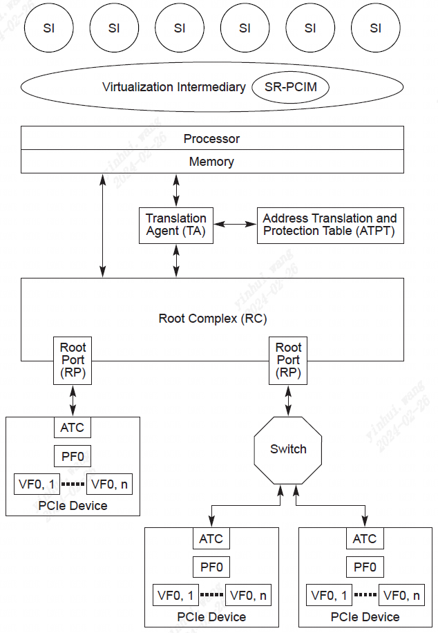
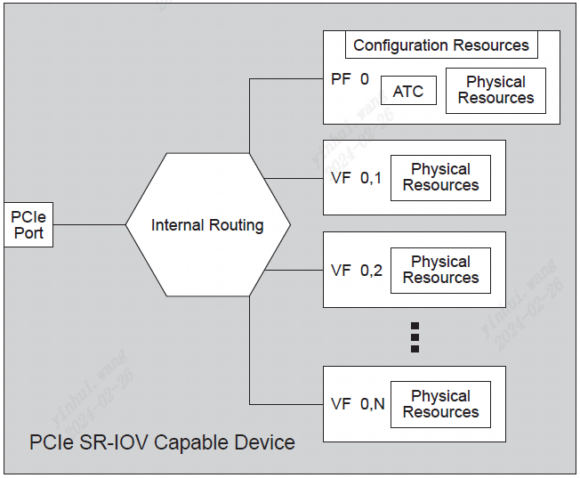
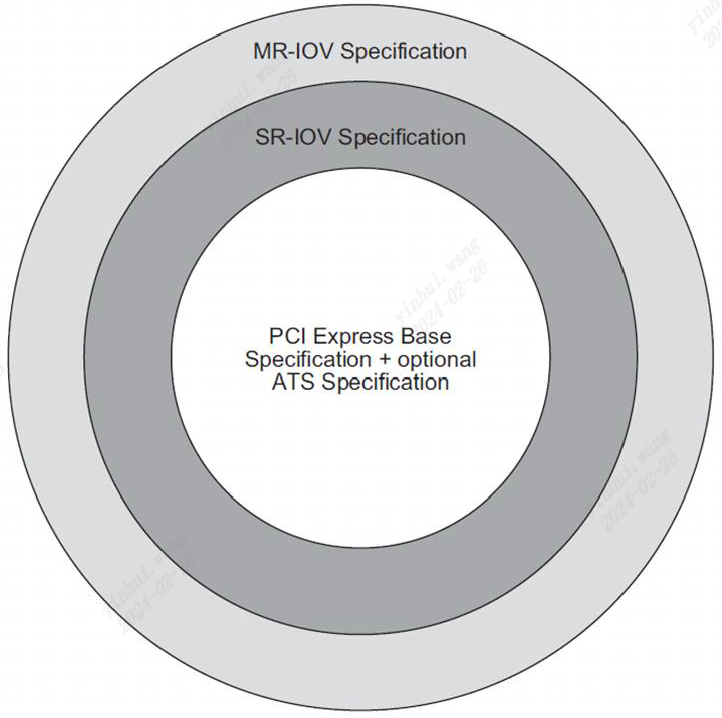
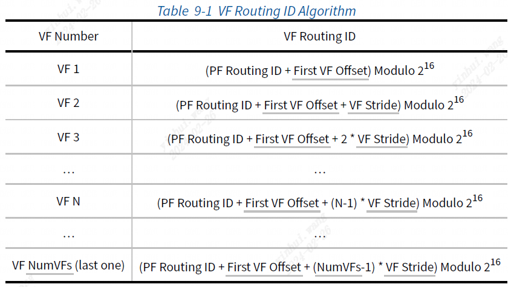

### 9.1 SR-IOV 架构概述

在行业内，人们付出了巨大的努力来通过使用虚拟化技术来提高硬件资源的有效利用率（即应用程序执行）。 单根 I/O 虚拟化和共享 (SR-IOV) 使多个系统映像 (SI) 能够共享 PCI 硬件资源。

为了说明如何使用该技术来提高有效资源利用率，请考虑图 9-1 中所示的通用平台配置。

                        图 9.1 通用平台配置
                        
通用平台配置由以下组件组成：
-  PCIe 根联合体 (RC)，包括：
	◦ 处理器 - 通用、嵌入式或专用处理元件
     ◦ 内存 - 通用或嵌入式
     ◦ 根联合体集成端点 (RCiEP)
     ◦ PCIe 根端口 (RP) - 每个 RP 代表一个单独的层次结构。 每个层次结构都称为单根层次结构，以将其与 [MR-IOV] 中定义的多层次结构技术区分开来。
-  PCIe 交换机 - 提供 I/O 扇出和连接
     ◦ PCIe 设备 - 多种 I/O 设备类型（例如网络、存储等）
     ◦ 系统映像 - 软件，例如用于执行应用程序或可信服务的操作系统（例如，共享或非共享 I/O 设备驱动程序）。

为了提高硬件资源的有效利用率而不需要修改硬件，可以执行多个SI。 称为虚拟化中介 (VI) 的软件插入在硬件和 SI 之间，如下所示如图9-2所示。

                    图 9.2 带有一个VI和多个SI的通用平台配置
                    
VI 拥有底层硬件的唯一所有权。 VI 使用本规范范围之外的各种方法，对硬件进行抽象，为每个 SI 提供自己的虚拟系统。 每个 SI 可用的实际硬件资源可能会根据工作负载或客户特定策略而有所不同。 虽然这种方法适用于许多环境，但 I/O 密集型工作负载可能会导致性能显着下降。 每个入站或出站 I/O 操作都必须由 VI 拦截和处理，从而增加大量平台资源开销。

SR-IOV 提供了减少这些平台资源开销的工具。 SR-IOV 的优点是：
-  能够消除 VI 参与主要数据移动操作 - DMA、内存空间访问、中断处理等。消除每个 I/O 操作的 VI 拦截和处理可以显着提高应用程序和平台性能。
-  通过单根PCI 管理器(SR-PCIM) 控制SR-IOV 资源配置和管理的标准化方法。
     ◦ 由于存在多种实现选项 - 系统固件、VI、操作系统、I/O 驱动程序等。 -SR-PCIM 实现超出了本规范的范围。
-  通过在设备内配置大量 I/O 功能，能够降低硬件要求和相关成本。
-  能够将SR-IOV 与其他I/O 虚拟化技术（例如地址转换服务(ATS)、地址转换和保护表(ATPT) 技术以及中断重映射技术）集成，以创建强大、完整的I/O 虚拟化解决方案。

图 9-3 展示了支持 SR-IOV 的平台示例。

             图 9.3 带有SR-IOV和IOV使能的通用平台配置
             
SR-IOV 通用平台配置由以下附加功能元素组成：
-  SR-PCIM - 负责配置SR-IOV 扩展功能、管理物理功能和虚拟功能、处理相关错误事件和整体设备控制（例如电源管理和热插拔服务）的软件。
-  可选转换代理(TA) - TA 是硬件或硬件和软件的组合，负责将PCIe 事务中的地址转换为关联的平台物理地址。 TA 可以包含地址转换高速缓存（ATC）以加速转换表访问。 TA 还可以支持地址转换服务 (ATS)，该服务使 PCIe 功能能够在对关联存储器进行 DMA 访问之前获得地址转换。 有关 ATS 优点和操作的更多详细信息，请参阅第 10 章。
-  可选地址转换和保护表(ATPT) - ATPT 包含由TA 访问的一组地址转换，用于处理PCIe 请求——DMA 读取、DMA 写入或中断请求。 有关更多详细信息，请参阅地址转换服务（第 10 章）。
	◦ 在 PCIe 中，中断被视为内存写入操作。 通过请求者标识符和 PCIe 事务中包含的地址的组合，可以将中断路由到对相关 I/O 功能透明的任何目标（例如，处理器内核）。
     ◦ DMA 读取和写入请求通过路由 ID 和 PCIe 事务中包含的地址的组合进行转换。
-  可选地址转换缓存(ATC) - ATC 可以存在于平台内的两个位置 - TA 内（可以集成在RC 内或位于RC 上方） - 或PCIe 设备内。 在 RC 内，ATC 可以加速翻译查找。 在设备内，ATC 通过 ATS 技术填充。 表明包含已转换地址的 PCIe 事务可能会绕过平台的 ATC，以提高性能，而不会影响与 ATPT 技术相关的优势。 有关更多详细信息，请参阅地址转换服务（第 10 章）。
-  可选访问控制服务(ACS) - ACS 定义了PCI Express 拓扑内的一组控制点，以确定TLP 是否应正常路由、阻止或重定向。 在支持 SR-IOV 的系统中，ACS 可用于防止分配给 VI 或不同 SI 的设备功能相互通信或与对等设备通信。 重定向可以允许转换代理在做出对等转发决策之前转换上游存储器TLP地址。 可选的 ACS P2P 出口控制可以提供选择性阻止。 ACS 会与 ATS 相互作用。 有关更多详细信息，请参阅第 9.3.7.6 节。
-  物理功能(PF) - PF 是一种PCIe 功能，支持SR IOV 扩展功能，并且可由SR-PCIM、VI 或SI 访问。
-  虚拟功能(VF) - VF 是一种可由SI 直接访问的“轻量级”PCIe 功能。
     ◦ 至少，与功能的主要数据移动相关的资源可供 SI 使用。 配置资源应仅限于受信任的软件组件，例如 VI 或 SR-PCIM。
     ◦ VF 可以由不同 SI 连续共享（即，VF 可以分配给一个 SI，然后重置并分配给另一个 SI。）
     ◦ 可以选择将 VF 从一个 PF 迁移到另一个 PF。 迁移过程本身超出了本规范的范围，但可以通过本规范中定义的配置控制来实现。
-  与 PF 关联的所有 VF 必须与 PF 具有相同的设备类型（例如，相同的网络设备类型或相同的存储设备类型）。

要将 PCIe 设备与支持 PCIe SR-IOV 的设备进行比较和对比，请检查以下一组图。 图 9-4 显示了 PCIe 兼容设备示例。

                 图 9.3 多Function 设备的示例

该图展示了具有以下特征的多功能 PCIe 设备示例：
-  PCIe 设备共享公共PCIe 链路。 所有功能共享的链路和 PCIe 功能通过Function 0 进行管理。
     ◦ 虽然该图仅说明了三个功能，但通过使用替代路由标识符 (ARI) 功能，PCIe 设备最多可以支持 256 个功能。
     ◦ 所有功能均使用通过 PCI 枚举过程捕获的单个总线编号。
-  在此示例中，每个PCIe 功能都支持ATS 功能，因此具有关联的ATC 来管理ATS 获得的转换地址。
-  每个PCIe 功能都有一组独特的物理资源，包括单独的配置空间和BAR。
-  每个PCIe 功能都可以分配给一个SI。 为了防止一个 SI 影响另一个 SI，所有 PCIe 配置操作都应由 VI 拦截和处理。

如图所示，硬件资源随着所配置功能的数量而扩展。 根据设备的复杂性和尺寸，每个功能的增量成本会有所不同。 为了减少增加的硬件成本，可以使用SR-IOV构建一个设备来支持单个PF和多个VF，如图9-5所示。

                     图 9.5 SR-IOV 单PF 设备示例
图 9-5 中的示例说明了具有 N 个 VF 的单个 PF。 需要注意的主要观察结果：
-  PF 符合PCIe 标准。
     ◦ 在常规复位和初始化之后，支持本规范中定义的 SR-IOV 功能的 PCIe Function应禁用 SR-IOV 功能。
     ◦ 要发现 PF 及其关联的 VF 支持的页面大小，请读取“支持的页面大小”配置字段。 有关如何使用此字段在系统页边界上对齐 PF 或 VF 内存空间孔径的更多信息，请参阅第 9.2.1.1.1 节。
-  PF 命名法 **PF M**表示功能编号 M 处的 PF。
-  VF 命名法**VF M,N** 表示与PF M 关联的第N 个VF。VF 编号从1 开始，因此与PF M 关联的第一个VF 是VF M,1。
-  每个VF 与PF 共享许多公共配置空间字段； （即，这些字段适用于所有 VF 并通过单个 PF 进行控制。共享减少了实现每个 VF 的硬件资源要求。）
     ◦ VF 使用与 PF 相同的配置机制和标头类型。
     ◦ 与给定 PF 关联的所有 VF 共享一个 VF BAR 集（请参阅第 9.3.3.14 节），并共享 SR-IOV 扩展功能中的一个控制访问的 VF 内存空间启用 (MSE) 位（请参阅第 9.3.3.3.4 节） 到VF内存空间。 也就是说，如果 VF MSE 位清零，则禁用为所有 VF 分配的内存映射空间。
     ◦ InitialVFs 和 TotalVFs 字段（请参阅第 9.3.3.5 节和第 9.3.3.6 节）用于发现可与 PF 关联的 VF 的最大数量。
     ◦ 如果设备不支持 VF 迁移，则 TotalVFs 和 InitialVFs 应包含相同的值。 如果Device支持VF迁移，则在读取TotalVFs时，PF必须返回可以分配给PF的VF数量。 对于这样的Device，当读取InitialVFs时，PF必须返回分配给PF的初始VF数量。
 -  每个功能、PF 和VF 都分配有唯一的路由ID。 每个 PF 的路由 ID 是根据第 2.2.4.2 节构建的。 每个 VF 的路由 ID 是使用其关联 PF 的路由 ID 以及该 PF 的 SR-IOV 扩展功能中的字段来确定的。
-  假设所有PCIe 和SR-IOV 配置访问均通过可信软件组件（例如VI 或SR-PCIM）进行。
-  每个VF 包含交付特定功能服务所需的一组非共享物理资源（例如，工作队列、数据缓冲区等资源）。这些资源可以由SI 直接访问，无需VI 或SR- PCIM 干预。
-  可以将一个或多个VF 分配给每个SI。 分配策略超出了本规范的范围。
-  虽然此示例说明了 PF 内的单个 ATC，但任何 ATC 的存在都是可选的。 此外，本规范并不排除实现支持设备内每个 VF 的 ATC。
-  内部路由是特定于实现的。
-  尽管PF 操作存在许多潜在的使用模型，但常见的使用模型是使用PF 来引导严格受VI 控制的设备或平台。 一旦配置了 SR-IOV 扩展功能，允许将 VF 分配给各个 SI，PF 就会承担更多的监督角色。 例如，PF 可用于管理设备特定功能，例如对每个 VF 的内部资源分配、对共享资源（例如 PCIe 链路或功能特定链路（例如网络或存储链路）等）的 VF 仲裁等 这些策略、管理和资源分配操作超出了本规范的范围。

另一个使用模型示例如图 9-6 所示。 在此示例中，设备支持多个 PF，每个 PF 都有自己的一组 VF。

                    图 9.6 SR-IOV 多PF能力设备示例
需要注意的主要观察结果：
-  每个PF 可以分配零个或多个VF。 对于设备内的所有 PF，每个 PF 的 VF 数量不需要相同。
-  ARI 扩展功能允许将功能分配给功能组，并定义如何配置功能组仲裁。 PF 和 VF 可以分配给功能组并利用相关的仲裁功能。 不过，在每个功能组内，仲裁仍然是特定于实现的。
-  PF 和VF 之间的内部路由是特定于实现的。
-  对于某些使用模型，所有PF 可能是相同的设备类型； （例如，所有 PF 都提供相同的网络设备或全部提供相同的存储设备功能。）对于其他使用模型，每个 PF 可能代表不同的设备类型； （例如，在图 9-6 中，一个 PF 可能代表网络设备，而另一个 PF 代表加密设备。）
     ◦ 在设备类型之间存在使用模型依赖性的情况下，例如对于作为网络设备类型的每个 VF，每个 SI 还需要一个作为加密设备类型的 VF。 SR-IOV 扩展功能提供了一种指示这些依赖性的方法。 用于构建这些依赖关系以及将 VF 依赖集分配给给定 SI 的策略超出了本规范的范围。

如前面的示例所示，PF 和 VF 的数量可能会根据使用模型要求而变化。 为了支持广泛的选项，SR-IOV 设备可以支持以下数量和组合的 PF 和 VF：
-  使用替代路由标识符(ARI) 功能，设备最多可支持256 个PF。 功能编号分配是特定于实现的，并且在整个 256 功能编号空间中可能是稀疏的。
-  PF 只能与设备捕获的总线编号相关联，如图 9-7 所示。
-  SR-IOV 设备可能会消耗多个总线号。 VF 可以与设备总线编号范围内的任何总线编号关联 - 捕获的总线编号加上软件配置的任何其他总线编号。 详细信息请参见第 9.2.1.2 节。
     ◦ 使用多个总线编号使设备能够支持大量 VF - 最大数量为路由 ID 空间的大小减去用于识别中间总线的位。
     ◦ 如果软件未配置足够的附加总线编号，则为附加总线编号实现的 VF 可能不可见。
 
              图 9.7 具有多个总线号的 SR-IOV 设备示例

```
实施说明
功能共置
ARI 扩展功能使设备能够支持多达 256 个Function-与捕获的总线编号相关的任意组合的Function、PF 或 VF。 如果使用模型不需要超过 256 个功能，则强烈鼓励实现将所有Function、PF 和 VF 放在捕获的总线编号内，并且不需要额外的总线编号来访问 VF。
```

在最后一个示例（图 9-8）中，设备实现可以混合任意数量的Function、PF 和 VF。

                图 9.8 具有混合功能类型的 SR-IOV 设备示例
需要注意的主要观察结果：
 - 每个设备必须包含功能 0。功能 0 可以是 PF（即，它可以包括 SR-IOV 扩展功能）。
-  任何功能组合都可以与捕获的总线编号相关联。
     ◦ 非 VF 只能与捕获的总线编号关联。
-  如果支持ARI 扩展功能，则可以将功能分配给功能组。 分配策略超出了本规范的范围。 如果不支持 ARI 扩展功能，功能仍然可以使用第 6.3.3.4 节中定义的功能仲裁功能。
#### 9.1.1 PCI 技术互操作性

建立明确的互操作性要求对于任何技术的成功都至关重要。 为此，组织了 PCI-SIG I/O 虚拟化规范，以最大限度地提高合规实施的互操作性潜力。 从概念上讲，这被视为一组同心圆，定义了如何分层功能以构建支持 IOV 的组件，如图 9-9 所示。

                      图 9.9 I/O 虚拟化互操作性
需要注意的主要观察结果：
• I/O 虚拟化扩展的核心是建立在该规范之上的。 所有 IOV 实施必须符合 [PCIe-1.1] 或更高版本。 在适用的情况下，IOV 规范会注明这些版本之间的相关差异。
     ◦ IOV 规范均不涉及物理层。
     ◦ SR-IOV 不涉及本规范中指定的数据链路或事务层。
     ◦ [MR-IOV] 不触及本规范中指定的事务层。
     ◦ 所有 I/O 虚拟化功能均通过 PCI Express 扩展配置空间中实施的新 PCI Express 功能进行通信。
     ◦ I/O 虚拟化规范对 PCI 或 PCI-X 规范没有影响。
     ◦ 层次结构可以由 PCI Express 和 PCI Express 至 PCI/PCI-X 桥的混合组成。
▪ PCI Express 至 PCI/PCI-X 桥接器和 PCI/PCI-X 设备可由多个 SI 串行共享。
• ATS 定义了适用于任何功能的可选功能。 SR-IOV 组件可支持 ATS。
• 要实现SR-IOV 设备，SR-IOV 要求设备完全兼容[PCIe]。
     ◦ 层次结构可以由 SR-IOV 和非 SR-IOV 组件的混合组成。 例如，层次结构可以包含 SR-IOV 和非 SR-IOV 端点设备的任意组合。

### 9.2 SR-IOV 初始化和资源分配

#### 9.2.1 SR-IOV 资源发现

以下各节介绍软件如何确定设备具有 SR-IOV 功能，并随后通过虚拟功能配置空间识别 VF 资源。

##### 9.2.1.1 配置 SR-IOV 能力

本节介绍在启用 PF 的 IOV 功能之前必须配置的字段。 通过在 SR-IOV 扩展功能中设置 PF 的 VF 启用位（请参见第 9.3.3.3.1 节）来启用 VF。

NumVFs 字段（请参见第 9.3.3.7 节）定义在关联 PF 中设置 VF 启用时启用的 VF 数量。

###### 9.2.1.1.1 配置 VF BAR 机制

本节介绍如何配置 VF BAR 来映射内存空间。 **VF不支持 I/O 空间**，因此 VF BAR 不得指示 I/O 空间。

系统页面大小(System Page Size)字段（请参见第 9.3.3.13 节）定义当启用 PF 的 IOV 功能时系统将用于映射 VF 的 PCIe 内存地址的页面大小。 PF 使用系统页面大小字段将每个 VF BAR 定义的内存空间孔径与系统页面边界对齐。 为系统页面大小选择的值必须是 SR-IOV 扩展功能中支持的页面大小之一（请参阅第 9.3.3.12 节）。

VF BAR 的行为与普通 PCI 内存空间 BAR 相同（参见第 7.5.1.2.1 节），不同之处在于 VF BAR 描述每个 VF 的孔径，而 PCI BAR 描述单个功能的孔径。 如果实现了 VF 可调整大小的 BAR 扩展功能（请参阅第 9.3.7.5 节），则 VF BAR 中某些位的属性将受到影响。
-  第 7.5.1.2.1 节中描述的用于确定Function BAR 内存孔径的行为适用于每个 VF BAR。 也就是说，每个VF BAR所需的存储器孔径的大小可以通过写入全“1”然后读取VF BAR来确定。 读回的结果必须按照第 7.5.1.2.1 节中的描述进行解释。
-  分配与第一个VF 相关的每个BAR 的起始存储空间地址的行为也如第7.5.1.2.1 节中所述。 也就是说，写入每个VF BAR的地址被Device用作第一个VF的起始地址。
-  VF BAR 与第 7.5.1.2.1 节中描述的 BAR 之间的区别在于，对于每个 VF BAR，与第二个及更高 VF 关联的内存空间源自第一个 VF 和 5.0-1.0-PUB 的起始地址。 —PCI Express® 基本规范修订版 5.0 版本 1.0 内存空间孔径。 对于任何给定的 $VF_v$，其任何已实现的 $BAR_b$) 的内存空间孔径的起始地址根据以下公式计算：

	$BAR_b$  $VF_v$起始地址 = VF $BAR_b$ + (v - 1) x (VF $BAR_b$孔径大小)
	其中，VF $BAR_b$ 孔径大小是由第 9.3.3.14 节中所述的常用 BAR 探测算法确定的 VF $BAR_b$ 大小。

在设置 VF 启用和 VF MSE 之前，不会启用 VF 存储空间（请参见第 9.3.3.3.1 节和第 9.3.3.3.4 节）。 请注意，更改系统页面大小（请参阅第 9.3.3.13 节）可能会影响 VF BAR 孔径大小。

图 9-10 显示了 PF 和 VF 内存空间孔径的示例。

          图 9.10 单个 BAR 设备的 BAR 空间示例

##### 9.2.1.2 VF 发现

SR-IOV 扩展功能中的 First VF Offset 和 VF Stride 字段是 16 位路由 ID 偏移。 这些偏移量用于计算 VF 的路由 ID，但具有以下限制：
 - PF 中的NumVFs 值（第9.3.3.7 节）可能会影响该PF 的 First VF Offset（第9.3.3.9 节）和VF Stride（第9.3.3.10 节）中的值。
-  设备的最低编号PF（例如PF0）中的ARI Capable Hierarchy（第9.3.3.3.5 节）中的值可能会影响设备的所有PF 中的First VF Offset 和VF Stride 中的值。
-  PF 的NumVF 仅当该PF 的VF Enable（第9.3.3.3.1 节）清除时才能更改。
-  仅当设备的所有 PF 中的 VF Enable 均已清除时，才能更改 ARI 功能层次结构（第 9.3.3.3.5 节）。

```
实施说明
NumVF 和 ARI 功能层次结构
在适用的情况下配置 NumVF 和 ARI 能力层次结构后，软件可以读取First VF Offset和 VF Stride，以确定 PF 的 VF 将消耗多少总线编号。 附加总线编号（如果有）在设置 VF Enable之前不会实际使用。
```

表 9-1 描述了用于确定与每个 VF 关联的路由 ID 的算法。


此路由 ID 计算中使用的所有算术都是 16 位无符号，丢弃所有进位。

所有VF和PF必须具有不同的路由ID。 考虑到设备所有 PF 中 NumVF 的任何有效设置，任何 PF 或 VF 的路由 ID 不得与任何其他 PF 或 VF 的路由 ID 重叠。

VF 步幅和第一个 VF 偏移是常量。 除本节前面所述外，它们的值可能不受此功能或设备其他功能中的设置的影响。

VF 可能驻留在与关联 PF 不同的总线编号上。 例如，如果“First VF Offset”的值为 0100h，则可能会发生这种情况。 VF 不得位于数值小于其关联 PF 的总线编号上。 与其关联的 PF 位于同一总线编号上的 VF 不得位于数值小于 PF 的设备编号上（紧邻下游端口下方的 SR-IOV 设备的设备编号始终为 0，因此始终满足 这个条件。）。

SR-IOV RCiEP 设备的 VF 与与其 PF 相同的根联合体事件收集器（如果有）关联。 此类 VF 不会在根复合体事件收集器端点关联扩展功能中报告。

根据第 2.2.6.2 节，与上游端口关联的支持 SR-IOV 的设备从任何类型 0 配置写入请求捕获总线号。 支持 SR-IOV 的设备不会从任何类型 1 配置写入请求中捕获总线编号。 支持 SR-IOV 的 RCiEP 使用特定于实现的机制来分配其总线编号。

总线编号的切换处理与基本 PCIe 相同。 在基本 PCIe 中，交换机将辅助总线编号（含）到从属总线编号（含）范围内的所有配置请求发送到设备。 寻址辅助总线号的类型 1 配置请求将转换为类型 0 配置请求，而寻址辅助总线号（不包括）和从属总线号（包括）之间的总线号的类型 1 配置请求将作为类型 1 配置请求转发到设备。

注意：总线号是一种有限资源。 强烈建议设备避免在总线编号使用中留下“漏洞”，以避免浪费总线编号。

所有 PF 必须位于设备捕获的总线编号上。

```
实施说明
跨越多个总线号码的 VF
作为示例，请考虑支持单个 PF 的 SR-IOV 设备。 最初，仅 PF 0 可见。 软件设置了 ARI 能力的层次结构。 根据 SR-IOV 扩展功能，它确定：InitialVFs 为 600，First VF Offset 为 1，VF Stride 为 1。
• 如果软件将NumVF 设置在[0 … 255] 范围内，则设备使用单个总线编号。
• 如果软件将NumVF 设置在[256 … 511] 范围内，则设备使用两个总线编号。
• 如果软件将NumVF 设置在[512 … 600] 范围内，则设备使用三个总线编号。

PF 0 和 VF 0,1 到 VF 0,255 始终位于第一个（捕获的）总线编号上。 VF 0,256 到 VF 0,511 始终位于第二个总线编号上（捕获的总线编号加 1）。 VF 0,512 到 VF 0,600 始终位于第三个总线编号上（捕获的总线编号加 2）。
```

软件应配置交换机辅助和从属总线编号字段，以将足够的总线编号路由到设备。 如果没有足够的总线编号，软件应通过在启用 SR-IOV 之前不启用 SR-IOV 或减少设备的部分或所有 PF 的 NumVF 来减少设备的总线编号要求。

在某些 PF n 中设置 VF 启用后，设备必须启用 VF n,1 至 VF n,m（含），其中 m 是 InitialVFs 和 NumVFs 中较小的一个。 接收针对位于捕获的总线号上的已启用 VF 的 0 类配置请求的设备必须正常处理该请求。 接收针对不在捕获的总线编号上的已启用 VF 的 1 类配置请求的设备必须正常处理该请求。 接收针对设备捕获的总线编号的类型 1 配置请求的设备必须遵循处理不支持的请求的规则。 此外，如果设置了 VF MSE，则每个启用的 VF 必须响应寻址与该 VF 关联的内存空间的 PCIe 内存事务。

PCI Express 结构中不存在未启用的功能（即 m 以上 VF 的功能）。 根据第 2.3.1 节，寻址不存在的函数将导致返回不支持的请求 (UR)。 这包括附加总线号码上的功能。

```
实施说明
具有 PF 和 Switch功能的多功能设备
SR-IOV 设备可能会占用多个总线号。 第一个总线编号之外的其他总线编号是连续的，并且紧跟在分配给设备的第一个总线编号之后。 如果 SR-IOV 设备还包含 PCI-PCI 桥（具有类型 1 配置空间标头），则在对这些桥的辅助总线编号进行编程时必须考虑 SR-IOV 的使用情况。 软件应首先确定 VF 使用的最后一个总线编号，然后将任何位于同一位置的桥配置为使用高于该值的总线编号。
```

##### 9.2.1.3 Function依赖关系列表

PCI 设备在Function之间可能具有特定于供应商的依赖性。 例如，功能 0 和 1 可能提供不同的机制来控制相同的底层硬件。 在这种情况下，设备编程模型可能要求将这些相关功能作为一组分配给 SI。

Function依赖列表用于描述这些依赖关系（或指示不存在函数依赖关系）。 软件应将 PF 和 VF 分配给 SI，以满足依赖性。

详细信息请参见第 9.3.3.8 节。

##### 9.2.1.4 中断资源分配

如果分配了中断资源，PF 和 VF 支持 MSI、MSI-X 中断或两者。 VF 不应实现 INTx。 中断在第 9.5 节中描述。

#### 9.2.2 SR-IOV 重置机制

本节介绍基于 PCI 定义的重置机制如何影响支持 SR-IOV 的设备。 它还描述了用于重置单个 VF 和单个 PF 及其关联 VF 的机制。

##### 9.2.2.1 SR-IOV 常规复位

根据第 6.6.1 节中的规则，对支持 SR-IOV 的设备进行常规重置应导致所有功能（包括 PF 和 VF）重置为其原始加电状态。 第 9.3 节描述了定义的字段的行为。								

注意：常规复位会清除 PF 中的 VF 启用。 因此，常规复位后 VF 不再存在。

##### 9.2.2.2 针对 VF 的FLR

VF 必须支持功能级别重置 (FLR)。

注意：软件可以使用 FLR 来重置 VF。 VF 的 FLR 会影响 VF 的状态，但不会影响其在 PCI 配置空间或 PCI 总线地址空间中的存在。 PF SR-IOV 扩展功能中的 VF BARn 值（请参阅第 9.3.3.14 节）和 VF MSE（请参阅第 9.3.3.3.4 节）以及 VF 可调整大小的 BAR 功能值（请参阅第 9.3.7.5 节）不受 VF 发布的FLR 的影响。

##### 9.2.2.3 针对 PF 的FLR

PF 必须支持 FLR。

FLR 到 PF 会重置 PF 状态以及 SR-IOV 扩展功能，包括 VF 启用，这意味着 VF 不再存在。

#### 9.2.3 IOV的重新初始化和重新分配

如果 VF 启用在设置后被清除，则与 PF 关联的所有 VF 将不再存在，并且不得再发出 PCIe 事务或响应配置空间或内存空间访问。 VF 启用清除后，VF 不得保留任何状态（包括粘滞位）。

#### 9.2.4 VF 迁移

VF 迁移是 [MR-IOV] 中的可选功能。 不支持 MR-IOV 扩展功能的设备不支持 VF 迁移功能。

在多根系统中，VF 可以在虚拟层次结构之间迁移。

要进行 VF 迁移，必须设置 VF Migration Capable 和 VF Migration Enable。 VF 迁移功能向 SR-PCIM 指示 VF 迁移硬件存在并且多根 PCI 管理器 (MR-PCIM) 已启用其使用。 VF 迁移的硬件支持是可选的。 对 VF 迁移的 SR-PCIM 支持也是可选的。

VF 迁移启用向设备硬件和 MR-PCIM 指示 SR-PCIM 也已启用 VF 迁移。

支持 VF 迁移对 SR PCIM 提出以下要求：
-  需要确定VF 是活动、休眠还是非活动。 活动的 VF 可供单根 (SR) 使用。 休眠的 VF 可以由 SR 配置，但不会发出事务。 SR 无法使用处于非活动状态的 VF。
-  需要参与迁移操作。 Migrate In 操作用于向 SR 提供 VF。 迁移入操作由 MR-PCIM 发起。 SR-PCIM 可以接受迁移操作并将 VF 移至 Active.Available 状态。
-  需要参与迁移出操作。 迁移出操作用于请求正常删除 SR 使用的活动 VF。 SR-PCIM 可以接受迁移并将 VF 移至 Inactive.Unavailable 状态。
-  需要处理撤销中的迁移。 这是当 MR-PCIM 撤回向 SR 提供 VF 且 VF 返回到 Inactive.Unavailable 状态时。

##### 9.2.4.1 初始 VF 状态

本节描述了 VF 迁移状态数组中的初始值（参见第 9.3.3.15.1 节）。

如果 InitialVFs（第 9.3.3.5 节）非零，则 $VF_1$ 到 $VF_InitialVFs$ 处于 Active.Available 状态。 如果 TotalVFs（第 9.3.3.6 节）大于 InitialVFs，则 $VF_{InitialVFs+1}$ 到 $VF_TotalVFs$ 处于 Inactive.Unavailable 状态。 如果 VF 迁移 Enable（第 9.3.3.3.2 节）被清除，则不会使用高于 InitialVF 的 VF。

如果 InitialVFs 为 0，则没有 VF 处于 Active.Available 状态。 如果 TotalVFs 等于 InitialVFs，则所有 VF 均处于 Active.Available 状态。 如果 TotalVFs 为 0，则没有 VF 与该 PF 关联，并且没有 VF 迁移状态数组。

图 9-11 描述了该初始 VF 状态。

                图 9.11 初始 VF 迁移状态数组

##### 9.2.4.2 VF 迁移状态转换

VF迁移遵循如图9-12所示的状态图。 显示的状态值包含在与 VF 关联的 VF State 数组条目中。 实线指示的状态转换由 MR-PCIM 发起。 由点划线指示的状态转换由 SR-PCIM 发起。

	                   图 9.12 VF 迁移状态图

SR-PCIM 通过将新值写入 VF 迁移状态数组来启动状态转换。 当 SR-PCIM 尝试启动表 9-2 之外的任何状态转换时，设备会忽略写入事务，并且不会发生状态转换。


```
实施说明
软件状态迁移变化检测
SR-PCIM 通常需要在写入 VF 迁移状态后重新读取状态更改，以验证状态更改是否生效。
```

软件无法以任何方式使用处于 Inactive.Unavailable 状态的 VF。 针对非活动 VF 的请求会收到不支持的请求 (UR)。 在转换到非活动或休眠状态的 100 毫秒内，设备必须确保不会使用指示的路由 ID 发出新事务。

MR-PCIM 通过使用[MR-IOV]中指定的不同数据结构来启动状态转换。 此类转换的影响在 VF 迁移状态数组和 VF 迁移状态位中可见。 由 MR-PCIM 发起的所有状态转换都会导致 VF 迁移状态位被设置。

每个支持 VF 迁移的 VF 都存在此迁移状态机。 迁移状态机不受函数依赖列表的影响（请参阅第 9.2.1.3 节和第 9.3.3.8 节）。

VF 迁移状态不影响功能状态。 如果作为迁移出和/或迁移入操作的一部分需要重置 VF 状态，SR-PCIM 必须发出 FLR 来完成此操作。 在没有 FLR 的情况下发生 VF 迁移时的 VF 行为未定义。

```
实施说明
FLR 和 VF 迁移
从系统 A 到系统 B 的 VF 迁移通常会涉及在完成 MigrateOut 操作之前系统 A 中的一个 FLR，以及在接受 MigrateIn 操作之后但使用 VF 之前系统 B 中的第二个 FLR。 系统A使用第一个FLR来确保其数据不会泄漏。 系统 B 使用第二个 FLR 来确保它从头开始。
```

### 9.3 配置

#### 9.3.1 SR-IOV 配置 概述

本节提供了实现 PF 和 VF 的 SR-IOV 扩展要求。

与所有功能一样，PF 在配置空间中是可发现的。 PF 包含第 9.3.3 节中描述的 SR-IOV 扩展功能。 PF 用于发现、配置和管理与 PF 关联的 VF 以及本规范中描述的其他内容。

#### 9.3.2 配置空间

支持 SR-IOV 的 PF 应实现以下各节中定义的 SR-IOV 扩展功能。 VF 应实现以下各节中定义的配置空间字段和功能。

#### 9.3.3 SR-IOV 扩展功能

这里定义的SR-IOV扩展能力是必须在每个支持SR-IOV的PF中实现的PCIe扩展能力。 此功能用于描述和控制 PF 的 SR-IOV 功能。

对于多功能设备，每个支持 SR-IOV 的 PF 应提供本节中定义的功能结构。 该功能结构可以存在于具有类型 0 配置空间标头的任何功能中。 此功能不得出现在具有类型 1 配置空间标头的函数中。

图 9-13 显示了 SR-IOV 扩展功能结构。

                       图 9.13  SR-IOV 扩展功能

##### 9.3.3.1 SR-IOV Extended Capability Header(Offset 00h)

表 9-3 定义了 SR-IOV 扩展功能标头。 SR-IOV 扩展功能的功能 ID 为 0010h。

                        图 9.14 SR-IOV 扩展功能标头
    
| Bit 位置 | 寄存器描述 | 属性 |
| ---- | ---- | ---- |
| 15:0 | PCI Express Extended Capability ID - 该字段是 PCI-SIG 定义的 ID 号，指示扩展功能的性质和格式。<br/> SR-IOV 扩展功能的扩展功能 ID 是 0010h。 | RO |
| 19:16 | Capability Version - 该字段是 PCI-SIG 定义的版本号，指示当前功能结构的版本。<br/>对于此版本的规范，必须为 1h。 | RO |
| 31:20 | Next Capability Offset - 该字段包含下一个 PCI Express 功能结构的偏移量，如果功能链接列表中不存在其他项，则为 000h。<br/> 对于配置空间中实现的扩展功能，此偏移量相对于 PCI 兼容配置空间的开头，因此必须始终为 000h（用于终止功能列表）或大于 0FFh。 | RO | 

##### 9.3.3.2 SR-IOV Capabilities Register(04h)

表 9-4 定义了 SR-IOV 功能字段的布局。


| Bit 位置 | 寄存器描述 | 属性 |
| ---- | ---- | ---- |
| 0 | VF Migration Capable - 如果设置，则 PF 具有迁移能力并在支持迁移的 MR-PCIM 下运行。 | RO |
| 1 | ARI Capable Hierachy Preserved<br/> PCI Express 端点：<br/> 如果设置，ARI Capable Hierarchy 位将在某些电源状态转换期间保留。<br/>RCiEP：<br/>不适用 - 强烈建议将该位硬连线至 0b。 | RO |
| 2 | VF 10-Bit Tag Requester Supported - 如果设置，所有 VF 必须支持 10 位标签请求程序功能。 如果清除，VF 不得支持 10 位标签请求器功能。<br/> 如果 PF 设备功能 2 寄存器中的 10 位标签请求者支持位清零，则该位必须清零。 | Hwinit |
| 31:21 | VF Migration Interrupt Message Number - 指示用于迁移中断的 MSI/MSI-X 矢量。<br>如果“VF 迁移功能”为“清除”，则此字段中的值未定义。 | RO |

###### 9.3.3.2.1 VF Migration Capable

设置“VF Migration Capable”表示PF支持VF 迁移。 如果清除，则 PF 不支持 VF 迁移。

VF 迁移支持是 [MR-IOV] 的一项可选功能。 如果 PF 没有实现 VF 迁移的硬件，则该位应实现为 RO 值 0b。 如果 PF 实现了 VF 迁移的硬件，则该位由 [MR-IOV] 中定义的机制控制，并指示存在对 VF 迁移的支持。

仅实现 SR-IOV 的设备应将此字段实现为 RO 值零。

支持 VF 迁移的 PF 必须实现 MSI 或 MSI-X 中断（或两者）。

###### 9.3.3.2.2 ARI Capable Hierarchy Preserved

ARI Capable Hierarchy Preserved 设置为指示 PF 在某些电源状态转换期间保留 ARI Capable Hierarchy 位（请参见第 9.3.3.3.5 节）。 组件必须设置该位或设置 No_Soft_Reset 位（参见第 9.6.2 节）。 建议组件设置该位，即使它们也设置了 No_Soft_Reset。

保留 ARI 功能的层次结构仅存在于设备编号最低的 PF 中（例如 PF0）。 保留的 ARI 能力层次结构在设备的其他 PF 中为只读零。

ARI Capable Hierarchy Preserved 不适用于 RCiEP，并且其值未定义（请参阅第 9.3.3.3 节）。

###### 9.3.3.2.3 VF 10-Bit Tag Requester Supported

如果PF支持10位标签请求者能力，则其关联的VF也被允许支持10位标签请求者能力，但这是可选的。 特别是对于大量流量同时分布在多个 VF 上的使用模型，各个 VF 可能不需要使用 10 位标签，这样它们就可以分别支持超过 256 个未处理的 non-Posted 请求。

对于给定的 PF，要求其所有关联的 VF 支持 10 位标签请求器功能，或者都不支持。 这避免了不必要的实施和管理复杂性。 参见第 9.3.5.9 节。

支持 10 位标签请求器功能的 VF 具有超出其他功能类型的额外要求，以便简化错误处理并减少一个 VF 影响其他流量时出现 10 位标签相关错误的可能性。
-  如果SR-IOV 控制寄存器中的VF 10 位标签请求器启用位被置位，则每个VF 必须对其生成的所有非发布请求使用10 位标签。
-  对于每个未完成的 10 位标签请求，如果 VF 接收到与未完成请求匹配的完成（Tag[9:8] 为 00b 除外），则 VF 必须防止该请求（最终）生成完成超时错误，并改为 通过设备特定的机制处理错误，避免数据损坏。

强烈建议软件不要将意外完成错误配置为不可纠正的错误。 这可以避免它们触发系统错误或硬件错误遏制机制，例如下游端口遏制 (DPC)。

```
实施说明
无 VF 10 位标签完成器支持位
没有 VF 10 位标签完成器支持位。 如果 PF 支持 10 位标签完成器功能，则其所有关联的 VF 都需要支持 10 位标签完成器功能，如第 9.3.5.9 节中所述。 这有助于避免 PCIe 层次结构的复杂性，其中一些完成器支持 10 位标签功能，而另一些则不支持。
```

###### 9.3.3.2.4 VF Migration Interrupt Message Number

VF 迁移中断消息编号必须包含用于与某些 VF 迁移事件关联生成的中断消息的 MSI 或 MSI-X 矢量编号。

对于 MSI，VF 迁移中断消息编号必须指示用于引用本节中描述的某些 SR 事件的 MSI 消息编号 [0 .. 31]。 功能需要更新此字段，以便当软件写入 MSI 的消息控制寄存器中的多消息启用字段时，如果分配给功能的 MSI 消息数量发生变化，则该字段是正确的。

对于 MSI-X，VF 迁移中断消息编号必须指示用于生成中断消息的 MSI-X 表条目 [0 .. 2047]。

如果同时实现 MSI 和 MSI-X，则允许它们使用不同的向量，但软件必须一次只能启用一种机制。 如果 MSI 和 MSI-X 中断均启用，则该字段未定义。

如果“VF 迁移功能”为“清除”，则此字段未定义。

```
实施说明
迁移和 MSI
如果 PF 实现 MSI，并且软件将“多消息启用”设置为小于“支持多消息”的值，则可能会发生某些 MSI 向量共享。 这可能会创建复杂的软件结构，因为可能需要将单个向量定向到 SR-PCIM 和 PF 设备驱动程序。
```

##### 9.3.3.3 SR-IOV Control Register(Offset 08h)

表 9-5 定义了 SR-IOV 控制字段的布局。

                  图 9.16 SR-IOV 控制寄存器

| Bit 位置 | 寄存器描述 | 属性 |
| ---- | ---- | ---- |
| 0 | VF Enable - 启用/禁用 VF。 默认值为 0b。 | RW |
| 1 | VF Migration Enable - 启用/禁用 VF 迁移支持。默认值为0b, 见章节 9.3.3.3.2 | RW/RO （见描述）|
| 2 | VF Migration Interrupt Enable - 启用/禁用 VF 迁移状态更改中断。 默认值为 0b。| RW |
| 3 | VF MSE - 为VF启用内存空间。 默认值为 0b。| RW |
| 4 | ARI Capable Hierarchy - <br/> PCIe EP: <br/> 该位必须在器件编号最低的 PF 中为 RW，并在所有其他 PF 中硬连线为 0b。 如果该位的值为 1b，则允许设备定位捕获的总线编号的功能编号 8 至 255 中的 VF。 否则，设备必须像非 ARI 设备一样定位 VF。<br/> 该位不受任何 PF 或 VF 的 FLR 影响。<br/> 默认值为 0b。<br/> RCiEP: <br/> 不适用 - 该位必须硬连线至 0b。<br/> 在根复合体中，始终允许将 VF 分配给“第一个 VF 偏移”和“VF 步长”规则允许的任何功能编号（请参阅第 9.3.3.9 节和第 9.3.3.10 节）。| RW/RO (见描述) |
| 5 | VF 10-Bit Tag Requester Enable - 如果设置，所有 VF 必须对它们生成的所有非发布请求使用 10 位标签。 如果清除，VF 不得将 10 位标签用于它们生成的非发布请求。 参见第 9.3.3.2.3 节。<br/>如果软件在任何 VF 具有未完成的非发布请求时更改该位的值，则结果不确定。<br/>如果 SR-IOV 功能寄存器中的 VF 10 位标签请求者支持位清零，则允许将该位硬连线为 0b。<br/>默认值为 0b。| RW/RO| 

###### 9.3.3.3.1 VF Enable

VF Enable 管理 VF 到关联 PF 的分配。 如果设置了 VF Enable，则可以在 PCI Express 结构中访问与 PF 关联的 VF。 设置后，VF 响应并可能按照 PCI Express EP 功能的规则发出 PCI Express 事务。

如果 VF Enable 为 Clear，则 VF 被禁用并且在 PCI Express 结构中不可见； 向这些 VF 发出的请求应接收 UR，并且这些 VF 不应发出 PCI Express 事务。

为了允许组件执行内部初始化，在将 VF 启用位从清除更改为设置后，系统不允许向由该 VF 启用位启用的 VF 发出请求，直到满足以下条件之一：
-  至少已过去 100 毫秒
-  已从 PF 接收到原因代码为 VF 已启用的 FRS 消息
-  至少已过了VF 启用时间。 VF 启用时间是 (1) 与 VF 关联的就绪时间报告功能中的重置时间值，或 (2) 由系统软件/固件确定的值。

在设置 VF 启用位后，根联合体和/或系统软件必须等待至少 1.0 秒，然后才能确定未能为有效配置请求返回成功完成状态的 VF 已损坏。 设置 VF 启用位后，如果 VF 启用位启用的 VF 尚未准备好为有效配置请求提供成功完成状态，则允许在 1.0 秒的限制内向配置请求返回 CRS 状态。 在 PF 发送原因代码为 VF 启用的 FRS 消息后，在没有介入 VF 禁用或其他有效重置条件的情况下，不允许与该 PF 关联的 VF 返回 CRS。 在向任何请求返回成功完成后，如果没有干预 VF 禁用或其他有效的复位条件，则不允许任何 VF 返回 CRS。

由于 VF 没有 MSE 位（VF 中的 MSE 由 PF 中 SR-IOV 扩展功能中的 VF MSE 位控制），因此软件有可能在 VF 准备好处理之前发出内存请求。 因此，在至少满足以下条件之一之前，不得向 VF 发出内存请求：
-  VF 已成功响应配置请求（未返回CRS）。
-  向 VF 发出 FLR 后，至少满足以下条件之一：
     ◦ 自发布 FLR 起至少已过去 1.0 秒。
     ◦ VF 支持 FRS，并且在发出 FLR 后，已从 VF 收到一条 FRS 消息，其原因代码为 FLR 已完成。
     ◦ 自 FLR 发布以来至少已经过了 FLR 时间。 FLR 时间是 (1) 与 VF 关联的就绪时间报告功能中的 FLR 时间值，或 (2) 由系统软件/固件确定的值。
-  在PF 中设置VF 启用后，至少满足以下条件之一：
     ◦ 自设置 VF 启用以来至少已过去 1.0 秒。
     ◦ PF 支持 FRS，并且在设置 VF 启用后，已从 PF 接收到原因代码为 VF 已启用的 FRS 消息。
     ◦ 自设置 VF 启用以来，至少已过了 VF 启用时间。 VF 启用时间是 (1) 与 VF 关联的就绪时间报告功能中的重置时间值，或者 (2) 由系统软件/固件确定的值。

在向 VF 发出 FLR 或在关联 PF 的 SR-IOV 扩展功能中设置 VF 启用后，允许 VF 静默丢弃内存请求，直到 VF 成功响应（不返回 CRS）任何请求。

清除 VF Enable 可有效地破坏 VF。 设置 VF 启用可有效创建 VF。 在先前清除 VF 启用后将其设置将导致一组新的 VF。 如果 PF 处于 D0 电源状态，则新 VF 处于 $D0_{uninitialized}$ 状态。 如果 PF 处于较低功耗状态，则行为未定义（请参阅第 9.6.1 和 9.6.2 节）。

当清除 VF 启用时，支持 FRS 的 PF 应发送带有 FRS 原因 VF 禁用的 FRS 消息，以指示此操作何时完成。 如果 PF 或与 PF 关联的任何 VF 发出未完成的非发布请求，则不允许 PF 发送此消息。 FRS 消息只能在这些请求完成（或超时）后发送。

清除 VF 启用后，不得访问 SR-IOV 扩展功能或 VF 迁移状态阵列（请参阅第 9.3.3.15.1 节）中的任何字段，直到出现以下情况：
-  清除VF 启用后至少已过去1.0 秒。
-  PF 支持FRS，并且在清除VF 启用后，已从PF 收到一条带有VF 禁用原因代码的FRS 消息。

第9.3.3.7节NumVFs、第9.3.3.5节InitialVFs、第9.3.3.6节TotalVFs、第9.3.3.9节第一个VF偏移、第9.3.3.13节系统页面大小和第9.3.3.14节VF BARx描述了与该字段相关的附加语义。

###### 9.3.3.3.2 VF Migration Enable

必须设置 VF 迁移启用才能允许在此 PF 上进行 VF 迁移。 详情请参阅[MR-IOV]。

如果设置了 VF Migration Capable，则该位为 RW，默认值为 0b。 否则，该位为零。

当设置 VF 启用时，该字段为 RO。

###### 9.3.3.3.3 VF Migration Interrupt Enable

每次以下条件的逻辑与从 FALSE 转换为 TRUE 时，必须发送 MSI 或 MSI-X 中断消息：
-  VF 的总线主控启用位已设置。
-  相关向量未被屏蔽。
-  VF 迁移中断允许位被置位。
-  VF 迁移状态位已设置。

使用的 MSI 或 MSI-X 向量由 VF 迁移中断消息编号字段指示。

如果“VF 迁移功能”为“清除”，则此字段未定义。

注意：VF 迁移事件在第 9.2.4 节中描述。

###### 9.3.3.3.4 VF MSE (Memory Space Enable)

VF MSE 控制与该 PF 关联的所有活动 VF 的内存空间启用，就像功能的 PCI 命令寄存器中的内存空间启用位一样。 该位的默认值为 0b。

当VF Enable 被设置时，只有当VF MSE 被设置时，VF 存储空间才会响应。 如果在设置 VF 启用且清除 VF MSE 时尝试访问虚拟功能的内存空间，VF 应遵循 [PCIe] 中定义的相同错误报告规则。

```
实施说明
VF MSE 和 VF 启用
当 VF Enable 清除时，VF 内存空间将响应 Unsupported Request。 因此，当 VF Enable 清除时，VF MSE 为“无关”； 然而，软件可以选择在对 VF BARn 寄存器进行编程之后、设置 VF 启用之前设置 VF MSE。
```

###### 9.3.3.3.5 ARI Capable Hierarchy

对于与上游端口关联的设备，支持 ARI 的层次结构向设备提示：ARI 已在设备上方的根端口或交换机下游端口中启用。 软件应设置该位以匹配设备上方根端口或交换机下游端口中的 ARI 转发启用位。

ARI 能力层次结构仅存在于设备编号最低的 PF 中（例如 PF0），并影响设备的所有 PF。 ARI 功能层次结构在设备的其他 PF 中为只读零。

设备可以使用 ARI Capable Hierarchy 的设置来确定 First VF Offset（参见第 9.3.3.9 节）和 VF Stride（参见第 9.3.3.10 节）的值。 如果在任何 PF 中设置了 VF 启用，则更改 ARI 能力层次结构的效果未定义。 该位必须在常规复位时设置为其默认值。 该位不受任何 PF 或 VF 的 FLR 影响。 如果设置了 ARI Capable Hierarchy Preserved（请参见第 9.3.3.2.2 节）或设置了 No_Soft_Reset（请参见第 9.6.2 节），则该 PF 从 D3Hot 到 D0 的电源状态转换不会影响该位的值（请参见 第 9.6.2 节）。

ARI 能力层次结构不适用于 RCiEP。

```
实施说明
ARI 能力层次结构
对于与上游端口关联的设备，该设备无法知道 ARI 是否已启用。 如果启用 ARI，设备可以通过将 VF 分配给捕获的总线编号上大于 7 的功能编号来节省总线编号。 ARI 在第 6.13 节中定义。

由于 RCiEP 不与上行端口关联，因此 ARI 不适用，并且 VF 可以分配给第一个 VF 偏移和 VF 步长允许的根复合体内的任何功能编号（请参见第 9.3.3.8 节和第 9.3.3.9 节）。
```

##### 9.3.3.4 SR-IOV Status Register(Offset 0Ah)
略

##### 9.3.3.5 InitialVFs (Offset 0Ch)

InitialVFs 向 SR-PCIM 指示最初与 PF 关联的 VF 的数量。

InitialVFs 的最小值为 0。

对于在单根模式下运行的设备，此字段为 HwInit，并且必须包含与 TotalVFs 相同的值。

对于在多根模式下运行的设备，当 VF Enable 清除时，MR-PCIM 可能会更改此字段的值。

注意：MR-PCIM 用于影响该字段的机制在 [MR-IOV] 中描述。

如果设置了 VF 迁移启用并且清除了 VF 启用然后设置，则 InitialVFs 的值可能会更改。 这是必要的，因为某些 VF 可能已迁移到其他 PF，并且可能不再可供该 PF 使用。

##### 9.3.3.6 TotalVFs (Offset 0Eh)

TotalVFs 指示可以与 PF 关联的 VF 的最大数量。

TotalVFs 的最小值为 0。

对于在单根模式下运行的设备，此字段为 HwInit，并且必须包含与 InitialVFs 相同的值。

对于在多根模式下运行的设备，该字段的值可能会被 MR-PCIM 更改。

注意：MR-PCIM 用于影响该字段的机制在 [MR-IOV] 中描述。

##### 9.3.3.7 NumVFs

NumVFs 控制可见 VF 的数量。 SR-PCIM 将 NumVF 设置为创建 VF 过程的一部分。 在将两个 NumVF 设置为有效值并设置 VF 启用后，该 VF 数量应在 PCI Express 结构中可见。 可见的 VF 具有为其保留的功能编号，但可能不存在。 如果 VF 存在，它应响应针对其的 PCI Express 事务，并应遵循本规范定义的所有规则。 如果满足以下任一条件，则存在 VF：
• “VF 迁移能力”已清除，且 VF 数量小于或等于 TotalVFs。
• 设置了 VF 迁移能力，并且关联的 VF 处于 Active.Available 或 Dormant.MigrateIn 状态（请参阅第 9.2.4 节）

如果 NumVFs 设置为大于 TotalVFs 的值，则结果未定义。

NumVF 仅可在 VF 启用清除时写入。 如果在设置 VF 启用时写入 NumVFs，则结果不确定。

NumVFs 的初始值未定义。

##### 9.3.3.8 Function Dependency Link (Offset 12h)

设备的编程模型可能在功能集之间具有特定于供应商的依赖性。 Function Dependency Link 字段用于描述这些依赖关系。

该字段描述了PF之间的依赖关系。 VF 依赖关系与其关联的 PF 依赖关系相同。

如果 PF 独立于设备的其他 PF，则该字段应包含其自己的功能编号。

如果某个 PF 依赖于设备的其他 PF，则该字段应包含同一功能依赖列表中下一个 PF 的功能编号。 函数依赖列表中的最后一个 PF 应包含函数依赖列表中第一个 PF 的函数编号。

如果 $PF_p$ 和 $PF_q$ 在同一功能依赖列表中，则任何分配了 $VF_{p,n}$ 的 SI 也应分配给 $VF_{q,n}$。

略(详细内容参见spec).

##### 9.3.3.9 First VF Offset(Offset 14h)

第一个 VF 偏移量是一个常量，定义与包含此功能结构的 PF 关联的第一个 VF 的路由 ID 偏移量。 第一个 VF 的 16 位路由 ID 是通过使用无符号 16 位算术将该字段的内容添加到包含该字段的 PF 的路由 ID（忽略任何进位）来计算的。

VF 不得位于数值小于其关联 PF 的总线编号上。

当编号最低的 PF 的 ARI Capable Hierarchy 值更改或该 PF 的 NumVFs 值更改时，该字段的值可能会更改。

注意：如果 NumVFs 为 0，则不使用第一 VF 偏移。如果 NumVFs 大于 0，则第一 VF 偏移不得为零。

##### 9.3.3.10 VF Stride (Offset 16h)

VF Stride 为与包含此功能结构的 PF 关联的所有 VF 定义从一个 VF 到下一个 VF 的路由 ID 偏移。 下一个VF的16位Routing ID是通过将该字段的内容与当前VF的Routing ID相加而计算的，忽略任何进位，使用无符号16位算术。

当编号最低的 PF 的 ARI Capable Hierarchy 值更改或该 PF 的 NumVFs 值更改时，该字段的值可能会更改。

注意：如果 NumVFs 为 0 或 1，则不使用 VF Stride。如果 NumVFs 大于 1，则 VF Stride 不得为零。

##### 9.3.3.11 VF Device ID (Offset 1Ah)

该字段包含应为每个 VF 向 SI 提供的设备 ID。

VF 设备 ID 可能与 PF 设备 ID 不同。 VF 设备 ID 必须由供应商管理。 供应商必须确保所选的 VF 设备 ID 不会导致使用不兼容的设备驱动程序。

##### 9.3.3.12 Supported Page Sizes (Offset 1Ch)

该字段指示 PF 支持的页面大小。 如果设置了位 n，则该 PF 支持 $2^{n +12}$ 的页面大小。 例如，如果设置位 0，则 PF 支持 4 KB 页面大小。 PF 需要支持 4 KB、8 KB、64 KB、256 KB、1 MB 和 4 MB 页面大小。 所有其他页面尺寸都是可选的。

页大小描述了 VF BAR 资源的最小对齐要求，如第 9.3.3.13 节中所述。

```
实施说明
非预取地址空间
非预取地址空间仅限于 4 GB 以下的地址。 32 位系统中的预取地址空间也是有限的。 强烈鼓励供应商利用系统页面大小功能来节省地址空间，同时支持具有更大页面的系统。
```

##### 9.3.3.13 System Page Size (Offset 20h)

该字段定义系统将用于映射 VF 内存地址的页面大小。 软件必须将System Page Size的值设置为Supported Page Sizes字段中设置的页面大小之一（请参见第 9.3.3.12 节）。 与Supported Page Size一样，如果在System Page Size中设置了位 n，则与此 PF 关联的 VF 需要支持 $2_{n +12}$ 的页面大小。 例如，如果设置位 1，则系统使用 8 KB 页面大小。 如果System Page Szie为零，则结果未定义。 如果System Page Size中设置了多于一位，则结果不确定。 如果System Page Size中设置的位未在Supported Page Size大小中设置，则结果未定义。

设置System Page Size后，与此 PF 关联的 VF 需要在System Page Size边界上对齐所有 BAR 资源。 每个 VF BARn 或 VF BARn 对（参见第 9.3.3.14 节）应在System Page Size边界上对齐。 定义非零地址空间的每个 VF BARn 或 VF BARn 对的大小应调整为消耗System Page Size字节的整数倍。 VF 内需要页大小对齐的所有数据结构应在System Page Size边界上对齐。

写入System Page Size时，VF Enable 必须为零。 如果在设置 VF 启用时写入System Page Size，则结果未定义。

默认值为 0000 0001h（即 4 KB）。

##### 9.3.3.14 VF BAR0 (Offset 24h), VF BAR1 (Offset 28h), VF BAR2 (Offset 2Ch), VF BAR3 (Offset30h), VF BAR4 (Offset 34h), VF BAR5 (Offset 38h)

这些字段必须定义 VF 的基址寄存器 (BAR)。 这些字段的行为与普通 PCI BAR 一样，如第 7.5.1 节中所述。 它们的大小可以通过写入全 1 并读回 BAR 的内容来调整，如第 7.5.1.2.1 节中所述，符合定义 BAR 类型字段的低位。

如果实现的话，这些字段的属性可能会受到 VF 可调整大小 BAR 扩展功能（参见第 9.3.7.5 节）的影响。

每个 BAR 解码的地址空间量应为系统页大小的整数倍。

每个 VF BARn 在通过写入 1 并读回内容来“确定大小”时，描述了每个 BAR 的单个虚拟功能消耗的地址空间量和所需的对齐方式。 当写入实际地址值并且设置 VF Enable 和 VF MSE 时，BAR 映射 NumVFs BAR。 换句话说，基地址是与该PF相关联的第一个VF BARn的地址，并且所有后续VF BARn地址范围如下所述。

VF BAR 仅支持 32 位和 64 位内存空间。 VF 不支持 PCI I/O 空间。 任何实现的 VF BARx 的位 0 必须为 RO 0b，用于映射 64 位存储器 VF BAR 对的高 32 位的 VF BARx 除外。

对齐要求和读取大小针对单个 VF，但当设置 VF 启用且设置 VF MSE 时，BAR 包含所有（NumVF）VF BARn 的基地址。

确定 VF BARn 映射的地址空间量的算法与标准 BAR 算法的不同之处如下：
1. 如果已实现，则通过 VF 可调整大小的 BAR 扩展功能（请参阅第 9.3.7.5 节）调整 BAR 的大小。
2. 读取低位以确定 BAR 是 32 位 BAR 还是 64 位 BAR 对后，通过将全 1 写入 VF BARn（或对于 VF BARn 和 VF BARn+1）来确定大小和对齐要求。 64 位 BAR 对）并读回 BAR 或 BAR 对的内容。 将读取返回的位掩码转换为第 7.5.1.2.1 节中所述的大小和对齐值。 该值是单个 VF 的大小和对齐方式。
3. 将步骤 2 中的值乘以 NumVFs 中设置的值，以确定设置 VF Enable 和 VF MSE 后 BAR 或 BAR 对将映射的空间总量。

对于每个 VF BARn 字段，n 对应于 VF BAR 空间之一。 表 9-7 显示了 n 和 Function 的 BAR 之间的关系。

更改系统页大小后，所有 VF BARn 寄存器的内容不确定。

##### 9.3.3.15 VF Migration State Array Offset (Offset 3Ch)

略(详细见spec)

##### 9.3.3.16 VF Migration State Array

略(详细见spec)


