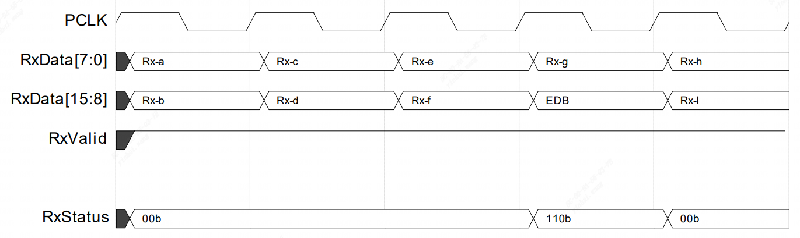
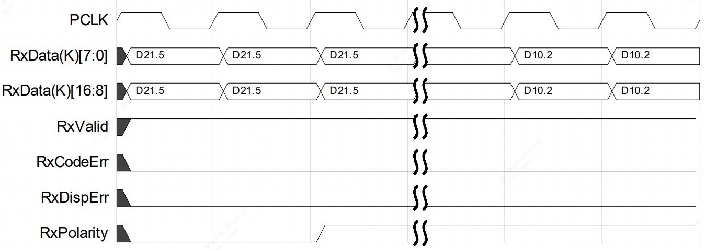
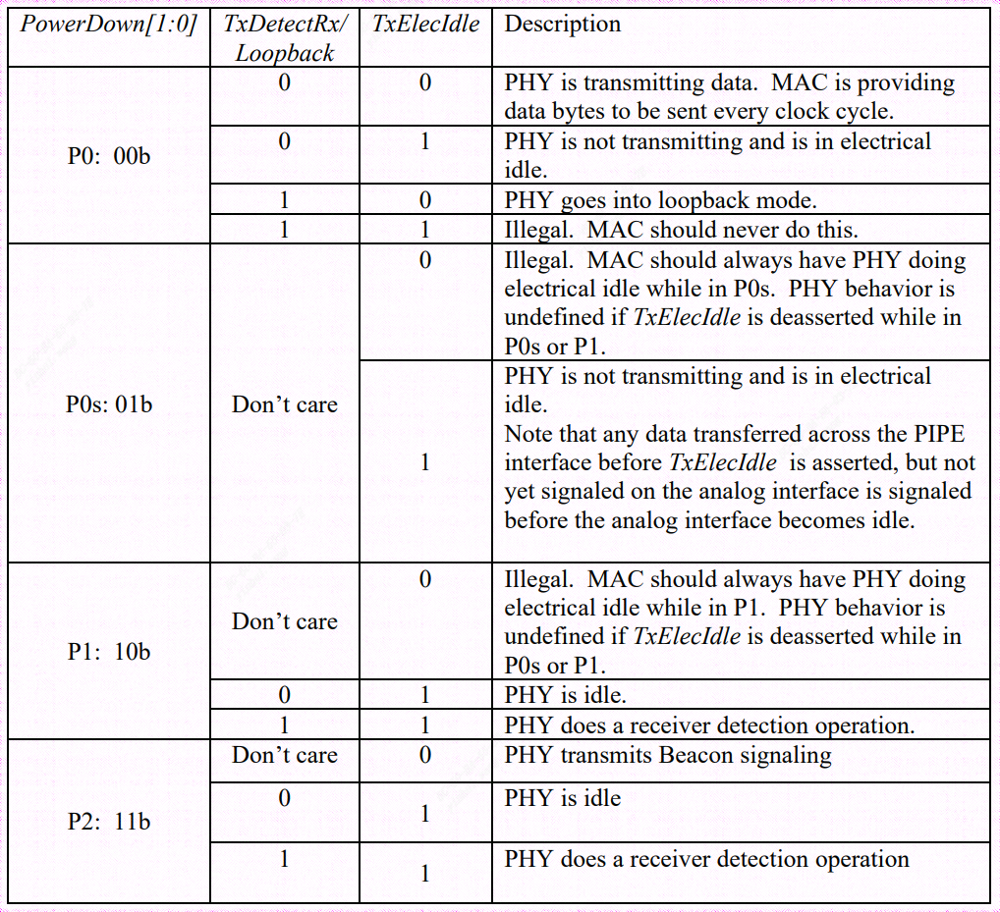

### 1 前言

#### 1.1 本次修订的范围

PCIe、SATA、USB、DisplayPort 和 USB4  PHY 接口规范具有所有功能块和信号的定义。此修订版本包括支持PCIe 5.0、SATA3.0、USB3.1、DP2.0和USB4.0。

PCI Express 6.0的PIPE定义是初步的，基于基本规范0..5版；如果需要符合PCI Express基础规范6.0版的未来版本，这些定义可能会发生更改。

#### 1.2 历史版本
|     版本号    |     日期     |      描述      |
| -----------   | ---------- | ------------- |
| 0.1 | 7/31/02| 出版草稿|
| 0.5 | 8/16/02| 工业界评议草稿|
| 0.6 | 10/4/02 | 增加运行时细节|
| 0.7 | 11/4/02 | 增加时序图 |
| 0.8 | 11/22/02 | 增加更多运行时细节，改动 RX 检测流程|
| 0.9 | 12/16/02 | 小幅更新，足够可靠的，以供实现的近似完稿版本|
|0.95 | 4/25/03 | 随PCIe 1.0a 协议更新。增加多通道 PIPE 实现建议|
| 1.00 | 6/19/03 | 供实现可用的稳定版本 |
| 1.70 | 11/6/05 | 支持 PCIe Gen 2 PIPE 支持PCIe Gen 2 的首个PIPE版本|
| 1.81 |  12/4/05 | 基于反馈修订各处 |
| 1.86 | 2/27/06 | 基于反馈修订各处。增加一节描述如何使用 CLKREQ# 信号。|
| 1.87 | 9/28/06 | 移除 Compliance Rate deteermination 部分的引用。为TX Margining 和 Selectable De-emphasis增加一节
| 1.90 | 3/24/07 | 小幅排版更新 |
| 2.00 | 7/21/07 | 小幅排版更新，供实现可用的稳定版本 |
| 2.70 | 12/31/07 | 支持 USB 3.0 的首个版本 |
| 2.71 | 1/21/08 | 更新 SKP 处理部分以及 USB SuperSpeed PHY 电源管理部分 |
| 2.75 | 2/08/08 | SKP 处理部分更多更新 |
| 2.90 | 8/11/08 | 增加 USB SS 模式的 32 bit 数据位宽支持，支持 USB SS 接受均衡训练，支持USB SS 非 8b/10b 编码的 compliance patterns。足够可靠的，以供实现的近似完稿版本 |
| 3.0 | 3/11/09 | 3.0 最终版本 |
| 4.0 | 4/5/11 | 草稿1：增加对SATA 的支持 |
| 4.0 | 4/13/11 | 草稿3：更新支持 PCIe 3.0 版本9 |
| 4.0 | 9/1/11 | 草稿6: 基于反馈，更新PCIe 3.0 版本9 |
| 4.1 | 12/7/11 | 支持通道独立时钟选项的初始草稿 |
| 4.1 | 12/12/11 | 草稿2：新增 PCIe 3.0 相关信号的示例时序图章节的草稿 |
| 4.2 | 7/1/13 | 增加对于 USB 3.1 的支持，基于 USB 3.1 specification revision 9 的草稿 |
| 4.3 | 1/31/14 | 增加对于 PTM, L1SS,以及PCIe 4.0 的支持(草稿状态) |
| 4.4 | 11/28/16 | 通过信号总线接口增加了对PCIe RX margining和弹性缓冲区深度控制的支持。支持PCIe标称空弹性缓冲区模式。Gen4更新：Local-LF/FS,LF/FS,Rate,PCLK rates。|
| 4.4.1 | 1/12/17 | 删除了消息总线的 ”PCLK 作为输入“的要求。添加了允许PHY选择是通过PowerDown[3:0] 独占还是通过RXEIDetectDisable和TxCommonModeDisabel支持L1子状态管理的措辞 |
| 5.0 | 11/2//17 | 阐明了只有在PHY公布范围内的不受支持的电压裕度偏移请求才需要裕度NAK。仅为PCIe SerDes添加了对64位数据宽度的支持。将所有符合条件的遗留PIPE信号映射到消息总线寄存器中。增加了对SerDes体系结构的支持。增加了对低引脚数与传统PIPE接口以及SerDes与原始PIPE架构的支持要求。增加了对聚合IO和DisplayPort的支持。建议USB标称空操作应使用RxDataValid。增加了通过寄存器位控制的EB错误恢复机制。添加RefClkRequired信号，以指示何时可以安全地移除参考时钟。将信号表重新格式化为单独的输入和输出表，并添加了一个新列，指示相关协议。|
| 5.1 | 3/14/18 | PCIe 5.0正式速率定义。一般打字错误更正和澄清。在5.0版本中无意中删除的外部信号表中重新添加。ElasticBufferLocationUpdateFrequency移动到PHY地址空间，其中最小/最大值将在PHY数据表中指定。阐明RefClkRequired#对于PHY是可选的。由于块编码，更新了TxDataValid描述，以参考USB原始PIPE架构中的用法。阐明PHY必须指定其自己的RxStandby时序要求。添加PHY参数以指定PclkChangeOk/PclkChangeAck速率+宽度变化和所有速率变化都需要握手。在PowerDown描述和RxEIDetectDisable描述中阐明了L1子状态的状态。允许接收者在P2中检测PCIe。添加USB澄清以进行计时LFPS、RxElecdle并从P1退出到P0。增加USB表PowerDown状态特征。更新了RxStatus描述，以反映'111b值指示USB的已校正SKP。所有速率更改（不仅仅是影响PCLK的速率更改）都需要PclkChangeOk/PclkChangeAck握手。添加关于LFPS传输相对于USB的SuperSpeed数据的优先级的说明。RxEIDetectDisable可用于禁用LFPS电路以节省电源。将GetLocalPresetCoefficients从PHY TX Control5寄存器的第5位移动到第7位，以允许LocalPresetIndex字段的增长。不推荐关闭车道的TxElecIdle+TxCompliance方法。更新了用于Tx EQ的USB 3.2的PHY参数表。禁止在用于USB的P2和P3中进行LFPS传输。增加了eDP费率。将TX Control9寄存器内容移动到RX Control4寄存器。将RX Status-3寄存器内容移动到TX Status3-6寄存器。已更新LocalG5LF寄存器字段的LocalPresetIndex有效范围。更新了“车道”中的各种条目接收器序列的边距”表。添加了PHY参数AsynchReceiverDetectSupport，以通告PHY是否支持PCIe P2状态下的异步接收器检测。更新了消息总线规则，包括对已发布到已发布写入和已定义寄存器组的限制。添加PHY参数以通告发送EIOS后转换到有效电空闲的时间。已将聚合IO接口更新为40位。添加了聚合IO的速率/宽度表。添加了数据路径和控制路径支持选项的PHY参数。禁止LFPS信号用于USB的P2和P3。USB重置期间的RXTermination断言更改为特定于实现。增加了采样计时与PIPE兼容的拓扑。|
|  5.1.1 | 7/5/18 | 删除RX状态1-3；在之前对规范的审查中，内容被移到了TX Status3-6，但旧寄存器被无意中留在了规范中。|
| 5.2 | 2/8/19 | 增加了对MCP应用的短距离支持（新信号ShortChannelPowerControl[1:0]和新PHY参数ShortChannelPower ControlSettings）。为Displayport 2.0添加了10、13.5、20Ghz频率。增加了对RxEqTraining的PCIe支持，新增RxEqTrainDone确认和新PHY参数PCIeRxEqTrain需求。增加了对PHY或控制器启动的Rx重新校准的支持，包括PhyIORecalRequest、IORecal和IORecalDone寄存器字段以及PHY参数PhyRecalRequirement。增加了对第8.20节的澄清，以指定TxElecIdle[3:0]位映射到表中。添加了DisplayPort AUX信号在每个连接器。RxValid与同步的说明RxCLK处于SerDes模式。已添加的电子邮件联系信息提交反馈(pipespecification@intel.com)。|
|  5.2.1 | 2/14/20 | 修复了ShortChannelPowerControlSettingsSupported参数的PowerControlSetting2建议描述中的打字错误，以参考<=10dB通道（而不是<=5dB通道）。澄清表3-1只是可能的宽度和PCLK速率组合的示例列表（并添加了4个1Ghz、8GT/s和16GT/s的符号宽度选项）|
| 6.0 | 6/22/20 | 将聚合IO命名法更新为USB4。从RxPolarity的适用协议中删除了USB4，因为RxPolitity不适用于SerDes。为SerDes模式的RxValid定义添加了不同值指示的说明。更新第8.26.1节中的操作规则，以表明LocalFS和LocalLF在PhyStatus取消断言之前已更新。在第8.20节中阐明了有效的TxElecIdle[3:0]转换序列。可配置对定义的澄清，尤其是关于Tx+Tx和Rx+Rx组合。更新了图3-2和图3-3，以显示DisplayPort的第二个可配置对。增加了RxData2和TxData2信号定义，用于Rx+Rx和Tx+Tx差分对组合。增加了Thunderbolt 3信号速率选项10.3125和20.625 GT/s。明确实际最大PCLK速率为在PHY数据表中公布。将以下信号更新为适用于USB4:RxTermination，RxEIDetectDisable，Width，RxWidth，RxValid。更新了以下信号以适用于Display Port Tx。支持PCI Express 6.0版（预版本0.5）：TxDeemph和LocalTxPresetCoefficients的4个8位系数的更新和新寄存器字段（目前假设为11个预设），8位FS/LF值，能够指定3个眼睛中的一个用于定时裕度，需要Serdes，Gen6不允许原始PIPE。为DisplayPort的速率编码添加了速率覆盖选项。图8-9在以前的版本中被损坏-修复了这个问题。增加了对深度电源管理的支持（可选异步）握手信号DeepPMReq#和DeepPMAck#以及用于在电源轨恢复之后管理PHY上下文恢复的可选恢复#信号。更新了措辞，以确保在不需要的模式下操作时必须断言TxDataValid。对PowerDown或RxStandby的任何更改都必须导致IORecal、RxEqEval或RxEqTraining操作中止。PCIe需要RXTermination。RefClkRequired#可以取消断言在P1期间。添加RxCLK2。更正图9-4和图9-5中寄存器名称的拼写错误。

### 2 Introduction (引言)

The **P**HY **I**nterface for the **P**CI **E**xpress, SATA, USB1 , DisplayPort and USB4 Architectures (**PIPE**)接口旨在实现功能等效的PCI Express、ATA、USB、DisplayPort以及USB4 PHY的开发。

这样的PHY可以构成单独的芯片，也可以用于实现更大规模的ASIC芯片中的PHY硬核单元(HardMicro cell)。
该规范定义了一系列必须在 PIPE 协议兼容PHY中实现的功能，并定义了一组PHY与媒体访问层（MAC）和链路层芯片(或者模块)之间的标准接口。

本协议文本的目的不是具体定义PHY芯片或硬核宏单元中的内部架构或设计。

PIPE 协议定义允许有多种不同的用处，协议中多处引用而不是重复了 PCI Express, SATA, 以及 USB 的协议文本中的内容。PIPE 协议与这三者的标准协议文本中的内容冲突之处，以这三者的协议文本为准

本协议文本提供了有关MAC如何将PIPE接口用于各种LTSSM状态、链路状态、和其他协议的一些信息。这些信息应被视为基于协议规范需求的”指南“或”一种实现方式“。MAC的实现方式非常的自由，只要其满足相应协议规范要求。

PIPE协议规范的目的之一是加速PCIe，SATA，USB和USB 4 设备开发。协议定义了一份芯片设计和终端设备厂商可以用于其产品开发的接口。外设以及IP厂商可以将产品的设计开发和验证，和PCIe，SATA以及USB相关告诉模拟电路的种种问题隔离开来，这能够最小化开发周期中的风险并减少开发时间。

PIPE协议规范为接口定义了两个时钟选项。第一种方案PHY提供随路时钟(PCLK)输出。另一种方案中，各个通道的PHY(each lane of the PHY)的PCLK由外部输入。第二种方案在先前的 4.1 版本的协议中加入，外部输入 PCLK 方案能够使控制器电路或者其他逻辑更好地控制 PIPE 接口的时序，以满足芯片实现中的时序需求。PHY 仅需要实现上诉两种方案中的一种，这两种方案分别被作为 ”PCLK as PHY Output“ 以及 ”PCLK as PHY Input“。

- **Note**: PCIe 5.0 以及更高版本，USB 4 和 Display Port **不支持** ”PCLK 作为PHY输出“ 模式。

图2-1展示了 PIPE 协议在 PCIe 协议（PCI Express Base Specification）中所处的位置。

图2-2 展示PIPE 协议在USB协议(USB 3.1 Specification) 中所处的位置
*图略*

图2-3 展示PIPE 协议在USB 4 协议(USB 1.0 Specification)中所处的位置
*图略*
#### 2.1 PCI Express PHY Layer

PCIe PHY 层复杂实现底层协议以及信号生成，实现的特性包括: 模拟缓冲电路，弹性缓存(Original PIPE)，接受端检测，数据串并转换，8b/10b 编码/解码(Original PIPE)，128b/130b 编码/解码(8GT/s, 16GT/s, 32GT/s)(Original PIPE)。 这部分模块的重心是将以 PCIe 协议速率传输的数据，转换到芯片后级电路的时钟域上去。

PCIe PHY 的一些关键特性：
- 标准PHY接口为PCI Express 逻辑层启用多个IP源，并为PCI Express PHY 供应商提供目标接口。
- 仅支持2.5GT/s或2.5GT/s和5.0 GT/s，或2.5 GT/s，5.0 GT/s和8.0 GT/s，或者2.5 GT/s、5.0 GT/s、8.0 GT/s和16 GT/s，也可以支持2.5 GT/s和5.0GT/s、8.0GT/s和16GT/s，还可以支持2.5 GT/s，或者32 GT/s、2.5GT/s、5.0GT/s和8.0GT/s、16GT/s、32GT/s和64GT/s串行数据传输速率。
- 利用8位、16位或32位并行接口传输和接收PCI Express数据。此外，仅支持SerDes体系结构中的64位接口。
- 高速组件的单功能集成。
- 从 PCIe 串行总线数据流中恢复接收时钟与数据。
- 在传输和接收数据时暂存数据。
- 支持 compliance pattern 发送中的直接校验控制 ( direct disparity control)。
- 8b/10b 编解码以及错误检测。
- 128b/130b 编解码以及错误检测。
- 接受端侦测。
- Beacon 的传输与接收。
- 可选的 Tx Margining, Tx De-emphasis 和信号摇摆率设置。
- 接收器的 Lan Margining。
- 极性
- 电气空闲 进入/退出检测(静噪)

#### 2.2 USB PHY Layer 

**忽略翻译**

#### 2.3 USB4 PHY Layer

**忽略翻译**

#### 2.4 SATA PHY Layer

**忽略翻译**

#### 2.5 DisplayPort PHY Layer

**忽略翻译**

#### 2.6 Low Pin Count Interface and SerDes Architecture(低引脚数接口和SerDes体系结构)

为了解决信号数量日益增加的问题，在PIPE 4.4 中引入了消息总线接口，并将其用于接收器处的PCIe 通道裕度(Lan Margining) 和 弹性缓冲区深度控制。

在PIPE 5.0中，所有没有关键时序要求的传统PIPE信号都被映射到消息总线寄存器中，以便可以通过消息总线接口访问它们的相关功能，而不是实现专用信号。

在PIPE 4.4 及以后的版本中添加的任何新功能都是只能通过信息总线访问获得，除非它们具有需要的关键时序要求的专用信号

为了便于设计作为硬IP交付的通用PHY，并作为MAC 提供MAC提供更多的延迟优化自由度，在PIPE 5.0 中定义了 SerDes 架构。这种体系结构简化了PHY，并将许多特定于协议的逻辑转移到MAC 中。

为了最大限度地提高MAC和PHY IP之间的互操作性，PHY设计必须遵守表2-1中所述的要求，即支持传统引脚接口与低引脚数接口，以及支持原始PIPE架构与SerDes架构。对于PCIe，表题中的PCIe 6.0 是指配置为具有PCIe 6.0 功能的PHY，选择是基于能力静态地进行的，并且不随速率变化而变化。

Table 2-1. PHY Requirements for Lagacy Pin Interface vs Low Pin Count Interface and Original PIPE vs SerDes Architecture Support

|    | USB4/DP | USB 3.2 及以下 | PCIe 5.0 | PCIe 6.0 | PCIe 4.0 及以下 | SATA |
| -- | ------------------- | ----------------|  ---------| -----------| -----------------| ------ |
| Legacy Pin Interface | Not allowed | Required(see ver 4.4.1)| Not allowed | Not allowed| Required(see ver 4.4.1)| Required(see ver 4.4.1)|
| Low Pin Count Interface | Required | Optional | Required |Required| Required for Gen4 RX margining only,optional for enverything alse | Optional |
| Original PIPE  | Not allowed | Required | Recommended(1.) | Not allowed | Required | Required |
| SerDes | Required | Optional | Required | Required | Optional | Optional |

- 1. 为了提供与选择不迁移到SerDes架构的PCIe和USB MAC的互操作性，鼓励PHY通过一种可以轻松优化相关逻辑的方法来提供对原始PIPE的支持。这样，不需要支持原始PIPE的PHY的设计就不会有任何不必要的逻辑负担。

#### 2.7 Support for Short Reach(SR) Applications

PIPE规范支持短通道（又称短距离或SR）应用，例如多芯片封装解决方案。对于这样的应用，可以通过优化较窄通道的某些操作和环境参数来显著降低操作功率。例如，与传统PCIe应用程序相比，具有SR的PCIe的操作功率可能降低约50%。虽然指定环境参数不在PIPE规范的范围内，但鼓励PHY供应商宣传任何此类环境旋钮，这些旋钮可以在短通道应用中更改以降低功率，例如降低PHY电源电压。本规范提供了用于调整特定操作参数以降低功率的挂钩。这些操作旋钮取决于PHY供应商，可能包括信道损耗、接收机均衡活动（包括DFE和CTLE）、TX 摆动和时钟恢复策略。

想要支持功率优化短距离应用程序的PHY供应商应为其在数据表中宣传的上述旋钮确定一组有用的操作点（通过ShortChannelPowerControlSettingsSupported参数），然后客户可以使用PIPE控制接口（通过ShortChannelPowerControl[1:0]信号）从中进行选择。

除了上述潜在的功率节省之外，MCP应用程序还提供了节省成本和额外操作优化的机会；特别是，强烈建议使用直流耦合，从而节省电容器插入成本。作为直流耦合支持的一部分，控制器应绕过显式接收器检测。对于PCIe，应绕过PCIe LTSSM状态下的接收器检测操 Detect.Quiet，并且LTSSM应自动进行轮询。如果LTSSM由于超时而转换回“从轮询检测”，建议在电气空闲退出检测或在30-100ms超时之后。基于DC的进一步优化可以实现耦合以减少功率状态（例如L1.2）退出等待时间。

#### 2.8 Configurable Pairs

PIPE规范的5.0版中增加了对可配置Rx/Tx差分对的支持。这种可配置性主要是为了支持Type-C替代模式协议，如DisplayPort和USB4；然而其他应用也是可能的。假设在任何给定时间最多有两个差分对可操作。支持的车道组合是一对Rx和一对Tx、两对Tx或两对Rx；每个组合共享一个每个Lan的PIPE信号集。请参阅第7节了解更多信息。

### 3 PHY/MAC Interface

图3-1显示了一个Rx对和一个Tx对组合的PHY和MAC层之间的数据和逻辑命令/状态信号。

                            Figure 3-1 PHY/MAC Interface

该协议规范允许几种不同的PHY/MAC 接口配置来支持各种信号速率。

对于在PCI Express 模式下仅支持 2.5GT/s 的PIPE 实现，实现者可以选择PCLK 在125MHZ下运行的16 bit 数据路径，或者PCLK在250MHZ上运行的8 bit 数据路径。

PIPE实现支持PCI Express模式下的5.0GT/s 和 2.5 GT/s 因此能够在2.5GT/s 和 5GT/s 信号速率之间切换，其可以通过多种方式实现。

一种实现方式可以选择将PCLK固定在250MHz，并且当以2.5GT/s速率操作时使用 8 bit 数据路径，以及当以 5.0 GT/s 信号速率操作时使用 16 bit 数据路径。

另一种实现选择是使用固定的数据路径宽度并改变PCLK频率来调整信号速率。在这种情况下，具有 8 bit 数据路径的实现将为 2.5GT/s 提供 250MHz的PCLK，并且为 5GT/s 提供500MHz的PCLK。类似地，具有16位数据路径的实现将为2.5GT/s信令提供125MHz的PCLK，并且为5.0GT/s信令在250MHz提供PCLK。可能性的示例列表如表3-1所示。

Table 3-1. PCI Express Mode - Possible PCLK rates and data widths

| Mode     | PCLK | Original PIPE DATA Widt(or SerDes Date Width) | TxDataValid and RxDataValid Strobe Rate|
| ------ | -----------| ------| ---------| 
| 2.5 GT/s | 4000 MHz | 8 bits(10bits) | 1 in 16 PCLKs |
| 2.5 GT/s | 2000 MHz | 8 bits(10bits) | 1 in 8 PCLKs |
| 2.5 GT/s | 1000 MHz | 8 bits(10bits) | 1 in 4 PCLKs |
| 2.5 GT/s | 500 MHz | 8 bits(10bits) | 1 in 2 PCLKs |
| 2.5 GT/s | 250 MHz | 8 bits(10bits) | N/A |
| 2.5 GT/s | 250 MHz | 16 bits(20bits) | 1 in 2 PCLKs |
| 2.5 GT/s | 500 MHz | 16 bits(20bits) | 1 in 4 PCLKs |
| 2.5 GT/s | 125 MHz | 16 bits(20bits) | N/A |
| 2.5 GT/s | 250 MHz | 32 bits(40bits) | 1 in 4 PCLKs |
| 2.5 GT/s | 62.5 MHz | 32 bits(40bits) | N/A |
| 2.5 GT/s | 62.5 MHz | N/A bits(80bits) | 1 in 2 PCLKs |
| 2.5 GT/s | 31.25 MHz | N/A bits(80bits) | N/A |
| 5.0 GT/s | 4000 MHz | 8 bits(10bits) | 1 in 8 PCLKs |
| 5.0 GT/s | 2000 MHz | 8 bits(10bits) | 1 in 4 PCLKs |
| 5.0 GT/s | 1000 MHz | 8 bits(10bits) | 1 in 2 PCLKs |
| 5.0 GT/s | 500 MHz | 8 bits(10bits) | N/A |
| 5.0 GT/s | 500 MHz | 16 bits(20bits) | 1 in 2 PCLKs |
| 5.0 GT/s | 250 MHz | 16 bits(20bits) | N/A |
| 5.0 GT/s | 250 MHz | 32 bits(40bits) | 1 in 2 PCLKs |
| 5.0 GT/s | 125 MHz | 32 bits(40bits) | N/A |
| 5.0 GT/s | 125 MHz | N/A (80bits) | 1 in 2 PCLKs |
| 5.0 GT/s | 62.5 MHz | N/A(80bits) | N/A |
| 8.0 GT/s | 4000 MHz | 8 bits(10bits) | 1 in 4 PCLKs |
| 8.0 GT/s | 2000 MHz | 8 bits(10bits) | 1 in 2 PCLKs |
| 8.0 GT/s | 1000 MHz | 8 bits(10bits) | N/A |
| 8.0 GT/s | 1000 MHz | 16 bits(20bits) | 1 in 2 PCLKs |
| 8.0 GT/s | 1000 MHz | 32 bits(40bits) | 1 in 4 PCLKs |
| 8.0 GT/s | 500 MHz | 16 bits(20bits) | N/A |
| 8.0 GT/s | 500 MHz | 32 bits(40bits) | 1 in 2 PCLKs |
| 8.0 GT/s | 250 MHz | 32 bits(40bits) | N/A |
| 8.0 GT/s | 250 MHz | N/A (80bits) | 1 in 2 PCLKs |
| 8.0 GT/s | 125 MHz | N/A (80bits) | N/A |
| 16.0 GT/s | 4000 MHz | 8 bits(10bits) | 1 in 2 PCLKs |
| 16.0 GT/s | 2000 MHz | 8 bits(10bits) | N/A |
| 16.0 GT/s | 1000 MHz | 16 bits(20bits) | N/A |
| 16.0 GT/s | 1000 MHz | 32 bits(40bits) | 1 in 2 PCLKs |
| 16.0 GT/s | 500 MHz | 32 bits(40bits) | N/A |
| 16.0 GT/s | 250 MHz | N/A (80bits) | N/A |
| 32.0 GT/s | 4000 MHz | 8 bits(10bits) | N/A |
| 32.0 GT/s | 2000 MHz | 16 bits(20bits) | N/A |
| 32.0 GT/s | 1000 MHz | 32 bits(40bits) | N/A |
| 32.0 GT/s | 500 MHz | N/A (80bits) | N/A |
| 64.0 GT/s | 4000 MHz | N/A (20bits) | N/A |
| 64.0 GT/s | 2000 MHz | N/A (40bits) | N/A |
| 64.0 GT/s | 1000 MHz | N/A (80bits) | N/A |

PCI Express模式的可能数据宽度和PCLK速率组合的示例列表如表3-1所示；其他组合也是可能的，只要它们符合PIPE定义，并且PCLK速率、数据宽度和TxDataValid/RxDataValid选通的组合与串行链路上的带宽相匹配。仅需要符合PIPE的MAC或PHY来支持每个PCI Express传输速度支持一个选项。请注意，支持的PHY大于x4的链接宽度必须提供32位或更小数据宽度的选项。

Table 3-2. PCI Express Mode(SerDes only) -- Possible RxCLK Rates and Data Widths

| Mode | RxCLK | Data Width |
| ------ | ------| --------|
| 2.5 GT/s | 250 MHz | 10 bits |
| 2.5 GT/s | 125 MHz | 20 bits |
| 2.5 GT/s | 62.5 MHz | 40 bits |
| 2.5 GT/s | 31.25 MHz | 80 bits |
| 5.0 GT/s | 500 MHz | 10 bits |
| 5.0 GT/s | 250 MHz | 20 bits |
| 5.0 GT/s | 125 MHz | 40 bits |
| 5.0 GT/s | 62.5 MHz | 80 bits |
| 8.0 GT/s | 1000 MHz | 10 bits |
| 8.0 GT/s | 500 MHz | 20 bits |
| 8.0 GT/s | 250 MHz | 40 bits |
| 8.0 GT/s | 125 MHz | 80 bits |
| 16.0 GT/s | 2000 MHz | 10 bits |
| 16.0 GT/s | 1000 MHz | 20 bits |
| 16.0 GT/s | 500 MHz | 40 bits |
| 16.0 GT/s | 250 MHz | 80 bits |
| 32.0 GT/s | 4000 MHz | 10 bits |
| 32.0 GT/s | 2000 MHz | 20 bits |
| 32.0 GT/s | 1000 MHz | 40 bits |
| 32.0 GT/s | 500 MHz | 80 bits |
| 64.0 GT/s | 4000 MHz | 20 bits |
| 64.0 GT/s | 2000 MHz | 40 bits |
| 64.0 GT/s | 1000 MHz | 80 bits |

可能存在支持上述配置的倍数的PIPE实现。以相同速率支持多个配置的PHY实现必须支持宽度和PCLK速率控制信号。在PCI Express模式、SATA模式或USB模式下支持多个速率的PHY必须支持固定PCLK速率的所有支持速率的配置。在PCI Express模式或SATA模式下支持多种速率的PHY必须支持在固定数据路径宽度的所有支持速率上的配置。

### 4 PCIe、USB、USB4和DP PHY功能

图4-1显示了Tx差分对和Rx差分对组合的PHY的功能框图。所示的功能块并非旨在定义兼容PHY的内部架构或设计，而是用作信号分组的辅助。

                       Figure 4-1: PHY Functional Block Diagram for Tx+Rx Usage
                       
图4-2和图4-3分别提供了说明Tx+Tx和Rx+Rx组合的功能PHY图。请注意，虽然这些图说明了PLL在PHY中，PLL在PHY外部的其他拓扑结构也是可能的，如中所述第8.1.1.节。

                            Figure 4-2. PHY Functional Diagram for Tx+Tx Usage Case

                        Figure 4-3. PHY Functional Diagram for Rx+Rx Usage Case
第4.1节和第4.2节对图4-1、图4-2和图4-3中所示的每个区块进行了说明。这些块表示PHY实现中需要存在的高级功能。这些描述和图表描述了一般架构和行为特征。不同的实现是可能的，也是可以接受的。

#### 4.1 Original PIPE Architecture

##### 4.1.1 Transmitter Block Diagram (2.5 and 5.0 GT/s)

                                       Figure 4-4. Transmitter Block Diagram

##### 4.1.2 Transmitter Block Diagram(8.0/10/16/32 GT/s)

    Figure 4-5: Transmitter Block Diagram (8.0/10/16/32 GT/s)

##### 4.1.3 Receiver Block Diagram (2.5 and 5.0 GT/s)

                                   Figure 4-6: Receiver Block Diagram

##### 4.1.4 Receiver Block Diagram (8.0/10/16/32 GT/s)

                         Figure 4-7: Receiver Block Diagram (8.0/10/16/32 GT/s)

#### 4.2 SerDes Architecture

使用SerDes架构，与原始PIPE架构相比，PHY实现了最小的数字逻辑。

##### 4.2.1 SerDes Architecture: Transmitter Block Diagram

图4-8显示了PHY中实现的发射机功能。从MAC接收的数据在差分线路上被驱动之前要经过并行到串行的转换器。请注意，在SerDes体系结构中，所有环回逻辑都驻留在MAC中。

                   Figure 4-8: SerDes Architecture: PHY Transmitter Block Diagram

##### 4.2.2 SerDes Architecture: Receiver Block Diagram

图4-9显示了PHY中实现的接收器功能。在输入差分线上接收的数据在与恢复的时钟RxCLK一起被转发到MAC之前经过串并转换器。

                   Figure 4-9. SerDes Architecture: PHY Receiver Block Diagram

### 5 SATA PHY Functionality

*暂略翻译*

### 6 PIPE Interface Signal Descriptions

PHY输入和输出信号在下表中进行了描述。请注意，输入/输出是从符合PIPE的PHY组件的角度定义的。因此，一个被描述为“输出”的信号由PHY驱动，而一个被称为“输入”的信号则由PHY接收。其提供了每个信号的基本描述。有关其操作和时间安排的更多详细信息，请参阅以下部分。

PIPE实现的“并行”侧的所有信号都与PCLK同步，下表中指出了例外情况。在SerDes体系结构中，RxData与RxCLK同步。仅支持SerDes架构的PHY不需要标记为“未在SerDes体系结构中使用”的信号；然而，同时支持原始PIPE和SerDes架构的PHY必须实现所有信号。每个信号都有一列，用于指示相关协议；USB是指USB3.2及更低版本，而USB4是单独表示的。

- 注意：
        对于USB4和DisplayPort，低速侧通道不属于PIPE定义的一部分；然而，附录确实列出了DisplayPort AUX信号。

#### 6.1 PHY/MAC Interface Signals — Command for SerDes and Original PIPE

本节介绍适用于SerDes体系结构和Original PIPE的信号。这两种体系结构之间的任何使用差异都会在描述中注明。

##### 6.1.1 Data Interface

                           Table 6-1. Transmitter Data Interface Input Signals

| Name | Active Level | Description | Relevant Protocols |
| ------  | ------------- | ------------  | -------------------- |
| ==Original PIPE==: TxData[31:0] for 32-bit interface   TxData[15:0] for 16-bit interface  TxData[7:0] for 8-bit interface  ==SerDes Arch==:   TxData[79:0] for 80-bit interface   TxData[39:0] for 40-bit interface  TxData[19:0] for 20-bit interface  TxData[9:0] for 10-bit interface | N/A | Tx差分对的并行数据输入总线。                对于原始PIPE架构，TxData信号宽度选项为32、16和8位。对于16位接口，16位表示发送数据的2个符号。bit[7:0]是要发送的第一个符号，bit[15:8]是第二个符号。对于32位接口，32位表示传输数据的4个符号。bit[23:16]是要发送的第三个符号，比特[31:24]是第四个符号。比特0是第一个被传输的。对于SerDes架构，TxData信号宽度选项为80、40、20和10位。对于80位接口，80位表示传输数据的8个符号。bit[49:40]、bit[59:50]、bit[69:60]和bit[79:70]分别是第五、第六、第七和第八符号。对于块编码的数据5，每个10 bit片中只有8 bit被使用，例如[7:0]表示字节0，[9:8]被保留，[17:10]表示字节1，并且[19:18]被保留，等等。|  PCIe, SATA, USB, DisplayPort, USB4 |
| ==SerDes Arch== :  TxData2[39:0] for 40-bit interface,  TxData2[19:0] for 20-bit interface, TxData2[9:0] for 10-bit interface | N/A | Tx2差分对的并行数据输入总线。对于SerDes架构，TxData信号宽度选项为40、20和10 bits。对于40-bit接口，40 bit表示发送数据的4个符号。bit [9:0]、bit [19:10]、bit [29:20]和bit [39:30]分别表示第一、第二、第三和第四符号。| DisplayPort TX |
| TxDataValid | N/A | PCI Express模式、SATA模式和USB模式（仅限原始PIPE）：此信号允许MAC指示PHY在一个时钟周期内忽略数据接口。值为1表示phy将使用数据，值为0表示phy不会使用数据。当PHY处于不需要信号的模式时，要求MAC始终断言TxDataValid。所有8 GT/s、16 GT/s、32 GT/s和64 GT/s的PCI Express模式以及所有10 GT/s的USB模式均使TxDataValid。有关使用TxDataValid的其他模式的列表，请参阅表3-1、表3-2和表3-3。有关USB使用的详细信息，请参阅第8.25节；该信号不适用于USB SerDes架构设计。| PCIe, SATA, USB(original PIPE only) |

                        Table 6-4. Transmit Data Interface Output Signals

| Name | Active Level | Description | Relevant Protocols |
| ------ | -------------| -------------- | ----------------- |
| Tx+, Tx- | N/A | PHY的TX差分输出。所有Transmitter应与介质交流耦合。请参阅PCI Express基本规范第4.3.1.2节或USB 3.1规范第6.2.2节。| PCIe, SATA, USB, DisplayPort TX, USB4 |
| Tx2+, Tx2- | N/A | PHY的TX差分输出。所有Transmitter应与介质交流耦合。| DisplayPort TX |

                         Table 6-4. Receiver Data Interface Input Signals

| Name | Active Level | Description | Relevant Protocols |
| ------ | -------------| -------------- | ----------------- |
| Rx+, Rx- | N/A | PHY的RX差分输入。| PCIe, SATA, USB, DisplayPort TX, USB4 |
| Rx2+, Rx2- | N/A | PHY的RX差分输入他。| DisplayPort TX |
| ==Original PIPE==: RxData[31:0] for 32-bit interface   RxData[15:0] for 16-bit interface  RxData[7:0] for 8-bit interface  ==SerDes Arch==:   RxData[79:0] for 80-bit interface   RxData[39:0] for 40-bit interface  RxData[19:0] for 20-bit interface  RxData[9:0] for 10-bit interface | N/A | Tx差分对的并行数据输入总线。                对于原始PIPE架构，RxData信号宽度选项为32、16和8位。对于16位接口，16位表示发送数据的2个符号。bit[7:0]是被接收的第一个符号，bit[15:8]是第二个符号。对于32位接口，32位表示传输数据的4个符号。bit[23:16]是要发送的第三个符号，比特[31:24]是第四个符号。比特0是第一个被接收的。当PHY处于SATA模式时，ALIGN基元之后的第一个有效数据必须在接收数据中显示为字节0。对于SerDes架构，RxData信号宽度选项为80、40、20和10位。对于80位接口，80位表示传输数据的8个符号。bit[49:40]、bit[59:50]、bit[69:60]和bit[79:70]分别是第五、第六、第七和第八符号。对于块编码的数据5，每个10 bit片中只有8 bit被使用，例如[7:0]表示字节0，[9:8]被保留，[17:10]表示字节1，并且[19:18]被保留，等等。RxData在SerDes模式下与RxCLK同步。 |  PCIe, SATA, USB, DisplayPort, USB4 |
| ==SerDes Arch== :  TxData2[39:0] for 40-bit interface,  TxData2[19:0] for 20-bit interface, TxData2[9:0] for 10-bit interface | N/A | Tx2差分对的并行数据输入总线。对于SerDes架构，TxData信号宽度选项为40、20和10 bits。对于40-bit接口，40 bit表示发送数据的4个符号。bit [9:0]、bit [19:10]、bit [29:20]和bit [39:30]分别表示第一、第二、第三和第四符号。RxData2在SerDes模式下与RxCLK2同步。| DisplayPort TX |

##### 6.1.2 Command Interface

*翻译和表格见PIPE 文档*

##### 6.1.3 Status Interface

*翻译和表格见 PIPE 文档*

##### 6.1.4 Message Bus Interface

消息总线接口提供了一种使用少量wires和参与非延迟敏感PIPE操作的方法，并且它允许在不添加额外导线的情况下添加未来的PIPE操作。使用此接口需要设备处于电源状态，PCLK正在运行。用于PIPE操作的控制和状态位被映射到8位寄存器中，这些寄存器托管在PHY和MAC中的12位地址空间中。通过表6-9中列出的信号驱动的读写命令访问寄存器。这些信号与PCLK同步，并通过reset#复位。通过消息总线接口发送的事务的特定命令和成帧在以下小节中进行了描述。

### 7 PIPE Message Bus Address Spaces

[TODO] 后续补上

### 8 PIPE Operational Behavior

#### 8.1 时钟(Clocking)

[TODO] 后续补上

#### 8.2 复位(Reset)

[TODO] 后续补上

#### 8.3 电源功耗管理(Power Management)

##### 8.3.1 Power Management — PCI Express Mode

电源功耗管理信号允许PHY最小化功耗。PHY必须满足PCI Express基本规范中提供的关于各种功率状态的时钟恢复和链路训练的所有时序约束。PHY还必须满足发射机和接收机的所有终端要求。

定义了四种标准功率状态，P0、P0s、P1和P2。P0状态是PHY的正常操作状态。当从P0直接转换较低功率状态时，PHY可以立即采取任何适当的功率节省措施。允许PHY实现附加的PHY特定功率状态；L1子状态支持需要实现额外的PHY特定功率状态。MAC可以使用任何PHY特定状态，只要仍然满足PCI Express基本规范要求即可。

在状态P0、P0s和P1中，PCLK需要保持运行。对于这三个状态和PCLK可操作的任何PHY特定状态之间的所有状态转换，PHY通过PhyStatus的单周期断言指示成功转换到指定功率状态。进入和离开P2或PCLK不可操作的PHY特定状态的转换如下所述。对于所有功率状态转换，在PHY已经指示初始状态转换完成之前，MAC不得开始任何操作序列或进一步的功率状态转换。

PHY功率状态到基本规范中的链路训练和状态状态机（LTSSM）中的状态的映射如下所示。MAC可以交替地使用PHY特定状态，只要基本规范要求仍然得到满足。

- P0状态：PHY中的所有内部时钟都可运行。P0是PHY发送和接收PCI Express信令的**唯一状态**。                                                                                                                                        P0是链路训练和状态状态机（LTSSM）中大多数状态的适当PHY功率管理状态。下面列出了每个低功率PHY状态的例外情况。

- P0s状态：PCLK必须保持工作状态。MAC可以仅在**发送信道空闲**时将PHY移动到该状态。   当Transmitter处于Tx_L0s.idle时，可以使用P0s状态。                                                                                                                                                                                                                  当PHY处于P0或P0s功率状态时，如果Receiver 检测到电空闲，则PHY的接收器部分可以采取适当的功率节省措施。注意，在接收信道上恢复信令时，PHY必须能够在PHY指定的时间（具有/不具有公共时钟的N_FTS）内获得比特和符号锁定。此要求仅适用于Receiver 先前在P0或P0s状态下被比特和符号锁定的情况。

- P1状态：PHY中选定的内部时钟可以关闭。PCLK必须保持运行。只有当**发送和接收信道都空闲**时，MAC才会将PHY移动到此状态。PHY不得指示成功进入P1（通过断言PhyStatus），直到PCLK稳定且工作DC共模电压稳定且在规范范围内（根据基本规范）。                             P1可用于链路训练和状态状态机（LTSSM）的禁用状态、所有检测状态和L1.Idle 状态（仅当L1处于子状态时不支持）。

- P2状态：PHY中选定的内部时钟可以关闭。**并行接口处于异步模式**，**PCLK关闭**。               P2可用于链路训练和状态机（LTSSM）的L1.Idle、L2.Idle和L2.TransmitWake 状态。

PCLK as PHY Output：当转换到P2时，PHY必须在PCLKis关闭前断言PhyStatus，然后在PCLK完全关闭和PHY处于P2状态时取消断言PhyStatus。当从P2转换出来时，PHY会尽快断言PhyStatus，并将其保留到PCLK稳定之后。

PCLK as PHY Input：当转换到P2时，当准备好移除PCLK时，PHY必须断言一个输入PCLK周期的PhyStatus。当从P2转换出来时，一旦PHY转换到P0并准备好操作，PHY必须尽快断言一个输入PCLK周期的PhyStatus。

当从不提供PCLK的状态转换到另一个不提供PCLK的状态时，PHY在PHY状态转换完成后立即断言PhyStatus，并保持其断言状态，直到MAC断言AsyncPowerChangeAck。一旦MAC断言AsyncPowerChangeAck，PHY就会取消断言PhyStatus。

应实现PHY以最大限度地减少P2期间的功耗，因为此时设备必须在Vaux功率限制内运行（如PCI Express基本规范中所述）。

              Figure 8-6. PCI Express P2 Entry and Exit with PCLK as PHY Output

             Figure 8-7. PCI Express P2 Entry and Exit with PCLK as PHY Input

MAC可以要求PHY进行一组有限的合法功耗状态转换。这些合法转换为：P0到P0s、P0到P1、P0至P2、P0s到P0、P1到P0以及P2到P0。基本规范还描述了导致这些状态转换的原因。

PIPE还允许向包括至少一个PHY特定功率状态在内的任何一对PHY功率状态转换和从该对PHY电源状态转换（除非另有禁止）。但是，MAC必须确保满足PCI Express规范的时序要求。

对于L1子状态条目，PHY必须支持PCLK被禁用、REFCLK可以被移除、RX电空闲和TX共模开启的状态；这可以是P2或类似P2的状态。图8-8说明了进入和离开L1子状态的转换是如何发生的。P2或类似P2的状态映射到L1.Idle；并且使用PhyStatus和AsyncPowerChangeAck信号，如本节前面所述。

或者，PHY可以使用用RxEIDetectDisable和TxCommonModeDisable信号增强的单个PowerDown[3:0]编码来实现L1子状态管理；当使用该替代机制时，PowerDown状态必须在L1子状态转换期间保持恒定。使用不同的PowerDown[3:0]编码来定义L1子状态允许灵活地指定不同的退出延迟；而使用RxEIDetectDisable和TxCommonModeDisable可以消除与AsyncPowerChangeAck进行握手的需要。PHY可以支持任何一种机制或两者；必须在PHY数据表中公布该能力。通过RxEIDetectDisable和TxCommonModeDisable进行L1子状态管理的边带机制需要PCLK as PHY Input Mode。

                Figure 8-8 L1 SubState Entry and Eixt with PCLK as PHY Output

##### 8.3.4 异步深度电源功耗管理(Asynchronous Deep Power Management)

###### 8.3.4.1 深度功率管理控制握手序列(Deep Power Management Control Handshake Sequencing)

PIPE规范通过定义一组异步握手信号DeepPMReq#和DeepPMAck#，在某些PowerDown状态期间启用深度电源管理状态。在深度功率管理状态期间，允许PHY采取适当的动作来降低功率，例如时钟选通、功率选通或电源导轨移除。

通过实施活动状态深度功率管理机制，例如通过延迟容忍报告或工作负载监测，MAC确定其何时可以容忍更高的退出延迟，并随后通过断言DeepPMReq#来通知PHY允许其进入深度功率管理状态。

PHY通过断言DeepPMAck#立即确认该请求；进入深度电源管理状态的实际PHY发生在DeepPMAck#被断言之后，并且PHY内部条件可能会阻止进入。

由于DeepPMReq#和DeepPMAck#是异步信号，PCLK被允许在进入和退出深度电源管理状态的转换期间保持门控。MAC通过取消断言DeepPMReq#来指示PHY退出其深度功率管理状态。

在检测到DeepPMReq#的取消断言后，PHY必须退出其深度电源管理状态，然后通过取消DeepPMAck#来发出退出已发生的信号。MAC在转换掉电状态之前确认PHY不处于深度功率管理状态；这使得当PCLK是PHY输入时能够始终以同步方式使用PowerDown。图8-10显示了进入和退出深度电源管理的握手顺序。

                 Figure 8-10 DeepPMReq#/DeepPMAck# Handshake Sequencing

###### 8.3.4.2 电源恢复后的电源移除和PHY 上下文恢复

在深度功率管理状态下的功率门控或功率轨移除之前，PHY可以选择将内部上下文保存到PHY之外的位置，作为功率节省优化。MAC必须保证PIPE接口在断电前处于空闲状态，没有未完成的操作。

保存上下文的机制不是PIPE规范的一部分；然而，PIPE规范确实定义了一个恢复窗口，在该窗口期间恢复上下文，并指定了在恢复窗口期间和之后所需的MAC和PHY行为。

MAC通过断言restore#通知PHY进入恢复窗口；通过撤销restore#信号来发出退出恢复窗口的信号。恢复#必须在电源导轨斜坡之前断言。在恢复窗口期间，恢复在电源门控或电源导轨移除之前保存的所有上下文；在此期间，MAC和PHY必须忽略任何输入PIPE接口信号的任何切换，PCLK和Restore#信号除外。

从恢复窗口退出后，MAC和PHY必须立即恢复对输入PIPE接口信号的监控。从恢复窗口退出后，MAC和PHY必须等待PCLK变为活动状态并切换至少32个周期，然后才能切换与PCLK同步的任何PIPE信号。图8-11说明了断电前和恢复窗口周围的关键要求。

                   Figure 8-11. PHY Context Restoration after Power is Restored

#### 8.4 更改信令速率、PCLK速率或数据总线宽度(Changing Signaling Rate, PCLK Rate, or Data Bus Width)

##### 8.4.1 PCI Express 模式

只有当PHY处于P0或P1电源状态并且TxElecdle和RxStandby（仅P0）被断言时，链路的信令速率、PCLK速率或数据总线宽度才能改变。当MAC在作为PHY输出模式的PCLK中改变速率信号、和/或宽度信号和/或PCLK速率信号时，PHY执行速率改变和/或幅度改变和/或者PCLK速率改变，并通过PhyStatus的单周期断言来发出其完成的信号。

MAC不得执行任何操作序列、电源状态转换、取消断言TxElecdle或RxStandby，或进一步的信令速率改变，直到PHY指示信令速率改变已经完成。这个序列与 PCLK as PHY Input 模式相同，只是MAC需要知道输入PCLK速率或rate或潜在宽度何时可以安全更改。

在MAC改变Rate和PCLK_Rate、Data Width或两者之后，对PCLK的任何改变只能在PclkChangeOk输出被PHY驱动为高之后发生。

如果需要，MAC更改输入PCLK，然后通过断言PclkChangeAck进行握手。PHY通过断言一个输入PCLK周期的PhyStatus进行响应，并在PhyStatus的后沿取消断言PclkChangeOk。注：如果MAC更改PCLK_Rate和Rate，则PHY将使用PclkChangeOk。

PHY数据表指示对于每个速率变化是否也需要相同的握手。表8-1总结了握手要求。

                         Table 8-1. PclkChangeOk/PclkChangeAck Requirements

| Rate | Width | PCLK Rate | PclkChangeOK/PclkChangeAck Handshake Required? |
| ----- | ------  | ----------- | ----------------------------------------------------------- |
| Stable | Don't care| Don't care | Not applicable |
| Change | Stable | Stable | Optional (parameter) |
| Change | Stable | Change | Required |
| Change | Change | Stable | Optional (parameter) |
| Change | Change | Change | Required |

当PlkChangeOk被采样为低时，MAC去断言PlkChangeAck，并且可以在PhyStatus被采样为高之后去断言TxElecdle和/或RxStandby。

存在LTSSM状态机转换指示PHY的速度变化和/或宽度和/或PCLK速率变化以及功率状态变化的情况。在这些情况下，MAC必须在改变功率状态之前（如果需要）改变信令速率、宽度和/或PCLK速率。

一些PHY架构可以允许速度变化和功率状态变化与速率和/或宽度和/或PCLK速率变化同时发生。如果PHY支持这一点，MAC必须在改变掉电信号的PCLK边缘改变速率和/或宽度和/或PCLK速率。

当PHY从P0转换到P1或P2状态时，可能会发生这种情况。完成机制与先前针对功率状态改变所定义的相同，并且不仅指示功率状态改变完成，而且指示速率和/或宽度和/或PCLK速率改变完成。

##### 8.4.4 固定数据路径实现

下图显示了当MAC改变信令速率并且PCLK 是 PHY的一个 输出时，改变PCLK频率的实现的逻辑时序。当改变信令速率时改变PCLK频率的实现必须改变时钟，使得时钟停止的时间（如果停止）最小化，以防止任何使用PCLK的定时器超过其规格。

同样在时钟转换周期期间，PCLK的频率不得超过PHY定义的最大时钟频率。速率改变和PHY完成速率改变之间的时间量是PHY特定的值。这些定时也适用于通过使用使用TxDataValid和RxDataValid信号的选项来保持数据路径固定的实现。

                                  Rate change with fixed data path
图8-12显示了当MAC改变信令速率并且PCLK是PHY输入时，改变PCLK频率的实现的逻辑时序。

      Figure 8-12 Change from PCI Express 2.5 Gt/s to 5.0 Gt/s with PCLK as PHY Input.

##### 8.4.5 固定 PCLK 的实现

下图显示了针对不同信令速率改变数据路径宽度的实现的逻辑时序。PCLK可能在速率变化期间停止。这些定时也适用于使用TxDataValid和RxDataValid信号的固定PCLK实现。

                               Rate change with fixed PCLK frequency

#### 8.5 Transmitter Margining — PCI Express Mode and USB Mode

当处于P0功率状态时，可以指示PHY改变发射器引脚处的电压值。当MAC改变TxMargin[2:0]时，PHY必须能够在128 ns内使用新设置进行传输。MAC可以选择一组有限的合法TxMargin[2:0]和Rate组合。有关PHY处于PCI Express模式时的合法设置的完整描述，请参阅PCIe基本规范。有关PHY处于USB模式时的合法设置的完整描述，请参阅USB规范。

				                        Selecting Tx Margining value

#### 8.6 Selectable De-emphasis — PCI Express Mode

当处于P0功率状态并且以5.0GT/s、8.0GT/s、16GT/s、32GT/s或64GT/s进行发送时，可以指示PHY改变发射机均衡的值。当信令速率为5.0 GT/s并且MAC改变TxDeemph时，PHY必须能够在128 ns内以新设置进行传输。当信令速率为8.0 GT/s、16 GT/s、32 GT/s或64 GT/s并且MAC改变TxDeemph时，PHY必须能够在256 ns内以新设置进行传输。

MAC可以选择的合法TxDeemph和Rate组合有限。有关完整说明，请参阅PCIe基本规范。

当速率选择2.5 GT/s时，MAC必须确保TxDeemph选择-3.5db。

                                             Selecting Tx De-emphasis value

#### 8.7 Receiver Detection — PCI Express Mode and USB Mode

当处于P1或可选的P2电源状态和PCI Express模式或处于P2或P3电源状态和USB模式时，PHY可以被指示执行接收器检测操作以确定在链路的另一端是否存在接收器。接收器检测的基本操作是MAC通过断言TxDetectRx/Loopback来请求PHY执行接收器检测序列。

当PHY完成接收器检测序列时，它断言一个时钟的PhyStatus，并将RxStatus信号驱动到适当的代码。在接收器检测完成后（如PhyStatus的断言所指示的），MAC必须在启动另一个接收器检测、功率状态转换或用信号通知速率改变之前取消TxDetectRx/环回断言。

一旦MAC请求了接收器检测序列（通过断言TxDetectRx/环回），MAC必须保持TxDetectRx/环回断言，直到PHY通过断言PhyStatus发出完成信号之后。当在P3中的PHY或P2中的PCIe的USB模式下执行接收器检测时，PHY断言PhyStatus并用信号通知适当的接收器检测值，直到MAC取消断言TxDetectRx/Loopback。

                                      Receiver Detect — Reciver present

#### 8.8 Transmitting a beacon — PCI Express Mode

当PHY已被置于P2功率状态，并且MAC想要发送信标时，MAC取消断言TxElecIdle，并且PHY应生成有效的信标，直到TxElecIdle被断言。在将PHY转换为P0之前，MAC必须断言TxElecdle。

                                                     Beacon Transmit

#### 8.10 Detecting a beacon — PCI Express Mode

PHY接收器必须始终监控电气空闲（重置期间或设置RxEIDetectDisable时除外）。当PHY处于P2功率状态，并且RxElecdle被取消断言时，则检测到信标。

                                                       Beacon Receive

#### 8.12 时钟容差补偿

    本节不适用于 SerDes 架构。
PHY接收器包含弹性缓冲器，用于补偿链路两端的比特率之间的频率差异。弹性缓冲器必须能够容纳足够的符号，以处理可用于所选PHY模式的速率补偿的符号之间的频率和最坏情况间隔的最坏情况差异。

为PHY中的弹性缓冲操作定义了两个模型。PHY可以支持这些模型中的一个或两个。标称空缓冲区型号仅在PCI Express、USB或SATA模式下受支持。

对于标称空缓冲区模型，PHY试图使弹性缓冲区尽可能接近空。在标称空模式下，PHY使用RxDataValid接口告知MAC何时没有可用数据。与标称半满缓冲区模型相比，标称空缓冲区模型提供了更小的最坏情况和平均延迟，但需要MAC支持RxDataValid信号。PHY在标称空缓冲区模式下删除所有SKP符号。

**后续补上**

#### 8.13 错误检测(Error Detection)

PHY负责检测几种类型的接收错误。使用接收器状态信号（RxStatus[2:0]）将这些错误用信号通知给MAC层。由于数据链路层中内置了更高级别的错误检测机制（如CRC），因此不需要专门识别有错误的符号，但关于错误何时发生在数据流中的合理定时信息是重要的。当发生接收错误时，在并行接口上的数据流中最接近错误实际发生位置的点处，对一个时钟周期断言适当的错误代码。RxStatus信号上可编码四种错误情况（SATA模式为五种）。如果在接收的字节（或通过16位、32位或64位接口传输的字节集）上发生多个错误，则应以如下所示的优先级发出错误信号。

- 1.8B/10B解码错误或块解码错误
- 2.弹性缓冲区溢出
- 3.弹性缓冲区下溢（在标称空缓冲区模型中不能发生）
- 4.Disparity 误差
- 5.错位（仅限SATA模式）

如果在SKP有序集或ALIGN期间发生错误，使得RxStatus上的错误信令和SKP或ALIGN添加/删除信令将发生在同一PCLK上，则错误信令具有优先级。

**注意**: PHY不发出128/130B（PCI Express）或128/132B（USB）报头错误的信号。原始接收的报头比特通过接口传递，并且控制器负责任何块报头错误检测/处理。

###### 8.13.1  8B/10B 解码错误

对于检测到的8B/10B解码错误，PHY应在数据流中放置EDB符号（用于PCIe或SATA）或SUB符号（用于USB）来代替坏字节，并在通过并行接口传输受影响字节的时钟周期期间用解码错误对RxStatus进行编码。

在下面的示例中，接收器正在接收字节Rx-a到Rx-z的流，并且字节Rx-f具有8B/10B解码错误。代替该字节，PHY在并行接口上放置EDB（用于PCIe或SATA）或SUB（用于USB），并将RxStatus设置为8B/10B解码错误代码。请注意，无法解码的字节也可能具有较差的视差，但8B/10B错误具有优先级。还要注意，对于大于8位的接口，如果坏字节在较低字节通道上，则其他字节中的一个可能具有坏视差，但同样，8B/10B错误具有优先级。

                                                 8B/10B Decode Error

##### 8.13.2 Disparity Errors

对于检测到的视差错误，当受影响的字节通过并行接口传输时，PHY应在时钟周期期间使用视差错误代码断言RxStatus。对于大于8位的接口，不可能辨别哪个字节（或者可能两者都有）具有视差误差。在下面的示例中，接收器在Rx-e或Rx-f数据字节中的一个（或两个）上检测到视差误差，并通过RxStatus的断言来指示这一点。可选地，PHY可以将视差误差信号化为8B/10B解码误差(使用代码0b100)。(MAC通常相同地处理8B/10B错误和视差错误。)。当在USB模式下操作时，信号差异错误是可选的。

                                                      Disparity Error

##### 8.13.3 弹性缓冲区错误(Elastic Buffer Errors)

对于弹性缓冲区错误，当伪符号在并行接口上移动时，应在一个或多个时钟周期内发出下溢信号。在接口上移动的符号应该是EDB符号（用于PCIe或SATA）或SUB符号（用于USB）。在下面的时序图中，PHY正在接收符号Rx-a到Rx-z的重复集合。弹性缓冲区下溢导致EDB符号（用于PCIe）或SUB符号（用于USB）插入Rx-g和Rx-h符号之间。当EDB（用于PCIe）或SUB（用于USB）出现在并行接口上时，PHY驱动RxStatus以指示时钟周期期间的缓冲区下溢。请注意，当PHY在标称空缓冲区模式下操作时，下溢不会发出信号。在这种模式下，每当需要插入数据时，SKP有序集都会在接口上移动或者使用RxDataValid信号。首选RxDataValid方法。

                                              Elastic Buffer Underflow

对于弹性缓冲区溢出，应在丢弃的一个或多个符号将出现在数据流中的时钟周期期间发出溢出信号。对于16位接口，MAC不可能或不必要确定符号在数据流中的确切位置。在下面的时序图中，PHY正在接收符号Rx-a到Rx-z的重复集合。弹性缓冲器溢出导致符号Rx-g被丢弃。PHY驱动RxStatus以指示在时钟周期期间缓冲区溢出，此时Rx-g将出现在并行接口上。

                                                 Elastic Buffer Overflow

###### 8.13.3.1

MAC可以设置ElasticBufferResetControl位（见第7.2.97.1.9节），以启动PHY中的EB重置序列。PHY必须在16个PCLK周期内完成EB重置序列，如下所示：
- 使用RxValid将RxStatus断言为1xx值
- 保持RxStatus为1xx，同时保持RxValid和RxDataValid
- 将指针移回其初始状态
- 释放RxStatus以指示正在再次转发干净的数据

#### 8.14 Loopback

- 对于USB和PCI Express模式，PHY必须支持相应基本规范中所述的内部环回。
- 对于SATA，当EncodeDecodeBypass被断言时，PHY可能可选地支持内部环回模式。
- 在SerDes体系结构中，环回是在MAC而不是PHY中处理的。

当MAC在进行正常数据传输时断言TxDetectRx/Loopback时（即，当TxElecdle被取消断言时），PHY开始环回数据。PHY必须在指定的接收和发送延迟内，停止从并行接口发送数据，并开始环回接收到的符号。在进行环回时，PHY继续在并行接口上呈现接收到的数据。

当MAC取消断言TxDetectRx/环回时，PHY停止环回接收到的数据。并行接口上的数据传输必须在指定的传输延迟内开始。

下面的时序图显示了开始环回的示例时序。在该示例中，接收器正在接收字节的重复流Rx-a到Rx-z。类似地，MAC使PHY发送字节Tx-a到Tx-z的重复流。当MAC向PHY断言TxDetectRx/环回时，PHY开始将接收到的数据环回到差分Tx+/Tx-线。TxDetectRx/Loopback的断言和Rx数据何时在Tx引脚上传输之间的时序取决于实现。

                                                            Loopback Start

下一个时序图显示了PHY在PCI Express模式下运行时从环回模式切换到正常模式的示例。

在PCI Express模式中，当MAC检测到电气空闲有序集时，MAC将取消断言TxDetectRx/Loopback并断言TxElecdle。PHY在进入电空闲之前必须传输电空闲有序集的至少三个字节。（注意，电空闲有序集的传输应该是通过PHY的正常管道的一部分，并且不应该要求PHY检测电空闲有序集合）。基本规范要求环回从设备能够在1ms内检测到电气空闲有序集并对其做出反应。PHY对此时间的贡献包括PHY的接收延迟加上PHY的发送延迟（见第6.13节）。

当PHY在USBMode下操作时，设备应仅在检测到LFPS信号（重置）或VBUS被移除时转换出环回。当检测到有效的LFPS信令时，MAC将PHY转换到P2功率状态，以便开始LFPS握手。

                                                        Loopback End

#### 8.15 极性反转 — PCI Express and USB Mode

为了支持通道极性反转，当RxPolarity被断言时，PHY必须反转接收到的数据。反相数据必须在RxPolarity被断言后的20 个 PCLK内开始显示在RxData[]上。

                                                  Polarity Inversion

#### 8.16 设置负视差（PCI Express模式）

为了将运行差异设置为负，MAC在一个时钟周期内断言TxCompliance，该时钟周期与要以负差异传输的数据相匹配。对于16位接口，低位字节将是在运行差异为负的情况下传输的字节。
此示例显示了如何使用TxCompliance在PCI Express模式下传输PCI Express符合性模式。TxCompliance仅在PCI Express模式下使用，并且在使用TxDataValid时由TxDataValid 限定。

                                               Setting Negative Disparity

#### 8.17 电气空闲(Electrical Idle) — PCI Express Mode

基本规范要求设备在 Tx+/Tx- 进入电气空闲状态之前发送电气空闲有序集。对于 16 位接口或 32 位接口，MAC 必须始终对齐并行接口上的电气空闲有序集，以便 COM 符号位于低位数据线上（TxDataK[7:0]）。图 8-13 显示了 PCI Express 8 GT/s 或 16 GT/s 接口的电气空闲退出和进入示例。每当 TxElecIdle 切换时，必须断言 TxDataValid，因为它用作采样 TxElecIdle 的限定符。注：对于 SerDes 架构，每 16 位数据需要 1 位 TxElecIdle。

                                                           Elextrical Idle

         Figure 8-13. PCI Express 3.0 TxDataValid Timings for Electrical Idle Exit and Entry

**注意**：图 8-13 仅显示了两个 TxData 块，因此 TxDataValid 在数据期间不会取消置位。规范中的其他示例显示了 TxDataValid 置低的较长序列。

当发生数据节流时，TxElecIdle 必须设置得足够长，以便 TxDataValid 进行采样，如图 8-14 所示。

                                          Figure 8-14. 数据节流和 TxElecldle

PIPE 规范不要求 RxStandby 在电气空闲后的任何时间内置位或根本不置位。各个 PHY 必须指定自己的 RxStandby 断言时序要求，这可能会有所不同，具体取决于它们是否具有惊人的要求。

#### 8.18 链路均衡评估(Link )

**后续补上翻译**

#### 8.19 实施特定时序和可选参数支持(Implementation specific timing and selectable parameter support)

**后续补上翻译**

#### 8.20 控制信号解码表 — PCI Express Mode

表 8-3 总结了七个控制信号中四个的编码，这些信号根据电源状态导致不同的行为。对于其他三个信号，Reset# 始终覆盖任何其他 PHY 活动。TxCompliance 和 RxPolarity 仅当 PHY 处于 P0 且正在主动发送时才有效。请注意，这些规则仅适用于未按第 8 节（多通道 PIPE）所述“关闭”的通道。

对于 SerDes 模式，表 8-3 中总结的规则适用于 P0 和 P0s 状态的每个 TxElecIdle[3:0] 位。预计进入电气空闲状态必须从 MSB 到 LSB，即 TxElecIdle[3:0] 的有效值为 1000b、1100b、1110b、1111b 和 0000b。图 8-17 显示了有效 TxElecIdle 转换的各种场景。到电气空闲的转换可以包括仅驱动到电气空闲的数据字节子集的单个周期，随后是电气空闲中的所有数据字节； 所有数据字节必须同时完成电气空闲状态的转换。对于 P1 和 P2 电源状态，TxElecIdle[3:0] 的所有位预计将被驱动为相同的值，因此仅需要解码 TxElecIdle[0]。
                              表 8-3. 控制信号解码表 — PCI Express

                          Figure 8-17 Possible TxElecIdle[3:0] Transition Scenarios

#### 8.23 所需的同步信号时序(Required synchronous signal timings)

为了提高不同供应商的 MAC 和 PHY 之间的互操作性，需要以下同步信号时序：

| Setup time for input signals | No greater than 25% of cycle time |
| ------------------------------  | -------------------------------------- |
| Hold time for input signals | 0ns |
| PCLK to data valid for outputs | No greater than 25% of cycle time |

#### 8.24 128b/130b 编码和块同步(PCI Express 8 GT/s, 16GT/s, and 32GT/s)

对于以 8.0 GT/s 速率、16 GT/s 速率或 32 GT/s 速率在 PIPE TxData 接口上移动的每个块（通常为 128 位 – 有时由重定时器传输较短/较长的 SKP 块），PHY 必须传输 2 个额外位。MAC 必须定期使用 TxDataValid 信号，以允许 PHY 传输积压的数据。

例如，如果 TxData 总线为 16 位宽且 PCLK 为 500 Mhz，则每 8 个块，MAC 必须对一个 PCLK 置低 TxDataValid，以允许 PHY 传输 16 位积压的构建数据。当 PHY 退出复位时，PHY 用于存储与 128/130b 编码率不匹配相关的 TX 数据的缓冲区必须为空，并且每当 PHY 退出电气空闲时也必须为空（因为 TX 缓冲区在进入空闲状态之前被刷新） 。

PHY 必须以类似的方式使用 RxDataValid。当 PIPE 接口以 8 GT/s 或 16 GT/s 运行时，必须每隔 N 个块取消断言 TxDataValid 和 RxDataValid 一个时钟，其中对于 8 位宽接口，N 为 4；对于 16 位宽接口，N 为 8 ，32 位宽接口为 16。MAC 必须在复位或退出电气空闲后第 N 个传输块结束后立即取消 TxDataValid。TxDataValid 时序示例如图 8-18（8 位接口）和图 8-19（16 位接口）所示。在复位或退出电气空闲后，在通过 PIPE 接口传输的第 N 个接收块结束后，PHY 必须首先立即取消断言 RxDataValid。 图 8-20 显示了 16 位宽接口的 RxDataValid 和其他 Rx 相关信号的时序示例。

                 图 8-18 PCIe 8GT/s 或 8 位宽 TxData 接口的更高 TxDataValid  

                  图 8-18 PCIe 8GT/s 或 16 位宽 TxData 接口的更高 TxDataValid

                     图 8-18 PCIe 8GT/s 或 16 位宽 TxData 接口的更高 TxDataValid

在某些情况下，例如向上配置，MAC 必须在空闲通道上开始传输，而其他一些通道已经处于活动状态。在任何此类情况下，MAC 必须等到 TxDataValid 取消断言后的周期，以允许 PHY 传输由于 128b/130b 而积压的数据，以开始在先前空闲的通道上进行传输。

#### 8.26 Message Bus Interface

##### 8.26.1 通用操作规则

Reset# 无效且 PCLK 稳定后，即可使用消息总线接口。消息总线接口必须在 Reset# 置位后立即返回到其空闲状态，并且必须保持空闲状态，直到 Reset# 取消置位且 PhyStatus 取消置位，但 PHY 进行的 LocalLF 和 LocalFS 更新除外（如第 9.8 节所述）。由于 MAC 知道 PCLK 何时稳定，因此 PCLK 必须是使用消息总线的输入的要求允许 MAC 仅在 PCLK 稳定后在消息总线上发出事务。

对于发出的每个 write_commissed 事务，发起者必须等待 write_ack 响应，然后才能发出任何新的 write_uncommissed 或 write_commissed 事务。 write_uncommissed 事务序列后面必须始终跟有 write_commissed 事务； 预计只会有一个 write_ack 响应。发起者必须确保未完成的写入总数，即自上次收到 write_ack 以来发出的写入数量，不得超过接收者实现的写入缓冲区存储。

write_ack 的传输不得依赖于 write_ack 的接收。

在每个方向上一次只能有一次出色的读操作。发起者必须等待读取完成才能发出新的读取，因为没有与未完成的读取关联的事务 ID。

为了简化设计，不能混合读取和写入。发出写操作时，不得有任何未完成的读操作； 相反，发出读取时不得有任何未完成的写入。未完成的写入是指尚未收到 write_ack 的任何 write_commissed 或任何后续 write_commited 未收到 write_ack 的 write_uncommissed。

posted-to-posted MAC 到 PHY 写入是导致响应中生成 PHY 到 MAC 写入的写入。为了简化验证空间，MAC 必须只有一个未完成的 post-to-posted 写入正在等待写入响应。表 8-4 列出了 MAC 生成的发布到发布的写入。此外，任何供应商定义的具有 posted-to-posted 属性的写入都最符合仅一个未完成的相同限制。
                                           表 8-4 Posted-to-Posted 写

| Posted-to Posted Register Write | PHY Write Generated in Response |
| ----------------------------------- | -------------------------------------- |
| Rx Margin Control0 register to stop/start margining | RX Margin Status0 |
| PHY TX Control5 register to assert GetLocalPresetCofficients | TX Status0,TX Status1,TX Status2 |
| PHY RX Control3 regsiter to assert RxEqEval | RX Link Evaluation Status0 and RX Link Evaluation Status1 |
| Elastic Buffer Control | Elastic Buffer Status |

某些寄存器被定义为寄存器组的一部分。为了简化验证空间，每当需要更新寄存器组中的一个寄存器时，必须使用一系列未提交写入和单个提交写入来更新寄存器组中的所有寄存器。定义的寄存器组如表8-5所示，其中每一行对应一个寄存器组。
                                        表 8-5. Defined Register Groups

##### 8.26.2 消息总线操作与专用信号

为了简单起见，消息总线操作和专用信号之间的依赖性保持在最低限度。确实存在依赖关系，只是因为尚未确定消除它们的可接受的解决方法； 这些依赖项记录在本节中：
- PHY 必须等待 write_ack 返回以进行对 LocalLF、LocalFS、LocalG4LF 或 LocalG4FS（如果有）的任何写入，然后才断言 PhyStatus 进行速率更改。

#### 8.28 Short Channel Power Control

对于短距离（例如 MCP 应用），在优化模式设置阻止链接的情况下，应提供将 ShortChannelPowerControl[1:0] 信号恢复为正常操作模式的措施。例如，如果特定设置与 2.5GT/s 链路速度不兼容并且仅在更高链路速度下工作，则预期ShortChannelPowerControl[1:0] 信号将被设置为正常操作模式以启动链路 最初，然后将值更改为优化的功率控制设置，同时过渡到更高的链路速度。

#### 8.29 RxEq Training

对于 PCIe，在多种情况下控制器可能会请求 PHY 执行接收器均衡。这些可以响应于远端发射机系数变化、环回进入、速率变化以及发射机侧不均衡的支持。对于 PCIe，PHY 设置 RX Status0 寄存器中的 RxEqTrainDone 位以指示接收器重新均衡完成。 图 8-21 显示了用于管理 PCIe 接收器均衡的消息总线序列。

                                                 图 8-21 PCIe 接收器均衡

#### 8.30 PHY 重新校准

在某些情况下，PHY 可能需要重新校准。 这些情况可能包括操作条件的变化，例如 Vref 变化，或检测到某些错误条件。PIPE 规范为控制器或 PHY 提供了启动重新校准的机制。重新校准必须在恢复期间进行，因此如果 PHY 确定需要重新校准，它会通知控制器它应该进入恢复并请求重新校准。图 8-23 显示了控制器发起的 PHY 重新校准的消息总线命令序列。图 8-24 显示了 PHY 发起的 PHY 重新校准的消息总线命令序列； 该序列本质上包括 PHY 通知控制器它应该请求重新校准，然后控制器遵循与控制器启动的 PHY 重新校准相同的步骤。PHY 通过设置 IORecalDone 位通知控制器重新校准操作完成后，允许控制器退出恢复并恢复链路上的正常操作。

### 9 操作序列示例

这些部分显示了一些更常见的 PCI Express、SATA 和 USB 操作的示例时序。 这些是示例序列和时序，不是必需的操作。

#### 9.1 Active PM L0 to L0s and back to L0 — PCIe

此示例显示了一种可以控制 PIPE PHY 在链路上执行活动状态电源管理的方法，其中链路处于 L0 状态、转换到 L0s 状态、然后转换回 L0 状态。

当 MAC 和更高级别确定链路应转换到 L0s 时，MAC 会发送电气空闲有序集，然后让 PHY 发送器进入空闲状态并进入 P0s。请注意，对于 16 位或 32 位接口，MAC 应始终对齐并行接口上的电气空闲，以便 COM 符号位于低位位置 (TxDataK[7:0])。

                                                         图9-1. L0 to L0s
为了使链路退出 L0s 状态，MAC 将 PHY 从 P0s 状态转换到 P0 状态，等待 PHY 指示它已准备好发送（通过 PhyStatus 断言），然后开始发送快速训练 序列 (FTS)。 请注意，这是 PHY 以 2.5GT/s 速度运行时 L0 到 L0 转换的示例。

                                                            图9-2 L0s to L0

此示例显示了一种可以控制 PIPE PHY 在链路上执行活动状态电源管理的方法，其中链路处于 L0s 状态、转换到 L1 状态、然后转换回 L0 状态。此示例假设 PHY 位于EP上（即，它面向上游），并且端点已满足进入 L1 的所有要求（如基本规范中指定）。

MAC 让 PHY 发送 PM_Active_State_Request_L1 消息，并从上行端口接收到 PM_Request_ACK 消息后，然后发送电气空闲有序集，并使 PHY 发送器进入空闲状态并进入 P1。

                                                     图 9-3 L0 to L1

为了使链路退出 L1 状态，MAC 将 PHY 从 P1 状态转换到 P0 状态，等待 PHY 指示它已准备好发送（通过 PhyStatus 断言），然后开始发送训练序列 有序集（TS1）。 请注意，这是 PHY 以 2.5GT/s 运行时的示例。

                                                          图 9-4 L1 to L0

