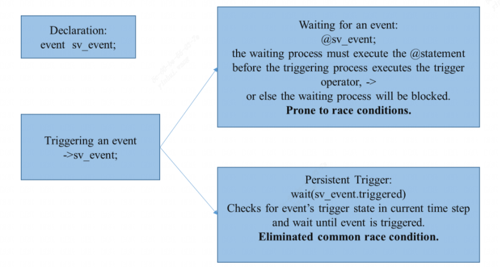
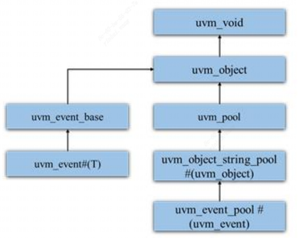
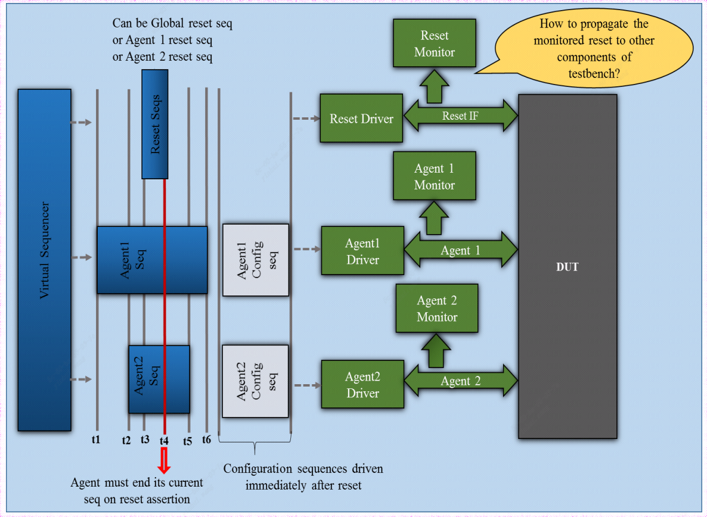
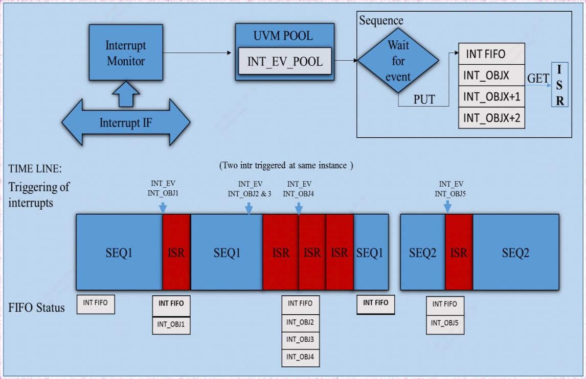

### 一、介绍

在验证环境中，验证平台的组件通常以同步的方式通信，以有效地实现时间精确的检查。System Verilog是专用且广泛使用的数据类型，用于实现组件之间所需的同步通信。UVM库中有一个内置、专用的类围绕SV event事件，这扩宽了基于事件通信的应用和使用，本文突出介绍 uvm_event的使用和优点。

### 二、System Verilog Event

SV的 event 是一种没有存储空间的数据类型。使用该数据类型事件(event)声明的标识符称为命名事件。正如图1所示，命名事件使用 “->”操作符被触发，并且一个正在触发的事件可以使用“@” 或内置 .triggered 方法 被捕获。命名事件和事件控制提供了两个或多个并发进程之间的通信和同步。

                                                 图1:  System Verilog event
### 三、UVM Events

uvm_event 是一个使用 System Verilog 事件构造创建的参数化包装类。它提供了一些额外的服务，如设置callback、数据传递、维护 waiter的数量、on/off 状态 和 计时信息等。

uvm_event 类是抽象 uvm_event_base类的扩展。图2显示了 uvm 类库中 uvm_event 的层次结构：
```systemverilog
	class uvm_event#(type T=uvm_object)extends uvm_object;
```
可选参数 T 允许用户定义可以在事件触发期间传递的数据类型。

										图2 ：uvm_event class 的层次结构
常用的 uvm_event方法有：

-tx-
| S. No   |         Method        |                 描述                     |
| : ----: | :----------------------------------: | :-----------------------------------------------------: |
| 1|trigger(T data=null) | 触发一个事件; 你可以将数据作为参数传递给等待触发的 trigger 函数。|
|2| wait_trigger()| 等待一个事件；等效于system verilog的 @ 操作符。|
|3| wait_ptrigger()|正在等待持久的trigger; 相等于system verilog的 .triggered,避免了任何竞争条件|
|4| get_trigger_data()|获取上次调用 trigger 时提供的数据(如果有的话)|
|5| wait_trigger_data(output T data)|调用 wait_trigger()，然后调用并返回get_trigger_data()的值|
|6| wait_trigger_pdata(output T data)|调用 wait_ptrigger(), 然后调用并返回 get_trigger_data()的值|

### 四、案例研究

#### 1. Reset 感知测试平台

处理动态复位是测试平台设计中的挑战之一。UVM 方法学中没定义必须如何处理动态复位。

复位是一个重大的破坏性事件，可以在任何时间点发生，确保芯片存在复位和恢复正常操作没有任何问题是非常重要的。

                                                    图3：Reset aware testbench
通常，我们会在任何给定的SoC进行多次复位，这增加了复位验证的复杂性，因为测试人员需要确保芯片中的所有IP/模块只对所需的复位做出反应，而忽略其余的复位。在测试台中必须考虑动态复位，并且必须进行任何内务管理(house keeping)，以仔细处理复位方案。

图3 是复位感知测试台的激励声明周期图和流程图。除了复位 Agent之外，环境中还有另外两个 Agent，它们可以分别通过应用 Agent1 复位 和 Agent2 复位，也可以通过应用全局复位同时复位。

图3 中的复位Agent 将持续监控复位接口，并且在成功捕捉到任何上述复位时触发复位事件。测试台中的所有其他组件将等待相应的复位事件触发。

以下是 Driver、Monitor、Scoreboard 和 Sequences这四个组件在捕捉复位事件的行为：

**Driver:**
-  不应再复位下驱动数据，并等待复位别删除.（如图3中的t4）
- 应停止驱动总线，并在复位应用程序上发送 item_done。(如图3中的t4)
- 如果在事务处理过程中没有复位，则必须完成事务处理。(如图3中的t5和t6)

**Monitor:**
- 应监测总线，并触发报告总线上未复位的情况错误。(图3中的t4)
- 如果在事务之间应用复位，则应将总线数据视为无效。(图3中的t4)

**Scoerboard:**
- 在应用复位时，必须刷新所有的FIFO。(图3中的t4)

**Sequences:**
- 复位后，应立即驱动配置序列，然后再驱动任何其他序列。(图3中的t6)

复位是IP的一个重要状态，因此需要设计测试台来适应和处理这种状态。以下是代码示例的简单步骤，可以使您的测试台具有复位意识：

**触发序列中断**：作为激励的一部分

触发全局复位事件：
```systemverilog
		global_reset_ev = cfg.event_pool.get("global_reset");
		global_reset_ev.trigger();
```

触发 Agent1 复位事件：
```systemverilog
		agent1_reset_ev = cfg.event_pool.get("agent1_reset");
		agent1_reset_ev.trigger();
```

触发 Agent2 复位事件：
```systemverilog
		agent2_reset_ev = cfg.event_pool.get("agent2_reset");
		agent2_reset_ev.trigger();
```

在复位感知组件中：组件将不得不等待相应的中断，并在成功接收到中断后实现其复位行为。

```systemverilog
		forever begin: Reset_service
			fork: capture_reset
			begin
				agentX_reset_ev.wait_ptrigger();
			end
			begin
				global_reset_ev.wait_ptrigger();
			end
			join
			reset_procedure();
		end
```
通过使用定制的uvm_phases，可以更好地控制动态复位。本文中的讨论仅限于uvm_event。

#### 2. RAL

寄存器抽象层是UVM 中流行的功能之一。UVM_RAL 提供了一些标准的回调方法，如 pre_write、pre_read、post_write、post_read、post_predict、encode 和 decode 方法。通过使用这些回调方法，可以在寄存器访问期间在所需位置添加所需的功能。

uvm_event 可用于从寄存器回调类到 Scoreboard、Reference mode、Sequence等其他组件的通信。采用 uvm_events进行RAL到TB的通信需要最少的测试台代码更改，而且通过uvm_event传递数据也很大帮助，尤其是在Scoerboard和Reference Mode。

创建一个 register callback 类：
```systemverilog
class trans_capture_cb extends uvm_reg_cbs;

	uvm_event#(uvm_reg_item)    wr_event;
	uvm_event#(uvm_reg_item)    rd_event;

	.....
	function new(...);
	.....
	endfunction 

	virtual function void post_write(uvm_reg_item rw);
		wr_event = cfg.event_pool.get("reg_write_event");
		// Triggering write event
		wr_event.trigger(rw);
	endfunction
	
	virtual function void post_read(uvm_reg_item rw);
		wr_event = cfg.event_pool.get("reg_read_event");
		// Triggering write event
		rd_event.trigger(rw);
	endfunction

endclass: trans_capture_cb
```

用户定义的 trans_capture_cb 回调类是通过扩展 uvm_reg_cbs 类创建的。post_write 和 post_read 方法被开发人员的方法覆盖。在重写的方法中，wr_event 和 rd_events从事件池中获取并触发，如上面代码所示。

Adding register callback with regsiters:
```systemverilog
	trans_capture_cb    trans_cap_cb;
	trans_cap_cb = new(...);
	uvm_reg_cb::add(env.reg_model.reg*, trans_cap_cb);
```

trans_capture_cb类被创建并添加到uvm_reg_cb队列中。当对寄存器执行读或写操作以进行寄存器时，回调对象会从队列中进行穿刺，并根据访问类型调用post_write或post_read函数。

从RAL中捕获事件：
```systemverilog
class ref_model extends uvm_component;
	// Declaring uvm_events for write and read
	uvm_event#(uvm_reg_item)    wr_event;
	uvm_event#(uvm_reg_item)    rd_event;
	uvm_reg_item    reg_wr;
	uvm_reg_item    reg_rd;
	uvm_object      reg_obj;

	....
	function new(....);
	....

	virtual function void build_phase(uvm_phase phase);
		wr_event = cfg.event_pool.get("reg_write_event");
		rd_event = cfg.event_pool.get("reg_read_event");
	endfunction: build_phase

	task run_phase(uvm_phase phase);
		fork
			forever begin
				wr_event.wait_ptrigger_data(reg_obj);
				if(!$cast(reg_wr,reg_obj)) begin `uvm_fatal(....) end
				process_wr_pkt(reg_wr);
			end
			forever begin
				rd_event.wait_ptrigger_data(reg_obj);
				if(!$cast(reg_rd,reg_obj)) begin `uvm_fatal(....) end
				process_wr_pkt(reg_rd);
			end
		join
	endtask: run_phase
endclass: uvm_component
```
在build_phase中，事件reg_write_event和reg_read_event从事件池中获取，并分别分配给本地wr_event与rd_event。

在run_phase中，将使用.wait_trigger_data方法派生线程以等待事件，一旦寄存器回调类触发事件，等待的线程就会捕获该事件。为了避免竞争条件，使用了作为持久触发器的wait_trigger_data方法，而不是普通触发器。

捕获uvm_event时，返回类型为uvm_object，它被强制转换为所需的uvm_reg_item对象类型。同样事件可以在测试台的其他组件上使用，只要它们可以访问相关的uvm_pool。

如果使用了TLM/Mailbox而不是uvm_event；这将导致测试台层次结构的多个级别发生变化，如果要将对象广播到多个组件，则必须建立到每个组件的单独连接，并且只有结构组件才能通过TLM连接，这需要序列和sequence_item的不同通信模式。

#### 3. 中断

中断处理时任何验证环境的必备功能。中断是指在满足某些条件后，由设计或IP块触发的事件; CPU必须为这些事件提供服务。CPU在为中断提供服务时的操作——中断服务程序(ISR)。

                                            图5：Interrupt Mechanism using uvm_events
现在，让我们关注uvm_events如何在这种情况下使用；图5中的中断监视器监视中断接口上的中断信号。每当检测到中断时，它都会触发一个事件，该事件会在配置类中声明的全局uvm_event_pool中注册。基本虚拟序列将持续等待中断事件的发生。一旦事件被捕获，所传递的数据和事件一起被推送到FIFO。

序列中的ISR方法在永久运行的虚拟序列中弹出，循环为FIFO弹出中断信息，并使用grab（）方法获得当前序列器的独占访问并相应执行。它将在序列完成之前使用ungrab（）方法，以便上一个/下一个序列继续执行。

如图5所示，在执行SEQ1时，出现了中断INT_EV1。一旦该事件被序列捕获，中断FIFO将填充随事件一起发送的数据（INT_OBJ1），ISR序列将弹出中断信息INT_OBJ 1使用grab（）方法获得序列器的独占访问，从而停止SEQ1并处理对ISR的控制。ISR完成后，序列发生器由ungra()释放，SEQ1从停止的位置恢复。

以下伪代码解释了如何在中断机制中使用 uvm_event。

**a. Monitor:** 中断监视器检查中断信号并触发事件。
```systemverilog
	class isr_monitor extends uvm_monitor;
		trans_c    trans;
		// isr event declaration
		uvm_event#(trans_c)    isr_event;

		function void build_phase(uvm_phase phase);
			isr_event = cfg.event_pool.get("interrupt_event");
		endfunction: build_phase

		task run_phase(uvm_phase phase);
			forever begin
				// Capturing and triggering the event
				@(poedge isr_if.int_n)
				isr_event.trigger(trans);
			end
		endtask: run_phase
	endclass
```

**b. Configuration:**   配置类具有全局 uvm_event pool
```systemverilog
	class env_cfg extends uvm_object;
		// event pool declaration
		uvm_pool_event    event_pool;

	endclass: env_cfg
```

**c. Test:**  Test 有一个 event_pool 声明，它是在build_phase 中创建，并被分配给cfg中的事件池。
```systemverilog
	class env_base_test extends uvm_test;
		uvm_event_pool    evt_pool;

		function build_phase(uvm_phase phase);
			evt_pool=uvm_event_pool.get_global_pool();
			env_cfg.event_pool=evt_pool;
		endfunction: build_phase
		
	endclass: env_base_test
```

**d. Sequence:** ISR 序列等待中断事件，获取当前的 sequencer 并为中断提供服务。
```systemverilog
	class isr_seq extends uvm_sequence;
		trans_c    trans;
		// isr event declarartion
		uvm_event#(trans_c) isr_event;

		task body();
			// Waiting for the isr event to trigger
			isr_event.wait_ptrigger_data(trans);
			// Strore the event in queue
			// grab the sequencer
			m_sequencer.grab(this);
			// isr scenario
			m_sequencer.ungrab(this);
		endtask
	endclass: isr_seq
```

#### 4. Callbacks
回调是一段可执行代码，作为参数传递给其他代码，期望其他代码在方便的时候回调(执行)参数。UVM回调用于添加新功能，而无需创建庞大的OOP层次结构。

uvm_event内置了 add 和 delect 回调方法。uvm_event_callback 类是一个抽象类，用于创建一个回调对象，该对象附加到 uvm_event#(T)，如下代码所示。
```systemverilog
	virtual class uvm_event_callback#(type T = uvm_object) extends uvm_object;
```
uvm_event_callback类有两个空的虚拟方法。用户必须创建一个从 uvm_event_callback扩展的回调类，并且必须覆盖虚拟方法来实现所需的功能。

回调支持是支持任何VIP的主要功能之一。作者一直在使用 uvm_event作为回调的占位符，以减少添加单独回调的开销。以下是实现这一目标的方法：

**a)** 在VIP组成部分的战略位置触发事件：
```systemverilog
class vip_component extends uvm_driver;
	// Declaration uvm_event for type transaction class
	uvm_event#(trans)    ev1;
	uvm_event#(trans)    ev2;
	uvm_event#(trans)    ev3;

	function new(...);
		super.new(...);
	endfunction

	virtual function void build_phase(uvm_phase phase);
		super.build_phase(phase);
		ev1 = uvm_event_pool::get_global("ev1");
		ev2 = uvm_event_pool::get_global("ev2");
		ev3 = uvm_event_pool::get_global("ev3");
	endfunction: build_phase

	task run_phase(uvm_phase phase);
		vip_pkt    pkt;
		start(pkt);
		->ev1.trigger(pkt);
		process(pkt);
		->ev2.trigger(pkt);
		end(pkt);
		->ev3.trigger(pkt);
	endtask: run_phase
endclass: vip_component
```

在所有VIP组件中，在uvm_event_pool中注册的事件都会在正确的位置触发。在上面代码中事件 ev1、ev2和ev3用关键字"ev1"、“ev2”和“ev3”注册到全局事件池中。在向全局事件池注册时，get_global方法会检查事件池数组中是否存在元素，如果不存在则会创建事件并为其分配键。

**b)** 请使用 uvm_event_callback类通过放置uvm_events标记的预定义点添加事件。

在下面代码中，user_event_callback类是从uvm_event_callback类扩展而来。uvm_event_callback类内置 pre_trigger()和post_trigger()方法，前者在事件触发前执行，后者在事件触发后执行。在pre_trigger方法中可以添加在事件触发之前必须执行的功能，在post_trigger方式中可以添加事件触发之后必须执行的函数。
```systemverilog
class user_event_callback extends uvm_event_callback#(trans);
	`uvm_object_utils(user_event_callback)

	function new(string name ="user_event_callback"); 
		super.new(name); 
	endfunction : new 
	virtual function bit pre_trigger(uvm_event ev, trans pkt); 
		//update logic-we can change trans/data before triggering event 
	endfunction virtual function bit post_trigger(uvm_event ev, trans pkt);  
		//update logic-we can change data/trans after triggering event 
	endfunction	
	
endclass
```
添加回调到 events:
```systemverilog
class my_test extends uvm_test;
	`uvm_component_utils(my_test)

	uvm_event   ev1;
	uvm_event_pool evt_pool=uvm_event_pool::get_global_pool();
	user_event_callback   cb_event;

	function new(string name = "my_env", uvm_component parent=null);
		super.new(name,parent); 
		ev1 = evt_pool.get(“ev1”); 
	endfunction 
	
	virtual function void build_phase(uvm_phase phase); 
		super.build_phase(phase); 
		//to add call backs 
		ev1.add_callback(cb_event); 
		…… 
		//to delete callbacks 
		ev2.delete_callback(cb_event); 
	endfunction

endclass: my_test
```
一旦回调类被编码为user_uvm_callback类的实例，它就会被创建为名称cb_event。通过使用方法add_callback中内置的uvm_event将cb_event添加到事件类中，并使用方法delete_callback来删除回调。在上面的代码中，作者感兴趣的是仅在事件ev1处处理数据包。类似地，可以在位置ev2和ev3处引入回调。

### 五、结论
uvm_event和事件池在验证环境中提供多个线程或并发进程之间的同步。据观察，通过使用uvm_event，我们可以在不对现有测试台进行重大更改的情况下实现更好的同步。围绕传统系统Verilog事件的uvm_event包装类添加了一些方法，使uvm_events适用于更广泛、更复杂的应用程序，而不仅仅是同步。

### 论文连接
[# A 360 Degree View of UVM Events – A Case Study](https://dvcon-proceedings.org/document/a-360-degree-view-of-uvm-events-a-case-study/)