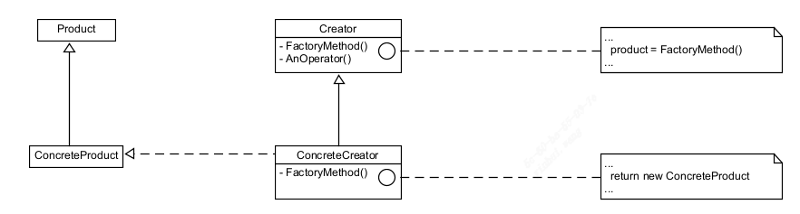
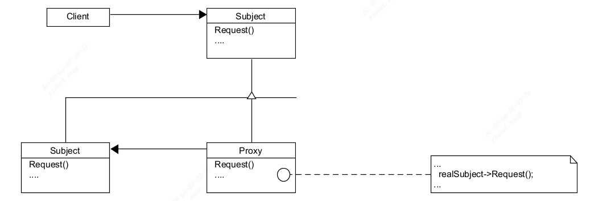
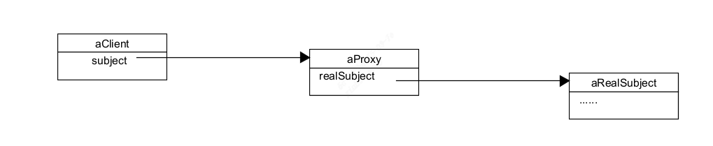
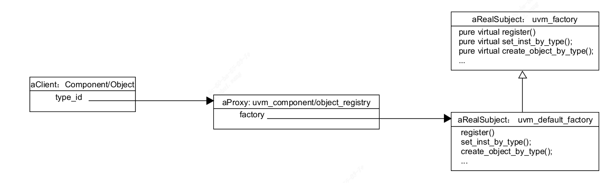
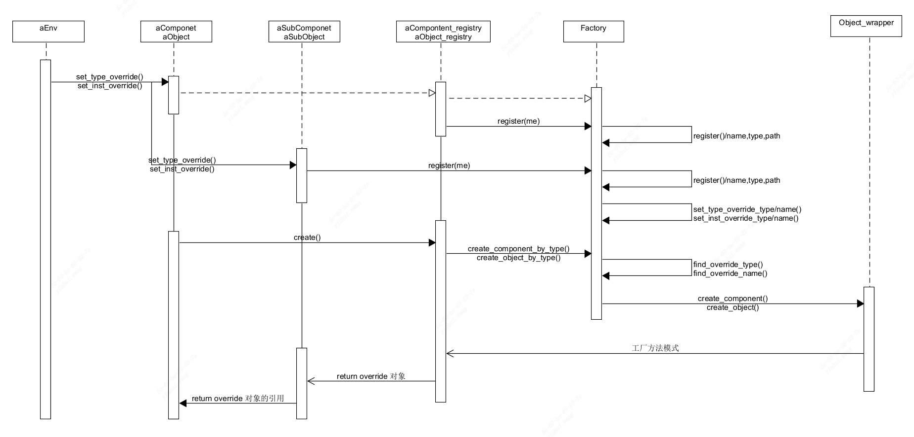

### 预备知识—— ①工厂方法(Factory Method)模式

#### 1. 意图
  定义一个用于创建对象的接口，让子类决定实现哪一个类。Factory Method 使一个类的实例化延迟到其子类。
  
#### 2. 动机
  框架使用抽象类定义和维护对象之间的关系。这些对象的创建通常由框架负责。
  
#### 3. 适用性
  在下列情况下可以使用 Factory Method 模式：

  *  当一个类不知道它所必须创建的对象的类的时候。
  *  当一个类希望由它的子类来指定它所创建的对象的时候。
  *  当类将创建对象的职责委托给多个帮助子类中的某一个，并且你希望将哪一个帮助子类是代理者这一信息局部化的时候。

#### 4. 结构


#### 5. 参与者
- Product
	— 定义工厂方法所创建的对象的接口。
- ConcreteProduct
	— 实现 Product 接口。
- Creator
	— 声明工厂方法，该方法返回一个 Product 类型的对象。Creator 也可以定义一个工厂方法的缺省实现，它返回一个缺省的 ConcreteProduct 对象。
	— 可以调用工厂方法以创建一个Product 对象。
- ConcreteCreator
	— 重定义工厂方法以返回一个 ConcreteProduct 实例。

#### 6. 协作
- Creator 依赖于它的子类来定义工厂方法，所以它返回一个适当的 ConcreateProduct 实例。

#### 7. 效果

工厂方法不再将与特定应用有关的类绑定到你的代码中。代码仅处理 Product 的接口，因此它可以与用户定义的任何 ConcreteProduct 类一起使用。

下面是 Factory Method 模式的两外两种效果：
	1） **为子类提供钩子(Hook)**  用工厂方法在一个类的内部创建对象往往比直接创建对象更灵活。Factory Method 给子类一个钩子以提供对象的扩展版本。
	2)   **连接平行的类层次**    当一个类将它的职责委托给一个独立的类的时候，就产生了平行类层次。

#### 8. 实现

当应用 Factory Method 模式时要考虑下面一些问题：
1）**主要有两种不同的情况**  Factory Method 模式主要有两种不同的情况：
	①  Creator 类是一个抽象类并且不提供它所声明的工厂方法实现；
	②   Creator 类是一个具体的类而为工厂方法提供一个缺省的的实现。也有可能定义一个缺省实现的抽象类，但是这不太常见。

 第一种情况需要子类来定义实现，因为没有合理的缺省实现。它避免了不得不实例化不可预见类的问题。在第二种情况中，具体的 Creator 主要由于灵活性才使用工厂方法。它所遵循的准则是，“用一个独立的操作创建对象，这样子类才能重定义它们的创建方法。”这条准则保证了子类的设计者能够在必要的时候改变父类所实例化的对象的类。

### 预备知识—— ② 代理模式 (Proxy)

#### 1. 意图

为其他对象提供一种代理以控制对这个对象的访问。

#### 2. 动机

对一个对象进行**访问控制**的一个原因是只有我们确实需要这个对象时才对它进行创建和初始化。

#### 3. 适用性

在需要用比较通用和复杂的对象指针代替简单的指针的时候，使用 Proxy 模式。下面是一些可以使用 Proxy 模式的常见情况：
	(1) **远程代理**(Remote Proxy) 为一个对象在不同的地址空间提供局部代表。
	(2) **虚代理**(Virtual Proxy) 根据需要创建开销很大的对象。
	(3) **保护代理** (Protection Proxy) 控制对原对象的访问。保护代理用于对象应该有不同的访问权限的时候
	(4) **智能指引** (Smart Reference) 取代了简单的指针，它在访问对象时执行一些附加操作。它的典型用途包括：
		- 对指向实际对象的引用计数，这样当该对象没有引用时，可以自动释放它(也称为 Smart Pointer)。
		- 当第一次引用一个持久对象时，将它装入内存。
		- 在访问实际对象前，检查是否已经锁定了它，以确保其他对象不能改变它。

#### 4. 结构



这是运行时一种可能的代理结构的对象图。



#### 5. 参与者

- **Proxy**
	- 保存一个引用使得代理可以访问实体。若RealSubject 和 Subject 的接口相同，Proxy 会引用Subject。
	- 提供一个与Subject的接口相同的接口，这样代理就可以用来替代实体。
	- 控制对实体的存取，并可能负责创建和删除它。
	 其他功能依赖于代理的类型：
	 - Remote Proxy 负责对请求及其参数进行编码，并向不同地址空间中的实体发送已编码的请求。
	 - Virtual Proxy 可以缓存实体的附加信息，以便延迟对它的访问。
	 - Protection Proxy 检查调用者是否实现了一个请求所需的访问权限。
- **Subject**
	- 定义 RealSubject 和 Proxy 的共用接口，这样就在任何使用 RealSubject 的地方都可以使用 Proxy。
- RealSubject
	- 定义 Proxy 所代表的实体。

#### 6. 协作

代理根据其种类，在适当的时候向 RealSubject 转发请求。


### 二、UVM 中的 Factory 机制

UVM工厂的目的是允许用派生类型的对象替换一种类型的对象而无需更改测试台的结构或编辑测试台代码。所使用的机制被称为覆盖，覆盖可以按实例或类型进行。此功能对于更改序列功能或用于将组件的一个版本更改为另一个版本。任何要更换的部件都必须多态性相容。这包括具有所有相同的TLM接口句柄，并且必须创建TLM对象通过新的更换部件。此外，为了利用工厂的某些编码约定需要遵守。

#### 2.1 UVM Factory 编码约定 1：Registration(注册)

Component 和 Object 必须包含以下元素组成的 Factory Register 代码：
- An uvm_component_registry wrapper or uvm_object_registry, typedefed to type_id
- A static function to get the type_id
- A function to get the type name


```systemverilog
class my_component extends uvm_component;

	// Wrapper class around the component class that is used within the factory
	typedef uvm_component_registry #(my_component, "my_component")  type_id;

	// Used to get the type_id wrapper
	static function type_id get_type();
		return type_id::get();
	endfunction: get_type

	// Used to get the type_name as a string
	function string get_type_name();
		return "my_component";
	endfunction: get_type_name

	...

endclass: my_component

class my_object extends uvm_object;

	// Wrapper class around the component class that is used within the factory
	typedef uvm_object_registry #(my_object, "my_object")  type_id;

	// Used to get the type_id wrapper
	static function type_id get_type();
		return type_id::get();
	endfunction: get_type

	// Used to get the type_name as a string
	function string get_type_name();
		return "my_component";
	endfunction: get_type_name

	...

endclass: my_object
```

uvm_component_registry 和 uvm_object_register 是一种 wrapper class (包装类) 用于 register(注册) objects 和 components的轻量级**代理**。该代理类可以有效地向 <uvm_factory> 注册。如果没有该代理类，注册需要将对象本身的一个实例。
要 register (注册) 一个特定的的object 和 component 类型，只需要 typedef 它的 wrapper class 的特例，这通常是在类内完成的。

uvm_object_registry 的源码(uvm_registry.svh)：
```systemverilog
class uvm_object_registry #(type T=uvm_object, string Tname="<unknown>")
                                        extends uvm_object_wrapper;

  typedef uvm_object_registry #(T,Tname) this_type;

  // Function: create_object
  // Creates an object of type ~T~ and returns it as a handle to a
  // <uvm_object>. This is an override of the method in <uvm_object_wrapper>.
  // It is called by the factory after determining the type of object to create.
  // You should not call this method directly. Call <create> instead.
  virtual function uvm_object create_object(string name="");

    T obj;

`ifdef UVM_OBJECT_DO_NOT_NEED_CONSTRUCTOR
    obj = new();

    if (name!="")
      obj.set_name(name);
`else
    if (name=="") obj = new();
    else obj = new(name);

`endif
    return obj;
  endfunction

  const static string type_name = Tname;

  // Function: get_type_name
  // Returns the value given by the string parameter, ~Tname~. This method
  // overrides the method in <uvm_object_wrapper>.
  virtual function string get_type_name();
    return type_name;
  endfunction

  local static this_type me = get();

  // Function: get
  // Returns the singleton instance of this type. Type-based factory operation
  // depends on there being a single proxy instance for each registered type.
  static function this_type get();
    if (me == null) begin
      uvm_coreservice_t cs = uvm_coreservice_t::get();                                   
      uvm_factory factory=cs.get_factory();
      me = new;
      factory.register(me);
    end
    return me;
  endfunction
  
  // Function: create
  // Returns an instance of the object type, ~T~, represented by this proxy,
  // subject to any factory overrides based on the context provided by the
  // ~parent~'s full name. The ~contxt~ argument, if supplied, supersedes the
  // ~parent~'s context. The new instance will have the given leaf ~name~,
  // if provided.

  static function T create (string name="", uvm_component parent=null,
                            string contxt="");

    uvm_object obj;
    uvm_coreservice_t cs = uvm_coreservice_t::get();                                     
    uvm_factory factory=cs.get_factory();

    if (contxt == "" && parent != null)
      contxt = parent.get_full_name();

    obj = factory.create_object_by_type(get(),contxt,name);

    if (!$cast(create, obj)) begin
      string msg;
      msg = {"Factory did not return an object of type '",type_name,
        "'. A component of type '",obj == null ? "null" : obj.get_type_name(),
        "' was returned instead. Name=",name," Parent=",
        parent==null?"null":parent.get_type_name()," contxt=",contxt};
      uvm_report_fatal("FCTTYP", msg, UVM_NONE);
    end
  endfunction

  // Function: set_type_override
  // Configures the factory to create an object of the type represented by
  // ~override_type~ whenever a request is made to create an object of the type
  // represented by this proxy, provided no instance override applies. The
  // original type, ~T~, is typically a super class of the override type.

  static function void set_type_override (uvm_object_wrapper override_type,
                                          bit replace=1);

    uvm_coreservice_t cs = uvm_coreservice_t::get();
    uvm_factory factory=cs.get_factory();
    factory.set_type_override_by_type(get(),override_type,replace);
  endfunction

  // Function: set_inst_override
  // Configures the factory to create an object of the type represented by
  // ~override_type~ whenever a request is made to create an object of the type
  // represented by this proxy, with matching instance paths. The original
  // type, ~T~, is typically a super class of the override type.
  // If ~parent~ is not specified, ~inst_path~ is interpreted as an absolute
  // instance path, which enables instance overrides to be set from outside
  // component classes. If ~parent~ is specified, ~inst_path~ is interpreted
  // as being relative to the ~parent~'s hierarchical instance path, i.e.
  // ~{parent.get_full_name(),".",inst_path}~ is the instance path that is
  // registered with the override. The ~inst_path~ may contain wildcards for
  // matching against multiple contexts.
  static function void set_inst_override(uvm_object_wrapper override_type,
                                         string inst_path,
                                         uvm_component parent=null);

    string full_inst_path;

    uvm_coreservice_t cs = uvm_coreservice_t::get();                                                    
    uvm_factory factory=cs.get_factory();

    if (parent != null) begin
      if (inst_path == "")
        inst_path = parent.get_full_name();
      else
        inst_path = {parent.get_full_name(),".",inst_path};
    end
    factory.set_inst_override_by_type(get(),override_type,inst_path);
  endfunction
endclass
```
uvm_component_registry 的源码(uvm_registry.svh)：
```systemverilog
class uvm_component_registry #(type T=uvm_component, string Tname="<unknown>")
                                           extends uvm_object_wrapper;
  typedef uvm_component_registry #(T,Tname) this_type;

  // Function: create_component
  // Creates a component of type T having the provided ~name~ and ~parent~.
  // This is an override of the method in <uvm_object_wrapper>. It is
  // called by the factory after determining the type of object to create.
  // You should not call this method directly. Call <create> instead.

  virtual function uvm_component create_component (string name,
                                                   uvm_component parent);
    T obj;
    obj = new(name, parent);
    return obj;
  endfunction
  
  const static string type_name = Tname;

  // Function: get_type_name
  // Returns the value given by the string parameter, ~Tname~. This method
  // overrides the method in <uvm_object_wrapper>.

  virtual function string get_type_name();
    return type_name;
  endfunction

  local static this_type me = get();

  // Function: get
  // Returns the singleton instance of this type. Type-based factory operation
  // depends on there being a single proxy instance for each registered type.
  static function this_type get();
    if (me == null) begin
      uvm_coreservice_t cs = uvm_coreservice_t::get();                          
      uvm_factory factory=cs.get_factory();
      me = new;
      factory.register(me);
    end
    return me;
  endfunction

  // Function: create
  // Returns an instance of the component type, ~T~, represented by this proxy,
  // subject to any factory overrides based on the context provided by the
  // ~parent~'s full name. The ~contxt~ argument, if supplied, supersedes the
  // ~parent~'s context. The new instance will have the given leaf ~name~
  // and ~parent~.

  static function T create(string name, uvm_component parent, string contxt="");
    uvm_object obj;
    uvm_coreservice_t cs = uvm_coreservice_t::get();                                     
    uvm_factory factory=cs.get_factory();

    if (contxt == "" && parent != null)
      contxt = parent.get_full_name();
    
    obj = factory.create_component_by_type(get(),contxt,name,parent);

    if (!$cast(create, obj)) begin
      string msg;
      msg = {"Factory did not return a component of type '",type_name,
        "'. A component of type '",obj == null ? "null" : obj.get_type_name(),
        "' was returned instead. Name=",name," Parent=",
        parent==null?"null":parent.get_type_name()," contxt=",contxt};
      uvm_report_fatal("FCTTYP", msg, UVM_NONE);
    end
  endfunction

  // Function: set_type_override
  // Configures the factory to create an object of the type represented by
  // ~override_type~ whenever a request is made to create an object of the type,
  // ~T~, represented by this proxy, provided no instance override applies. The
  // original type, ~T~, is typically a super class of the override type.

  static function void set_type_override (uvm_object_wrapper override_type,
                                          bit replace=1);
    uvm_coreservice_t cs = uvm_coreservice_t::get();
    uvm_factory factory=cs.get_factory();                                          
    factory.set_type_override_by_type(get(),override_type,replace);
  endfunction

  // Function: set_inst_override
  // Configures the factory to create a component of the type represented by
  // ~override_type~ whenever a request is made to create an object of the type,
  // ~T~, represented by this proxy,  with matching instance paths. The original
  // type, ~T~, is typically a super class of the override type.
  // If ~parent~ is not specified, ~inst_path~ is interpreted as an absolute
  // instance path, which enables instance overrides to be set from outside
  // component classes. If ~parent~ is specified, ~inst_path~ is interpreted
  // as being relative to the ~parent~'s hierarchical instance path, i.e.
  // ~{parent.get_full_name(),".",inst_path}~ is the instance path that is
  // registered with the override. The ~inst_path~ may contain wildcards for
  // matching against multiple contexts.

  static function void set_inst_override(uvm_object_wrapper override_type,
                                         string inst_path,
                                         uvm_component parent=null);

    string full_inst_path;
    uvm_coreservice_t cs = uvm_coreservice_t::get();                                     
    uvm_factory factory=cs.get_factory();
    if (parent != null) begin
      if (inst_path == "")
        inst_path = parent.get_full_name();
      else
        inst_path = {parent.get_full_name(),".",inst_path};
    end
    factory.set_inst_override_by_type(get(),override_type,inst_path);
  endfunction

endclass
```

uvm_factory 类是纯虚类，只提供接口。uvm_default_factory 类是uvm_factory 类的派生类，并且实现了uvm_factory的接口。uvm_component/object_registry是uvm_factory的轻量级代理类，它可以方便的控制对 uvm_factory 的访问如：register、create、set_type_override等。

它们之间的结构图：



uvm_factory 的代码(Ref: uvm_factory.svh)
```systemverilog

virtual class uvm_factory;

	static function uvm_factory get();
		uvm_coreservice_t   s;
		s = uvm_coreservice_t::get();
		return s.get_factory();
	endfunction

	pure virtual function void register(uvm_object_wrapper obj);

	// Group: Type & Instanece Overrides
	pure virtual function void set_inst_override_by_type(uvm_object_wrapper original_type, uvm_object_wrapper override_type, string full_inst_path);

	pure virtual function void set_inst_override_by_name(string original_type_name, string override_type_name, string full_inst_path);

	....

	// Group: Creation
	pure virtual function 
	uvm_object    create_object_by_type    (uvm_object_wrapper requested_type,  
                                              string parent_inst_path="",
                                              string name="");

	pure virtual function
    uvm_component create_component_by_type (uvm_object_wrapper requested_type,  
                                              string parent_inst_path="",
                                              string name, uvm_component parent);

	....

	// Group find override by type/name
	pure virtual function
    uvm_object_wrapper find_override_by_type (uvm_object_wrapper requested_type,
                                                string full_inst_path);

    pure virtual function
    uvm_object_wrapper find_override_by_name (string requested_type_name,
                                                string full_inst_path);

	....
endclass: uvm_factory
```

UVM Factory 为了能够实现类型和实例的覆盖的功能，其在 uvm_default_factory 的内部创建了一个Table，其用来保存 full_inst_path、original_type_name、override_type_name、original_type、override_type。所以在对象创建之前需要将基类和派生类的上述这些参数通过 register() 和 set_type/name_override_type_name() 等函数注册到uvm_factory中的表格中。对象通过静态函数 create() 进行创建，在此过程中通过 find_override_by_name/type() 函数进行**查表**得到original_type/name 对应的 override_type/name，然后通过工厂方法 crete_component() 和 create_object() 创建对象。

create_component() 和 create_object() 的工厂方法的结构图：


UVM Factory 运行时序图：



Register Code 具有固定的规则模式，因此 UVM 将这些规则模式封装成 Macros(宏)，以方便用户安全便捷的使用。

\`uvm_object_*_utils 的定义如下(uvm_object_defines.svh):

```systemverilog
`define uvm_object_utils(T) \
  `uvm_object_utils_begin(T) \
  `uvm_object_utils_end

`define uvm_object_param_utils(T) \
  `uvm_object_param_utils_begin(T) \
  `uvm_object_utils_end

`define uvm_object_utils_begin(T) \
   `m_uvm_object_registry_internal(T,T)  \
   `m_uvm_object_create_func(T) \
   `m_uvm_get_type_name_func(T) \
   `uvm_field_utils_begin(T)
  
`define uvm_object_param_utils_begin(T) \
   `m_uvm_object_registry_param(T)  \
   `m_uvm_object_create_func(T) \
   `uvm_field_utils_begin(T)

`define uvm_object_utils_end \
     end \
   endfunction \


//This is needed due to an issue in of passing down strings
//created by args to lower level macros.
`define m_uvm_object_registry_internal(T,S) \
   typedef uvm_object_registry#(T,`"S`") type_id; \
   
   static function type_id get_type(); \
     return type_id::get(); \
   endfunction \

   virtual function uvm_object_wrapper get_object_type(); \
     return type_id::get(); \
   endfunction


`define m_uvm_object_create_func(T) \
   function uvm_object create (string name=""); \
     T tmp; \
`ifdef UVM_OBJECT_DO_NOT_NEED_CONSTRUCTOR \
     tmp = new(); \
     if (name!="") \
       tmp.set_name(name); \
`else \
     if (name=="") tmp = new(); \
     else tmp = new(name); \
`endif \
     return tmp; \
   endfunction


`define m_uvm_get_type_name_func(T) \
   const static string type_name = `"T`"; \
   virtual function string get_type_name (); \
     return type_name; \
   endfunction


// These macros do ~not~ perform factory registration nor implement the
// ~get_type_name~ and ~create~ methods. Use this form when you need custom
// implementations of these two methods, or when you are setting up field macros
// for an abstract class (i.e. virtual class).
`define uvm_field_utils_begin(T) \
   function void __m_uvm_field_automation (uvm_object tmp_data__, \
                                     int what__, \
                                     string str__); \
   begin \
     T local_data__; /* Used for copy and compare */ \
     typedef T ___local_type____; \
     string string_aa_key; /* Used for associative array lookups */ \
     uvm_object __current_scopes[$]; \
     if(what__ inside {UVM_SETINT,UVM_SETSTR,UVM_SETOBJ}) begin \
        if(__m_uvm_status_container.m_do_cycle_check(this)) begin \
            return; \
        end \
        else \
            __current_scopes=__m_uvm_status_container.m_uvm_cycle_scopes; \
     end \
     super.__m_uvm_field_automation(tmp_data__, what__, str__); \
     /* Type is verified by uvm_object::compare() */ \
     if(tmp_data__ != null) \
       /* Allow objects in same hierarchy to be copied/compared */ \
       if(!$cast(local_data__, tmp_data__)) return;


`define m_uvm_object_registry_param(T) \
   typedef uvm_object_registry #(T) type_id; \
   static function type_id get_type(); \
     return type_id::get(); \
   endfunction \

   virtual function uvm_object_wrapper get_object_type(); \
     return type_id::get(); \
   endfunction
```

\`uvm_object_*_utils 的定义如下(uvm_object_defines.svh):
```systemverilog
`define uvm_component_utils(T) \
   `m_uvm_component_registry_internal(T,T) \
   `m_uvm_get_type_name_func(T) \


`define uvm_component_param_utils(T) \
   `m_uvm_component_registry_param(T) \
  

`define uvm_component_utils_begin(T) \
   `uvm_component_utils(T) \
   `uvm_field_utils_begin(T)
  

`define uvm_component_param_utils_begin(T) \
   `uvm_component_param_utils(T) \
   `uvm_field_utils_begin(T)


`define uvm_component_utils_end \
     end \
   endfunction


//This is needed due to an issue in of passing down strings
//created by args to lower level macros.
`define m_uvm_component_registry_internal(T,S) \
   typedef uvm_component_registry #(T,`"S`") type_id; \
   static function type_id get_type(); \
     return type_id::get(); \
   endfunction \

   virtual function uvm_object_wrapper get_object_type(); \
     return type_id::get(); \
   endfunction


`define m_uvm_get_type_name_func(T) \
   const static string type_name = `"T`"; \
   virtual function string get_type_name (); \
     return type_name; \
   endfunction


`define m_uvm_component_registry_param(T) \
   typedef uvm_component_registry #(T) type_id; \
   static function type_id get_type(); \
     return type_id::get(); \
   endfunction \

   virtual function uvm_object_wrapper get_object_type(); \
     return type_id::get(); \
   endfunction


`define uvm_field_utils_begin(T) \
   function void __m_uvm_field_automation (uvm_object tmp_data__, \
                                     int what__, \
                                     string str__); \
   begin \
     T local_data__; /* Used for copy and compare */ \
     typedef T ___local_type____; \
     string string_aa_key; /* Used for associative array lookups */ \
     uvm_object __current_scopes[$]; \
     if(what__ inside {UVM_SETINT,UVM_SETSTR,UVM_SETOBJ}) begin \
        if(__m_uvm_status_container.m_do_cycle_check(this)) begin \
            return; \
        end \
        else \
            __current_scopes=__m_uvm_status_container.m_uvm_cycle_scopes; \
     end \
     super.__m_uvm_field_automation(tmp_data__, what__, str__); \
     /* Type is verified by uvm_object::compare() */ \
     if(tmp_data__ != null) \
       /* Allow objects in same hierarchy to be copied/compared */ \
       if(!$cast(local_data__, tmp_data__)) return;
```

上述 UVM Macro 的使用示例：
```systemverilog
// For a class derived from an object (uvm_object, uvm_transaction)
class my_item extends uvm_sequence_item;

	`uvm_object_utils(my_item)

endclass

//  For a parameterised object class
class muy_item #(int ADD_WIDTH=20, int DATA_WIDTH=20) extends uvm_sequence_item;

	typedef my_item #(ADD_WIDTH, DATA_WIDTH) this_t
	
	`uvm_object_param_utils(this_t)

endclass

// For a component
class my_component extends uvm_component;

	`uvm_component_utils(my_component)

endclass

// For a parameterised component
class my_param_component #(int ADD_WIDTH=20, int DATA_WIDTH=23) extends uvm_component;

	typedef my_param_component #(ADD_WIDTH, DATA_WIDTH) this_t

	`uvm_component_param_utils(this_t)

endclass
```

#### 2.2 UVM Factory 编码约定2：Constructor Defaults

uvm_component和uvm_object构造函数是虚拟方法，这意味着用户必须遵循原型模板。为了在build phase支持延期constrction，Factory Constructor应包含构造函数参数的默认值。这允许在Factory内部使用默认值和类的属性被重新分配给通过的create方法传递的参数uvm_component_registry包装类。组件和对象的默认值不同：
```systemverilog
// For a component
class my_component extends uvm_component;
	....

	function new(string name="my_component", uvm_component parent=null);
		super.new(name, parent);
	endfunction: new
	
	....
endclass: my_component

// For an object
class my_item extends uvm_object;
	....

	function new(string name="my_item");
		super.new(name);
	endfunction: new

	....
endclass: my_item
```

#### 2.3 UVM Factory 编码约定3：Component and Object creation

测试台组件是在build phase 使用uvm_component_registry的create方法创建的。这首先构造类，然后在具有name和parent参数分配正确。对于组件，构建过程是自上而下的，这允许更高的级别组件和配置，以控制实际构建的内容。

对象类是根据需要创建的，再次使用create方法。

以下代码片段说明了如何做到这一点：
```systemverilog
class env extends uvm_env;
	....

	my_component m_my_component;
	my_param_component #(.ADDR_WIDTH(32), .DATA_WIDTH(32))  m_my_p_component;

	// Constructor & registration macro left out


	// Component and Parameterized Component create examples
	function void build_phase(uvm_phase phase);

		m_my_conponent = my_component::type_id::create("m_my_component", this);
		m_my_p_component = my_param_component #(32, 32)::type_id::create("m_my_p_component", this);	
	endfunction: build_phase
	
	task run_phase();
		my_seq test_seq;
		my_param_seq #(.ADDR_WIDTH(32), .DATA_WIDTH(32)) p_test_seq;
		
		// Object and Parameterized object create examples
		test_seq = my_seq::type_id::create("test_seq");
		p_test_seq = my_param_seq::type_id::create("p_test_seq");

	endtask: run_phase

	....
endclass: env
```

### 三、使用 Factory Overrides

UVM Factory 允许一个类在构造时被派生类型的另一个类替换。这对于通过用一个类替换另一个类来改变测试台的行为非常有用，而无需编辑或重新编译测试台代码。为了使 Factory 覆盖过程发挥作用，需要遵循许多编码约定先决条件，这些先决条件在关于UVM Factory的文章中进行了解释。

UVM Factory 可以被认为是一个查找表

UVM工厂可以被认为是一个查找表。当使用＜type>::type_id::create("＜name＞"，＜parent＞）方法时，真正发生的情况是 type_id 用于选择 Factory 类的组件包装器，构造其内容并再次将结果句柄传回。Factory Override(覆盖)改变了查找的方式，因此查找原始type_id会导致使用不同的type_id。因此，将返回一个不同类型的构造对象的句柄。这种技术依赖于多态性，即能够使用基类型句柄引用派生类型的能力。在实践中，只有当父类被类扩展层次结构中的一个子类覆盖时，覆盖才会起作用。

#### 3.1 Component Override

UVM 中有两种类型的 Component Override —— Type override 和 Instance override。

##### Component Type Overrides

Type override 意味着每次在testbench结构中创建组件类类型时，都会在其位置创建一个替代类型。这使用于该组件类型的所有实例，以下代码片段中说明了对这种类型的重写的方法的调用：
```systemverilog
// Colour parent class
class colour extends uvm_component;

	`uvm_component_utils(colour)

	....
endclass: colour


// Red child class
class red extends colour;

	`uvm_component_utils(red)

	....
endclass: red

//
// Factory type override syntax is :
//
// <original_type>::type_id::set_type_override(<substitute_type>::get_type(), replace);
//
// Where replace is a bit which when ==1 enables the override of an existing override, otherwise the existing override is honoured.

// To override all instance of colour with red:
colour::type_id::set_type_override(red::get_type(), 1);

// This mean that the following creation line returns a red, rather than a colour
pixel = colour::type_id::create("pixel", this);
```
参数化 Component 类也可以被 Override，但必须注意确保重写类与被重写的类具有相同的参数值，否则它们不被视为相关类型：
```systemverilog
// 
// Type override for parameterized classes: 
//

// Base class type
class bus_driver #(int BUS_WIDTH = 32) extends uvm_component;
	....

	`uvm_component_utils(bus_driver #(BUS_WIDTH))

	....
endclass: bus_driver

// Drivered class type
class bus_conductor #(int BUS_WIDTH = 32) extends bus_driver #(BUS_WIDTH);
	....
	
	`uvm_component_utils(bus_conductor)

	....
endclass: bus_conductor

// The parameterized type override needs to keep the parameterisation consistant
bus_driver #(64)::type_id::set_type_override(bus_conductor #(64)::get_type(), 1);

// Creation of a #(64) bus_driver results in a #(64) bus_conductor handle being returned
bus_person = bus_driver#(64)::type_id::create("bus_person",this);

// Whereas creating a #(64) bus_driver results in a #(16) bus_driver handle being // // // returned because the matching type override is not found:

bus_person = bus_driver#(16)::type_id::create("bus_person", this);

// Similarly if a type override has non-matching parameters, then it will fail and // // // return the original type

// Return bus_driver #(64)
bus_driver#(64)::type_id::set_type_override(bus_conductor#(32)::get_type(), 1)

```

##### Component 实例 Overrides

可以通过指定特定Component 的实例在UVM 组件层次结构中的位置来覆盖该实例。同样，这种方法可以与参数化类一起使用，前提是要注意匹配覆盖中涉及的两种类类型的参数化：
```systemverilog
// 
// Component Instance Factory Override example 
//

// Using red --> colour example from type override example
// 
//  <original_type>::type_id::set_inst_override(<substitute_type>::get_type(), <path_sring>);
// 

colour::type_id::set_inst_override(red::type_id::get_type(), "top.env.raster.spot");

// And again for a parameterized type, the parameter values must match

bus_driver #(64)::type_id::set_inst_override(bus_conductor #(64)::get_type(), "top.env.bus_agent.m_driver");
```

同时，UVM 也提供 Commandline 实现 Factory Overrides，直接在编译时传入编译参数：+uvm_set_type_override=<req_type>,<override_type>[,<replace>]或+uvm_set_inst_override=<req_type>,<override_type>,<full_inst_path>。它们更加灵活的根据需求改变测试平台，而无需更改代码和重新编译。

#### 3.2 Object Override

对象或与序列相关的对象通常只与类型override一起使用，因为实例重写方法与UVM测试台组件层次结构中对象不参与的位置有关。然而，有一种编码技巧可以用来重写对象的特定“实例”，这在关于重写序列的文章中有解释。


